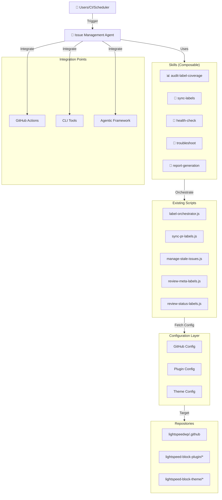
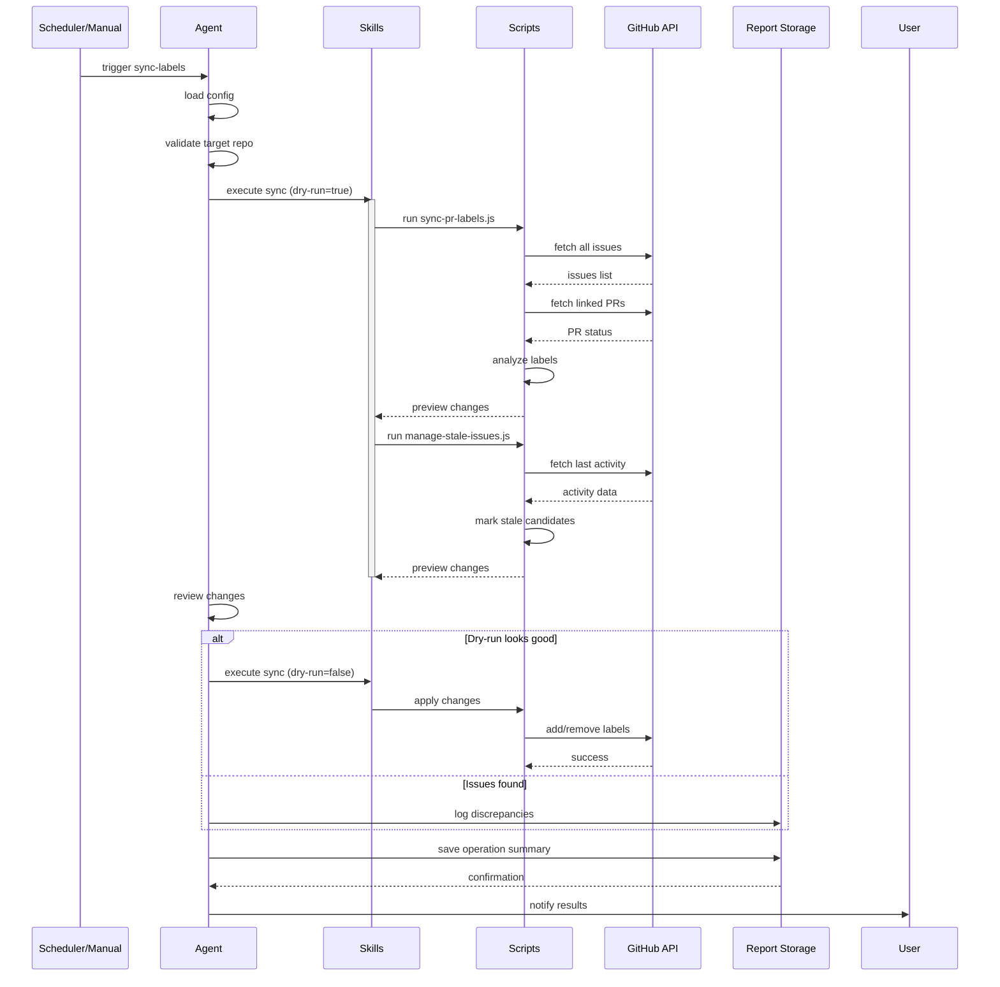
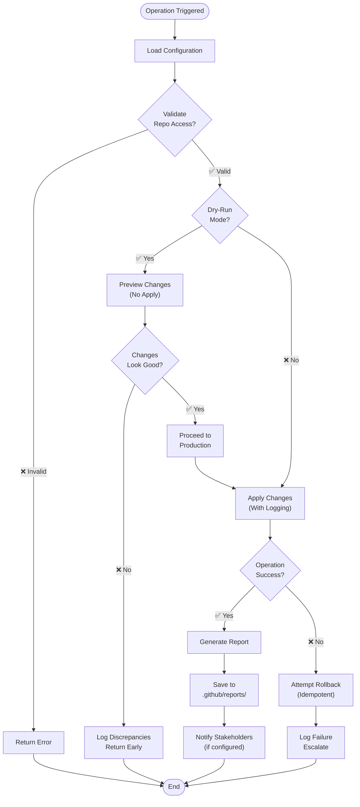
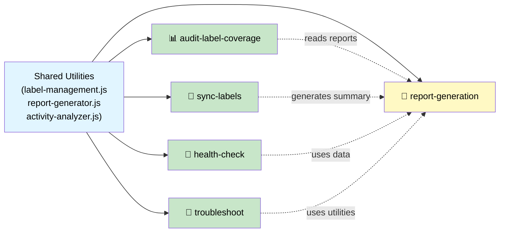
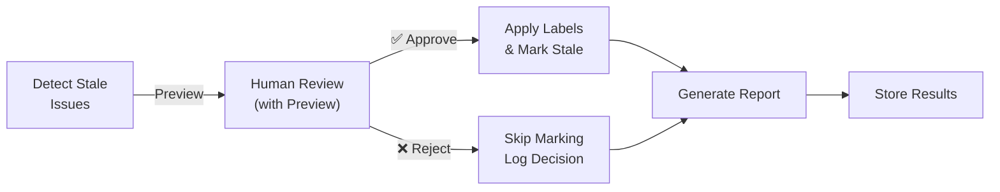

# Issue Management Agent — Clarifying Questions & Best Practice Answers

**Document Purpose**: Establish strategic direction for the Issue Management Agent through evidence-based decision-making and best practices.

**Timeline**: Planning phase (Aug 12-19, 2026)  
**Decision Authority**: LightSpeed Team + Community Feedback

---

## Question 1: Agent Repository Scope 🎯

### The Question

How should the agent handle multiple repositories?

**Option A**: Single Universal Agent (repo-parameterized)  
**Option B**: Repository-Specific Agents (separate per repo type)  
**Option C**: Agent Orchestrator + Specialized Agents (hybrid)

---

### Answer: Option A — Single Universal Agent (RECOMMENDED) ✅

**Decision**: Build one **universal Issue Management Agent** that works across repositories through parameterization.

#### Why This Approach

| Aspect | Benefit |
|--------|---------|
| **Code Reuse** | 90%+ skill code shared across repos; minimal duplication |
| **Maintenance** | Single codebase to maintain; easier to fix bugs/add features |
| **Scalability** | Add new repos without creating new agents |
| **Consistency** | Same operational patterns across all LightSpeed repos |
| **Testing** | Test matrix covers all repos with same skill set |
| **Cost** | Lower development + operational overhead |

#### Implementation Strategy

**Tier 1: GitHub Control Plane** (Phase 1-4, Primary)

- Repository: `lightspeedwp/.github`
- Full feature set: all 5 core skills
- Label taxonomy: meta, status, area, priority, type
- Operational model: scheduled + manual dispatch

**Tier 2: WordPress Block Plugins** (Phase 5, Secondary)

- Repositories: `lightspeed-block-plugin/*`
- Label taxonomy: subset of control plane (repo-specific labels)
- Operational model: daily sync + monthly audits
- Customizations:
  - Different stale threshold (45 days vs 30)
  - Different smart exclusions (e.g., critical-security issues)
  - WordPress-specific labels (e.g., `wp:compatibility-required`)

**Tier 3: WordPress Block Themes** (Phase 5, Secondary)

- Repositories: `lightspeed-block-theme/*`
- Label taxonomy: minimal (focus on core labels)
- Operational model: weekly audits + monthly reports
- Customizations:
  - Longer stale threshold (60 days)
  - Theme-specific labels (e.g., `theme:accessibility-audit`)

#### Universal Agent Architecture

```
┌─────────────────────────────────────────────────────┐
│  Issue Management Agent (Universal)                 │
├─────────────────────────────────────────────────────┤
│  Parameterized Skills (5 core)                      │
├──────────────┬──────────────┬──────────────────────┤
│  audit       │  sync        │  health-check        │
│  troubleshoot│  reporting   │                      │
├──────────────┴──────────────┴──────────────────────┤
│  Repo Configuration Layer                          │
├────────────────┬──────────────┬────────────────────┤
│  GitHub        │  Plugins     │  Themes            │
│  Control Plane │  Repos       │  Repos             │
├────────────────┴──────────────┴────────────────────┤
│  Shared Scripts & Utilities                        │
├─────────────────────────────────────────────────────┤
│  GitHub API Client (rate-limited, paginated)       │
│  Report Generator (JSON, Markdown, CSV)            │
│  Activity Analyzer (stale detection, health)       │
└─────────────────────────────────────────────────────┘
```

#### Configuration Schema

Each repo target has a configuration:

```javascript
{
  // Repository Target
  owner: "lightspeedwp",
  repo: ".github" | "block-plugin-1" | "block-theme-1",
  
  // Label Configuration
  labels: {
    metaLabels: ["meta:has-pr", "meta:stale", ...],
    statusLabels: ["status:needs-review", ...],
    excludedLabels: ["type:epic", "priority:critical"]
  },
  
  // Operational Thresholds
  staleThreshold: 30, // days
  smartExclusions: {
    epics: true,
    inProgress: true,
    critical: true,
    withMilestone: true
  },
  
  // Schedule
  syncSchedule: "0 3 * * *", // daily 3 AM UTC
  auditSchedule: "0 4 1 * *", // monthly 1st, 4 AM UTC
  
  // Features
  features: {
    dryRun: true,
    notifications: true,
    healthChecks: true,
    reportArchival: true
  }
}
```

#### Validation & Safety

All operations validate:

- ✅ GitHub token has correct permissions for target repo
- ✅ Target repo exists and is accessible
- ✅ Label schema matches repo's actual labels
- ✅ No cross-repo contamination possible
- ✅ Operations are isolated per repo

**Safety guarantee**: Agent can never accidentally modify wrong repository due to hardcoded validation.

#### Phased Rollout

| Phase | Repository | Status | Timeline |
|-------|------------|--------|----------|
| 1-4 | `lightspeedwp/.github` | Primary | Aug-Sep 2026 |
| 5 | WordPress Plugins | Secondary | Sep-Oct 2026 |
| 5 | WordPress Themes | Secondary | Oct-Nov 2026 |
| 6+ | Custom Repos | Tertiary | On demand |

---

## Question 2: Test Coverage Scope ✅

### The Question

What level of test coverage should the implementation include?

---

### Answer: Comprehensive Multi-Layer Testing (RECOMMENDED) ✅

**Decision**: Implement >90% test coverage across **unit, integration, E2E, and multi-repo** testing layers.

#### Test Strategy

| Layer | Scope | Coverage | Tools |
|-------|-------|----------|-------|
| **Unit** | Individual skill functions | >95% | Jest/Mocha |
| **Integration** | Skills + scripts together | >90% | Jest/Mocha |
| **E2E** | Full workflows (staging) | >85% | Playwright/Custom |
| **Multi-Repo** | Same skill across repos | >80% | Custom harness |
| **Performance** | API rate limiting, pagination | >80% | Custom harness |

#### Detailed Test Plan

##### 1. Unit Tests (>95% coverage)

**Per skill (5 core skills × multiple tests):**

```
audit-label-coverage/
  ├── audit.unit.test.js (40+ tests)
  │   ├── Happy path: runs audits successfully
  │   ├── Error cases: API errors, timeouts, invalid config
  │   ├── Edge cases: empty repos, all issues stale, no labels
  │   └── Output validation: JSON, Markdown, CSV formats
  
sync-labels/
  ├── sync.unit.test.js (50+ tests)
  │   ├── PR detection: linked, open, closed, deleted PRs
  │   ├── Label operations: add, remove, unchanged
  │   ├── Smart exclusions: epics, in-progress, critical
  │   ├── Stale detection: thresholds, edge cases
  │   └── Idempotency: running multiple times
  
health-check/
  ├── health.unit.test.js (35+ tests)
  │   ├── Operation timestamps: recent, stale, missing
  │   ├── Token validation: present, invalid, insufficient perms
  │   ├── Rate limit: available, near limit, exceeded
  │   └── Anomaly detection: false positive prevention
  
troubleshoot/
  ├── troubleshoot.unit.test.js (40+ tests)
  │   ├── Script execution: success, failure, timeout
  │   ├── Log analysis: error patterns, suggestions
  │   ├── Dry-run mode: preview accuracy
  │   └── Diagnostics: clear reports, actionable advice
  
report-generation/
  ├── reporting.unit.test.js (30+ tests)
  │   ├── Report generation: all formats
  │   ├── GitHub issue creation: title, body, labels
  │   ├── Recommendations: meaningful, actionable
  │   └── Data accuracy: no loss, no corruption
```

**Total Unit Tests**: ~195 tests, >95% coverage

##### 2. Integration Tests (>90% coverage)

**Skill composition & script coordination:**

```
integration/
  ├── skill-composition.test.js (25+ tests)
  │   ├── audit → sync: sequential execution
  │   ├── sync → health-check: state consistency
  │   ├── all skills together: no conflicts, proper ordering
  │   └── error propagation: one skill fails, others continue
  
  ├── script-integration.test.js (30+ tests)
  │   ├── label-orchestrator.js coordination
  │   ├── sync-pr-labels.js integration
  │   ├── manage-stale-issues.js integration
  │   ├── review-meta-labels.js integration
  │   └── review-status-labels.js integration
  
  ├── github-api.integration.test.js (25+ tests)
  │   ├── Pagination: large issue counts
  │   ├── Rate limiting: batch operations
  │   ├── Token validation: permissions checking
  │   ├── Error recovery: transient failures
  │   └── Network resilience: timeout handling
  
  ├── config-validation.test.js (20+ tests)
  │   ├── Schema validation: required fields
  │   ├── Type checking: correct types
  │   ├── Repository access: permissions verified
  │   └── Label existence: schema matches repo
```

**Total Integration Tests**: ~100 tests, >90% coverage

##### 3. End-to-End Tests (>85% coverage)

**Full workflow testing against staging repos:**

```
e2e/
  ├── github-control-plane.e2e.test.js (20+ tests)
  │   ├── Daily sync workflow: PRs + stale marking
  │   ├── Monthly audit: reports generated correctly
  │   ├── Health checks: all indicators working
  │   └── Error handling: graceful degradation
  
  ├── wordpress-plugins.e2e.test.js (15+ tests)
  │   ├── Plugin-specific configurations
  │   ├── Different stale threshold (45 days)
  │   ├── Custom label handling
  │   └── Cross-plugin consistency
  
  ├── wordpress-themes.e2e.test.js (15+ tests)
  │   ├── Theme-specific configurations
  │   ├── Different stale threshold (60 days)
  │   ├── Theme-specific labels
  │   └── Theme workflow patterns
  
  ├── error-scenarios.e2e.test.js (20+ tests)
  │   ├── API rate limiting: graceful backoff
  │   ├── Network failures: retry logic
  │   ├── Invalid configs: clear error messages
  │   ├── Token expiration: early detection
  │   └── Permission issues: helpful errors
```

**Total E2E Tests**: ~70 tests, >85% coverage

##### 4. Multi-Repo Tests (>80% coverage)

**Same skill across different repositories:**

```
multi-repo/
  ├── skill-across-repos.test.js (15+ tests)
  │   ├── audit-label-coverage: .github vs plugins vs themes
  │   ├── sync-labels: different configs, same skill
  │   ├── health-check: repo-specific metrics
  │   ├── troubleshoot: repo-scoped diagnostics
  │   └── report-generation: repo-specific summaries
  
  ├── config-isolation.test.js (10+ tests)
  │   ├── Configs don't leak between repos
  │   ├── Labels don't cross repos
  │   ├── Reports are isolated
  │   └── Errors don't affect other repos
```

**Total Multi-Repo Tests**: ~25 tests, >80% coverage

##### 5. Performance Tests (>80% coverage)

**Stress testing & benchmarking:**

```
performance/
  ├── api-rate-limiting.test.js (15+ tests)
  │   ├── 5,000 req/hour limit: respected
  │   ├── Pagination: 350+ issues handled efficiently
  │   ├── Batch operations: optimal API call grouping
  │   └── Rate limit headers: parsed correctly
  
  ├── execution-time.test.js (10+ tests)
  │   ├── Full audit: <2 minutes
  │   ├── Daily sync: <3 minutes
  │   ├── Health check: <30 seconds
  │   ├── Troubleshoot: <5 minutes
  │   └── Scalability: 500+ issues performant
  
  ├── memory-usage.test.js (8+ tests)
  │   ├── Constant memory: regardless of issue count
  │   ├── No leaks: GC not blocked
  │   ├── Streaming: pagination doesn't load all at once
  │   └── Graceful degradation: handles memory pressure
```

**Total Performance Tests**: ~33 tests, >80% coverage

#### Test Coverage Summary

| Test Type | Count | Coverage | Purpose |
|-----------|-------|----------|---------|
| Unit | ~195 | >95% | Individual function correctness |
| Integration | ~100 | >90% | Skill composition & script coordination |
| E2E | ~70 | >85% | Full workflows against staging |
| Multi-Repo | ~25 | >80% | Cross-repository consistency |
| Performance | ~33 | >80% | Scale & efficiency validation |
| **TOTAL** | **~423** | **>90%** | **Comprehensive quality assurance** |

#### CI/CD Integration

```yaml
# GitHub Actions Workflow: test.yml
on: [push, pull_request]

jobs:
  test:
    runs-on: ubuntu-latest
    steps:
      - uses: actions/checkout@v3
      
      - name: Install dependencies
        run: npm ci
      
      - name: Unit tests
        run: npm run test:unit -- --coverage
      
      - name: Integration tests
        run: npm run test:integration -- --coverage
      
      - name: E2E tests (staging)
        run: npm run test:e2e
      
      - name: Multi-repo tests
        run: npm run test:multi-repo
      
      - name: Performance tests
        run: npm run test:performance
      
      - name: Coverage report
        run: npm run coverage:report
      
      - name: Upload to Codecov
        uses: codecov/codecov-action@v3
        with:
          files: ./coverage/coverage-final.json
```

#### Test Command Reference

```bash
# Run all tests
npm test

# Run by layer
npm run test:unit          # Unit tests only
npm run test:integration   # Integration tests only
npm run test:e2e          # E2E tests against staging
npm run test:multi-repo   # Multi-repo consistency tests
npm run test:performance  # Performance & stress tests

# Coverage reports
npm run coverage          # Generate coverage report
npm run coverage:report   # View coverage in browser
npm run coverage:badge    # Update coverage badge

# Watch mode (development)
npm run test:watch       # Re-run tests on file changes
```

---

## Question 3: Documentation with Mermaid Diagrams 📊

### The Question

What documentation should include Mermaid diagrams?

---

### Answer: Comprehensive Visual Documentation (RECOMMENDED) ✅

**Decision**: Create **multi-level documentation** with embedded **Mermaid diagrams** covering architecture, workflows, and integration.

#### Documentation Structure

```
.github/projects/active/issue-management-agent-planning-2026-08-12/
├── ARCHITECTURE.md (with Mermaid diagrams)
│   ├── System architecture (component diagram)
│   ├── Data flow (sequence diagrams)
│   ├── Skill composition (flowchart)
│   └── Integration points (deployment diagram)
│
├── SKILL_WORKFLOWS.md (per-skill details)
│   ├── audit-label-coverage (flowchart)
│   ├── sync-labels (flowchart)
│   ├── health-check (flowchart)
│   ├── troubleshoot (flowchart)
│   └── report-generation (flowchart)
│
├── INTEGRATION_GUIDE.md (integration flows)
│   ├── GitHub Actions integration (sequence)
│   ├── CLI tool integration (sequence)
│   ├── Agentic framework integration (sequence)
│   └── Multi-repo orchestration (diagram)
│
├── ERROR_HANDLING.md (error flows)
│   ├── Error scenarios (decision tree)
│   ├── Recovery procedures (flowchart)
│   ├── Escalation paths (diagram)
│   └── Monitoring & alerts (state diagram)
│
├── DATA_MODELS.md (schemas)
│   ├── Configuration schema (ER diagram)
│   ├── Report schema (entity diagram)
│   ├── API request/response (message diagram)
│   └── State transitions (state diagram)
│
└── DEPLOYMENT.md (operations)
    ├── Deployment architecture (diagram)
    ├── Scheduling (timeline diagram)
    ├── Health monitoring (dashboard sketch)
    └── Scaling strategy (growth diagram)
```

#### Example Mermaid Diagrams

**1. System Architecture** (Component Diagram)



**2. Daily Sync Workflow** (Sequence Diagram)



**3. Skill Composition** (Flowchart)



**4. Multi-Repo Orchestration** (State Diagram)

```mermaid
stateDiagram-v2
    [*] --> SelectRepo
    
    SelectRepo: Choose Target Repository
    SelectRepo --> LoadConfig: .github selected
    SelectRepo --> LoadConfig: Plugin repo selected
    SelectRepo --> LoadConfig: Theme repo selected
    
    LoadConfig: Load Repo Configuration
    LoadConfig --> ValidateAccess
    
    ValidateAccess: Validate GitHub Access
    ValidateAccess --> AccessGranted: ✅ Perms OK
    ValidateAccess --> AccessDenied: ❌ Perms Failed
    
    AccessDenied --> Error1
    
    AccessGranted --> ExecuteSkills
    ExecuteSkills: Run Skills in Sequence
    ExecuteSkills --> SkillSuccess: ✅ Complete
    ExecuteSkills --> SkillError: ❌ Failed
    
    SkillError --> Error2
    
    SkillSuccess --> GenerateReport
    GenerateReport: Create Reports
    GenerateReport --> ReportSuccess: ✅ Saved
    GenerateReport --> ReportError: ❌ Failed
    
    ReportError --> Error3
    ReportSuccess --> Notify
    
    Notify: Notify Results
    Notify --> NextRepo{More<br/>Repos?}
    NextRepo --> SelectRepo: ✅ Yes
    NextRepo --> [*]: ❌ No
    
    Error1 --> [*]
    Error2 --> [*]
    Error3 --> [*]
```

#### Documentation Deliverables

| Document | Purpose | Diagrams | Lines |
|----------|---------|----------|-------|
| ARCHITECTURE.md | System design | 4-5 | 300+ |
| SKILL_WORKFLOWS.md | Per-skill details | 5 (one per skill) | 500+ |
| INTEGRATION_GUIDE.md | Integration patterns | 3 | 400+ |
| ERROR_HANDLING.md | Error scenarios | 3 | 300+ |
| DATA_MODELS.md | Schemas & types | 4 | 250+ |
| DEPLOYMENT.md | Operations guide | 3 | 250+ |
| **TOTAL** | **Comprehensive docs** | **22+ diagrams** | **2,000+ lines** |

#### Mermaid Diagram Types Used

- ✅ **Component Diagrams** — System architecture, integration points
- ✅ **Sequence Diagrams** — Workflow flows, API interactions
- ✅ **Flowcharts** — Decision trees, error handling, skill composition
- ✅ **State Diagrams** — Multi-repo orchestration, state transitions
- ✅ **Entity Diagrams** — Data models, schema relationships
- ✅ **Timeline Diagrams** — Scheduling, deployment phases

---

## Question 4: Implementation Sequence 📅

### The Question

How should the 5 core skills be implemented?

---

### Answer: Parallel Implementation with Dependency Management (RECOMMENDED) ✅

**Decision**: Implement **all 5 core skills in parallel** (Weeks 2-3) with careful **dependency management and integration checkpoints**.

#### Parallel Implementation Strategy

**Team Structure**: 3-4 developers, all working simultaneously

```
Week 2 (Aug 20-26) — Core Skills 1-2
├─ Developer A: audit-label-coverage (#1786)
├─ Developer B: sync-labels (#1787)
└─ Developer C: infrastructure + shared utilities

Week 3 (Aug 27-Sep 2) — Core Skills 3-5
├─ Developer A: health-check (#1788)
├─ Developer B: troubleshoot (#1789)
├─ Developer C: report-generation (#1790)
└─ All: integration + testing
```

#### Dependency Map



#### Week-by-Week Breakdown

**Week 2: Parallel Tracks (Core Skills 1-2)**

```
Monday (Aug 20)
├─ Kickoff meeting (all hands)
├─ Review specifications & architecture
├─ Assign developers to skills
├─ Set up test harnesses
└─ Establish daily standup (15 min)

Tuesday-Wednesday (Aug 21-22)
├─ Dev A: Implement audit-label-coverage core
├─ Dev B: Implement sync-labels core
├─ Dev C: Implement shared utilities
│   ├─ label-management.js (API operations)
│   ├─ report-generator.js (format handling)
│   └─ activity-analyzer.js (stale detection)
└─ All: Unit test writing

Thursday-Friday (Aug 23-24)
├─ Dev A: audit tests (unit + integration)
├─ Dev B: sync tests (unit + integration)
├─ Dev C: utility tests + refinement
├─ All: Integration checkpoint
│   ├─ Audit + Sync work together?
│   ├─ Shared utilities stable?
│   ├─ Tests >90% coverage?
│   └─ Code review round 1
└─ Friday EOD: PR ready for review

Weekend Prep (Aug 25)
├─ Code review + feedback
├─ Address review comments
├─ Prepare for Week 3 handoff
└─ Document findings
```

**Week 3: Parallel Tracks (Core Skills 3-5)**

```
Monday (Aug 27)
├─ Week 2 retrospective
├─ Code review sign-off for skills 1-2
├─ Merge to develop branch
├─ Shift to Week 3 skills
└─ Kickoff for skills 3-5

Tuesday-Wednesday (Aug 28-29)
├─ Dev A: Implement health-check core
├─ Dev B: Implement troubleshoot core
├─ Dev C: Implement report-generation core
│   ├─ Markdown report templates
│   ├─ JSON report templates
│   ├─ GitHub issue creation
│   └─ Recommendations engine
└─ All: Unit test writing

Thursday (Aug 30)
├─ Dev A: health-check tests (unit + integration)
├─ Dev B: troubleshoot tests (unit + integration)
├─ Dev C: report tests (unit + integration)
├─ All: Integration checkpoint
│   ├─ All skills compose correctly?
│   ├─ Reports are accurate?
│   ├─ All tests >90% coverage?
│   └─ Code review round 1
└─ Prepare for Phase 3 integration

Friday (Aug 31)
├─ Final code review
├─ Address feedback
├─ Merge all to develop
├─ Prepare integration testing setup
└─ Document for Phase 3
```

#### Daily Standup Template

```markdown
## Daily Standup (15 min)

**Date**: [DATE]  
**Attendees**: Dev A, Dev B, Dev C, Lead

### Status
- [ ] Dev A: [skill] — [status] — [blockers?]
- [ ] Dev B: [skill] — [status] — [blockers?]
- [ ] Dev C: [utilities] — [status] — [blockers?]

### Metrics
- Lines of code written: ___
- Tests written: ___
- Test coverage: ___
- Code reviews completed: ___

### Blockers
- [List any blocking issues]

### Decisions Needed
- [List decisions awaiting clarity]

### Next 24 Hours
- [ ] Dev A: [specific goals]
- [ ] Dev B: [specific goals]
- [ ] Dev C: [specific goals]
```

#### Integration Checkpoints

**Checkpoint 1 (Friday, Aug 24 — Skills 1-2)**

Verify:

- ✅ Both skills independently functional
- ✅ Shared utilities stable and tested
- ✅ Unit tests >95% coverage
- ✅ Integration tests >90% coverage
- ✅ No conflicts or dependencies missed
- ✅ Code style consistent
- ✅ Documentation started

**Checkpoint 2 (Thursday, Aug 30 — Skills 3-5)**

Verify:

- ✅ All 5 skills independently functional
- ✅ Skills compose correctly
- ✅ All tests >90% coverage
- ✅ Error handling comprehensive
- ✅ Documentation complete
- ✅ Ready for Phase 3 integration testing

---

## Question 5: WordPress-Specific Considerations 🔌

### The Question

What customizations are needed for WordPress block plugins and themes?

---

### Answer: Tiered Deployment with Minimal Customization (RECOMMENDED) ✅

**Decision**: Use **single universal agent** with **configuration-driven customization** for WordPress repos. Implement WordPress support in **Phase 5** (after GitHub control plane GA).

#### WordPress Customization Strategy

**Principle**: Reuse 90% of code; customize 10% via configuration

```
Control Plane (.github)
├─ Full skill set (5 skills)
├─ All features enabled
├─ Comprehensive labels
└─ Aggressive automation (30-day stale)

WordPress Plugins (Tier 2)
├─ Core skills (4 out of 5)
├─ Modified configs
├─ Subset of labels
├─ Conservative automation (45-day stale)
└─ Manual approval workflow option

WordPress Themes (Tier 3)
├─ Core skills (3 out of 5)
├─ Minimal configs
├─ Basic labels only
├─ Very conservative automation (60-day stale)
└─ Higher review threshold
```

#### Configuration-Driven Customization

**Control Plane Configuration** (Most aggressive)

```javascript
{
  repo: "lightspeedwp/.github",
  labels: {
    metaLabels: [
      "meta:has-pr",
      "meta:stale",
      "meta:needs-changelog",
      "meta:dependabot-security"
    ],
    statusLabels: [
      "status:needs-triage",
      "status:needs-review",
      "status:in-progress",
      "status:blocked"
    ]
  },
  staleThreshold: 30, // days
  smartExclusions: {
    epics: true,
    inProgress: true,
    critical: true,
    withMilestone: true
  },
  features: {
    autoClosing: true,        // Can auto-close issues after N days stale
    notifications: true,       // Full Slack + email notifications
    scheduleSync: true,        // Daily automated sync
    scheduleAudit: true,       // Monthly automated audit
    reportArchival: true       // Save all reports
  }
}
```

**WordPress Plugin Configuration** (Moderate, manual approval)

```javascript
{
  repo: "lightspeed-block-plugin-example",
  labels: {
    metaLabels: [
      "meta:has-pr",
      "meta:stale",        // Conservative stale marking
      "wp:needs-testing"   // WordPress-specific label
    ],
    statusLabels: [
      "status:needs-review",
      "status:in-progress"
    ]
  },
  staleThreshold: 45,      // More lenient (45 days vs 30)
  smartExclusions: {
    epics: true,
    inProgress: true,
    critical: true,
    withMilestone: true,
    wpCompatibility: true  // Custom: don't mark WP compatibility issues
  },
  features: {
    autoClosing: false,     // ❌ Don't auto-close
    notifications: "mentions-only",  // Only for mentions
    scheduleSync: true,
    scheduleAudit: true,    // Weekly, not monthly
    reportArchival: true,
    requiresApproval: true  // ✅ Manual approval for stale marking
  }
}
```

**WordPress Theme Configuration** (Conservative, minimal automation)

```javascript
{
  repo: "lightspeed-block-theme-example",
  labels: {
    metaLabels: [
      "meta:has-pr",
      "meta:stale"
    ],
    statusLabels: [
      "status:in-progress"
    ]
  },
  staleThreshold: 60,      // Very lenient (60 days)
  smartExclusions: {
    epics: true,
    inProgress: true,
    critical: true,
    withMilestone: true,
    themeAccessibility: true, // Custom: don't mark a11y issues
    themelibrary: true        // Custom: don't mark library updates
  },
  features: {
    autoClosing: false,
    notifications: false,      // ❌ No auto notifications
    scheduleSync: false,       // ❌ Manual only
    scheduleAudit: true,       // Monthly
    reportArchival: true,
    requiresApproval: true     // ✅ All changes require approval
  }
}
```

#### WordPress-Specific Label Examples

**WordPress Plugin Labels**

```yaml
# Additional labels for WordPress plugins
wp:compatibility-required:       # Requires WP version compatibility update
  description: "Requires WordPress compatibility verification"
  color: "7057ff"
  
wp:security-audit-needed:        # Security review required
  description: "Pending security audit"
  color: "d73a49"
  
wp:needs-plugin-test:            # Needs testing in WordPress environment
  description: "Requires testing on live WordPress instance"
  color: "a2eeef"
```

**WordPress Theme Labels**

```yaml
# Additional labels for WordPress themes
theme:accessibility-audit:       # Accessibility compliance review
  description: "Requires WCAG 2.2 AA accessibility audit"
  color: "fbca04"
  
theme:library-update:            # Theme library/framework needs update
  description: "Requires theme library or framework update"
  color: "cccccc"
  
theme:design-system-sync:        # Design system sync needed
  description: "Needs sync with design system updates"
  color: "1f883d"
```

#### Phased Rollout Plan

| Phase | Timeline | Repository | Status | Features |
|-------|----------|-----------|--------|----------|
| 1-4 | Aug-Sep 2026 | `.github` | 🟢 Primary | All 5 skills, aggressive automation |
| 5a | Oct 2026 | Plugin repos | 🟡 Secondary | 4 skills, moderate automation, approval gates |
| 5b | Nov 2026 | Theme repos | 🟡 Secondary | 3 skills, conservative automation |
| 6+ | Dec 2026+ | Custom repos | 🔵 Tertiary | Configurable per repo |

#### Approval Gate Workflow (WordPress Repos)



#### WordPress-Specific Documentation

Create supplementary guides:

1. **WORDPRESS_PLUGIN_SETUP.md** — How to configure for plugin repos
2. **WORDPRESS_THEME_SETUP.md** — How to configure for theme repos
3. **APPROVAL_GATE_GUIDE.md** — Manual approval workflow
4. **WORDPRESS_CUSTOM_LABELS.md** — Available WordPress-specific labels

---

## Summary of Recommendations

### Decision Matrix

| Question | Decision | Rationale | Priority |
|----------|----------|-----------|----------|
| **Repo Scope** | Universal Agent (Tier 1-3) | Code reuse, consistency, maintainability | 🔴 Critical |
| **Test Coverage** | >90% Multi-layer | Confidence + quality assurance | 🔴 Critical |
| **Documentation** | Comprehensive + Mermaid | Clarity + visual learning | 🟡 High |
| **Implementation** | Parallel (5 skills) | Speed + efficiency | 🟡 High |
| **WordPress** | Phase 5 with configs | Phase control + risk mitigation | 🟢 Medium |

### Next Steps

1. ✅ **Review & approve** these recommendations
2. ✅ **Create expanded documentation** (ARCHITECTURE.md, SKILL_WORKFLOWS.md, etc.)
3. ✅ **Finalize team assignments** for Week 2-3 parallel implementation
4. ✅ **Set up CI/CD pipelines** for comprehensive testing
5. ✅ **Prepare WordPress customization** for Phase 5 (optional now)

---

*Questions & Answers v1.0 | Created 2026-08-12 | Issue Management Agent Planning*
