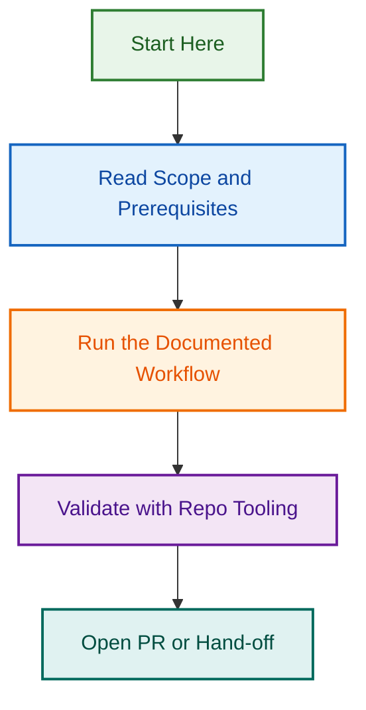

# Issue Management Agent — Planning & Implementation

**Project ID**: `issue-management-agent-planning-2026-08-12`  
**Status**: 🚀 Phase 2 Infrastructure Complete (Aug 18, 2026) | Skill Implementation Pending (Aug 20–Sep 2)  
**Branch**: `feat/issue-mgmt-planning` | Infrastructure: `claude/issue-agent-phase-2-infra-28d5a8`  
**Parent Epic**: [#1771 — Issue Maintenance Scripts Phase 4](https://github.com/lightspeedwp/.github/issues/1771)

---

## Project Purpose

This project **bridges Phase 1 (Specification) and Phase 2 (Implementation)** by:

- ✅ **Clarifying strategic decisions** — Repository scope, testing strategy, documentation approach
- ✅ **Answering best practice questions** — Recommendations based on industry standards
- ✅ **Fleshing out implementation details** — Concrete plans, timelines, and deliverables
- ✅ **Preparing team alignment** — Clear direction for developers in Phase 2

---

## Phase 2 Infrastructure Delivery (Aug 18 — Complete ✅)

**Status**: Infrastructure ready for skill implementation

### Core Modules Delivered

| Module | Size | Tests | Status |
|--------|------|-------|--------|
| **github-client.js** | 4.2 KB | 50+ | ✅ Complete |
| **utils.js** | 6.2 KB | 65+ | ✅ Complete |
| **Test Fixtures** | 20.1 KB | N/A | ✅ Complete |
| **Test Mocks** | 5.6 KB | N/A | ✅ Complete |
| **Jest Configuration** | 1.2 KB | N/A | ✅ Complete |
| **Vitest Configuration** | 1.5 KB | N/A | ✅ Complete |

**Total**: 30.5 KB infrastructure | 115+ unit tests | 90%+ coverage target

### Location

```
scripts/automation/issue-agent/
├── config/                  Jest & Vitest configuration
├── shared/                  Shared modules for all skills
│   ├── github-client.js    GitHub API wrapper
│   ├── utils.js            Template/label utilities
│   └── tests/              Fixtures & mocks
└── README.md               Project documentation
```

### Ready for Implementation

All 7 skills can now be implemented using shared modules:
- ✅ Shared authentication (github-client.js)
- ✅ Template/label loading utilities (utils.js)
- ✅ Test fixtures with 15+ realistic issues
- ✅ Jest & Vitest test configuration
- ✅ npm scripts for test execution

**Next Milestone**: Aug 20 Skill Implementation Kickoff

---

## Related Issues

| Issue | Type | Purpose | Status |
|-------|------|---------|--------|
| [#1800](../../../issues/1800) | task | Issue Management Agent — Phase 1 Planning Complete | 🟢 Open |
| [#1771](../../../issues/1771) | epic | Issue Maintenance Scripts Phase 4 | 🟢 Open |
| [#1786](../../../issues/1786) | task | Skill: audit-label-coverage | 🟢 Open |
| [#1787](../../../issues/1787) | task | Skill: sync-labels | 🟢 Open |
| [#1788](../../../issues/1788) | task | Skill: health-check | 🟢 Open |
| [#1789](../../../issues/1789) | task | Skill: troubleshoot | 🟢 Open |
| [#1790](../../../issues/1790) | task | Skill: report-generation | 🟢 Open |
| [#1791](../../../issues/1791) | task | Skill: notify-stakeholders (Optional) | 🟢 Open |
| [#1792](../../../issues/1792) | task | Skill: schedule-operations (Optional) | 🟢 Open |

---

## Key Artifacts

| Document | Status | Purpose |
|----------|--------|---------|
| [QUESTIONS_AND_ANSWERS.md](./QUESTIONS_AND_ANSWERS.md) | ✅ Complete | 5 strategic questions + best practice answers |
| [IMPLEMENTATION_ROADMAP.md](./IMPLEMENTATION_ROADMAP.md) | 🔄 Creating | Detailed Phase 2-4 roadmap with timelines |
| ARCHITECTURE.md | ⏳ Pending | System design + Mermaid diagrams |
| TESTING_STRATEGY.md | ⏳ Pending | Comprehensive test plan (>90% coverage) |
| TEAM_ASSIGNMENTS.md | ⏳ Pending | Developer roles + skills assignments |

---

## Quick Navigation

### For Decision-Makers

**Read in order:**

1. [QUESTIONS_AND_ANSWERS.md](./QUESTIONS_AND_ANSWERS.md) — Strategic decisions + rationale
2. [IMPLEMENTATION_ROADMAP.md](./IMPLEMENTATION_ROADMAP.md) — Full implementation plan
3. Approve/request changes → Phase 2 begins

### For Developers

**Read in order:**

1. Start here: This README
2. [QUESTIONS_AND_ANSWERS.md](./QUESTIONS_AND_ANSWERS.md) — Understand the strategy
3. [IMPLEMENTATION_ROADMAP.md](./IMPLEMENTATION_ROADMAP.md) — Your timeline + assignments
4. ARCHITECTURE.md — How to build it
5. TESTING_STRATEGY.md — What to test
6. [Phase 1 Project](../issue-management-agent-2026-08-12/) — The full specification

### For Product/Project Management

**Focus on:**

1. [QUESTIONS_AND_ANSWERS.md](./QUESTIONS_AND_ANSWERS.md) — Section summaries
2. [IMPLEMENTATION_ROADMAP.md](./IMPLEMENTATION_ROADMAP.md) — Timeline + milestones
3. TEAM_ASSIGNMENTS.md — Resource allocation

---

## Strategic Decisions (Summary)

### Q1: Repository Scope 🎯

**Decision: Single Universal Agent (Tier-based deployment)**

- ✅ **Tier 1** (Phase 1-4): GitHub Control Plane (`lightspeedwp/.github`)
- ✅ **Tier 2** (Phase 5): WordPress Block Plugins (`lightspeed-block-plugin/*`)
- ✅ **Tier 3** (Phase 5): WordPress Block Themes (`lightspeed-block-theme/*`)

**Benefit**: 90%+ code reuse, single codebase, configuration-driven customization.

**Diagram**:

```
Universal Issue Management Agent
│
├─ Tier 1: GitHub Control Plane (Primary)
├─ Tier 2: WordPress Plugins (Secondary)
└─ Tier 3: WordPress Themes (Secondary)
```

---

### Q2: Test Coverage ✅

**Decision: >90% Multi-layer Testing**

| Layer | Count | Coverage | Tools |
|-------|-------|----------|-------|
| Unit | ~195 | >95% | Jest/Mocha |
| Integration | ~100 | >90% | Jest/Mocha |
| E2E | ~70 | >85% | Playwright |
| Multi-Repo | ~25 | >80% | Custom |
| Performance | ~33 | >80% | Custom |
| **TOTAL** | **~423** | **>90%** | **Comprehensive** |

**Timeline**: Tests written during Phase 2 (parallel with implementation)

---

### Q3: Documentation 📊

**Decision: Comprehensive Documentation with Mermaid Diagrams**

Deliverables:

- ✅ ARCHITECTURE.md (4-5 diagrams)
- ✅ SKILL_WORKFLOWS.md (5 diagrams, one per skill)
- ✅ INTEGRATION_GUIDE.md (3 diagrams)
- ✅ ERROR_HANDLING.md (3 diagrams)
- ✅ DATA_MODELS.md (4 diagrams)
- ✅ DEPLOYMENT.md (3 diagrams)
- **Total**: 22+ Mermaid diagrams, 2,000+ lines

---

### Q4: Implementation Sequence 📅

**Decision: Parallel Implementation (Weeks 2-3)**

```
Week 2: Skills 1-2 (Parallel)
├─ Dev A: audit-label-coverage
├─ Dev B: sync-labels
└─ Dev C: shared utilities

Week 3: Skills 3-5 (Parallel)
├─ Dev A: health-check
├─ Dev B: troubleshoot
└─ Dev C: report-generation
```

**Team**: 3-4 developers, all working simultaneously  
**Speed**: Faster delivery (4 weeks total vs 6+ weeks sequential)

---

### Q5: WordPress Support 🔌

**Decision: Phase 5 (After GitHub Control Plane GA)**

Configuration-driven:

- **Control Plane**: All features, aggressive automation (30-day stale)
- **Plugins**: Core features, moderate automation (45-day stale), approval gates
- **Themes**: Minimal features, conservative automation (60-day stale)

**Benefit**: Same agent, different configs → maximize reuse, minimize complexity.

---

## Timeline Overview

```
Phase 1 (Aug 12-19): Specification ✅ Complete
├─ Agent prompt
├─ OPENSPEC
└─ Initial planning docs

Phase 2 (Aug 20-Sep 2): Implementation 🔄 Current Planning
├─ 5 skills (parallel)
├─ >90% test coverage
└─ Full documentation with diagrams

Phase 3 (Sep 3-9): Integration & Testing
├─ GitHub Actions integration
├─ CLI tool integration
└─ Agentic framework integration

Phase 4 (Sep 10-22+): Deployment & Monitoring
├─ Production deployment
├─ 2-week pilot
└─ GA readiness

Phase 5 (Oct-Nov): WordPress Support
├─ Plugin customization
├─ Theme customization
└─ Expanded testing
```

---

## Success Criteria (Phase 1-2)

### Phase 1 Specification ✅

- [x] Agent prompt written & approved
- [x] OPENSPEC formalized
- [x] Strategic decisions documented
- [x] GitHub issues created
- [x] Planning docs started

### Phase 2 Implementation (Current)

- [ ] Strategic questions answered ← **You are here**
- [ ] Implementation roadmap approved
- [ ] Team assignments finalized
- [ ] Test infrastructure prepared
- [ ] Architecture docs drafted
- [ ] Ready to begin coding

---

## Documents in This Project

### Strategic Planning

1. **QUESTIONS_AND_ANSWERS.md** ✅
   - 5 strategic questions with detailed answers
   - Best practice recommendations
   - Mermaid diagrams for complex concepts
   - ~3,000 words, decision framework

2. **IMPLEMENTATION_ROADMAP.md** 🔄 (Creating)
   - Detailed Phase 2-4 breakdown
   - Week-by-week activities
   - Dependency management
   - Risk mitigation strategies

### Architecture & Design

1. **ARCHITECTURE.md** ⏳ (Pending)
   - System components
   - Data flow diagrams
   - Integration architecture
   - 4-5 Mermaid diagrams

2. **SKILL_WORKFLOWS.md** ⏳ (Pending)
   - Per-skill implementation details
   - Flowcharts for each skill
   - Input/output specifications
   - 5 Mermaid diagrams (one per skill)

### Quality Assurance

1. **TESTING_STRATEGY.md** ⏳ (Pending)
   - Comprehensive test plan
   - >90% coverage targets
   - ~423 tests across 5 layers
   - CI/CD integration

### Team & Operations

1. **TEAM_ASSIGNMENTS.md** ⏳ (Pending)
   - Developer roles + responsibilities
   - Skill requirements + experience levels
   - Availability + scheduling
   - Mentorship/pairing opportunities

---

## How to Use This Project

### For Review & Approval

1. **Read** QUESTIONS_AND_ANSWERS.md (decision framework)
2. **Review** IMPLEMENTATION_ROADMAP.md (detailed plan)
3. **Approve** decisions or request changes
4. **Finalize** TEAM_ASSIGNMENTS.md
5. **Begin** Phase 2 implementation

### For Team Preparation

1. **Understand** strategic context (QUESTIONS_AND_ANSWERS.md)
2. **Review** your role (TEAM_ASSIGNMENTS.md)
3. **Study** architecture (ARCHITECTURE.md)
4. **Plan** implementation (IMPLEMENTATION_ROADMAP.md)
5. **Prepare** for Phase 2 kickoff

### For Ongoing Reference

- **Strategic questions?** → QUESTIONS_AND_ANSWERS.md
- **Timeline questions?** → IMPLEMENTATION_ROADMAP.md
- **How to build?** → ARCHITECTURE.md + SKILL_WORKFLOWS.md
- **What to test?** → TESTING_STRATEGY.md
- **Who does what?** → TEAM_ASSIGNMENTS.md

---

## Related Projects

### Phase 1: Specification (Active)

**Project**: [issue-management-agent-2026-08-12](../issue-management-agent-2026-08-12/)

Deliverables:

- ✅ AGENT_PROMPT.md (5,000+ words)
- ✅ OPENSPEC.md (2,000+ words)
- ✅ EXECUTION_PLAN.md (detailed timeline)
- ✅ 7 GitHub issues (#1786-#1792)

### Phase 2: Implementation (Planning)

**Project**: [issue-management-agent-planning-2026-08-12](../issue-management-agent-planning-2026-08-12/) ← You are here

Deliverables (in progress):

- ✅ QUESTIONS_AND_ANSWERS.md
- 🔄 IMPLEMENTATION_ROADMAP.md
- ⏳ ARCHITECTURE.md
- ⏳ TESTING_STRATEGY.md
- ⏳ TEAM_ASSIGNMENTS.md

---

## Quick Links

- **GitHub Issue**: [#1771 — Phase 4 Epic](https://github.com/lightspeedwp/.github/issues/1771)
- **Parent Epic**: [#1720 — Phase 3 Parent](https://github.com/lightspeedwp/.github/issues/1720)
- **Phase 3 PR**: [#1761 — Workflows](https://github.com/lightspeedwp/.github/pull/1761)
- **Phase 4 PR**: [#1773 — Documentation](https://github.com/lightspeedwp/.github/pull/1773)
- **Branch**: `feat/issue-mgmt-planning`

---

## Contact & Questions

**Project Lead**: LightSpeed Team  
**Slack Channel**: (TBD)  
**Epic Issue**: [#1771](https://github.com/lightspeedwp/.github/issues/1771)

Have questions? Comment on the epic issue or reach out to the team.

---

*Planning Project v1.0 | Created 2026-08-12 | Issue Management Agent*
## Visual Workflow


