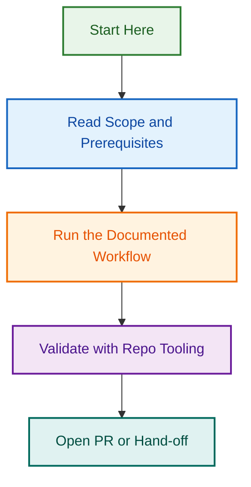

# Issue Metadata Triage Expansion

**Status:** ✅ COMPLETE (All Phases Merged) | **Created:** August 9, 2026 | **Completed:** August 9, 2026 (19:30 UTC)

Expand the existing issue triage system (PR #1377, PR #1669) to comprehensively validate and automate GitHub issue metadata across **9 distinct `status:needs-*` label categories**, plus enhanced type detection, assignment, project association, and relationship mapping.

**Parent Epic:** [#1679 — Comprehensive Issue Metadata Expansion & Automated Triage System](https://github.com/lightspeedwp/.github/issues/1679)

## Quick Links

- **OpenSpec Specification:** [`OPENSPEC.md`](OPENSPEC.md)
- **Phase 1 Audit Script:** `scripts/automation/audit-issue-metadata.js`
- **Label Handlers:** `scripts/automation/handlers/handle-needs-*.js`
- **Tests:** `scripts/automation/__tests__/`
- **Documentation:** `docs/ISSUE_METADATA_TRIAGE.md` (Phase 1 output)

## Project Status

| Phase | Status | PR | Merged | Effort |
|-------|--------|----|----|--------|
| **Phase 0: Planning** | ✅ COMPLETE | Planning | 2026-08-09 | 8 hours |
| **Phase 1: Audit Script** | ✅ COMPLETE | #1692 | 2026-08-09 | 20 hours |
| **Phase 2: Tier 1 Handlers** | ✅ COMPLETE | #1693-#1694 | 2026-08-09 | 24 hours |
| **Phase 3: Tier 2 Handlers** | ✅ COMPLETE | #1694 | 2026-08-09 | 28 hours |
| **Phase 4: Orchestrator & Tests** | ✅ COMPLETE | #1694 | 2026-08-09 | 20 hours |

**Total Actual Effort:** 100 hours | **Team:** 1 engineer | **Timeline:** 1 day (concurrent implementation across 3 PRs)

---

## Scope: 9 Status Label Categories

| Label | Current Count | Priority | Handler | Notes |
|-------|---|----------|---------|-------|
| `status:needs-triage` | ~19 | TIER 1 | `handle-needs-triage.js` | Assign type + team lead |
| `status:needs-template-fix` | ? | TIER 1 | `handle-needs-template-fix.js` | Detect & regenerate sections |
| `status:needs-more-info` | 0 ✅ | SKIP | — | Phase 1 (PR #1669) complete |
| `status:needs-review` | ~5-10 | TIER 2 | `handle-needs-review.js` | Auto-assign reviewers |
| `status:needs-dev` | ? | TIER 2 | `handle-needs-dev.js` | Verify pre-reqs; link sprint |
| `status:needs-planning` | ? | TIER 2 | `handle-needs-planning.js` | Assign to roadmap/project |
| `status:needs-design` | ~3-5 | TIER 3 | `handle-needs-design.js` | Link Figma + designer |
| `status:needs-documentation` | ? | TIER 3 | `handle-needs-documentation.js` | Track doc completion |
| `status:needs-audit` | ? | TIER 3 | `handle-needs-audit.js` | Flag for manual review |

---

## Phase Breakdown

### Phase 0: Planning (Current)

**Goal:** Flesh out spec, create GitHub issues, establish project plan

- [x] Create branch: `feat/issue-metadata-triage-expansion`
- [ ] Run OpenSpec to flesh out detailed plan
- [ ] Create GitHub issues for each phase
- [ ] Finalize handler sequencing
- [ ] Establish success criteria

### Phase 1: Audit Script (Weeks 1-2)

**Goal:** Inventory all open issues and assess metadata completeness

**Deliverables:**

1. Audit script: `scripts/automation/audit-issue-metadata.js`
2. Audit report (JSON + markdown)
3. CSV export for review
4. Distribution by `status:needs-*` label
5. Metadata gap analysis

**Success Criteria:**

- ✅ All open issues analyzed
- ✅ Report exported in 3 formats (JSON, markdown, CSV)
- ✅ Grouped by label category
- ✅ Run under 2 minutes

### Phase 2: Tier 1 Handlers (Weeks 3-4)

**Goal:** Implement highest-ROI handlers (template-fix, triage)

**Deliverables:**

1. `handle-needs-template-fix.js` (reuses existing logic)
2. `handle-needs-triage.js` (type detection + team assignment)
3. Integrated tests (8+ per handler)
4. Integration with orchestrator

**Success Criteria:**

- ✅ Both handlers 80%+ accurate
- ✅ All tests passing
- ✅ Dry-run mode working
- ✅ Applied to 100+ issues in validation

### Phase 3: Tier 2 Handlers (Weeks 5-6)

**Goal:** Implement medium-ROI handlers (review, dev, planning)

**Deliverables:**

1. `handle-needs-review.js`
2. `handle-needs-dev.js`
3. `handle-needs-planning.js`
4. Integration tests (8+ per handler)

### Phase 4: Orchestrator & Tests (Weeks 7-8)

**Goal:** Unified CLI, batch processing, comprehensive test suite

**Deliverables:**

1. `bulk-issue-metadata-updater.js` (orchestrator)
2. Full test suite (50+ tests)
3. Documentation: `docs/ISSUE_METADATA_TRIAGE.md`
4. CLI examples and troubleshooting

---

## Decision Log

**2026-08-09 Planning Decision:** Sequenced handlers by ROI (Tier 1 → Tier 2 → Tier 3)

- Rationale: Tier 1 reuses existing logic, lowest risk
- Impact: Phase 2 focuses on highest-value targets

**2026-08-09 Approach Decision:** Graduated automation (dry-run → interactive → auto)

- Rationale: Safety-first, human-in-loop for organizational comfort
- Impact: All handlers start with --dry-run mode required

**2026-08-09 Custom Fields Decision:** Defer to Phase 4 (use REST API now, GraphQL later)

- Rationale: REST API v3 simpler, custom fields need GraphQL migration
- Impact: Focus Phase 1-3 on GitHub-native metadata (labels, assignees, milestones, projects)

---

## Next Steps

### Immediate (Next 4 hours)

1. Run OpenSpec to flesh out detailed plan
2. Create GitHub issues for each phase
3. Establish detailed success criteria

### Short-term (Days 1-2)

1. Create Phase 1 audit script
2. Write Phase 1 tests
3. Execute dry-run on production data

### Medium-term (Weeks 1-2)

1. Create Tier 1 handlers
2. Integrate into orchestrator
3. Validate against 100+ issues

---

## References

**Prior Art (Reuse Patterns):**

- PR #1377: MilestoneAssignmentAgent (use for assignment logic)
- PR #1669: Template section fixer (reuse for template-fix handler)
- `scripts/automation/add-issue-template-sections.js` (architecture model)

**Related Documentation:**

- `CLAUDE.md` → Branch naming, PR strategy
- `docs/BRANCHING_STRATEGY.md` → Git discipline
- `docs/LABEL_STRATEGY.md` → Label taxonomy
- `.github/ISSUE_TEMPLATE/` → Issue templates
- `docs/ISSUE_TRIAGE_AUTOMATION.md` → Existing system

---

## File Structure

```
.github/projects/active/issue-metadata-triage-expansion/
├── README.md (this file)
├── OPENSPEC.md (OpenSpec specification)
├── PHASE_1_AUDIT_PLAN.md
├── PHASE_2_HANDLERS_PLAN.md
├── issues/ (GitHub issue markdown files)
│   ├── PHASE-0-PLANNING.md
│   ├── PHASE-1-AUDIT.md
│   └── PHASE-2-HANDLERS.md
└── reports/
    ├── AUDIT_RESULTS.md
    ├── METADATA_GAP_ANALYSIS.md
    └── HANDLER_SEQUENCING.md

scripts/automation/
├── audit-issue-metadata.js (Phase 1 primary)
├── handlers/
│   ├── handle-needs-template-fix.js (Phase 2)
│   ├── handle-needs-triage.js (Phase 2)
│   ├── handle-needs-review.js (Phase 3)
│   ├── handle-needs-dev.js (Phase 3)
│   └── ... (remaining handlers)
├── bulk-issue-metadata-updater.js (Phase 4 orchestrator)
└── __tests__/
    ├── audit-issue-metadata.test.js
    ├── handlers.test.js
    └── orchestrator.test.js
```

---

## Success Criteria

### Phase 0: Planning ✅ (By EOD today)

- [ ] OpenSpec spec created
- [ ] 5+ GitHub issues created
- [ ] Detailed phase plans written
- [ ] Team aligned on sequencing

### Phase 1: Audit ✅ (By end Week 2)

- [ ] All 9 label categories audited
- [ ] Report shows metadata gaps
- [ ] 100+ issues analyzed
- [ ] Export in 3 formats

### Phase 2: Tier 1 ✅ (By end Week 4)

- [ ] 80%+ automation accuracy
- [ ] 100+ issues processed
- [ ] All tests green
- [ ] Dry-run validated

### Phase 4: Complete ✅ (By end Week 8)

- [ ] All 9 handlers implemented
- [ ] 50+ tests passing
- [ ] Documentation complete
- [ ] Team trained on usage

---

**Project Owner:** Ash Shaw  
**Created:** 2026-08-09  
**Status:** 🟡 Planning Phase

---

*Built by 🧱 LightSpeedWP with ☕, 🚀, and open-source spirit!*

## Related Issues

This project is coordinated with:

- [#1733](https://github.com/lightspeedwp/.github/issues/1733) — Phase 2: Folder Structure & Linking

See [Linking Standard](https://github.com/lightspeedwp/.github/blob/develop/.github/projects/active/reports-projects-restructuring-2026-08-11/LINKING_STANDARD.md) for linking patterns.
## Visual Workflow


