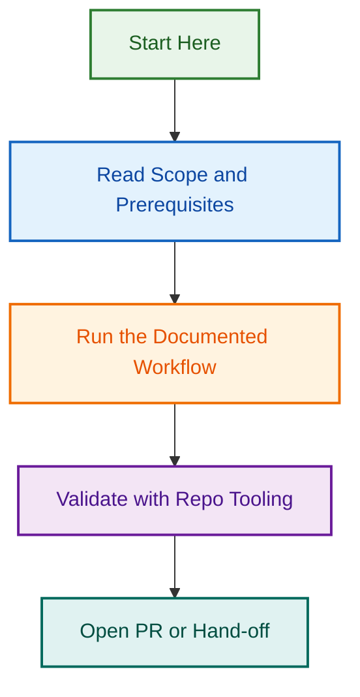

# Issue Triage Automation System

**Status:** 🟡 Phase 2C Execution In Progress | **Start:** July 26, 2026 | **Last Updated:** September 2, 2026

Implement automated issue triage to fix a critical compliance gap affecting 250 non-compliant issues and prevent future automation failures.

| Phase | Status | Merged | Details |
|-------|--------|--------|---------|
| **Phase 1: Implementation** | ✅ COMPLETE | PR #1377 | 40-hour implementation, MilestoneAssignmentAgent, bulk remediation workflow |
| **Phase 2: Execution & Validation** | ✅ COMPLETE | PR #1488 | Unit tests (28 tests, 81% coverage), dry-run execution, governance findings documented |
| **Phase 2C: Issue Fixing** | 🟡 IN PROGRESS | — | Workflow execution testing: Babel fixes, ES modules, context size limits resolved (Runs #56-#60) |

Implement automated issue triage to fix a critical compliance gap affecting 250 non-compliant issues and prevent future automation failures.

---

## Quick Navigation by Role

### 👥 **For Executives / Stakeholders** (10 min read)

**What's the problem?**

- 250 issues created in the past 7 days with **100% compliance failures**
- Missing type labels (100%), milestones (100%), DoR/DoD sections (99.2%)
- 748 total compliance gaps across all issues
- Prevents AI agents from safely automating issue creation

**What's the solution?**
Implement automated issue triage system with:

- Intelligent milestone assignment (6 rules, 95%-50% confidence)
- Type-specific remediation checklists (10+ issue types)
- Enhanced issue creation workflow (auto-applies all metadata)
- Bulk remediation workflow (fixes 250 issues in one run)
- Comprehensive documentation and API reusability

**Timeline & Investment:**

- **Duration:** 2 days (July 26-28)
- **Implementation Effort:** 40 hours (already complete)
- **Execution Effort:** 1 hour (dry-run + apply)
- **Team:** 1 engineer (implementation done), 1 executor
- **Risk:** LOW (comprehensive automation, dry-run preview available)

**Next Steps:**

1. Review Epic #1376 in GitHub
2. Review PR #1377 (all changes)
3. Approve merge to develop
4. Execute bulk remediation (dry-run first, then apply)

**Key Files:**

- `PROJECT_INDEX.md` — Full project structure
- `IMPLEMENTATION_PLAN.md` — Timeline, execution plan, success criteria
- `docs/ISSUE_TRIAGE_AUTOMATION.md` — Complete system documentation

### Related Active Projects

- **[issue-type-workflow-automation](../issue-type-workflow-automation/)** — Related issue type automation (complementary scope)
- **[issue-metadata-triage-expansion](../issue-metadata-triage-expansion/)** — Expanded metadata triage system (Phase 2)
- **[issue-management-agent-planning-2026-08-12](../issue-management-agent-planning-2026-08-12/)** — Universal issue management agent (Phase 3+)
- **[template-enforcement-governance](../template-enforcement-governance/)** — Template validation (related system)

---

### 🏗️ **For Technical Leads** (30 min read)

**What are we building?**

Two-phase delivery:

1. **Phase 1 (Development):** Implement agent scripts, workflows, and documentation ✅ COMPLETE
   - MilestoneAssignmentAgent (6 rules, confidence scoring)
   - RemediationChecklistGenerator (10+ issue types)
   - issue-create-enhanced.yml workflow
   - issue-remediation-bulk.yml workflow
   - Comprehensive documentation

2. **Phase 2 (Execution):** Bulk remediation of 250 issues
   - Dry-run preview (non-destructive)
   - Apply fixes (250 issues, all metadata)
   - Compliance verification

**Key Design Decisions:**

- Intelligent milestone assignment with 6 priority-ordered rules
- Type-aware remediation (not generic)
- Dry-run preview before any changes
- Selective remediation (choose milestones, labels, templates)
- Full compliance audit trail in reports

**Architecture:**

- 2 new agent scripts (MilestoneAssignmentAgent, RemediationChecklistGenerator)
- 2 new workflows (issue-create-enhanced, issue-remediation-bulk)
- 1 documentation file (ISSUE_TRIAGE_AUTOMATION.md)
- Integration points with existing labeling.yml workflow

**Success Metrics:**

- ✅ 250/250 issues have type labels
- ✅ 250/250 issues have milestones
- ✅ 248+/250 issues have DoR/DoD sections
- ✅ 100% compliance across all issues
- ✅ Zero regressions in existing workflows
- ✅ Full documentation for team use

**Team Allocation:**

- Phase 1 (Implementation): Complete ✅
- Phase 2 (Dry-run): 15 minutes (review reports)
- Phase 2 (Apply): 30 minutes (execution)
- Phase 2 (Verify): 10 minutes (final check)
- **Total execution time:** ~1 hour

**Next Steps:**

1. Review PR #1377 (all code and documentation)
2. Approve and merge to develop
3. Execute dry-run workflow (review reports)
4. Approve and apply fixes
5. Run verification workflow

**Key Files:**

- `IMPLEMENTATION_PLAN.md` — Complete roadmap and execution plan
- `.github/workflows/issue-create-enhanced.yml` — Enhanced creation workflow
- `.github/workflows/issue-remediation-bulk.yml` — Bulk remediation workflow
- `docs/ISSUE_TRIAGE_AUTOMATION.md` — Complete system documentation

---

### 👨‍💻 **For Individual Contributors** (5 min overview, then execution)

**What are you doing?**
You're executing Phase 2: Bulk remediation of 250 non-compliant issues.

**Your workflow:**

1. **Dry-Run Preview (Non-Destructive)**

   ```bash
   gh workflow run issue-remediation-bulk.yml \
     --ref develop \
     -f days=7 \
     -f dry_run=true
   ```

   - Generates reports without changing anything
   - Review milestone assignments
   - Review label inferences
   - Review remediation checklists

2. **Apply Fixes**

   ```bash
   gh workflow run issue-remediation-bulk.yml \
     --ref develop \
     -f days=7 \
     -f dry_run=false
   ```

   - Assigns milestones to all 250 issues
   - Applies type labels to all 250 issues
   - Posts remediation checklists to 248 issues

3. **Verify Compliance**

   ```bash
   gh workflow run labeling.yml \
     --ref develop \
     -f dry_run=false
   ```

   - Final comprehensive validation
   - All checks passing
   - Zero non-compliant issues

**Getting Help:**

- For system details: Read `docs/ISSUE_TRIAGE_AUTOMATION.md`
- For execution plan: See `IMPLEMENTATION_PLAN.md`
- For troubleshooting: Check project issues #1378-#1385
- For blockers: Post in GitHub or comment on Epic #1376

**Next Steps:**

1. Ensure PR #1377 is merged to develop
2. Execute dry-run workflow
3. Review reports (typically 5-10 min)
4. Execute apply workflow
5. Verify compliance with labeling workflow

**Key Files:**

- `docs/ISSUE_TRIAGE_AUTOMATION.md` — Complete system documentation
- `IMPLEMENTATION_PLAN.md` — Execution roadmap
- Epic #1376 — Progress tracking
- Child issues #1378-#1385 — Individual task tracking

---

## 📊 Project At a Glance

| Metric | Details |
|--------|---------|
| **Status** | 🟢 Active (Implementation Complete, Ready for Execution) |
| **Duration** | 2 days (July 26-28) |
| **Implementation Effort** | 40 hours (Complete) |
| **Execution Effort** | ~1 hour |
| **Phases** | 2 (Implementation + Execution) |
| **Team Size** | 1 engineer |
| **Risk Level** | LOW (dry-run preview, no-breaking changes) |
| **Success Criteria** | 8 items (all compliance metrics) |
| **Key Deliverables** | 5 components (2 agents, 2 workflows, 1 doc) |

---

## 📁 File Structure

```
.github/projects/active/issue-triage-automation-system/
├── README.md (this file)
├── PROJECT_INDEX.md (full project details)
├── IMPLEMENTATION_PLAN.md (roadmap & execution plan)
├── EXECUTION_CHECKLIST.md (step-by-step execution guide)
├── issues/ (GitHub issue markdown files)
│   ├── 1376-issue-triage-automation-epic.md
│   ├── 1378-implement-milestone-agent.md
│   ├── 1379-implement-checklist-generator.md
│   ├── 1380-create-enhanced-workflow.md
│   ├── 1381-create-remediation-workflow.md
│   ├── 1382-write-documentation.md
│   ├── 1383-dry-run-execution.md
│   ├── 1384-apply-fixes.md
│   └── 1385-verify-compliance.md
└── reports/
    ├── AUDIT_RESULTS.md
    └── MILESTONE_ASSIGNMENT_RULES.md
```

Related documentation:

- `docs/ISSUE_TRIAGE_AUTOMATION.md` — Complete system documentation
- `docs/BRANCHING_STRATEGY.md` — Branching and PR strategy

---

## 🎯 What's Next?

**Immediate (Next 2 hours):**

1. Review PR #1377 (implementation)
2. Approve and merge to develop
3. Execute dry-run workflow
4. Review generated reports

**Short-term (Same day):**

1. Apply fixes to 250 issues
2. Run verification workflow
3. Confirm 100% compliance achieved
4. Close Epic #1376

**Post-completion:**

1. Use enhanced issue creation workflow for all future issues
2. Monitor compliance metrics
3. Update team on new automation capabilities

---

## 📞 Questions?

- **Quick answers?** Read the section for your role above
- **System details?** See `docs/ISSUE_TRIAGE_AUTOMATION.md`
- **Execution plan?** See `IMPLEMENTATION_PLAN.md`
- **Compliance metrics?** See `AUDIT_RESULTS.md`
- **Status?** Check GitHub Epic #1376 and child issues
- **Blocker?** Post in GitHub or comment on issues

---

**Project Owner:** Ash Shaw  
**Created:** 2026-07-26  
**Status:** ✅ Implementation Complete, Ready for Execution

## Related Issues

This project is coordinated with:

- [#1733](https://github.com/lightspeedwp/.github/issues/1733) — Phase 2: Folder Structure & Linking

See [Linking Standard](https://github.com/lightspeedwp/.github/blob/develop/.github/projects/active/reports-projects-restructuring-2026-08-11/LINKING_STANDARD.md) for linking patterns.

## Visual Workflow


