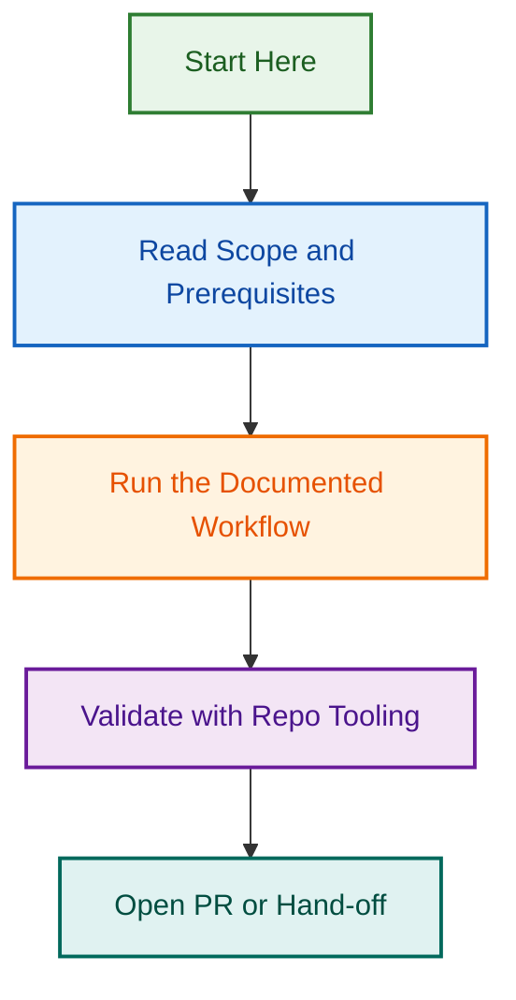

# Issue Type & Metadata Automation Initiative

**Status:** 🟢 Active | **Start:** July 23, 2026 | **Target Completion:** August 27, 2026

Fix critical gaps in issue creation automation so metadata is automatically populated at creation time.

---

## Quick Navigation by Role

### 👥 **For Executives / Stakeholders** (10 min read)

**What's the problem?**
Issues created without proper metadata (type, assignee, project, fields), requiring manual cleanup. GitHub bot sometimes confusingly reopens issues.

**What's the solution?**
Auto-populate all metadata at creation. Fix 5 critical issues, add 3 enhanced features, document best practices.

**Timeline & Investment:**

- **Duration:** 5 weeks (July 23 — August 27)
- **Effort:** 37.5 hours
- **Team:** 1–2 engineers
- **Risk:** LOW (isolated workflow changes, thorough testing)

**Next Steps:**

1. Read `IMPLEMENTATION_PLAN.md` (30 min)
2. Review epic issue in GitHub
3. Approve Phase 1 allocation
4. Track progress via GitHub project board

**Key Files:**

- `PROJECT_INDEX.md` — Full project structure & files
- `IMPLEMENTATION_PLAN.md` — Timeline, effort, success criteria

---

### 🏗️ **For Technical Leads** (45 min read)

**What are we building?**

Three phases:

1. **Phase 1 (Critical Fixes):** Remove broken label, add aliases, fix issue labeling, fix workflow reopening, add DoD validation (11.5h)
2. **Phase 2 (Enhanced Features):** PR merge blocker, custom field population, template-aware type detection (15h)
3. **Phase 3 (Documentation):** AI agent guidance, update AGENTS.md, full testing (11h)

**Key Design Decisions:**

- Issue-body labeling rules (40+ patterns for templates, types, areas)
- Template-enforcement posts guidance instead of silent reopening
- DoD validation prevents issue close with incomplete checklist
- PR merge blocked if linked issue incomplete
- Custom fields auto-inferred from issue type + content

**Architecture:**

- Update 7 config files (labels.yml, labeler.yml, issue-types.yml, etc.)
- Create 3 new workflows (validate-issue-dod, validate-linked-issue-dod, populate-fields)
- Enhance 2 existing workflows (issues.yml, template-enforcement.yml)
- Add 40+ labeling rules to labeler.yml

**Success Metrics:**

- ✅ All issues have correct type label at creation
- ✅ All custom fields auto-populated
- ✅ PR merges blocked if linked issue incomplete
- ✅ Zero silent issue reopening (clear guidance provided)
- ✅ All 158 labels protected in governance

**Team Allocation:**

- Phase 1: 1 senior engineer (2 weeks)
- Phase 2: 1 engineer (2 weeks)
- Phase 3: 1 engineer (1 week)
- Code review: Tech lead (2–3h total)

**Next Steps:**

1. Read `IMPLEMENTATION_PLAN.md` (complete) (30 min)
2. Review `.github/reports/issue-management/solution-design-2026-07-23.md` (30 min)
3. Review GitHub epic issue + Phase 1 tasks
4. Assign team members
5. Authorize Phase 1 execution

**Key Files:**

- `IMPLEMENTATION_PLAN.md` — Full roadmap, architecture, effort
- `.github/reports/issue-management/` — Detailed audit & design docs
- `./issues/` — Individual issue markdown files (task breakdown)

---

### 👨‍💻 **For Individual Contributors** (5 min overview, then task-specific)

**What are you doing?**
You're assigned to one or more tasks across Phase 1, 2, or 3. Each task has a detailed markdown file with step-by-step instructions.

**Your workflow:**

1. Read the task markdown file (e.g., `issues/02-fix-nonexistent-label.md`)
2. Follow the step-by-step implementation section
3. Run the validation checks
4. Create a PR with your changes
5. Request review from tech lead

**Phase 1 Tasks (Weeks 1-2):**

- `02-fix-nonexistent-label.md` — 5 min task (remove 1 line from config)
- `03-fix-type-aliases.md` — 30 min task (add aliases to labels.yml)
- `04-issue-body-labeling-rules.md` — 3-4 hour task (add 40+ rules)
- `05-fix-template-enforcement.md` — 2-3 hour task (update workflow)
- `06-issue-dod-validation.md` — 2-3 hour task (create new workflow)

**Phase 2 Tasks (Weeks 3-4):**

- `07-pr-merge-blocker.md` — 3-4 hour task (new workflow)
- `08-custom-field-population.md` — 4-5 hour task (new workflow)
- `09-template-aware-type.md` — 1-2 hour task (enhance existing workflow)

**Phase 3 Tasks (Weeks 4-5):**

- `10-ai-agent-guidance.md` — 2 hour task (documentation)
- `11-update-agents-md.md` — 2 hour task (documentation)
- `12-test-and-validate.md` — 4 hour task (testing & validation)

**Getting Help:**

- For task details: Read the markdown file in `./issues/`
- For architecture questions: See `.github/reports/issue-management/solution-design-2026-07-23.md`
- For status: Check epic issue + linked child issues in GitHub
- For blockers: Post in #engineering Slack or comment on GitHub

**Next Steps:**

1. Check GitHub epic issue for your assigned tasks
2. Read your task markdown file
3. Follow the implementation steps
4. Create PR when ready
5. Request review

**Key Files:**

- `./issues/` — All task markdown files (start here!)
- `.github/reports/issue-management/` — Design details (reference)
- `.github/projects/active/IMPLEMENTATION_PLAN.md` — Timeline & effort

---

## 📊 Project At a Glance

| Metric | Details |
|--------|---------|
| **Status** | 🟢 Active |
| **Duration** | 5 weeks (July 23 — Aug 27) |
| **Total Effort** | 37.5 hours |
| **Phases** | 3 (5 + 3 + 3 tasks) |
| **Team Size** | 1–2 engineers |
| **Risk Level** | LOW |
| **Success Criteria** | 12 items (all checklist items) |
| **Key Deliverables** | 5 critical fixes, 3 enhanced features, full documentation |

---

## 📁 File Structure

```
.github/projects/active/issue-type-workflow-automation/
├── README.md (this file)
├── PROJECT_INDEX.md (full project details)
├── IMPLEMENTATION_PLAN.md (roadmap & architecture)
└── issues/ (GitHub issue markdown files)
    ├── 01-epic-issue-type-automation.md
    ├── 02-fix-nonexistent-label.md
    ├── 03-fix-type-aliases.md
    ├── 04-issue-body-labeling-rules.md
    ├── 05-fix-template-enforcement.md
    ├── 06-issue-dod-validation.md
    ├── 07-pr-merge-blocker.md
    ├── 08-custom-field-population.md
    ├── 09-template-aware-type.md
    ├── 10-ai-agent-guidance.md
    ├── 11-update-agents-md.md
    └── 12-test-and-validate.md
```

Related documentation:

- `.github/reports/issue-management/audit-2026-07-23-comprehensive.md` (full audit)
- `.github/reports/issue-management/solution-design-2026-07-23.md` (detailed design)

---

## 🎯 What's Next?

1. **Stakeholders:** Approve Phase 1 (allocate resources)
2. **Tech Leads:** Assign team members to Phase 1 tasks
3. **Contributors:** Read your assigned task markdown + start implementation
4. **All:** Track progress via GitHub epic issue + project board

---

## 📞 Questions?

- **Quick answers?** Read the section for your role above
- **Timeline/effort?** See IMPLEMENTATION_PLAN.md
- **Task details?** See individual markdown files in ./issues/
- **Design questions?** See solution-design-2026-07-23.md in reports folder
- **Status?** Check GitHub epic issue
- **Blocker?** Post in #engineering or comment on GitHub

---

**Project Owner:** Ash Shaw  
**Created:** 2026-07-23  
**Status:** ✅ Ready for Execution

## Related Issues

This project is coordinated with:

- [#1733](https://github.com/lightspeedwp/.github/issues/1733) — Phase 2: Folder Structure & Linking

See [Linking Standard](https://github.com/lightspeedwp/.github/blob/develop/.github/projects/active/reports-projects-restructuring-2026-08-11/LINKING_STANDARD.md) for linking patterns.
## Visual Workflow


