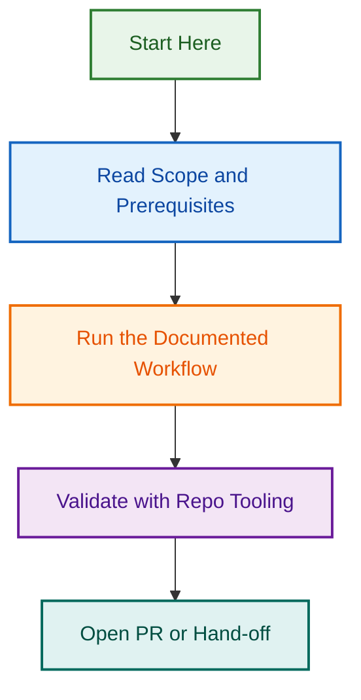

# Issue Type Allocator Initiative — Complete Project

**Status:** 🟢 Active | **Phases 1-4:** ✅ Complete (Merged PR #2686) | **Phases 5-8:** 🚀 Ready to Execute

Comprehensive 8-phase initiative to establish unified issue type taxonomy, standardize labels and colors, integrate with AI agents, and validate end-to-end workflow.

**📊 Authoritative Status:** See [STATUS.md](./STATUS.md) for complete phase status, timeline, and metrics.

---

## Quick Navigation by Role

### 👥 **For Executives / Stakeholders** (10 min read)

**What was the problem?**
- Inconsistent issue type taxonomy (35 types, unclear consolidation)
- Template structure issues (44 files, 19 duplicate pairs, 10 missing)
- Label naming inconsistencies (type:docs vs type:documentation, etc.)
- No unified framework for agent decision-making

**What's the solution?**
8-phase initiative to establish unified taxonomy, standardize labels, integrate with agents, and validate end-to-end:
- **Phases 1-4:** ✅ Complete (Analysis, Skill, Planning) — PR #2686 merged Sept 3
- **Phases 5-8:** 🚀 Ready to execute (Templates, Labels, Agents, Testing)

**Timeline & Investment:**

- **Phases 1-4:** ✅ Complete (4 weeks, ~16-22 hours) — MERGED
- **Phases 5-8:** 🚀 Ready (2 weeks, ~13-16 hours estimated)
- **Total:** ~30-40 hours (distributed over 8 phases)
- **Team:** 1–2 engineers
- **Risk:** LOW (isolated workflow changes, thorough testing)

**Next Steps:**

1. Read `STATUS.md` for complete project status (5 min)
2. For Phase 5 details: See `issues/phase-5-template-fixes.md`
3. Allocate resources for phases 5-8 execution
4. Track progress via GitHub project board

**Key Files:**

- `STATUS.md` ⭐ — Authoritative project status (phases 1-8)
- `issues/phase-5-template-fixes.md` — Phase 5 task breakdown
- `issues/phase-6-label-standardization.md` — Phase 6 task breakdown
- `issues/phase-7-agent-integration.md` — Phase 7 task breakdown
- `issues/phase-8-testing-validation.md` — Phase 8 task breakdown

---

### 🏗️ **For Technical Leads** (30 min read)

**What are we building?**

Eight-phase initiative to establish unified issue type taxonomy and integrate with AI agents:

**Completed (Merged PR #2686, Sept 3):**
- **Phase 1-4:** Analysis, Issue Type Allocator Skill (570 lines), Planning, Consolidation strategy (35→29 types)

**Ready to Execute (Phases 5-8):**
- **Phase 5 (2-3h):** Template fixes — deduplication, renumbering 01-29, create 10 missing templates
- **Phase 6 (3-4h):** Label standardization — fix inconsistencies (type:docs→type:documentation), apply semantic color redistribution
- **Phase 7 (4-6h):** Agent integration — wire Issue Type Allocator Skill to 5 agents
- **Phase 8 (2-3h):** Testing & validation — comprehensive testing of all 35 types, agents, labels, colors

**Key Architecture:**

- **Phase 5:** Deduplicate 19 template pairs, renumber to 01-29, create missing templates, validate structure
- **Phase 6:** Standardize label names, redistribute colors per 8 semantic categories, update configs (.github/labels.yml, .github/issue-types.yml, .github/labeler.yml)
- **Phase 7:** Update 5 agent instructions (Release, Issues, PR, Changelog, Automation) to reference skill decision tree
- **Phase 8:** Test 35 issue types + 5 agents + labels + colors + edge cases, generate test report

**Success Criteria:**

- ✅ All 35 issue types have correct templates (01-29 clean sequence)
- ✅ All label names standardized, no type:docs or type:ops ambiguity
- ✅ Semantic color distribution applied (8 categories, WCAG 2.2 AA compliant)
- ✅ All 5 agents wire correctly to skill decision tree
- ✅ End-to-end testing validates complete workflow
- ✅ Release-ready for v1.1

**Team Allocation:**

- Phase 5: 1 engineer (2-3 hours)
- Phase 6: 1 engineer (3-4 hours)
- Phase 7: 1 engineer (4-6 hours)
- Phase 8: 1 engineer (2-3 hours)
- Code review: Tech lead (3-4h total)

**Next Steps:**

1. Read `STATUS.md` for complete status (5 min)
2. Review individual phase files in `issues/` (phase-5-8)
3. Check skill at `skills/issue-type-allocator/SKILL.md` (merged)
4. Assign team members to phases 5-8
5. Authorize execution

**Key Files:**

- `STATUS.md` ⭐ — Authoritative status (all phases)
- `issues/phase-5-template-fixes.md` — Phase 5 complete breakdown
- `issues/phase-6-label-standardization.md` — Phase 6 complete breakdown
- `issues/phase-7-agent-integration.md` — Phase 7 complete breakdown
- `issues/phase-8-testing-validation.md` — Phase 8 complete breakdown
- `skills/issue-type-allocator/SKILL.md` — The skill (570 lines, merged)

---

### 👨‍💻 **For Individual Contributors** (5 min overview, then task-specific)

**What are you doing?**
You're assigned to one or more tasks across Phase 5, 6, 7, or 8. Each phase has a detailed markdown file with complete implementation guidance.

**Phase Assignment Workflow:**

1. Read your phase file (e.g., `issues/phase-5-template-fixes.md`)
2. Review the checklist of sub-tasks
3. Follow the implementation sections with detailed steps
4. Run validation checks locally
5. Create PR with your changes to feature branch
6. Request review from tech lead

**Phase 5 Tasks (Template Fixes & Renumbering):**
- Delete 19 duplicate template files (slots 07-25)
- Renumber all templates to 01-29 sequence
- Create 10 missing templates (types 26-35)
- Add/update frontmatter on all templates
- Validate template structure and consistency

**Phase 6 Tasks (Label Standardization):**
- Fix label naming inconsistencies (type:docs → type:documentation, etc.)
- Apply semantic color redistribution (8 categories, WCAG 2.2 AA)
- Update `.github/labels.yml`, `.github/issue-types.yml`, `.github/labeler.yml`
- Update all 29 template references
- Validate label governance and color contrast

**Phase 7 Tasks (Agent Integration):**
- Update Release Agent instructions + skill reference
- Update Issues Agent instructions + skill decision tree
- Update PR Agent instructions + type inference logic
- Update Changelog Agent instructions + type→section mapping
- Update Automation Agent instructions + AI Ops label assignment
- Test agent behavior with skill integration

**Phase 8 Tasks (Testing & Validation):**
- Create test issues for all 35 types
- Test each agent with skill integration
- Validate label consistency across all types
- Test color contrast (WCAG 2.2 AA)
- Test edge cases and error scenarios
- Generate comprehensive test report

**Getting Help:**

- For task details: Read the phase file in `./issues/phase-*.md`
- For skill reference: See `skills/issue-type-allocator/SKILL.md` (decision tree)
- For status: Check `STATUS.md` and GitHub project board
- For design questions: See `.github/reports/issue-management/` (reference)
- For blockers: Post in #engineering Slack or comment on GitHub

**Next Steps:**

1. Check GitHub project board for your assigned phase
2. Read your phase markdown file (complete task breakdown)
3. Follow the implementation steps with validation
4. Create feature branch and PR when ready
5. Request review from tech lead

**Key Files:**

- `STATUS.md` ⭐ — Project status (phases 1-8 complete documentation)
- `issues/phase-5-template-fixes.md` — Phase 5 task breakdown
- `issues/phase-6-label-standardization.md` — Phase 6 task breakdown
- `issues/phase-7-agent-integration.md` — Phase 7 task breakdown
- `issues/phase-8-testing-validation.md` — Phase 8 task breakdown
- `skills/issue-type-allocator/SKILL.md` — The skill (decision tree, examples)

---

## 📊 Project At a Glance

| Metric | Details |
|--------|---------|
| **Status** | 🟢 Active (Phases 1-4 ✅ Complete, Phases 5-8 Ready) |
| **Total Duration** | 8 phases (July 23, 2026 — Target Sept 10, 2026) |
| **Total Effort** | ~30-40 hours (distributed across 8 phases) |
| **Phases** | 8 (Analysis + Skill, then 4 implementation phases) |
| **Team Size** | 1–2 engineers |
| **Risk Level** | LOW |
| **Key Deliverables** | Skill (merged), Templates, Labels, Agents, Testing, Release |
| **Authoritative Status** | [STATUS.md](./STATUS.md) — Phases 1-8 complete documentation |

---

## 📁 File Structure

```
.github/projects/active/issue-type-workflow-automation/
├── README.md (this file — project overview)
├── STATUS.md ⭐ (AUTHORITATIVE — Phases 1-8 status, timeline, metrics)
├── PROJECT_INDEX.md (legacy project details)
├── IMPLEMENTATION_PLAN.md (legacy phases 1-3 roadmap)
│
├── issues/ (Phase 1-3: Original automation tasks)
│   ├── 01-epic-issue-type-automation.md
│   ├── 02-fix-nonexistent-label.md
│   ├── 03-fix-type-aliases.md
│   ├── 04-issue-body-labeling-rules.md
│   ├── 05-fix-template-enforcement.md
│   ├── 06-issue-dod-validation.md
│   ├── 07-pr-merge-blocker.md
│   ├── 08-custom-field-population.md
│   ├── 09-template-aware-type.md
│   ├── 10-ai-agent-guidance.md
│   ├── 11-update-agents-md.md
│   ├── 12-test-and-validate.md
│   │
│   ├── phase-5-template-fixes.md (NEW — Phase 5 task breakdown)
│   ├── phase-6-label-standardization.md (NEW — Phase 6 task breakdown)
│   ├── phase-7-agent-integration.md (NEW — Phase 7 task breakdown)
│   └── phase-8-testing-validation.md (NEW — Phase 8 task breakdown)
```

**Key Documents:**

- **STATUS.md** — Authoritative project status for all 8 phases (phases 1-4 complete, 5-8 documented)
- **skills/issue-type-allocator/SKILL.md** — 570-line skill (merged PR #2686, merged 2026-09-03)
- `.github/reports/issue-management/audit-2026-07-23-comprehensive.md` (audit findings)
- `.github/reports/issue-management/solution-design-2026-07-23.md` (design details)

---

## 🎯 What's Next?

1. **Stakeholders:** Approve Phase 1 (allocate resources)
2. **Tech Leads:** Assign team members to Phase 1 tasks
3. **Contributors:** Read your assigned task markdown + start implementation
4. **All:** Track progress via GitHub epic issue + project board

---

## 📞 Questions?

- **Quick answers?** Read the section for your role above
- **Timeline/effort?** See IMPLEMENTATION_PLAN.md
- **Task details?** See individual markdown files in ./issues/
- **Design questions?** See solution-design-2026-07-23.md in reports folder
- **Status?** Check GitHub epic issue
- **Blocker?** Post in #engineering or comment on GitHub

---

**Project Owner:** Ash Shaw  
**Created:** 2026-07-23  
**Status:** ✅ Ready for Execution

### Related Active Projects

- **[issue-triage-automation-system](../issue-triage-automation-system/)** — Related issue triage automation (complementary scope)
- **[issue-metadata-triage-expansion](../issue-metadata-triage-expansion/)** — Expanded metadata triage system
- **[issue-management-agent-planning-2026-08-12](../issue-management-agent-planning-2026-08-12/)** — Universal issue management agent
- **[template-enforcement-governance](../template-enforcement-governance/)** — Template validation

---

## Related Issues & PRs

**Completed Work:**
- [PR #2686](https://github.com/lightspeedwp/.github/pull/2686) — Phase 1-4: Issue Type Allocator Skill & Planning (✅ Merged Sept 3, 2026)

**In Progress:**
- [PR #2696](https://github.com/lightspeedwp/.github/pull/2696) — Phase 5-8: Task Documentation (Draft, Ready for Phase 5 Execution)

**Related Coordination:**
- [#1733](https://github.com/lightspeedwp/.github/issues/1733) — Phase 2: Folder Structure & Linking
- [#1592](https://github.com/lightspeedwp/.github/issues/1592) — Label Prefix Governance Enforcement

See [Linking Standard](https://github.com/lightspeedwp/.github/blob/develop/.github/projects/active/reports-projects-restructuring-2026-08-11/LINKING_STANDARD.md) for linking patterns.

## Visual Workflow


