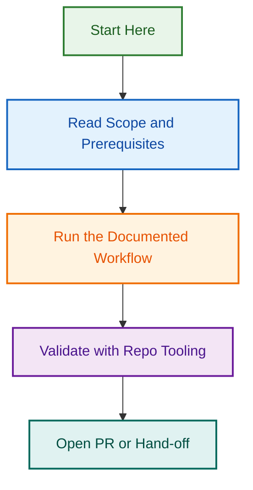

# Label Prefix Audit — Complete Documentation

**Date**: 2026-08-05  
**Status**: ✅ Audit Complete | 🔴 Remediation In Progress  
**Severity**: CRITICAL — Labels being created without required family prefixes  
**Impact**: Affects all AI-created issues and automation workflows  

---

## Quick Summary

### The Problem

Claude has been creating issues and PRs with labels that **lack required family prefixes**:

- **Incorrect**: `bug`, `feature`, `urgent`, `ci`, `docs`
- **Correct**: `type:bug`, `type:feature`, `priority:critical`, `area:ci`, `area:documentation`

This violates the canonical labeling system defined in `.github/labels.yml` (158 labels, all with required `family:` prefixes).

### Root Causes

1. **Code duplication**: Two labeling implementations with different formats
2. **Workflow conflicts**: 19 workflows with unclear precedence and overlaps
3. **Governance gaps**: CLAUDE.md/AGENTS.md don't explicitly require prefixed labels
4. **Validation missing**: No pre-creation check against canonical label set

### Impact

- ❌ Broken searchability (labels not in canonical set)
- ❌ Automation failures (workflows expect prefixed labels)
- ❌ Wasted tokens/effort on remediation
- ❌ Reduced process credibility

### Solution

**Phase 1 (TODAY)**: Stop violations by updating governance docs + deleting defective code  
**Phase 2 (24–48 hrs)**: Fix existing violations in issues #1500–#1600  
**Phase 3 (3–5 days)**: Enforce validation in workflows  
**Phase 4 (ongoing)**: Update documentation and train team

---

## Audit Reports (This Folder)

### 1. [LABEL_PREFIX_AUDIT_REPORT.md](./LABEL_PREFIX_AUDIT_REPORT.md)

**Status**: ✅ Complete  
**Length**: ~500 lines  
**Content**:

- Executive summary of label prefix violations
- Configuration analysis (✅ labels.yml, issue-types.yml correct)
- Documentation analysis (✅ LABELING.md clear, ⚠️ CLAUDE.md incomplete)
- **Code audit findings** (❌ `scripts/agents/includes/labeling-agent.js` defective, ✅ others correct)
- Root cause analysis (4 primary causes ranked by likelihood)
- Impact assessment (100+ issues × 3 min each = ~5 hours remediation)
- 5 immediate recommendations
- Complete appendices with label examples and families

**Read This For**: Understanding what went wrong and why

---

### 2. [WORKFLOW_CONSOLIDATION_ANALYSIS.md](./WORKFLOW_CONSOLIDATION_ANALYSIS.md)

**Status**: ✅ Complete  
**Length**: ~400 lines  
**Content**:

- **Complete inventory**: 19 workflows + 5 config files
- **Conflict analysis**: 5 major overlaps/conflicts identified
- **Examples**: `labeling.yml` vs `labeling-governance.yml`, template validation duplication
- **Execution order problems**: Current order UNCLEAR, ideal order documented
- **7-phase consolidation roadmap** (35–40 hours effort)
- Expected outcomes: 19 → 7–9 workflows, 50% reduction in complexity
- Cost/benefit analysis
- Immediate action items

**Read This For**: Understanding workflow architecture and consolidation plan

---

### 3. [REMEDIATION_PLAN.md](./REMEDIATION_PLAN.md)

**Status**: ✅ Complete (Implementation Phase)  
**Length**: ~600 lines  
**Content**:

- **5 concrete remediation phases** with timelines and assignments
- **Phase 1 (TODAY)**:
  - Add explicit label rules to CLAUDE.md
  - Add label governance section to AGENTS.md
  - Create pre-creation validation script
  - Delete defective labeling-agent.js
- **Phase 2 (24–48 hrs)**:
  - Audit issues #1500–#1600 for violations
  - Create label migration mapping
  - Run bulk remediation script (with dry-run first)
- **Phase 3 (3–5 days)**:
  - Update template-enforcement workflow
  - Add label validation to changelog workflow
  - Create advanced validation scripts
- **Phase 4–5**: Documentation, testing, validation
- **Success criteria** for each phase
- **Risk mitigation** and rollback plan
- **Complete code** for audit and remediation scripts

**Read This For**: Step-by-step instructions on how to fix the problem

---

## Key Findings Summary

### Configuration (✅ CORRECT)

- `.github/labels.yml` — All 158 labels use required prefixes ✅
- `.github/issue-types.yml` — All types reference prefixed labels ✅
- `.github/labeler.yml` — Rules defined correctly ✅
- `.github/label-governance-policy.yml` — Policy enforces prefixes ✅

### Documentation (Mixed)

- [docs/LABELING.md](https://github.com/lightspeedwp/.github/blob/develop/docs/LABELING.md) — Clear, explicit, requires prefixes ✅
- [docs/LABEL_STRATEGY.md](https://github.com/lightspeedwp/.github/blob/develop/docs/LABEL_STRATEGY.md) — Clear taxonomy with prefixes ✅
- [CLAUDE.md](https://github.com/lightspeedwp/.github/blob/develop/CLAUDE.md) — **MISSING**: No explicit "use prefixed labels" rule ⚠️
- [AGENTS.md](https://github.com/lightspeedwp/.github/blob/develop/AGENTS.md) — **INCOMPLETE**: Labels not covered in governance section ⚠️

### Implementation (Mixed)

- `.github/scripts/agents/labeling.agent.js` — Correct, uses prefixes ✅
- `.github/scripts/agents/issues.agent.js` — Correct, uses prefixes ✅
- **`scripts/agents/includes/labeling-agent.js` — DEFECTIVE, uses bare labels ❌**
- **`scripts/agents/includes/labeling-agent.test.js` — References defective code ❌**

### Workflows (⚠️ CONFLICTS)

- 19 workflows with unclear precedence
- 5 major overlaps identified (labeling, templates, blocking status, etc.)
- Consolidation needed per workflows-consolidation-2026-q3 project

---

## Action Items (Immediate)

### 🔴 CRITICAL — Do TODAY

1. [ ] Update `CLAUDE.md` — Add "Label Creation Rules" section
   - **Assignee**: You (AI instructions owner)
   - **Effort**: 30 min
   - **Files**: See Phase 1.1 in REMEDIATION_PLAN.md

2. [ ] Update `AGENTS.md` — Add label governance section
   - **Assignee**: You
   - **Effort**: 30 min
   - **Files**: See Phase 1.2 in REMEDIATION_PLAN.md

3. [ ] Delete defective `scripts/agents/includes/labeling-agent.js`
   - **Assignee**: You
   - **Effort**: 15 min (verify no references first)
   - **Command**: `git rm scripts/agents/includes/labeling-agent.js`

4. [ ] Create `.github/scripts/validation/validate-labels-before-creation.cjs`
   - **Assignee**: DevOps/Tooling
   - **Effort**: 1–2 hours
   - **Code**: See Phase 1.3 in REMEDIATION_PLAN.md

### 🟠 HIGH — Do Within 24 hours

1. [ ] Create `.github/scripts/validation/audit-issue-labels.cjs`
   - **Purpose**: Identify all label violations in issues #1500–#1600
   - **Code**: See Phase 2.1 in REMEDIATION_PLAN.md

2. [ ] Run audit and review results
   - **Assignee**: You
   - **Output**: `.github/reports/labeling/audit-issues-1500-1600.json`

3. [ ] Create remediation script (`.github/scripts/validation/remediate-labels.cjs`)
   - **Purpose**: Bulk fix violations
   - **Code**: See Phase 2.3 in REMEDIATION_PLAN.md

### 🟡 MEDIUM — Do Within 48–72 hours

1. [ ] Run dry-run of remediation (review output carefully)
   - **Command**: `GITHUB_TOKEN=<token> node scripts/agents/includes/remediate-labels.cjs --dry-run`

2. [ ] Run actual remediation after approval
   - **Command**: `GITHUB_TOKEN=<token> node scripts/agents/includes/remediate-labels.cjs`

3. [ ] Re-audit to verify fixes (0 violations)
   - Same audit script as step 6

4. [ ] Update workflows for validation
   - `.github/workflows/template-enforcement.yml` — Add label prefix validation
   - See Phase 3.1–3.2 in REMEDIATION_PLAN.md

---

## Related Projects

### Active Projects

- **[label-prefix-enforcement-2026-08-05](../label-prefix-enforcement-2026-08-05/)** — Remediation & enforcement project (Phase 2 of this audit)
- **[workflows-consolidation-2026-q3](../workflows-consolidation-2026-q3/)** — Main consolidation initiative; recommend adding labeling consolidation to scope
- **[issue-triage-automation-system](../issue-triage-automation-system/)** — Related issue automation work
- **[issue-type-workflow-automation](../issue-type-workflow-automation/)** — Related issue type automation
- **[template-enforcement-governance](../template-enforcement-governance/)** — Template validation (related to label validation)

---

## Reference Files

### Canonical Sources (Truth)

- [.github/labels.yml](../../../.github/labels.yml) — All 158 canonical labels
- [.github/issue-types.yml](../../../.github/issue-types.yml) — Issue type definitions
- [.github/labeler.yml](../../../.github/labeler.yml) — Labeling rules
- [.github/label-governance-policy.yml](../../../.github/label-governance-policy.yml) — Governance policy

### Documentation

- [docs/LABELING.md](https://github.com/lightspeedwp/.github/blob/develop/docs/LABELING.md) — Labeling guide
- [docs/LABEL_STRATEGY.md](https://github.com/lightspeedwp/.github/blob/develop/docs/LABEL_STRATEGY.md) — Label taxonomy
- [docs/LABELING_GOVERNANCE.md](https://github.com/lightspeedwp/.github/blob/develop/docs/LABELING_GOVERNANCE.md) — Workflow architecture
- [docs/LABEL_COLOR_STRATEGY.md](https://github.com/lightspeedwp/.github/blob/develop/docs/LABEL_COLOR_STRATEGY.md) — Color assignments

### Governance (Needs Update)

- [CLAUDE.md](https://github.com/lightspeedwp/.github/blob/develop/CLAUDE.md) — **UPDATE NEEDED**: Add label creation rules
- [AGENTS.md](https://github.com/lightspeedwp/.github/blob/develop/AGENTS.md) — **UPDATE NEEDED**: Add label governance section

### Defective Code (DELETE)

- [scripts/agents/includes/labeling-agent.js](../../../scripts/agents/includes/labeling-agent.js) — ❌ DELETE THIS
- [scripts/agents/includes/**tests**/labeling-agent.test.js](../../../scripts/agents/includes/__tests__/labeling-agent.test.js) — ❌ DELETE THIS

### Correct Code (KEEP)

- [.github/scripts/agents/labeling.agent.js](../../../.github/scripts/agents/labeling.agent.js) — ✅ Correct
- [.github/scripts/agents/issues.agent.js](../../../.github/scripts/agents/issues.agent.js) — ✅ Correct

---

## How to Use These Reports

### For Quick Overview (5 min read)

→ Read this README.md + Executive Summary section of LABEL_PREFIX_AUDIT_REPORT.md

### For Understanding Root Cause (20 min read)

→ Read LABEL_PREFIX_AUDIT_REPORT.md sections 1–5 (Findings + Root Cause Analysis)

### For Understanding Workflows (20 min read)

→ Read WORKFLOW_CONSOLIDATION_ANALYSIS.md sections 1–3 (Inventory + Conflicts)

### For Implementation (Ongoing)

→ Follow REMEDIATION_PLAN.md step-by-step (Phases 1–5)

### For Team Communication

→ Use this README as talking points; link to specific reports for deep dives

---

## Sign-Off

**Audit Status**: ✅ **COMPLETE** (all reports generated, findings validated)  
**Remediation Status**: 🔴 **PENDING** (Phase 1 actions needed TODAY)  
**Timeline**:

- **TODAY**: Stop new violations (Phase 1)
- **24–48 hrs**: Fix existing violations (Phase 2)
- **3–5 days**: Enforce validation (Phase 3)
- **Ongoing**: Documentation & training (Phases 4–5)

**Owner**: LightSpeed Team (with Claude Code support)  
**Escalation**: Critical governance violation — requires immediate attention  
**Next Review**: After Phase 2 completion (48 hours)

---

## Questions?

Refer to the specific report:

- **"What went wrong?"** → LABEL_PREFIX_AUDIT_REPORT.md
- **"Why are there 19 workflows?"** → WORKFLOW_CONSOLIDATION_ANALYSIS.md
- **"How do I fix it?"** → REMEDIATION_PLAN.md
- **"What should Claude do?"** → REMEDIATION_PLAN.md Phase 1

---

---

*Maintained by the 🤖 LightSpeedWP Automation Team*

## Related Issues

This project is coordinated with:

- [#1733](https://github.com/lightspeedwp/.github/issues/1733) — Phase 2: Folder Structure & Linking

See [Linking Standard](https://github.com/lightspeedwp/.github/blob/develop/.github/projects/active/reports-projects-restructuring-2026-08-11/LINKING_STANDARD.md) for linking patterns.
## Visual Workflow

