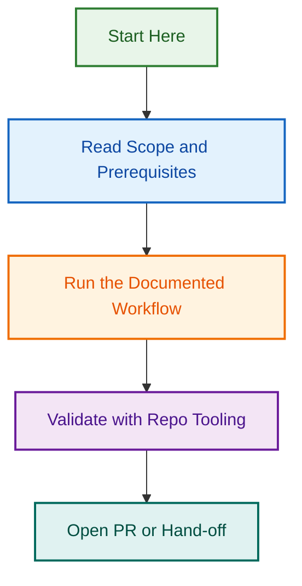

# Label Prefix Enforcement Project

**Status**: 🟢 **ACTIVE** (Phase 3 complete)  
**Started**: 2026-08-05  
**Phase 3 Completion**: 2026-09-02  
**Priority**: 🔴 **CRITICAL**

---

## Project Overview

Comprehensive remediation of ~100 issues (#1500–#1600) with non-canonical labels, plus permanent governance to prevent future violations.

### What This Project Achieves

✅ **Audit Complete**: Root cause identified (defective code in `scripts/agents/includes/labeling-agent.js`)  
✅ **Phase 1 Complete**: Governance framework established (merged #2476)  
✅ **Phase 3 Complete**: Label prefix enforcement in PR templates (merged #2590)  
🔄 **Phase 2 Ongoing**: Fix existing ~100 issues with bare labels  
⏳ **Phase 4–5**: Documentation, training, ongoing governance

---

## Quick Links

| Document | Purpose |
|----------|---------|
| [ACTION_PLAN.md](./ACTION_PLAN.md) | Complete 5-phase remediation roadmap |
| [IMPLEMENTATION_GUIDE.md](./IMPLEMENTATION_GUIDE.md) | **NEW** — Step-by-step procedures for all phases |
| [RISK_MITIGATION.md](./RISK_MITIGATION.md) | **NEW** — Risk assessment & contingency procedures |
| [TESTING_VALIDATION.md](./TESTING_VALIDATION.md) | **NEW** — Testing & validation procedures |
| [OPENSPEC_RFC_REFINED.md](./OPENSPEC_RFC_REFINED.md) | Refined OpenSpec RFC incorporating audit results (2.0) |

---

## Key Findings

### Root Cause

**Defective Code**: `scripts/agents/includes/labeling-agent.js` applies bare labels without required family prefixes

### Impact

- ~100 issues (#1500–#1600) with non-canonical labels
- Broken automation (workflows expect prefixed labels)
- Searchability degraded
- ~5 hours remediation effort

### Solution

**5-Phase Plan**:

1. ✅ **Phase 1 (COMPLETE)**: Delete defective code, update governance documents → PR #2476 merged
2. 🔄 **Phase 2 (IN PROGRESS)**: Fix existing ~100 issues (bulk remediation) → Audit & mapping complete
3. ✅ **Phase 3 (COMPLETE)**: Add validation to PR templates → PR #2590 merged
4. 🔄 **Phase 4 (ONGOING)**: Update documentation → In progress
5. ⏳ **Phase 5 (PENDING)**: Team training → Scheduled

---

## Timeline

```
TODAY          +24h          +48h          +3d          +5d          +7d
|              |              |              |              |              |
Phase 1      Phase 2       Phase 2       Phase 3       Phase 3       Phase 4
(2–3 hrs)    START FIX      COMPLETE     START         COMPLETE      & 5 DONE
             (3–5 hrs)      REMEDIATION  VALIDATION    ENFORCEMENT
```

**Total Effort**: 12–19 hours  
**Total Duration**: 5–7 business days

---

## Related Projects

- **[label-prefix-audit-2026-08-05](../label-prefix-audit-2026-08-05/)** — Audit & root cause analysis (Phase 1 of this initiative)
- **[workflows-consolidation-2026-q3](../workflows-consolidation-2026-q3/)** — Consolidate 19 labeling/issue workflows (longer-term)
- **[template-enforcement-governance](../template-enforcement-governance/)** — PR/issue template validation
- **[issue-triage-automation-system](../issue-triage-automation-system/)** — Issue automation framework

---

## Links to Audit Reports

All audit findings in PR #1591:

1. **[LABEL_PREFIX_AUDIT_REPORT.md]** (500+ lines)
   - Complete audit findings and root cause analysis
   - Configuration verification (all correct)
   - Code audit (defective code identified)
   - Impact assessment

2. **[WORKFLOW_CONSOLIDATION_ANALYSIS.md]** (400+ lines)
   - 19 workflows inventoried
   - 5 major conflicts documented
   - 7-phase consolidation roadmap
   - Expected 50% complexity reduction

3. **[REMEDIATION_PLAN.md]** (600+ lines)
   - Complete phase-by-phase plan
   - Implementation scripts included
   - Success criteria for each phase
   - Risk mitigation and rollback

4. **[README.md]** (audit folder)
   - Quick reference guide
   - Summary of all findings
   - Phase 1–5 action items
   - Related projects and references

---

## Success Metrics

### Phase 1 (TODAY)

- [ ] CLAUDE.md updated with label creation rules
- [ ] AGENTS.md updated with governance section
- [ ] Defective code deleted
- [ ] 0 new non-canonical labels created

### Phase 2 (24–48 hrs)

- [ ] All ~100 issues in #1500–#1600 fixed
- [ ] Re-audit confirms 0 violations
- [ ] No automation failures due to label format

### Phase 3 (3–5 days)

- [ ] Label validation in issue creation workflows
- [ ] Label validation in PR workflows
- [ ] Pre-creation validation script tested

### Phase 4 (5–7 days)

- [ ] LABELING.md updated with troubleshooting
- [ ] FAQ guide created
- [ ] README references updated

### Phase 5 (7+ days)

- [ ] Team notified via Slack
- [ ] No new violations in subsequent weeks
- [ ] Team understands canonical label system

---

## Governance Changes

### CLAUDE.md (NEW SECTION)

```markdown
## Label Creation Rules (CRITICAL)

ALL labels MUST use required family prefixes:
- type:* for classification (bug, feature, task, etc.)
- status:* for workflow state
- priority:* for urgency
- area:* for domain/component
- meta:* for automation markers

Never create issues with bare labels like 'bug', 'urgent', 'ci'.
```

### AGENTS.md (NEW SECTION)

```markdown
### Label Creation for Programmatic Issue Creation

Explicit examples and validation checklist for label creation.
Reference `.github/labels.yml` (158 canonical labels).
```

---

## Risk Assessment

| Risk | Mitigation |
|------|-----------|
| New code still uses bare labels | Phase 1 governance + Phase 3 validation |
| Remediation misses some issues | Re-audit phase 2 |
| Workflows break during changes | Test in dev environment first |
| Team doesn't understand rules | Phase 5 training program |

**Overall Risk**: 🟢 LOW

---

## Dependencies

- **PR #1591**: Label Prefix Governance Enforcement audit report
- **Issue #1592**: Tracking issue for Phase 1–5 actions
- **`.github/labels.yml`**: Canonical label definitions (source of truth)

---

## Owner & Contact

**Project Owner**: LightSpeed Governance Team  
**Audit Coordinator**: Claude Code  
**Timeline**: 5–7 business days to completion

---

*Built with ☕ and 🚀 by Claude Code Audit · LightSpeedWP*

## Related Issues & PRs

| Issue/PR | Type | Status | Purpose |
|----------|------|--------|---------|
| [#1592](https://github.com/lightspeedwp/.github/issues/1592) | Issue | Open | Root issue: Label Prefix Governance Enforcement |
| [#1733](https://github.com/lightspeedwp/.github/issues/1733) | Issue | Open | Phase 2: Folder Structure & Linking |
| [#2476](https://github.com/lightspeedwp/.github/pull/2476) | PR | Merged | Phase 1: Governance framework |
| [#2590](https://github.com/lightspeedwp/.github/pull/2590) | PR | Merged | Phase 3: Label prefix enforcement in PR templates |

**Project Coordination**: Works alongside label-prefix-audit-2026-08-05 and labeling-consolidation-2026-09-03

## Visual Workflow


