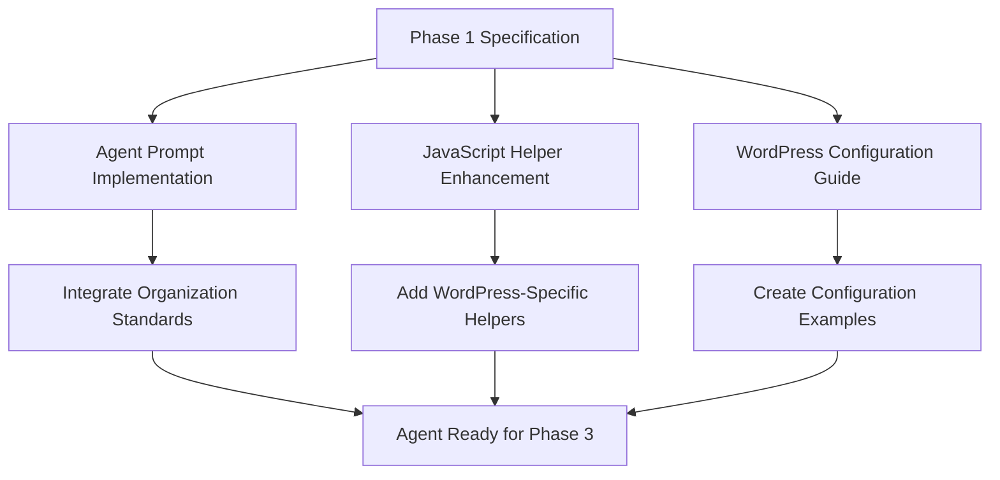
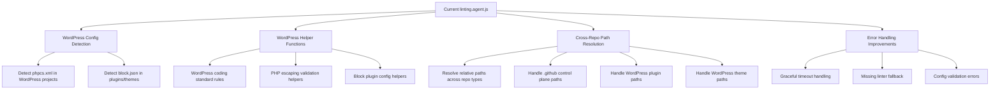
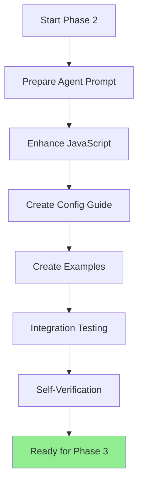

# Linting Agent Implementation Plan — Phase 2 (OpenSpec)

**Project:** Portable Linting Agent for LightSpeedWP  
**Phase:** 2 — Implementation  
**Branch:** `feat/linting-agent-implementation`  
**Related Issue:** [#1819](https://github.com/lightspeedwp/.github/issues/1819)

---

## 1. Overview

### Phase 2 Objectives

Implement the portable linting agent as designed in Phase 1 specification, creating:

- Fully functional agent prompt in `.github/agents/linting.agent.md`
- Enhanced JavaScript implementation with WordPress support
- Configuration guides for cross-repository use
- Ready-for-testing agent ready for Phase 3 validation

### Implementation Approach



---

## 2. Implementation Components

### 2.1 Agent Prompt (`.github/agents/linting.agent.md`)

**Source:** Phase 1 AGENT_PROMPT_DRAFT.md  
**Tasks:**

- [ ] Copy full prompt from AGENT_PROMPT_DRAFT.md to `.github/agents/linting.agent.md`
- [ ] Update frontmatter with Phase 2 status
- [ ] Integrate references to organisation standards
- [ ] Add integration notes for lint-fixer agent
- [ ] Validate all markdown and links

**File Size:** Expected 400+ lines  
**Complexity:** Medium (copy + minor updates)

### 2.2 JavaScript Implementation (`scripts/agents/linting.agent.js`)

**Enhancements Required:**



**Tasks:**

- [ ] Add `detectRepositoryType(rootDir)` function
  - Detect if repo is control plane, plugin, or theme
  - Return enum: `'control-plane'`, `'wordpress-plugin'`, `'wordpress-theme'`
  - Used to select appropriate linting rules

- [ ] Add WordPress-specific config helpers
  - `getWordPressPhpcsConfig()` — Return WPCS standard
  - `getBlockPluginConfig()` — Return block.json validation rules
  - `getBlockThemeConfig()` — Return theme.json validation rules

- [ ] Enhance path resolution
  - `resolveRepositoryRoot(filePath)` — Find repo root across types
  - Handle Windows/Unix path differences
  - Support absolute and relative paths

- [ ] Improve error handling
  - Timeout handling with fallback to defaults
  - Missing linter graceful degradation
  - Config parse error messages

**Test Coverage:** All new functions covered in Phase 3 tests

### 2.3 WordPress Configuration Guide

**File:** `WORDPRESS_CONFIG_GUIDE.md`

**Contents:**

- WordPress plugin linting setup (block plugins)
- WordPress theme linting setup (block themes)
- Configuration examples for `phpcs.xml`, `eslint.config.js`, etc.
- How to configure agent per repository type

**Sections:**

1. Overview of WordPress support
2. Plugin configuration (structure, files to lint, rules)
3. Theme configuration (structure, files to lint, rules)
4. Local development setup
5. CI/CD integration examples
6. Troubleshooting guide

**Size:** 300+ lines  
**Complexity:** Medium (documentation + examples)

### 2.4 Configuration Examples

**Files to Create:**

- `examples/wordpress-plugin-phpcs.xml` — Example PHPCS config for plugin
- `examples/wordpress-theme-stylelint.json` — Example stylelint for theme
- `examples/wordpress-plugin-eslint.config.js` — Example ESLint for plugin
- `examples/block-plugin-agent-config.json` — Example agent config

---

## 3. Integration Points

### 3.1 Linting Instructions Reference

Update `instructions/linting.instructions.md` to:

- Reference new `linting.agent.md` location
- Add WordPress agent integration section
- Link to WORDPRESS_CONFIG_GUIDE.md

### 3.2 CLAUDE.md Updates

Add to repository CLAUDE.md files (control plane + WordPress examples):

```markdown
## Linting Agent Configuration

The portable linting agent in `.github/agents/linting.agent.md` automatically 
detects this repository type and applies appropriate linting rules.

### Configuration
- Uses canonical config files (`.eslintrc.json`, `phpcs.xml`, etc.)
- Falls back to sensible defaults if configs missing
- Override defaults via CLAUDE.md if needed

See [WORDPRESS_CONFIG_GUIDE.md](...) for setup details.
```

---

## 4. Implementation Workflow



### Step-by-Step

1. **Prepare Agent Prompt** (1-2 hours)
   - Copy AGENT_PROMPT_DRAFT.md content
   - Update frontmatter
   - Verify all links and references
   - Test formatting

2. **Enhance JavaScript** (4-6 hours)
   - Add repository type detection
   - Add WordPress helper functions
   - Improve path resolution
   - Add error handling
   - Document new functions

3. **Create Configuration Guide** (2-3 hours)
   - Write WordPress plugin section
   - Write WordPress theme section
   - Add configuration examples
   - Add troubleshooting

4. **Create Examples** (1-2 hours)
   - Example phpcs.xml for plugin
   - Example stylelint.json for theme
   - Example eslint.config.js
   - Example agent config

5. **Integration Testing** (1-2 hours)
   - Verify agent loads in control plane context
   - Verify agent loads in plugin context
   - Verify agent loads in theme context
   - Test configuration discovery

6. **Self-Verification** (1 hour)
   - Confirm all files created
   - Verify no package.json changes
   - Check markdown formatting
   - Validate links

**Total Estimated Time:** 10-16 hours

---

## 5. Success Criteria

✅ **Agent Ready for Phase 3:**

- [ ] `.github/agents/linting.agent.md` created with full prompt
- [ ] `linting.agent.js` enhanced with WordPress support
- [ ] `WORDPRESS_CONFIG_GUIDE.md` comprehensive and clear
- [ ] Configuration examples provided (4+ files)
- [ ] All links tested and working
- [ ] No package.json/package-lock.json changes
- [ ] Ready for comprehensive testing in Phase 3

✅ **Code Quality:**

- [ ] All new functions documented
- [ ] No console.log or debug statements left
- [ ] Error messages clear and actionable
- [ ] Path resolution handles Windows/Unix

✅ **Documentation Quality:**

- [ ] Markdown linting passes
- [ ] Mermaid diagrams render correctly
- [ ] All internal links working
- [ ] External links verified

---

## 6. Related Issues

| Issue | Type | Phase | Status |
|-------|------|-------|--------|
| [#1818](https://github.com/lightspeedwp/.github/issues/1818) | epic | 1-4 | 🟡 In Progress |
| [#1819](https://github.com/lightspeedwp/.github/issues/1819) | task | 2 | 🔵 Planned |
| [#1821](https://github.com/lightspeedwp/.github/issues/1821) | task | 3 | ⏰ Planned |
| [#1822](https://github.com/lightspeedwp/.github/issues/1822) | task | 4 | ⏰ Planned |

---

## 7. Deliverables Summary

### Documentation Files

- **IMPLEMENTATION_PLAN.md** — This file (planning overview)
- **WORDPRESS_CONFIG_GUIDE.md** — WordPress integration guide
- Updated `.github/agents/linting.agent.md` — Full agent prompt

### Code Files

- Enhanced `scripts/agents/linting.agent.js` — WordPress support

### Example Files

- `examples/wordpress-plugin-phpcs.xml`
- `examples/wordpress-theme-stylelint.json`
- `examples/wordpress-plugin-eslint.config.js`
- `examples/block-plugin-agent-config.json`

### Updates

- Updated `instructions/linting.instructions.md`
- Example CLAUDE.md updates

---

## 8. Risks & Mitigations

| Risk | Probability | Impact | Mitigation |
|------|-------------|--------|-----------|
| WordPress config too complex | Medium | Medium | Start with block plugins/themes only, classic WordPress in Phase 4 |
| Path resolution edge cases | Medium | Low | Test across Windows/Unix paths in Phase 3 |
| Missing linter gracefully fails | Low | Low | Fallback to defaults, log warnings |
| Agent prompt integration issues | Low | Medium | Test in actual .github context before submission |

---

*Built by 🧱 LightSpeedWP with ☕, 🚀, and open-source spirit!*
