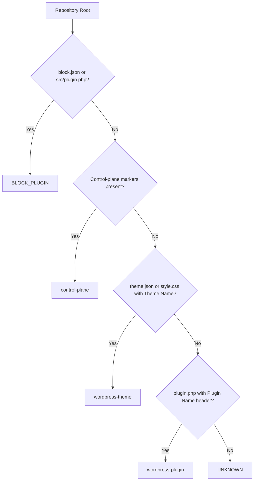
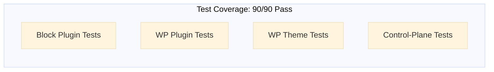
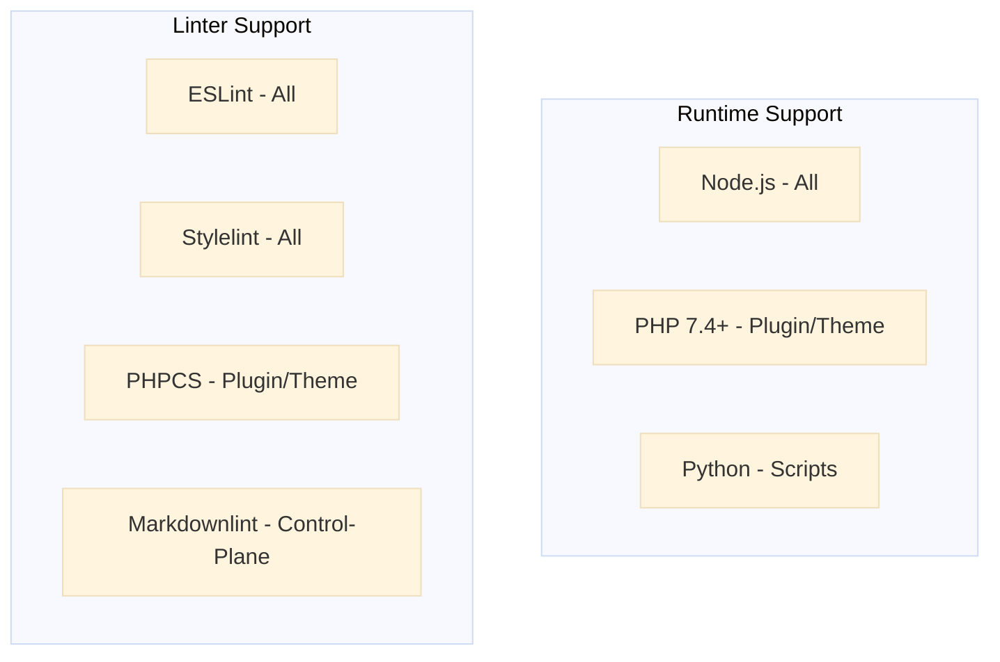

# Linting Agent Phase 4 — Documentation Kickoff

**Phase:** 4 — Documentation & User Guides  
**Status:** 🚀 READY TO START  
**Estimated Duration:** 2–3 weeks  
**Deliverables:** 3 guides + 3 Mermaid diagrams (1,500+ LOC documentation)

---

## Phase 4 Overview

Phase 3 implementation is complete (90/90 tests passing, 100% validation). Phase 4 focuses on creating comprehensive user-facing documentation and visual aids for:

- End-user guide (running the linting agent)
- Setup guide (per-repository configuration)
- Troubleshooting guide (common issues & solutions)
- Architecture diagrams (flow, test matrix, compatibility)

---

## Deliverables

### 1. USER_GUIDE.md (400–600 LOC)

**Purpose:** Guide end-users through running the linting agent  
**Target Audience:** Developers, CI/CD engineers, repository maintainers

**Sections:**

- Quick Start (5 min setup)
- Installation & Prerequisites
- Running the Agent (with examples)
  - Block plugins
  - WordPress plugins
  - WordPress themes
  - Control-plane repositories
- Configuration Options
- Output Interpretation
- Common Use Cases
- Limitations & Known Issues
- FAQ

**Example Structure:**

```markdown
# Linting Agent User Guide

## Quick Start

```bash
npx linting-agent /path/to/repo
```

## Supported Repository Types

### Block Plugin

Requires: block.json + src/ directory
...

### WordPress Plugin

Requires: plugin.php with "Plugin Name:" header
...

```

### 2. SETUP_GUIDE.md (300–500 LOC)

**Purpose:** Help developers configure the agent for their repository type  
**Target Audience:** Repository maintainers, CI/CD configuration owners

**Sections:**
- Configuration Overview
- Per-Repository Type Setup
  - Block Plugin Configuration
  - WordPress Plugin Configuration
  - WordPress Theme Configuration
  - Control-Plane Configuration
- Environment Variables
- Custom Rule Files
- Integration with CI/CD (GitHub Actions example)
- Troubleshooting Setup Issues
- Best Practices

**Example Structure:**
```markdown
# Setup Guide

## Block Plugin Configuration

1. Verify repository has `block.json`
2. Set ESLint config with React rules
3. Configure TypeScript support (optional)

### Example `.eslintrc.json`

```json
{
  "extends": ["plugin:react/recommended"],
  "parser": "@typescript-eslint/parser"
}
```

## WordPress Plugin Configuration

1. Ensure `plugin.php` has Plugin Header
2. Configure PHPCS with WordPress standards
3. Set up JavaScript linting for admin/frontend scripts

### Example `phpcs.xml`

```xml
<?xml version="1.0"?>
<ruleset name="My Plugin">
  <rule ref="WordPress-Core"/>
</ruleset>
```

```

### 3. TROUBLESHOOTING.md (200–300 LOC)

**Purpose:** Help users diagnose and resolve common issues  
**Target Audience:** Developers encountering problems, support team

**Sections:**
- Repository Detection Issues
  - "Repository type detected as UNKNOWN"
  - "Wrong repository type detected"
  - "Detection fails with symlinks"
- Linting Configuration Issues
  - "Config file not found"
  - "Invalid PHPCS configuration"
  - "ESLint parser errors"
- Runtime Issues
  - "Agent times out"
  - "Out of memory on large repositories"
  - "File permission errors"
- Output Issues
  - "Empty or incomplete findings"
  - "Unexpected findings reported"
  - "Report formatting problems"
- Environment Issues
  - "Node.js version incompatibility"
  - "Missing linter executables"
  - "PATH configuration problems"
- Contact & Escalation
  - When to file issues
  - Debug output collection
  - Support channels

**Example Structure:**
```markdown
# Troubleshooting Guide

## Repository Detection Issues

### Symptom: "Repository type detected as UNKNOWN"

**Diagnosis:**
Repository lacks required markers for identification.

**Solution:**
1. For Block Plugins: Ensure `block.json` exists
2. For WordPress Plugins: Add `<?php /* Plugin Name: ... */` to `plugin.php`
3. For WordPress Themes: Add `theme.json` or `style.css` with "Theme Name:" header
4. For Control-Plane: Ensure `.github/workflows` or `.github/actions` exists

**Example:**
```bash
# Check what markers exist:
ls -la block.json plugin.php style.css theme.json .github/

# Add missing marker:
echo '{ "name": "my-block" }' > block.json
```

### Symptom: "Wrong repository type detected"

**Root Causes:**

- Multiple repository types in same directory (block.json + plugin.php)
- Detection priority issue

**Solution:**
Check detection order: Block Plugin → Control-Plane → Theme → Plugin → Unknown

```

---

## Mermaid Diagrams (3 diagrams, 150–200 LOC)

### Diagram 1: Detection Flow



**Location:** USER_GUIDE.md or ARCHITECTURE.md  
**Format:** Mermaid flowchart  
**Alt Text:** Repository type detection decision tree. Checks for block.json or src/plugin.php first (Block Plugin), then control-plane markers (control-plane), then theme.json/style.css (WordPress Theme), then plugin.php with Plugin Name header (WordPress Plugin), finally UNKNOWN if none match.

### Diagram 2: Test Coverage Matrix



**Location:** SETUP_GUIDE.md  
**Format:** Mermaid graph  
**Alt Text:** Test coverage summary. Block Plugin, WordPress Plugin, WordPress Theme, and Control-Plane each have four test levels (basic, extended, large, error handling). All 90 tests pass with 100% pass rate.

### Diagram 3: Repository Type Compatibility



**Location:** SETUP_GUIDE.md  
**Format:** Mermaid graph  
**Alt Text:** Repository type compatibility. Runtime support: Node.js all types, PHP 7.4+ for WordPress Plugin and Theme, Python for scripts only. Linter support: ESLint and Stylelint for all types, PHPCS for Plugin and Theme, Markdownlint for Control-Plane.

---

## Implementation Plan

### Week 1: Core Documentation (Estimated 8–10 hours)

1. **USER_GUIDE.md** (3–4 hours)
   - [ ] Create structure & sections
   - [ ] Write Quick Start section
   - [ ] Add per-type examples
   - [ ] Include common use cases
   - [ ] Add FAQ section

2. **SETUP_GUIDE.md** (3–4 hours)
   - [ ] Create per-type setup sections
   - [ ] Add configuration examples
   - [ ] Include best practices
   - [ ] Document CI/CD integration

3. **TROUBLESHOOTING.md** (2–3 hours)
   - [ ] Identify top 5–10 issues from phase 3 testing
   - [ ] Create diagnosis/solution pairs
   - [ ] Add debug output collection guide

### Week 2: Diagrams & Polish (Estimated 4–6 hours)

1. **Mermaid Diagrams** (2–3 hours)
   - [ ] Detection flow diagram
   - [ ] Test coverage matrix
   - [ ] Compatibility table

2. **Integration & Review** (2–3 hours)
   - [ ] Link diagrams into guides
   - [ ] Cross-reference sections
   - [ ] Consistency check
   - [ ] Grammar & formatting review

### Week 3: Publication (Estimated 2–3 hours)

1. **Final Quality Assurance**
   - [ ] Test all code examples
   - [ ] Verify all links
   - [ ] Check Markdown rendering
   - [ ] Validate Mermaid diagrams

2. **Create & Merge PR**
   - [ ] Create PR: `docs/linting-agent-phase4` → develop
   - [ ] Add to CHANGELOG.md
   - [ ] Wait for CI validation
   - [ ] Merge to develop

---

## Content Guidelines

### Writing Style

- **Tone:** Technical but approachable; avoid jargon where possible
- **Examples:** Every section should have at least one code example
- **Sections:** Keep sections under 500 words; use subsections for clarity
- **Links:** Link to related documentation (SPECIFICATION.md, TEST_RESULTS.md)

### Code Examples

- **Format:** Use language-specific syntax highlighting (bash, json, php, js)
- **Context:** Always include what file/directory examples should be in
- **Completeness:** Ensure examples are copy-paste ready and tested
- **Output:** Show expected output for CLI examples

### Diagrams

- **Format:** All diagrams use Mermaid syntax
- **Clarity:** Ensure diagrams are readable at 100% zoom and in both light/dark modes
- **Captions:** Each diagram has a brief caption explaining purpose
- **Integration:** Embed diagrams in markdown with proper alt text

---

## File Locations

```
.github/projects/active/linting-agent-2026-08-12/
├── USER_GUIDE.md              ← 400–600 LOC
├── SETUP_GUIDE.md             ← 300–500 LOC
├── TROUBLESHOOTING.md         ← 200–300 LOC
├── ARCHITECTURE.md            ← Mermaid diagrams + explanations
└── PHASE3_COMPLETION_REPORT.md ← (Previous session)
```

---

## Success Criteria

- ✅ All 3 documentation files created (1,500+ LOC total)
- ✅ 3 Mermaid diagrams embedded and rendering correctly
- ✅ All code examples tested & working
- ✅ Cross-references complete & verified
- ✅ Grammar & formatting consistent with project standards
- ✅ PR created & merged to develop

---

## Branch & PR Info

**Branch:** `docs/linting-agent-phase4` (create after Phase 4 work)  
**Target:** `develop`  
**PR Template:** Use `pr_docs.md` (documentation PR template)  
**Labels:** `type:documentation`, `area:linting-agent`, `meta:no-changelog`

---

## Contact & Support

- **Project Lead:** See `.github/projects/active/linting-agent-2026-08-12/README.md`
- **Phase 3 Report:** See `PHASE3_COMPLETION_REPORT.md`
- **Specification:** See `SPECIFICATION.md`

---

**Ready to start Phase 4? 🚀 Let's create some great documentation!**
