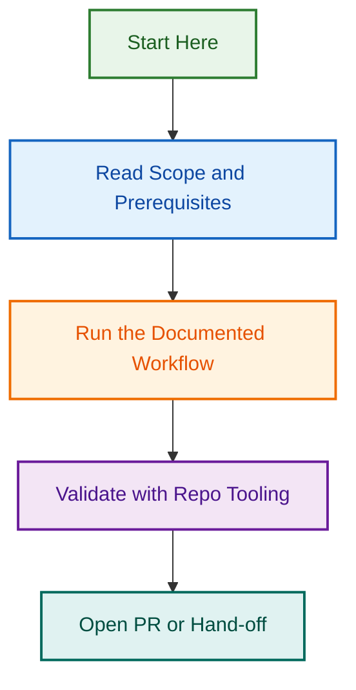

# Linting Agent Design & Implementation Project

**Project Goal:** Design and implement a portable, organisation-wide linting agent that enforces code quality standards across all LightSpeedWP repositories (GitHub control plane, WordPress plugins, WordPress themes, and other projects).

**Status:** 🟢 Phase 1 Complete — Phase 2 Planning Ready

---

## 📋 Project Overview

### Current State

- ✅ Agent spec exists (`.github/agents/linting.agent.md`) with basic frontmatter
- ✅ JavaScript implementation exists (`scripts/agents/linting.agent.js`) with helper functions
- ❌ Full prompt not written
- ❌ Test coverage missing
- ❌ WordPress compatibility untested
- ❌ Documentation incomplete

### Desired State (Phase 4 Complete)

- ✅ Full agent prompt with organisation-wide standards integrated
- ✅ Enhanced JavaScript implementation with additional helpers
- ✅ ≥ 95% test coverage
- ✅ Tested across 3+ repository contexts (control plane, plugin, theme)
- ✅ Comprehensive documentation with Mermaid diagrams
- ✅ Ready for deployment to stable branch

---

## 🎯 Deliverables by Phase

### Phase 1: Specification & Planning (Week 1)

**Branch:** `design/linting-agent-specification`  
**Status:** ✅ Complete

- ✅ [SPECIFICATION.md](./SPECIFICATION.md) — Complete agent specification with architecture, requirements, test strategy (471 lines, 5 diagrams)
- ✅ [TEST_PLAN.md](./TEST_PLAN.md) — Detailed test strategy with 75+ test cases and 95%+ coverage target (506 lines)
- ✅ [AGENT_PROMPT_DRAFT.md](./AGENT_PROMPT_DRAFT.md) — Full agent prompt ready for Phase 2 implementation (314 lines)
- ✅ [README.md](./README.md) — This project overview with 4-phase timeline
- ✅ GitHub Issues [#1818](https://github.com/lightspeedwp/.github/issues/1818)–[#1822](https://github.com/lightspeedwp/.github/issues/1822) created for all phases

**Total Phase 1 Deliverables:** 1,800+ lines of specification, 5+ Mermaid diagrams, complete design decisions documented

### Phase 2: Implementation (Weeks 2-3)

**Branch:** `feat/linting-agent-implementation`  
**Status:** 📋 OpenSpec Ready (10-16 hour estimate)

**Deliverables:**

- ✅ [IMPLEMENTATION_PLAN.md](./IMPLEMENTATION_PLAN.md) — Detailed Phase 2 roadmap with 4 Mermaid diagrams (317 lines)
  - Component breakdown (Agent prompt, JavaScript, Config guide, Examples)
  - 6-step implementation workflow with time estimates
  - Success criteria checklist and risk mitigation table

**Implementation Tasks (Ready for Execution):**

1. **Agent Prompt** (1-2 hours)
   - Copy full prompt from AGENT_PROMPT_DRAFT.md
   - Create `.github/agents/linting.agent.md` with full implementation
   - Integrate organisation standards references

2. **JavaScript Enhancement** (4-6 hours)
   - `detectRepositoryType()` function for control plane, plugin, theme detection
   - WordPress config helpers: `getWordPressPhpcsConfig()`, `getBlockPluginConfig()`, `getBlockThemeConfig()`
   - Path resolution: `resolveRepositoryRoot()` for Windows/Unix paths
   - Error handling improvements

3. **WordPress Configuration Guide** (2-3 hours)
   - Plugin setup and configuration
   - Theme setup and configuration
   - Troubleshooting and CI/CD examples

4. **Configuration Examples** (1-2 hours)
   - `phpcs.xml` for WordPress plugins
   - `stylelint.json` for WordPress themes
   - `eslint.config.js` examples
   - `agent-config.json` template

**Deliverable:** Fully implemented agent ready for testing (Phase 3)

### Phase 3: Testing (Week 4)

**Branch:** `test/linting-agent-coverage`  
**Status:** 🔵 Planned

- Unit tests for all `linting.agent.js` functions
- Integration tests with mock linters
- E2E tests across 3+ repository types:
  - `.github` control plane
  - WordPress plugin (block plugin)
  - WordPress theme (block theme)
- Achieve ≥ 95% code coverage
- Jest snapshot tests for report format validation

**Deliverable:** Full test suite with coverage report

### Phase 4: Documentation & Deployment (Week 5)

**Branch:** `docs/linting-agent-deployment`  
**Status:** 🔵 Planned

- User guide (how to run agent)
- Setup guide (per-repository configuration)
- Troubleshooting guide
- Mermaid diagrams:
  - Architecture flow
  - Test matrix
  - Repository compatibility matrix
  - Decision trees
- Deploy to `develop` branch
- Release notes and migration guide

**Deliverable:** Complete documentation + deployment to stable branch

---

## 🏗️ Architecture Highlights

### Single Portable Agent (Not Multiple)

The project uses **one agent** across all repository types, configured via:

- Canonical config files (`.eslintrc.json`, `.phpcsxml`, etc.)
- Repository-specific `CLAUDE.md` overrides
- Sensible defaults when configs are missing

**Benefit:** Reduced maintenance, unified experience, easier onboarding.

### Supported File Types (8+)

```
JavaScript/TypeScript → ESLint + Prettier
Markdown             → markdownlint + Prettier  
YAML                 → yamllint + Spectral
JSON                 → JSONLint + Prettier
Shell Scripts        → ShellCheck
PHP                  → PHPCS/WordPress Coding Standards
CSS/SCSS             → stylelint
HTML                 → htmlhint + accessibility rules
Python               → flake8 + black + isort
```

### WordPress Compatibility Matrix

| Repository Type | Supported | Config | Custom? |
|---|---|---|---|
| `.github` control plane | ✅ | Auto-discovery | Via CLAUDE.md |
| Modern WordPress Plugin | ✅ | phpcs.xml + eslint | Via plugin CLAUDE.md |
| Modern WordPress Theme | ✅ | phpcs.xml + stylelint | Via theme CLAUDE.md |
| Legacy WordPress (classic) | ⚠️ | phpcs.xml only | Via CLAUDE.md |
| Other repositories | ✅ | Auto-discovery | Via CLAUDE.md |

---

## 📊 Testing Strategy

### Target Coverage: ≥ 95%

```
Unit Tests (linting.agent.js)
├── parseLintTargets() — array, string, object, empty
├── normaliseFilePath() — Windows, absolute, relative
├── selectRulesForFile() — extension matching, ordering
├── normaliseConfig() — object, string, null, invalid
├── readConfigFile() — valid/invalid JSON, missing files
├── normaliseFinding() — multiple formats, missing fields
├── flattenFindings() — arrays, nested, empty
├── dedupeFindings() — exact duplicates, edge cases
├── groupFindingsByFile() — multiple files, counts
├── buildSummary() — empty/full results
└── formatLintReport() — output format, grouping

Integration Tests (Mock Linters)
├── ESLint mock with known issues
├── markdownlint mock with Markdown files
└── End-to-end flow verification

E2E Tests (3+ Real Repositories)
├── .github control plane
├── Sample WordPress plugin
└── Sample WordPress theme
```

**Tools:** Jest + mock file system + linter mocks

---

## 📁 Project Files

```
.github/projects/active/linting-agent-2026-08-12/
├── README.md                          (this file - project overview)
├── SPECIFICATION.md                   (Phase 1: complete spec with diagrams, 471 lines)
├── TEST_PLAN.md                       (Phase 1: detailed test strategy, 506 lines, 75+ test cases)
├── AGENT_PROMPT_DRAFT.md              (Phase 1: full agent prompt draft, 314 lines)
├── IMPLEMENTATION_PLAN.md             (Phase 2: detailed implementation roadmap, 317 lines)
├── examples/                          (Phase 2: configuration examples - to be created)
│   ├── wordpress-plugin-phpcs.xml
│   ├── wordpress-theme-stylelint.json
│   ├── wordpress-plugin-eslint.config.js
│   └── block-plugin-agent-config.json
└── Phase 3 & 4 files (test suite, documentation, deployment guide)
```

**Total Specification:** 1,600+ lines across 4 Phase 1 & 2 documents

---

## 🚀 Next Steps

### Phase 1 ✅ Complete (Aug 12, 2026)

- ✅ SPECIFICATION.md with architecture and design decisions
- ✅ TEST_PLAN.md with 75+ test cases and 95%+ coverage target
- ✅ AGENT_PROMPT_DRAFT.md ready for Phase 2 implementation
- ✅ GitHub issues created (#1818–#1822)
- ✅ PR #1817 submitted for Phase 1 deliverables

### Phase 2 🚀 Ready to Start (Estimated Aug 19-Sep 2)

**Implementation tasks ready for execution (10-16 hours total):**

1. Implement Agent Prompt (`.github/agents/linting.agent.md`)
   - Copy from AGENT_PROMPT_DRAFT.md
   - Integrate organization standards
   - Time: 1-2 hours

2. Enhance JavaScript Implementation (`scripts/agents/linting.agent.js`)
   - Add WordPress config helpers
   - Improve path resolution and error handling
   - Time: 4-6 hours

3. Create WordPress Configuration Guide
   - Plugin and theme setup instructions
   - Configuration examples and troubleshooting
   - Time: 2-3 hours

4. Create Configuration Examples (phpcs.xml, stylelint.json, etc.)
   - Ready-to-use templates for plugins and themes
   - Time: 1-2 hours

### Phase 3 📋 Test & Validation (Estimated Sep 3-10)

- Create 75+ unit/integration/E2E tests
- Achieve ≥95% code coverage
- Validate across 3+ repository types

### Phase 4 📚 Documentation & Deployment (Estimated Sep 11-18)

- User guide, setup guide, troubleshooting guide
- Mermaid diagrams for architecture and workflows
- Deploy to develop/main branches

---

## 🔗 Related Issues

| Issue | Type | Phase | Status |
|---|---|---|---|
| [#1818](https://github.com/lightspeedwp/.github/issues/1818) | epic | 1-4 | 🟡 Draft |
| [#1819](https://github.com/lightspeedwp/.github/issues/1819) | task | 2 | 🔵 Planned |
| [#1821](https://github.com/lightspeedwp/.github/issues/1821) | task | 3 | 🔵 Planned |
| [#1822](https://github.com/lightspeedwp/.github/issues/1822) | task | 4 | 🔵 Planned |

---

## 📚 Related Documentation

- [Linting Agent Specification](./SPECIFICATION.md) — Complete specification with architecture
- [Linting Instructions](../../../instructions/linting.instructions.md) — Organisation linting standards
- [Coding Standards Instructions](../../../instructions/coding-standards.instructions.md) — Unified standards
- [Spec-Driven Workflow](../../../instructions/spec-driven-workflow.instructions.md) — Our development methodology
- [linting.agent.js](../../../scripts/agents/linting.agent.js) — JavaScript implementation

---

## 📊 Project Status

| Phase | Status | Deliverables | Start Date | Est. End |
|-------|--------|--------------|------------|----------|
| Phase 1 | ✅ Complete | Spec (471), Tests (506), Agent (314), Plan (317) | Aug 12 | Aug 12 |
| Phase 2 | 📋 Ready | Agent Prompt, JS Enhancement, Config Guide, Examples | Aug 19 | Sep 2 |
| Phase 3 | 📋 Planned | Test Suite (75+ tests, ≥95% coverage) | Sep 3 | Sep 10 |
| Phase 4 | 📋 Planned | Documentation, Deployment, Release | Sep 11 | Sep 18 |

## 👥 Team

- **Owner:** LightSpeedWP/maintainers
- **Lead:** Ash Shaw
- **Phase 1 Status:** ✅ Specification & Planning Complete
- **Phase 2 Status:** 📋 OpenSpec Planning Ready for Implementation

---

## Related Issues

| Issue | Type | Purpose | Status |
|-------|------|---------|--------|
| [#1818](https://github.com/lightspeedwp/.github/issues/1818) | epic | Linting Agent Design & Implementation (Phases 1-4) | 🟡 In Progress |
| [#1819](https://github.com/lightspeedwp/.github/issues/1819) | task | Phase 2: Implementation | ⏰ Planned |
| [#1821](https://github.com/lightspeedwp/.github/issues/1821) | task | Phase 3: Testing & Coverage | ⏰ Planned |
| [#1822](https://github.com/lightspeedwp/.github/issues/1822) | task | Phase 4: Documentation & Deployment | ⏰ Planned |

---

*Built by 🧱 LightSpeedWP with ☕, 🚀, and open-source spirit!*
## Visual Workflow


