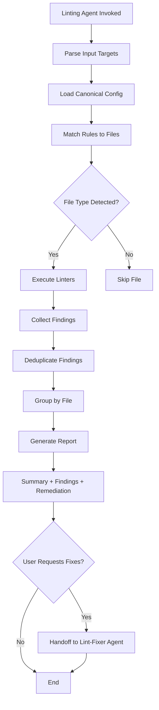
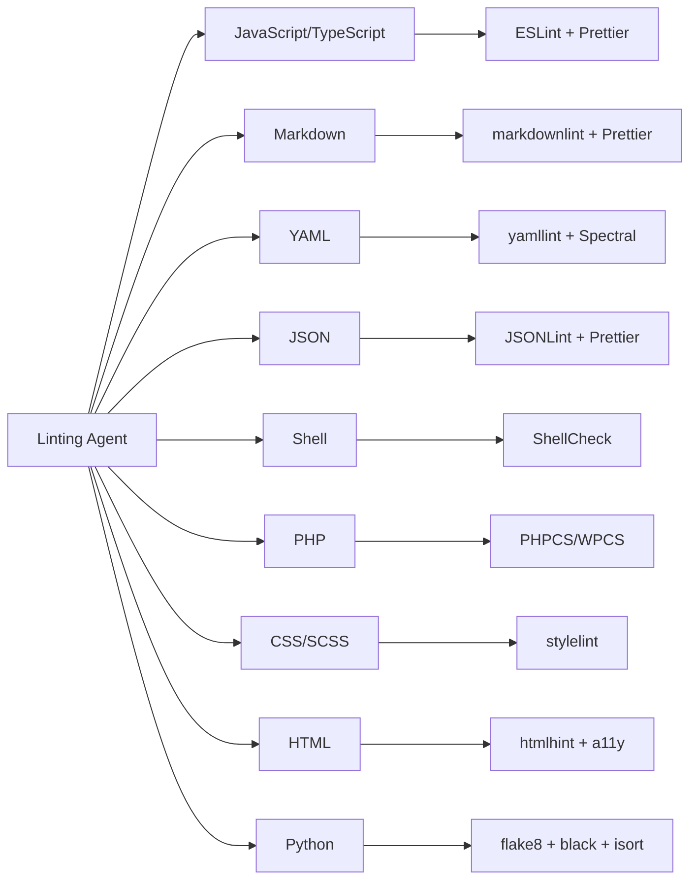
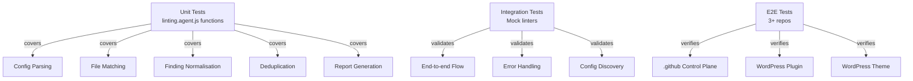

# Linting Agent Specification — OpenSpec Phase

**Project Scope:** Design and implement a portable, organisation-wide linting agent that enforces code quality standards across the GitHub organisation (control plane, WordPress plugins, WordPress themes, and other repositories).

**Timeline:** Phase 1 (Specification & Planning) → Phase 2 (Implementation) → Phase 3 (Testing) → Phase 4 (Deployment)

---

## 1. Overview

### Problem Statement

Currently, linting standards are fragmented across repositories:

- Different linters per repository
- Inconsistent configuration management
- No unified enforcement across the organisation
- Manual code review overhead for linting issues
- WordPress repositories lack portable linting standards

### Solution

A **portable, configurable linting agent** that:

- Works across all LightSpeedWP repositories (control plane, plugins, themes)
- Enforces organisation-wide coding standards
- Provides clear, actionable remediation guidance
- Supports auto-fix workflows
- Integrates with CI/CD pipelines
- Maintains repository-specific overrides (via `CLAUDE.md`)

### Success Criteria

✅ Agent runs successfully in 3+ repository contexts (control plane, WordPress plugin, WordPress theme)  
✅ Detects and reports linting issues for 8+ file types (JS, TS, Markdown, YAML, JSON, Shell, PHP, HTML)  
✅ Provides actionable remediation steps (not just errors)  
✅ Integrates with lint-fixer agent for automated fixes  
✅ 100% test coverage for `linting.agent.js` helper functions  
✅ Documentation includes setup guide + troubleshooting + examples  

---

## 2. Architecture & Design

### 2.1 Agent Architecture



### 2.2 Scope: Single vs Multiple Agents

**Decision: Single Portable Agent**

- **Location:** `.github/agents/linting.agent.md` (GitHub control plane)
- **Use across:** All LightSpeedWP repositories
- **Portability:** Auto-discovers configs, no hardcoded paths
- **Customisation:** Via `CLAUDE.md` in each repo (e.g., exclude files, additional rules)

**Rationale:**

- Reduces maintenance burden (one source of truth)
- Standardises messaging and output format
- Simpler onboarding for new repositories
- Configuration-driven (not code-driven) customisation

### 2.3 Repository Compatibility Matrix

| Repository Type | Supported | Config Location | Custom Rules? | Notes |
|---|---|---|---|---|
| `.github` control plane | ✅ | `.eslintrc.json`, `.markdownlint`, etc. | Via CLAUDE.md | Primary use case |
| WordPress Plugin (modern) | ✅ | `phpcs.xml`, `eslint.config.js` | Via plugin CLAUDE.md | Block plugins supported |
| WordPress Theme (modern) | ✅ | `phpcs.xml`, `.stylelintrc` | Via theme CLAUDE.md | Block themes supported |
| Legacy WordPress (classic) | ⚠️ | `phpcs.xml` only | Via CLAUDE.md | PHP linting only, no JS |
| Other repos | ✅ | Auto-discovery | Via CLAUDE.md | Generic fallback |

### 2.4 Supported Linters



---

## 3. Requirements

### 3.1 Functional Requirements

#### FR-1: File Type Detection

- Agent must detect file types by extension
- Support mapping multiple extensions to same linter (e.g., `.yml` + `.yaml`)
- Handle edge cases (files without extensions, double extensions)

#### FR-2: Config Discovery & Loading

- Auto-discover canonical config files from project root:
  - `.eslintrc.json`, `eslint.config.js`
  - `.prettierrc.json`
  - `.markdownlintrc`
  - `.yamllint`
  - `phpcs.xml`
  - `.stylelintrc.json`
  - `htmlhint.json`
- Support inline config (frontmatter in source files)
- Graceful fallback to sensible defaults if no config found
- Cache config (avoid re-reading same file)

#### FR-3: Linter Execution

- Execute applicable linters for each file
- Parse output from multiple linter formats
- Handle linter timeouts (report as warnings, don't block)
- Support both local and CI environments

#### FR-4: Finding Normalisation

- Normalise findings across linters (different output formats)
- Extract: file path, line number, rule ID, message, severity
- Deduplicate findings (same file, rule, message, severity)

#### FR-5: Reporting

- Summary: files scanned, files with findings, total findings by severity
- Findings grouped by file, with rule ID + message + remediation step
- Remediation checklist (clear next steps)
- CI status indicator (blocking vs advisory)

#### FR-6: Integration Points

- Handoff to lint-fixer agent when user requests fixes
- Output format compatible with CI pipelines
- Markdown format for GitHub comments/PRs

### 3.2 Non-Functional Requirements

#### NFR-1: Portability

- Zero hardcoded repo paths
- Works across control plane + WordPress repos without modification
- Config-driven customisation (not code changes)

#### NFR-2: Performance

- Linting < 10s for typical repository
- Config caching to avoid re-reading files
- Parallel linting where possible

#### NFR-3: Accessibility

- Output is readable on screen readers (proper Markdown semantics)
- Colour not sole indicator of severity (use emoji + text)
- Clear visual hierarchy (headings, lists)

#### NFR-4: Reliability

- Graceful error handling (missing linters, malformed configs)
- Clear error messages (actionable, not cryptic)
- No unhandled exceptions

#### NFR-5: Security

- No execution of untrusted code
- Config files validated before use
- No storage of sensitive data in findings

---

## 4. Design Decisions & Trade-offs

### Decision 1: Single Agent vs Multiple

**Selected:** Single portable agent  
**Rationale:**  

- Simpler maintenance and testing
- Unified user experience across repos
- Configuration (not code) handles repo differences
- Easier onboarding for new repositories

**Alternative Considered:** Separate agents per repo type  

- Would require maintaining 3+ agents
- Duplicated logic and documentation
- Higher maintenance burden

---

## 5. Implementation Plan

### Phase 1: Specification & Planning (Week 1)

- ✅ Create agent specification (this document)
- ✅ Design architecture and decision trees
- ✅ Define test strategy
- ✅ Create active project documentation

### Phase 2: Implementation (Weeks 2-3)

- Update `linting.agent.md` with full prompt
- Enhance `linting.agent.js` with additional helper functions
- Create WordPress-specific configuration guide
- Add error handling and edge case coverage

### Phase 3: Testing (Week 4)

- Unit tests for `linting.agent.js` (all exported functions)
- Integration tests with mock linters
- E2E tests across 3+ repository types
- Test coverage ≥ 95%

### Phase 4: Documentation & Deployment (Week 5)

- Usage guide (how to invoke agent)
- Setup guide (configure per repository)
- Troubleshooting guide
- Mermaid diagrams for processes
- Deploy to stable branch

---

## 6. Test Strategy

### Test Architecture



### Test Coverage Requirements

**Target:** ≥ 95% code coverage

#### Unit Tests (linting.agent.js)

| Function | Coverage | Notes |
|---|---|---|
| `parseLintTargets()` | ✅ | Handle arrays, strings, objects, empty input |
| `normaliseFilePath()` | ✅ | Windows paths, absolute, relative, edge cases |
| `selectRulesForFile()` | ✅ | Extension matching, ordering, filtering |
| `normaliseConfig()` | ✅ | Object, string, null, invalid input |
| `readConfigFile()` | ✅ | Valid/invalid JSON, missing files |
| `normaliseFinding()` | ✅ | Various finding formats, missing fields |
| `flattenFindings()` | ✅ | Arrays, nested objects, empty results |
| `dedupeFindings()` | ✅ | Exact duplicates, edge cases |
| `groupFindingsByFile()` | ✅ | Multiple files, severity counting |
| `buildSummary()` | ✅ | Empty/full results, severity counts |
| `formatLintReport()` | ✅ | Output format, grouping, titles |

#### Integration Tests

- Mock ESLint runner with known issues
- Mock markdownlint with Markdown files
- Mock PHPCS with PHP files
- Verify end-to-end flow (input → config → execution → report)
- Verify error handling (missing files, bad config, linter timeouts)

#### E2E Tests

- Run against actual `.github` repository
- Run against sample WordPress plugin
- Run against sample WordPress theme
- Verify output format matches expected structure
- Verify integration with lint-fixer agent

### Test Tools

- **Test Framework:** Jest (already used in repo)
- **Mocking:** Jest mocks for file system and linter execution
- **Snapshots:** Snapshot tests for report output format
- **Coverage:** `jest --coverage` with 95% threshold

---

## 7. WordPress Compatibility

### 7.1 WordPress Plugin Support

**File Types Supported:**

- PHP (`.php`) — PHPCS with WordPress Coding Standards
- JavaScript (`.js`) — ESLint + Prettier
- JSON (`.json`) — JSONLint + schema validation (block.json, package.json)

**Configuration:**

```json
{
  "rules": [
    { "name": "phpcs", "extensions": [".php"], "enabled": true },
    { "name": "eslint", "extensions": [".js"], "enabled": true },
    { "name": "jsonlint", "extensions": [".json"], "enabled": true }
  ]
}
```

**Custom CLAUDE.md Override:**

```markdown
## Linting Agent Configuration

- Exclude: `node_modules/`, `dist/`, `build/`
- PHP Standard: WordPress with strict rules
- JS Environments: both browser and node
```

### 7.2 WordPress Theme Support

**File Types Supported:**

- PHP (`.php`)
- CSS/SCSS (`.css`, `.scss`)
- JavaScript (`.js`)
- JSON (`.json`)

**Configuration:**

```json
{
  "rules": [
    { "name": "phpcs", "extensions": [".php"], "enabled": true },
    { "name": "stylelint", "extensions": [".css", ".scss"], "enabled": true },
    { "name": "eslint", "extensions": [".js"], "enabled": true },
    { "name": "jsonlint", "extensions": [".json"], "enabled": true }
  ]
}
```

### 7.3 WordPress vs Standard PHP Rules

| Standard | WordPress | Rationale |
|---|---|---|
| Naming: `camelCase` functions | `snake_case` functions | WordPress convention |
| No nonces/escaping required | Nonces + escaping required | WordPress security |
| Simple variable validation | Use `sanitize_*` functions | WordPress best practice |
| Direct DB access OK | Use `$wpdb` with prepared statements | WordPress API requirement |

---

## 8. Success Metrics

### During Implementation

| Metric | Target | Verification |
|---|---|---|
| Unit test coverage | ≥ 95% | Jest coverage report |
| Integration tests pass | 100% | CI pipeline |
| E2E tests (3 repos) | 100% passing | Manual verification |
| Documentation complete | ✅ | README + setup guide + troubleshooting |
| Mermaid diagrams | ≥ 5 | Process flows, architecture, test matrix |

### Post-Deployment

| Metric | Target | Verification |
|---|---|---|
| Agent runs successfully | 100% of repos | Automated weekly test |
| Finding accuracy | ≥ 95% | Spot-check against manual linting |
| User adoption | ≥ 3 repos | Usage tracking |
| Time to remediation | < 15 min | Average from PR to fix |

---

## 9. Risks & Mitigations

| Risk | Probability | Impact | Mitigation |
|---|---|---|---|
| Linter config incompatibility across repos | Medium | High | Test early in Phase 2 with actual repos |
| Missing linter in repository | Medium | Medium | Graceful fallback to defaults, clear error message |
| Finding false positives | Medium | Medium | Verify accuracy before deployment, adjustable rules |
| Performance degradation on large repos | Low | Medium | Profile in Phase 3, optimise if needed |
| WordPress-specific rules conflict with standard rules | Low | High | Document explicit override mechanism in CLAUDE.md |

---

## 10. Dependencies & Blockers

### Dependencies

- ✅ `linting.agent.js` (exists, will enhance)
- ✅ Linting tool configs (ESLint, yamllint, PHPCS, etc.)
- ✅ `lint-fixer` agent (exists, will integrate)
- ✅ Organisation instruction files (linting.instructions.md, coding-standards.instructions.md)

### Blockers

- None identified at specification phase

---

## 11. Related Issues

| Issue | Type | Purpose | Status |
|---|---|---|---|
| (TBD — created with PR) | epic | Linting Agent Design & Implementation | 🟡 Draft |
| (TBD — Phase 2) | task | Phase 2 Implementation | 🔵 Planned |
| (TBD — Phase 3) | task | Phase 3 Testing & Coverage | 🔵 Planned |
| (TBD — Phase 4) | task | Phase 4 Documentation & Deployment | 🔵 Planned |

---

## 12. References

- [Linting Instructions](../../../instructions/linting.instructions.md)
- [Coding Standards Instructions](../../../instructions/coding-standards.instructions.md)
- [Specification-Driven Workflow](../../../instructions/spec-driven-workflow.instructions.md)
- [WordPress Coding Standards](https://developer.wordpress.org/coding-standards/)
- [linting.agent.js Implementation](../../../scripts/agents/linting.agent.js)
- [lint-fixer Agent](../../../.github/agents/lint-fixer.agent.md)

---

*Built by 🧱 LightSpeedWP with ☕, 🚀, and open-source spirit!*
