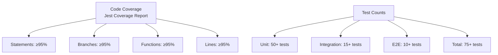

# Linting Agent Test Plan

**Target Coverage:** ≥ 95%  
**Test Framework:** Jest  
**Test Files Location:** `scripts/agents/__tests__/linting.agent.test.js` (existing) + new tests

---

## 1. Test Architecture

```mermaid
graph TD
    A["Test Suite<br/>linting.agent.test.js"] --> B["Unit Tests<br/>Helper Functions"]
    A --> C["Integration Tests<br/>Mock Linters"]
    A --> D["E2E Tests<br/>Real Repositories"]
    
    B --> B1["parseLintTargets()"]
    B --> B2["normaliseFilePath()"]
    B --> B3["selectRulesForFile()"]
    B --> B4["normaliseConfig()"]
    B --> B5["readConfigFile()"]
    B --> B6["normaliseFinding()"]
    B --> B7["flattenFindings()"]
    B --> B8["dedupeFindings()"]
    B --> B9["groupFindingsByFile()"]
    B --> B10["buildSummary()"]
    B --> B11["formatLintReport()"]
    
    C --> C1["Mock ESLint Flow"]
    C --> C2["Mock markdownlint Flow"]
    C --> C3["Mock PHPCS Flow"]
    C --> C4["Error Handling"]
    C --> C5["Config Discovery"]
    
    D --> D1[".github Control Plane"]
    D --> D2["WordPress Plugin"]
    D --> D3["WordPress Theme"]
```



---

## 2. Unit Tests by Function

### Test File: `scripts/agents/__tests__/linting.agent.test.js`

#### 2.1 `parseLintTargets(input, rootDir)`

**Purpose:** Parse and normalise lint targets (file paths)

| Test Case | Input | Expected Output | Status |
|---|---|---|---|
| String with single file | `"src/index.js"` | `["src/index.js"]` | ⏳ |
| String with multiple files (newline-separated) | `"src/a.js\nsrc/b.js"` | `["src/a.js", "src/b.js"]` | ⏳ |
| String with multiple files (comma-separated) | `"src/a.js,src/b.js"` | `["src/a.js", "src/b.js"]` | ⏳ |
| String with semicolon separator | `"src/a.js;src/b.js"` | `["src/a.js", "src/b.js"]` | ⏳ |
| Array of files | `["src/a.js", "src/b.js"]` | `["src/a.js", "src/b.js"]` | ⏳ |
| Object with files property | `{files: ["a.js", "b.js"]}` | `["a.js", "b.js"]` | ⏳ |
| Object with paths property | `{paths: ["a.js", "b.js"]}` | `["a.js", "b.js"]` | ⏳ |
| Object with targets property | `{targets: ["a.js", "b.js"]}` | `["a.js", "b.js"]` | ⏳ |
| Empty string | `""` | `[]` | ⏳ |
| Empty array | `[]` | `[]` | ⏳ |
| Null/undefined | `null` / `undefined` | `[]` | ⏳ |
| Duplicates | `"a.js,a.js,b.js"` | `["a.js", "b.js"]` | ⏳ |
| Whitespace handling | `" a.js , b.js "` | `["a.js", "b.js"]` | ⏳ |
| Relative paths | `"./src/a.js"` | (normalized) | ⏳ |
| Absolute paths | `/absolute/path/a.js` | (normalized relative) | ⏳ |

**Coverage Target:** 100%

---

#### 2.2 `normaliseFilePath(value, rootDir)`

**Purpose:** Normalise file paths to relative POSIX format

| Test Case | Input | Expected Output | Status |
|---|---|---|---|
| Relative path (Unix) | `"src/index.js"` | `"src/index.js"` | ⏳ |
| Relative path (Windows) | `"src\\index.js"` | `"src/index.js"` | ⏳ |
| Absolute path (Unix) | `/home/user/project/src/a.js` | `"src/a.js"` | ⏳ |
| Absolute path (Windows) | `C:\\Users\\project\\src\\a.js` | `"src/a.js"` | ⏳ |
| Current directory reference | `./src/a.js` | `"src/a.js"` | ⏳ |
| Parent directory reference | `../sibling/a.js` | (normalized) | ⏳ |
| Root directory | `"/"` or `"."` | (base name) | ⏳ |
| Empty string | `""` | `""` | ⏳ |
| Null/undefined | `null` / `undefined` | `""` | ⏳ |
| File without extension | `"README"` | `"README"` | ⏳ |
| Double extension | `"config.test.js"` | `"config.test.js"` | ⏳ |
| Path with spaces | `"my files/test file.js"` | `"my files/test file.js"` | ⏳ |

**Coverage Target:** 100%

---

#### 2.3 `selectRulesForFile(filePath, config)`

**Purpose:** Determine which linters apply to a file

| Test Case | Input File | Config | Expected Rules | Status |
|---|---|---|---|---|
| JavaScript file | `"index.js"` | (default) | `["eslint"]` | ⏳ |
| TypeScript file | `"index.ts"` | (default) | `["eslint"]` | ⏳ |
| Markdown file | `"README.md"` | (default) | `["markdownlint"]` | ⏳ |
| YAML file | `"config.yml"` | (default) | `["yamllint"]` | ⏳ |
| JSON file | `"package.json"` | (default) | `["jsonlint"]` | ⏳ |
| Shell script | `"deploy.sh"` | (default) | `["shellcheck"]` | ⏳ |
| PHP file | `"index.php"` | (default) | `["phpcs"]` | ⏳ |
| CSS file | `"style.css"` | (default) | (none or stylelint) | ⏳ |
| File with multiple matches | N/A | (custom config) | (multiple rules) | ⏳ |
| Disabled rule | N/A | (rule with enabled: false) | (empty) | ⏳ |
| Unknown extension | `"file.xyz"` | (default) | (empty) | ⏳ |
| No extension | `"Makefile"` | (default) | (empty) | ⏳ |
| Case sensitivity | `"INDEX.JS"` | (default) | `["eslint"]` | ⏳ |
| Rule ordering | N/A | (custom order) | (correct order) | ⏳ |

**Coverage Target:** 100%

---

#### 2.4 `normaliseConfig(config, rootDir, fsImpl)`

**Purpose:** Parse and normalise linting configuration

| Test Case | Config Input | Expected Result | Status |
|---|---|---|---|
| Null/undefined | `null` | (default config) | ⏳ |
| Empty object | `{}` | (default config merged) | ⏳ |
| Valid object | `{rules: [...]}` | (merged with defaults) | ⏳ |
| String path to file | `".eslintrc.json"` | (loaded from file) | ⏳ |
| Absolute path to file | `/absolute/path/.eslintrc.json` | (loaded from file) | ⏳ |
| Missing file | `"nonexistent.json"` | (throws error) | ⏳ |
| Invalid JSON file | (malformed JSON) | (throws error with message) | ⏳ |
| Config with rules array | `{rules: [{name: "eslint", extensions: [".js"]}]}` | (normalised rules) | ⏳ |
| Config with disabled rules | `{rules: [{name: "eslint", enabled: false}]}` | (disabled properly) | ⏳ |
| Config with order | `{rules: [{name: "eslint", order: 1}]}` | (sorted by order) | ⏳ |
| Config cache | (same config twice) | (returns cached) | ⏳ |
| Invalid type (array) | `[]` | (throws error) | ⏳ |
| Invalid type (number) | `123` | (throws error) | ⏳ |

**Coverage Target:** 100%  
**Note:** Test caching with `clearLintConfigCache()`

---

#### 2.5 `readConfigFile(configPath, fsImpl)`

**Purpose:** Read and parse JSON config files

| Test Case | File Content | Expected Result | Status |
|---|---|---|---|
| Valid JSON | `{"rules": []}` | (parsed object) | ⏳ |
| Missing file | (nonexistent) | (throws error) | ⏳ |
| Invalid JSON | `{invalid json}` | (throws error) | ⏳ |
| Empty JSON | `{}` | (empty object) | ⏳ |
| JSON with comments | (if supported) | (parsed correctly) | ⏳ |
| Large config file | (1000+ lines) | (parsed correctly) | ⏳ |

**Coverage Target:** 100%  
**Note:** Use mock file system to avoid I/O

---

#### 2.6 `normaliseFinding(finding, fallbackFilePath)`

**Purpose:** Normalise finding objects from different linters

| Test Case | Finding Input | Expected Output | Status |
|---|---|---|---|
| ESLint format | `{filePath, message, ruleId, severity}` | (normalised) | ⏳ |
| markdownlint format | `{file, text, rule}` | (normalised) | ⏳ |
| Generic format | `{filePath, message, rule, severity}` | (normalised) | ⏳ |
| Fallback filePath | `{message, rule}` + fallback | (uses fallback) | ⏳ |
| Missing required field | `{filePath}` (no message/rule) | `null` | ⏳ |
| Null input | `null` | `null` | ⏳ |
| Non-object input | `"string"` | `null` | ⏳ |
| Severity normalization | `{..., severity: "WARNING"}` | (lowercase) | ⏳ |

**Coverage Target:** 100%

---

#### 2.7 `flattenFindings(result, fallbackFilePath)`

**Purpose:** Flatten linter output into normalised findings array

| Test Case | Result Format | Expected Output | Status |
|---|---|---|---|
| Array of findings | `[{...}, {...}]` | (normalised array) | ⏳ |
| Object with findings | `{findings: [...]}` | (extracted + normalised) | ⏳ |
| Object with issues | `{issues: [...]}` | (extracted + normalised) | ⏳ |
| Object with errors | `{errors: [...]}` | (extracted + normalised) | ⏳ |
| Null result | `null` | `[]` | ⏳ |
| Empty array | `[]` | `[]` | ⏳ |
| Nested findings | (complex structure) | (flattened) | ⏳ |
| Invalid findings (filtered) | `[{...}, null, {...}]` | (nulls removed) | ⏳ |

**Coverage Target:** 100%

---

#### 2.8 `dedupeFindings(findings)`

**Purpose:** Remove duplicate findings

| Test Case | Input | Expected Output | Status |
|---|---|---|---|
| No duplicates | `[{file: "a.js", rule: "r1"}, {file: "b.js", rule: "r2"}]` | (unchanged) | ⏳ |
| Exact duplicates | `[{file: "a.js", rule: "r1"}, {file: "a.js", rule: "r1"}]` | (1 item) | ⏳ |
| Same file/rule, different message | `[{..., message: "msg1"}, {..., message: "msg2"}]` | (2 items, both kept) | ⏳ |
| Same everything, different severity | `[{..., severity: "error"}, {..., severity: "warning"}]` | (2 items) | ⏳ |
| Empty array | `[]` | `[]` | ⏳ |
| Null input | `null` / `undefined` | (handles gracefully) | ⏳ |

**Coverage Target:** 100%

---

#### 2.9 `groupFindingsByFile(findings)`

**Purpose:** Group findings by file path

| Test Case | Input | Expected Structure | Status |
|---|---|---|---|
| Multiple files | (5 files, 10 findings total) | (5 groups, counts correct) | ⏳ |
| Single file | (1 file, 3 findings) | (1 group with count=3) | ⏳ |
| Severity counting | (error + warning) | (severities: {error: 1, warning: 1}) | ⏳ |
| Empty array | `[]` | `{}` | ⏳ |

**Coverage Target:** 100%

---

#### 2.10 `buildSummary(findings, targets)`

**Purpose:** Generate summary statistics

| Test Case | Findings | Targets | Expected Summary | Status |
|---|---|---|---|---|
| Typical run | (10 findings, 5 files) | (20 files scanned) | (correct counts) | ⏳ |
| No findings | `[]` | (5 targets) | (all zeros) | ⏳ |
| No targets | `[]` | `[]` | (zeros) | ⏳ |
| Severity breakdown | (3 errors, 5 warnings) | (any) | (severities counted) | ⏳ |

**Coverage Target:** 100%

---

#### 2.11 `formatLintReport(result)`

**Purpose:** Format findings into readable Markdown report

| Test Case | Result Input | Expected Output | Status |
|---|---|---|---|
| Typical report | (all fields) | (proper Markdown) | ⏳ |
| No findings | (empty findings) | ("No lint findings.") | ⏳ |
| Custom title | `{title: "Custom"}` | (uses custom title) | ⏳ |
| Snapshot test | (typical run) | (matches snapshot) | ⏳ |

**Coverage Target:** 100%  
**Note:** Use snapshot testing for output format

---

## 3. Integration Tests

### Test File: `scripts/agents/__tests__/linting.agent.integration.test.js` (new)

#### 3.1 Mock ESLint Runner

```javascript
describe('Integration: ESLint Mock Runner', () => {
  it('should detect unused variable', async () => {
    const result = await lintCodebase(mockRoot, {
      runner: mockESLintRunner,
      files: ['test.js']
    })
    expect(result.findings).toContainEqual(
      expect.objectContaining({ rule: 'no-unused-vars' })
    )
  })
  
  it('should detect console statements', async () => {
    // Similar test for console.log detection
  })
})
```

**Test Cases:**

- Detect unused variables
- Detect console statements
- Detect missing semicolons (if configured)
- Detect unsafe patterns
- Handle linter timeout gracefully

#### 3.2 Mock Markdownlint Runner

```javascript
describe('Integration: markdownlint Mock Runner', () => {
  it('should detect missing alt text', async () => {
    // Test alt text requirement
  })
  
  it('should detect broken links', async () => {
    // Test link validation
  })
})
```

#### 3.3 Config Discovery

```javascript
describe('Integration: Config Discovery', () => {
  it('should load .eslintrc.json from project root', async () => {
    // Mock file system with .eslintrc.json
    // Verify it's loaded
  })
  
  it('should use defaults when config missing', async () => {
    // No config file
    // Verify defaults are used
  })
})
```

#### 3.4 Error Handling

```javascript
describe('Integration: Error Handling', () => {
  it('should handle missing linter gracefully', async () => {
    // Runner throws error
    // Should report as warning, not crash
  })
  
  it('should handle malformed config', async () => {
    // Invalid JSON in config
    // Should report error clearly
  })
})
```

---

## 4. E2E Tests

### Test File: `scripts/agents/__tests__/linting.agent.e2e.test.js` (new)

#### 4.1 GitHub Control Plane (.github repository)

```javascript
describe('E2E: .github Control Plane', () => {
  it('should lint JavaScript files', async () => {
    const result = await lintCodebase(githubRoot, {
      files: [
        '.github/scripts/agents/linting.agent.js',
        'scripts/agents/linting.agent.js'
      ]
    })
    expect(result.status).toBe('passed') // or 'failed' with specific errors
    expect(result.findings.length).toBeGreaterThanOrEqual(0)
  })
  
  it('should lint Markdown documentation', async () => {
    const result = await lintCodebase(githubRoot, {
      files: ['README.md', 'docs/**/*.md']
    })
    expect(result.summary.filesScanned).toBeGreaterThan(0)
  })
})
```

#### 4.2 WordPress Plugin Repository

```javascript
describe('E2E: WordPress Plugin (Block Plugin)', () => {
  it('should lint PHP files with WPCS', async () => {
    const result = await lintCodebase(pluginRoot, {
      files: ['src/index.php', 'src/render.php']
    })
    // Verify WordPress-specific rules applied
  })
  
  it('should lint JavaScript with ESLint', async () => {
    const result = await lintCodebase(pluginRoot, {
      files: ['src/index.js', 'src/edit.js']
    })
    expect(result.findings.length).toBeGreaterThanOrEqual(0)
  })
  
  it('should validate block.json schema', async () => {
    const result = await lintCodebase(pluginRoot, {
      files: ['block.json']
    })
    // Verify JSON schema validation
  })
})
```

#### 4.3 WordPress Theme Repository

```javascript
describe('E2E: WordPress Theme (Block Theme)', () => {
  it('should lint PHP templates', async () => {
    // Test PHP files in theme
  })
  
  it('should lint CSS/SCSS stylesheets', async () => {
    // Test CSS files
  })
  
  it('should lint theme.json schema', async () => {
    // Test theme.json validation
  })
})
```

---

## 5. Coverage Metrics

### Target: ≥ 95% coverage



### Coverage Command

```bash
npm test -- scripts/agents/__tests__/linting.agent.test.js --coverage --coverageThreshold='{"global":{"branches":95,"functions":95,"lines":95,"statements":95}}'
```

---

## 6. Test Tools & Setup

### Jest Configuration

```javascript
// jest.config.js additions
module.exports = {
  testMatch: [
    '**/scripts/agents/__tests__/**/*.test.js'
  ],
  collectCoverageFrom: [
    'scripts/agents/linting.agent.js',
    '!**/node_modules/**'
  ],
  coverageThreshold: {
    global: {
      branches: 95,
      functions: 95,
      lines: 95,
      statements: 95
    }
  }
}
```

### Mocking Strategy

- **File System:** Jest `fs` mock (avoid real I/O)
- **Linters:** Mock runner functions that return known results
- **Logging:** Capture and verify log messages

---

## 7. Test Execution Schedule

| Phase | When | Command | Expected Time |
|---|---|---|---|
| Unit Tests | Each commit | `npm test -- linting.agent.test.js` | < 30s |
| Integration Tests | Before PR | `npm test -- linting.agent.integration.test.js` | < 1m |
| E2E Tests | Before merge | `npm test -- linting.agent.e2e.test.js` | 5-10m |
| Full Coverage Report | PR creation | `npm test -- --coverage` | < 2m |

---

## 8. Success Criteria

✅ All 75+ tests passing  
✅ ≥ 95% code coverage  
✅ No skipped tests  
✅ All snapshot tests passing  
✅ CI pipeline green  

---

*Built by 🧱 LightSpeedWP with ☕, 🚀, and open-source spirit!*
