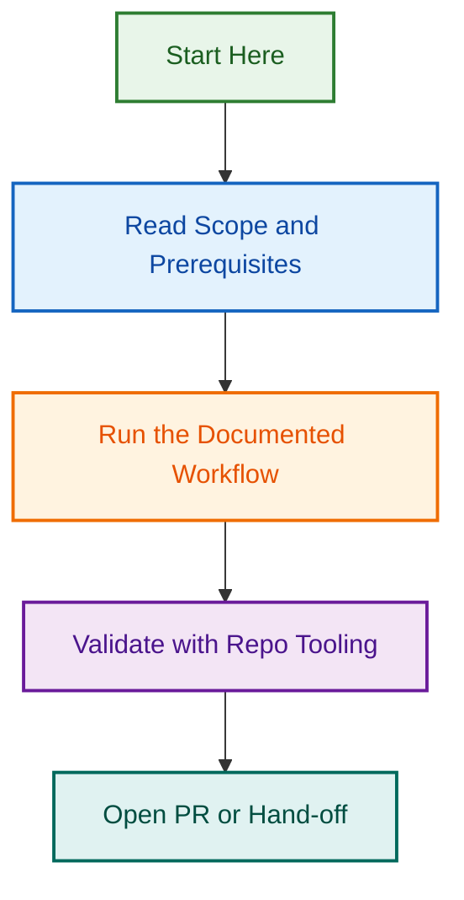

# Markdown Audit CI Optimization

## Project Status

🟡 **ACTIVE** — Audit findings and implementation planning in progress.

## Overview

Optimization initiative for markdown validation and linting CI workflows. Focuses on improving validation accuracy, reducing false positives, and streamlining the CI/CD pipeline for documentation changes.

## Key Deliverables

- **Audit Analysis** — Comprehensive findings on current markdown validation issues
- **Implementation Guide** — Step-by-step plan for implementing optimizations
- **CI Workflow Improvements** — Enhanced validation rules and automation

## Related Documents

- See `AUDIT_PROMPT.md` for audit methodology
- See `IMPLEMENTATION_GUIDE.md` for implementation details
- See `MARKDOWN_AUDIT_FINDINGS.md` for detailed audit results

## Next Steps

- Review audit findings
- Implement CI workflow improvements
- Validate against test suite
- Deploy to production

---

**Project Lead:** TBD  
**Started:** 2026-08-05  
**Status:** Active  
**Last Updated:** 2026-08-06

## Related Issues

This project is coordinated with:

- [#1733](https://github.com/lightspeedwp/.github/issues/1733) — Phase 2: Folder Structure & Linking
- [#1737](https://github.com/lightspeedwp/.github/issues/1737) — Phase 2: Link markdown-audit-ci-optimization

See [Linking Standard](https://github.com/lightspeedwp/.github/blob/develop/.github/projects/active/reports-projects-restructuring-2026-08-11/LINKING_STANDARD.md) for linking patterns.
## Visual Workflow

