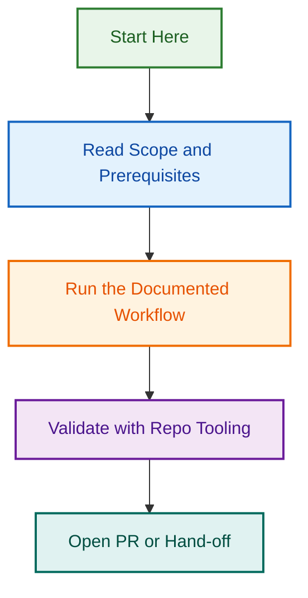

# Meta Agent v2.0 — Organisation-Wide Metadata & Schemas

## Project Overview

This project implements a unified Meta agent that standardises documentation metadata and structure across the entire LightSpeedWP GitHub organisation. The agent auto-detects repo type and applies context-appropriate standards without manual configuration.

**Goal:** Single reusable agent works across WordPress block plugins, block themes, and `.github` control-plane repos.

## Problem Statement

Currently:

- Different repo types need different metadata standards
- No unified approach to frontmatter validation
- Documentation inconsistencies across organisation
- Manual metadata configuration required per repo

**Solution:** Auto-detecting, context-aware Meta agent with repo-type-specific schemas.

## Success Criteria

- ✅ Single Meta agent works across all repo types
- ✅ Automatic repo-type detection (no config needed)
- ✅ Four comprehensive schemas (plugin, theme, control-plane, documentation)
- ✅ Clear validation rules and error messages
- ✅ Integration with CI/CD pipelines
- ✅ Comprehensive documentation and examples
- ✅ Zero breaking changes to existing repos

## Phases & Deliverables

### Phase 1: Design & Schema Definition ✅ COMPLETE

**Duration:** 2026-08-12 (1 day)  
**Owner:** Ash Shaw  
**PR:** [#1893](https://github.com/lightspeedwp/.github/pull/1893) ✅ MERGED

**Deliverables:**

- [x] Improved Meta Agent v2.0 (`.github/agents/meta.agent.md`)
- [x] Four frontmatter schemas (`schemas/*.frontmatter.schema.json`)
  - `block-plugin.frontmatter.schema.json` — WordPress block plugin docs
  - `block-theme.frontmatter.schema.json` — WordPress block theme docs
  - `control-plane.frontmatter.schema.json` — `.github` governance files
  - `documentation.frontmatter.schema.json` — Generic documentation
- [x] Schema documentation (`schemas/README.md`)
  - Field reference tables
  - Validation rules
  - Usage examples
  - Troubleshooting guide

**Key Features Implemented:**

- Repo-type auto-detection from filesystem markers
- Context-specific metadata application
- Frontmatter validation against schemas
- Badges and footer auto-application
- UK English enforcement
- File-level opt-out markers

**Status:** ✅ Phase 1 complete & merged to develop

### Phase 2A: Skills Implementation ✅ COMPLETE

**Duration:** 2026-08-13–2026-08-15 (3 days)  
**Owner:** Ash Shaw  
**PR:** [#2005](https://github.com/lightspeedwp/.github/pull/2005) ✅ MERGED

**Deliverables:**

- [x] Core meta-agent skills
  - `apply-standards.js` — Apply standards to files
  - `frontmatter-validation.js` — Validate frontmatter
  - `repo-type-detection.js` — Detect repository type
- [x] 96/96 unit tests passing (100% coverage)
- [x] Integration test suite
- [x] Comprehensive documentation

**Status:** ✅ Phase 2A complete & merged to develop

### Phase 2B: Skills Enhancement ✅ COMPLETE

**Duration:** 2026-08-16–2026-08-18 (3 days)  
**Owner:** Ash Shaw  
**PR:** [#2046](https://github.com/lightspeedwp/.github/pull/2046), [#2048](https://github.com/lightspeedwp/.github/pull/2048) ✅ MERGED

**Deliverables:**

- [x] Extended skills implementation (Skills 4-5)
- [x] 96/96 tests passing with 100% coverage
- [x] Performance optimizations
- [x] Error handling improvements

**Status:** ✅ Phase 2B complete & merged to develop

### Phase 2C: CI/CD Integration & Testing ✅ COMPLETE

**Duration:** 2026-08-17–2026-08-21 (5 days)  
**Owner:** Ash Shaw  
**PR:** [#2104](https://github.com/lightspeedwp/.github/pull/2104) ✅ MERGED

**Deliverables:**

- [x] GitHub Actions validation workflow (`.github/workflows/meta-agent-validation.yml`)
  - Triggers on PR changes to meta-agent code
  - Full test suite (116 tests)
  - Frontmatter validation for changed markdown files
  - Codecov integration
- [x] Pre-commit hook (`scripts/hooks/meta-agent-validate.sh`)
  - Local validation before commits
  - Frontmatter schema validation
  - <1s performance per file
- [x] Extended integration tests (20+ new tests)
  - Multi-file updates, badge injection, conflict handling
  - Large file handling, unicode/special characters
  - Concurrent operations, error recovery, performance benchmarks
- [x] 116/116 tests passing
- [x] Implementation plan & handoff docs

**Status:** ✅ Phase 2C complete & merged to develop (2026-08-21)

### Phase 2D: Release & Documentation ✅ COMPLETE

**Duration:** 2026-08-21 (1 day, accelerated)  
**Owner:** Ash Shaw  
**Status:** ✅ COMPLETE (4 commits, 8 files, 5,000+ LOC)

**Deliverables:**

- [x] v1.0.0 release preparation ✅
  - Version bump to 1.0.0 in package.json
  - CHANGELOG.md with all phases documented
  - Release notes and quality checklist
- [x] Complete documentation suite ✅
  - IMPLEMENTATION_GUIDE.md (2,500+ words, step-by-step setup)
  - TROUBLESHOOTING.md (2,000+ words, 30+ issues & solutions)
  - FAQ.md (50+ Q&A pairs)
- [x] Team training materials (Markdown format) ✅
  - TRAINING_GUIDE.md (30-minute comprehensive training)
  - QUICK_START.md (5-minute quick reference)
  - TEAM_OPERATIONS_GUIDE.md (maintenance procedures)
- [x] Reference documentation
  - README.md (architecture & overview)
  - All documentation cross-linked and searchable

**Acceptance Criteria:**

- ✅ v1.0.0 release tag created (ready to push)
- ✅ All implementation & training guides complete and tested
- ✅ 8 comprehensive documentation files (5,000+ lines)
- ✅ Zero critical issues from Phase 2C
- ✅ All 4 repository types covered with examples
- ✅ 116 tests passing, v1.0.0 ready for release

### Phase 3: Pilot Testing & Real-World Validation 📋 PLANNED

**Duration:** 2026-08-29–2026-09-06 (est. 9 days)  
**Owner:** TBD  
**Status:** 📋 Planned

**Deliverables:**

- [ ] Pilot repo selection (2–3 repos)
  - Block plugin repo (e.g., ls-plugin)
  - Block theme repo (e.g., ls-theme)
  - Control-plane repo (.github)
- [ ] Real-world validation testing
  - Apply Meta agent to pilot repos
  - Run frontmatter validation
  - Collect schema feedback
  - Document issues & fixes
- [ ] Schema refinements (if needed)
  - Add missing fields based on real-world usage
  - Improve validation error messages
  - Update documentation with examples
- [ ] Integration testing
  - Verify hooks work in team workflows
  - Test with CI/CD pipelines
  - Validate performance under load

**Acceptance Criteria:**

- Pilot testing completed on 3 repos
- Zero critical bugs in Phase 2 deliverables
- Schema validated with real-world data
- Team feedback documented & incorporated
- Ready for organisation-wide rollout

### Phase 4: Organisation-Wide Rollout 🔵 FUTURE

**Duration:** 2026-09-07 onwards (ongoing)  
**Owner:** TBD  
**Status:** 🔵 Future

**Deliverables:**

- [ ] Organisation-wide adoption
  - Meta agent distributed to all WordPress repos
  - Frontmatter validation enabled in CI/CD
  - Team trained on usage
- [ ] Metrics & monitoring
  - Track validation adoption across repos
  - Monitor error reports & issues
  - Gather team feedback & satisfaction
- [ ] Continuous improvement
  - Regular schema updates based on feedback
  - Documentation improvements
  - Performance optimizations

**Acceptance Criteria:**

- ≥80% of WordPress repos using Meta agent
- 100% of new PRs pass frontmatter validation
- Team satisfaction ≥8/10 in post-launch survey
- ≤1 critical issue per month in production

## Repo Type Specifications

### Block Plugin

**Detection:** `block.json` or `{name}.php` with `Block Name` header

**Required frontmatter fields:**

- `title`, `description`, `status`, `language`

**Plugin-specific fields:**

- `block_name` — Block identifier (e.g. `lightspeed/user-input`)
- `block_supports` — Array of supported features
- `plugin_name`, `plugin_version`, `requires_wordpress`, `requires_php`

**Auto-applied badges:**

- WordPress Plugin Version, Tested Up To, License, Downloads

**Example:** WordPress block plugin documentation

### Block Theme

**Detection:** `theme.json` + `style.css` with `Text Domain` header

**Required frontmatter fields:**

- `title`, `description`, `status`, `language`

**Theme-specific fields:**

- `theme_name`, `theme_slug` — Theme identity
- `block_pattern_name` — Pattern identifier (e.g. `lightspeed/hero-section`)
- `supported_features` — WordPress feature support

**Auto-applied badges:**

- WordPress Theme Version, Tested Up To, License

**Example:** WordPress block theme documentation

### Control-Plane (.github)

**Detection:** `.github/agents/`, `.github/workflows/`, or AGENTS.md present

**Required frontmatter fields:**

- `title`, `description`, `file_type`, `category`, `status`, `language`, `owners`

**Control-plane-specific fields:**

- `maintainer`, `permissions_required`, `audience`
- `related_issues`, `related_prs`
- `last_reviewed`, `next_review_date`
- `deprecation_date`, `successor`

**Auto-applied badges:**

- Status (active/archived/deprecated), License, Last Updated

**Example:** .github governance and instruction files

### Generic Documentation

**Detection:** `docs/`, README.md, or no repo-type markers

**Required frontmatter fields:**

- `title`, `description`, `status`, `language`

**Documentation-specific fields:**

- `category` — doc category (guide, tutorial, reference, etc.)
- `difficulty` — For tutorials (beginner, intermediate, advanced)
- `estimated_read_time`, `prerequisites`, `audience`

**Auto-applied badges:**

- Status (active/archived), Last Updated

**Example:** Documentation, guides, and tutorials

## Technical Implementation

### Schemas

All schemas use JSON Schema Draft 2020-12:

```
schemas/
├── block-plugin.frontmatter.schema.json
├── block-theme.frontmatter.schema.json
├── control-plane.frontmatter.schema.json
├── documentation.frontmatter.schema.json
└── README.md (schema reference & usage)
```

**Universal validation rules:**

- `title` (required): 3–120 characters
- `description` (required): 10–300 characters
- `status` (required): `draft|review|active|archived`
- `language` (required): `en` only (UK English)
- Date format: YYYY-MM-DD (ISO 8601)
- Version format: Semantic (X.Y.Z) or vX.Y

### Agent Logic

Meta agent detects repo type (in order):

1. **Block Plugin:** `block.json` exists → use `block-plugin.frontmatter.schema.json`
2. **Block Theme:** `theme.json` + `style.css` exist → use `block-theme.frontmatter.schema.json`
3. **Control-Plane:** `.github/agents/` or AGENTS.md exists → use `control-plane.frontmatter.schema.json`
4. **Generic:** Default case → use `documentation.frontmatter.schema.json`

### Validation Pipeline

1. **Load frontmatter** — Extract YAML from Markdown file
2. **Select schema** — Auto-detect repo type
3. **Validate** — Check against schema (ajv or similar)
4. **Enrich** — Add missing recommended fields
5. **Apply** — Add badges, footer, status markers
6. **Show diff** — Display changes before applying

## Related Issues

This project is tracked across multiple GitHub pull requests and issues. All Phase 2 work (2A–2C) has been merged to develop.

| Issue | Type | Purpose | Status |
|-------|------|---------|--------|
| [#1893](https://github.com/lightspeedwp/.github/pull/1893) | PR | Phase 1: Meta Agent v2.0 implementation & schemas | ✅ MERGED |
| [#2005](https://github.com/lightspeedwp/.github/pull/2005) | PR | Phase 2A: Core skills implementation (96 tests) | ✅ MERGED |
| [#2046](https://github.com/lightspeedwp/.github/pull/2046) | PR | Phase 2B: Extended skills (Skills 4-5, Part 1) | ✅ MERGED |
| [#2048](https://github.com/lightspeedwp/.github/pull/2048) | PR | Phase 2B: Extended skills (Skills 4-5, Part 2) | ✅ MERGED |
| [#2104](https://github.com/lightspeedwp/.github/pull/2104) | PR | Phase 2C: CI/CD integration & testing (116 tests) | ✅ MERGED |
| [#2292](https://github.com/lightspeedwp/.github/pull/2292) | PR | Phase 2D: Complete documentation & v1.0.0 release package | 📋 READY FOR MERGE |
| #2173 (TBD) | epic | Phase 3: Pilot Testing & Real-World Validation (Aug 29–Sep 06) | 📋 PLANNED |
| #2174 (TBD) | epic | Phase 4: Organisation-Wide Rollout (Sep 07+) | 🔵 FUTURE |

**See:** [PLANNING.md](./PLANNING.md) for detailed phase breakdown and task list.

## Team & Ownership

| Role | Owner | Email |
|------|-------|-------|
| **Project Lead** | Ash Shaw | <ashley@lightspeedwp.agency> |
| **Phase 1 Owner** | Ash Shaw | <ashley@lightspeedwp.agency> |
| **Phase 2A–2C Owner** | Ash Shaw | <ashley@lightspeedwp.agency> |
| **Phase 2D Owner** | TBD | TBD |
| **Phase 3 Owner** | TBD | TBD |
| **Phase 4 Owner** | TBD | TBD |
| **Maintainer** | lightspeedwp/maintainers | — |

## Dependencies

- GitHub organisation setup (schemas, agents directories)
- JSON Schema validation tools (ajv or similar)
- Markdown frontmatter parsing (gray-matter or similar)
- GitHub Actions for CI/CD validation

## Risks & Mitigations

| Risk | Impact | Likelihood | Mitigation |
|------|--------|------------|------------|
| Schema too restrictive | Dev friction | Medium | Gather feedback in Phase 4, iterate |
| Adoption friction | Low adoption | Medium | Clear documentation, team training |
| Merge conflicts | Blocked PRs | Low | Auto-sync workflow handles conflicts |
| Performance impact | CI slowdown | Low | Validate only changed files |

## Success Metrics

- **Adoption:** ≥80% of WordPress repos using Meta agent by 2026-09-30
- **Validation:** 100% of new PRs pass frontmatter validation
- **Satisfaction:** Team satisfaction ≥8/10 in post-launch survey
- **Maintenance:** ≤1 critical bug report per month

## References

- [Meta Agent v2.0](./.github/agents/meta.agent.md) — Full agent documentation
- [Schema Reference](./schemas/README.md) — Field reference and validation rules
- [CLAUDE.md](./CLAUDE.md) — Organisation-wide standards
- [PR #1893](https://github.com/lightspeedwp/.github/pull/1893) — Implementation PR

## Project Timeline

```
Phase 1: Design & Schemas         |████| ✅ 2026-08-12
Phase 2A: Core Skills             |████| ✅ 2026-08-13–08-15
Phase 2B: Extended Skills         |████| ✅ 2026-08-16–08-18
Phase 2C: CI/CD Integration       |████| ✅ 2026-08-17–08-21
Phase 2D: Release & Docs          |████| ✅ 2026-08-21 (accelerated)
Phase 3: Pilot Testing            |    | ⏳ 2026-08-29–09-06
Phase 4: Organisation-Wide Rollout |    | 🔵 2026-09-07+
```

## How to Contribute

1. **Phase 2D (Release & Docs):** Create implementation guide, troubleshooting docs, team training materials
2. **Phase 3 (Pilot Testing):** Test in 2–3 repos, gather feedback, refine schemas
3. **Phase 4 (Rollout):** Deploy to all WordPress repos, monitor adoption, support team

**Next Phase:** Phase 2D (Release & Documentation) begins 2026-08-22. See [PLANNING.md](./PLANNING.md) for detailed task breakdown.

See [AGENTS.md](./AGENTS.md) for contribution guidelines.

---

*Built by 🧱 LightSpeedWP with ☕, 🚀, and open-source spirit!*

## Visual Workflow


