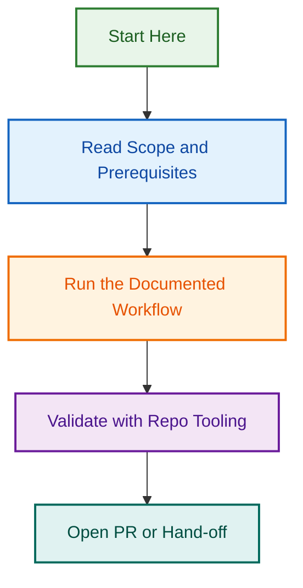

# Metrics Agent v2.0 — Phase 3: Production Rollout & Integration

## Project Overview

**Status:** 🚀 KICKOFF 2026-08-26  
**Duration:** 2-3 weeks (30-45 hours)  
**Team:** 1-2 engineers  
**Owner:** [Phase 3 Lead TBD]

## What This Project Is

Phase 3 is the production rollout and integration phase for Metrics Agent v2.0. All Phase 2 implementation code is complete and stable (150+ tests, 92%+ coverage). Phase 2.5 documentation is shipped and team-ready.

This phase focuses on:
- ✅ Deploying metrics collection to production
- ✅ Integrating with Meta Agent, Reporting Agent, and Issue Management
- ✅ Setting up monitoring, alerting, and runbooks
- ✅ Conducting team training and adoption
- ✅ Validating metrics accuracy and performance

## Deliverables

### Task 3.1: Production Deployment (3-5 hours)
**Issue:** [#3101](https://github.com/lightspeedwp/.github/issues/3101)

Deploy metrics-collection workflow to production with automatic scheduling:
- [ ] Enable workflow on main/develop
- [ ] Configure scheduled run (daily 2 AM UTC)
- [ ] Set up GitHub token and environment secrets
- [ ] Enable workflow logging and monitoring
- [ ] Configure failure alerts (Slack)

### Task 3.2: Integration with Control Plane (6-8 hours)
**Issue:** [#3102](https://github.com/lightspeedwp/.github/issues/3102)

Wire metrics data into Meta Agent, Reporting Agent, and Issue Management:
- [ ] Create integration adapter (Meta Agent)
- [ ] Document metrics input format (Reporting Agent)
- [ ] Set up issue creation templates
- [ ] Test end-to-end metrics flow
- [ ] Update integration documentation

### Task 3.3: Monitoring & Alerting (4-6 hours)
**Issue:** [#3103](https://github.com/lightspeedwp/.github/issues/3103)

Set up production monitoring and runbooks:
- [ ] Configure Slack notifications
- [ ] Create metrics health dashboard (optional)
- [ ] Set up alerts for health score drops (<60)
- [ ] Document runbooks for 5+ common failures
- [ ] Document monitoring strategy

### Task 3.4: Team Rollout & Training (8-10 hours)
**Issue:** [#3104](https://github.com/lightspeedwp/.github/issues/3104)

Conduct training and ensure team adoption:
- [ ] Conduct 4 training sessions (60 min each)
- [ ] Run hands-on labs with team
- [ ] Gather feedback and document issues
- [ ] Certification: Team completes knowledge checks
- [ ] Schedule recurring team sync (weekly)

**Training Schedule:**
- Week of 2026-08-26: 4x 1-hour sessions
- Week of 2026-09-02: Hands-on labs and certification

### Task 3.5: Validation & Refinement (4-6 hours)
**Issue:** [#3105](https://github.com/lightspeedwp/.github/issues/3105)

Validate metrics accuracy and performance:
- [ ] Validate metrics accuracy (manual counts)
- [ ] Performance test under production load
- [ ] Test error recovery and retries
- [ ] Validate data persistence and recovery
- [ ] Document lessons learned

## Phase 3 Success Criteria

### Deployment Success
- [ ] Metrics workflow runs on schedule (daily, zero manual intervention)
- [ ] All contexts collected (control-plane, plugins, themes)
- [ ] Collection completes in <5 minutes
- [ ] Zero critical errors in first 2 weeks

### Integration Success
- [ ] Metrics accessible to 2+ downstream agents
- [ ] Reports automatically generated and published
- [ ] Issue tracking end-to-end functional
- [ ] Team references metrics in standup (3+ times)

### Team Adoption Success
- [ ] All engineers complete training certification
- [ ] Team uses metrics in 2+ decisions
- [ ] Training feedback >= 4/5
- [ ] Zero critical bugs in first month

## Related Issues

| Issue | Type | Purpose | Status |
|-------|------|---------|--------|
| [#3101](https://github.com/lightspeedwp/.github/issues/3101) | task | Production Deployment | 🟡 Planned |
| [#3102](https://github.com/lightspeedwp/.github/issues/3102) | task | Integration with Control Plane | 🟡 Planned |
| [#3103](https://github.com/lightspeedwp/.github/issues/3103) | task | Monitoring & Alerting | 🟡 Planned |
| [#3104](https://github.com/lightspeedwp/.github/issues/3104) | task | Team Rollout & Training | 🟡 Planned |
| [#3105](https://github.com/lightspeedwp/.github/issues/3105) | task | Validation & Refinement | 🟡 Planned |

## Timeline

```
2026-08-19  Phase 2.5 Documentation Complete (PR #2113 merged)
2026-08-26  Phase 3 Kickoff — Task 3.1 begins
2026-09-02  Task 3.1-3.2 complete, team training begins (Task 3.4)
2026-09-09  Phase 3 Complete — Production ready, monitoring live
```

## Key Resources

### Documentation
- [Phase 2.5 README](https://github.com/lightspeedwp/.github/blob/develop/scripts/metrics/docs/README.md)
- [Integration Guide](https://github.com/lightspeedwp/.github/blob/develop/scripts/metrics/docs/INTEGRATION_GUIDE.md)
- [Usage Guide](https://github.com/lightspeedwp/.github/blob/develop/scripts/metrics/docs/USAGE_GUIDE.md)
- [Training Guide](https://github.com/lightspeedwp/.github/blob/develop/scripts/metrics/docs/TRAINING_GUIDE.md)
- [Handoff Document](https://github.com/lightspeedwp/.github/blob/develop/scripts/metrics/docs/HANDOFF.md)

### Code
- Phase 2 Implementation: `scripts/metrics/` (merged to develop)
- Phase 2 Workflow: `workflows/metrics-collection.yml` (merged to develop)

### Phase 3 Prompt
For new session continuation: `METRICS_AGENT_PHASE_3_PROMPT.txt` in memory

## Phase 3 Lead Requirements

- ✅ Familiar with GitHub Actions workflows
- ✅ Experience with Node.js and async patterns
- ✅ Knowledge of repository metrics/health scoring
- ✅ Comfortable with multi-system integration
- ⚠️ Does NOT need to be original author (knowledge transfer complete)

## Questions for Phase 3 Lead

Before starting, clarify:

1. **Scheduling:** What time works best for daily metrics? (default: 2 AM UTC)
2. **Notifications:** Should failures alert on Slack? Pagerduty?
3. **Reporting:** Should metrics post as issue comments? Weekly summaries?
4. **Integration:** Which agents should receive metrics data first?
5. **Ownership:** Who owns metrics ops after Phase 3?

## Long-Term Roadmap (Post-Phase 3)

- **Phase 4:** Dashboard and visualization
- **Phase 5:** Advanced analytics and trending
- **Phase 6:** ML-based anomaly detection
- **Phase 7:** Automated remediation based on metrics

## Project Status

| Phase | Status | PRs | Docs | Tests |
|-------|--------|-----|------|-------|
| **2** | ✅ Complete | #2078 | — | 150+ (92%+) |
| **2.5** | ✅ Complete | #2113 | ✅ 5 files | — |
| **3** | 🚀 Kickoff | — | 📋 Ready | — |

---

**Version:** 1.0.0  
**Created:** 2026-08-19  
**Kickoff:** 2026-08-26  
**Owner:** [Phase 3 Lead TBD]

**Status:** ✅ READY FOR PHASE 3 🚀
## Visual Workflow


