# Metrics Agent — Architecture

## System Overview

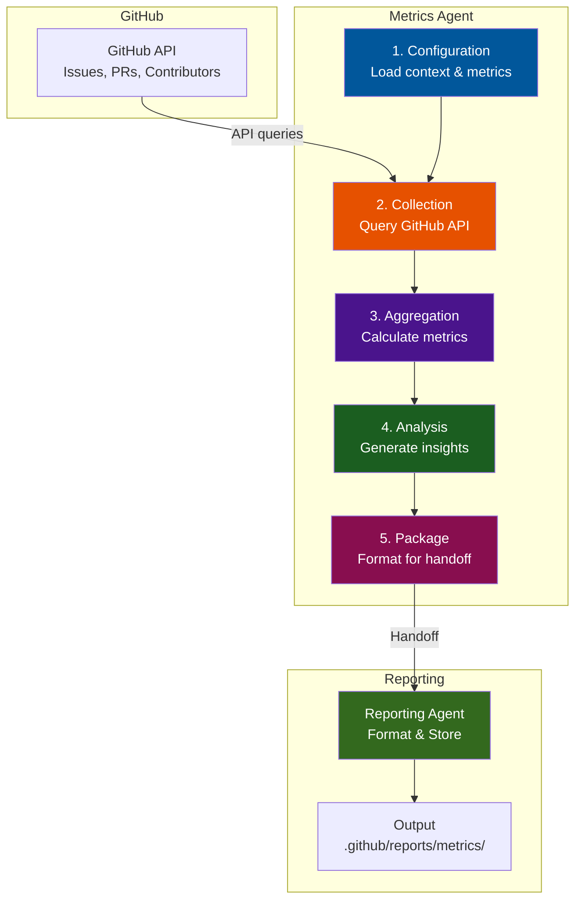

## Component Architecture

### Configuration Layer

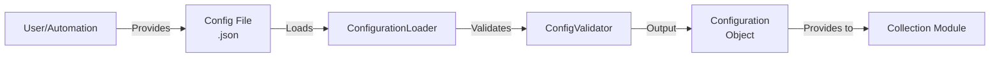

**Responsibilities:**

- Load configuration files
- Validate context, metrics, repositories
- Provide validated configuration to other modules
- Support environment variables for sensitive data

### Collection Module

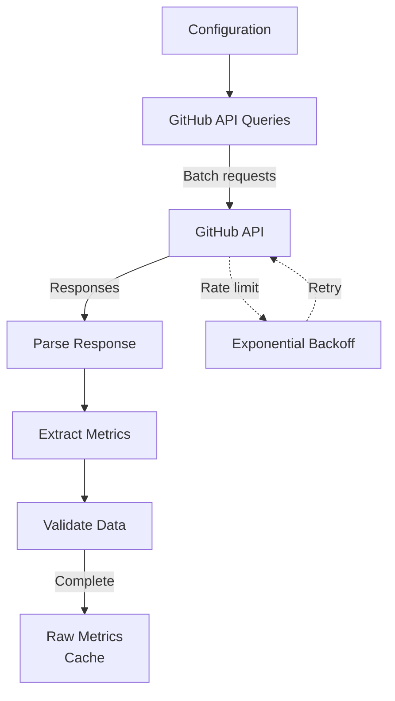

**Responsibilities:**

- Query GitHub API efficiently
- Handle rate limiting
- Extract relevant fields
- Validate data quality
- Cache results

### Aggregation Module

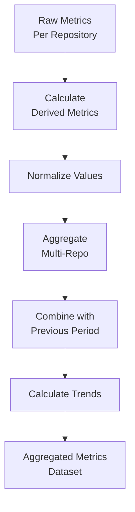

**Responsibilities:**

- Calculate averages, medians, percentiles
- Handle outliers
- Multi-repository aggregation
- Trend calculation (period-over-period)
- Data normalization

### Analysis Module

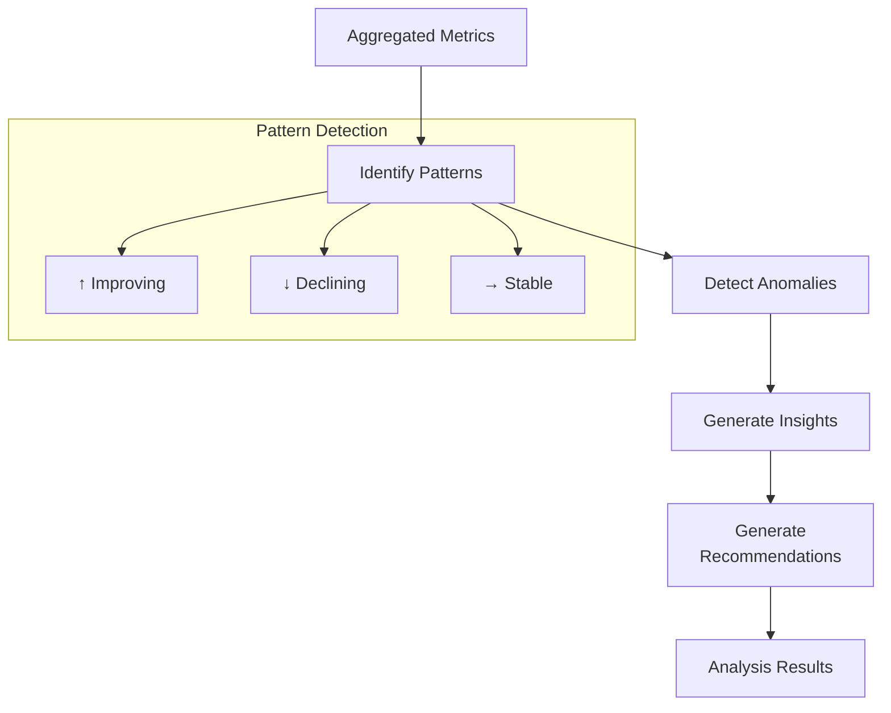

**Responsibilities:**

- Identify patterns in metrics
- Detect anomalies (statistical outliers)
- Generate actionable insights
- Create recommendations
- Flag concerning trends

### Packaging Module

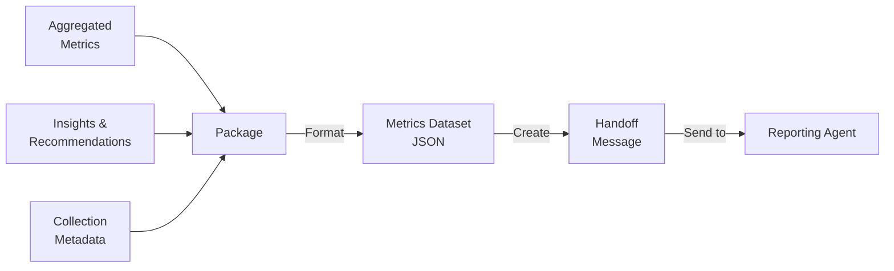

**Responsibilities:**

- Format complete metrics dataset
- Include insights and recommendations
- Add metadata (timestamps, sources)
- Create handoff message
- Send to Reporting agent

## Data Flow

### Complete Collection Flow

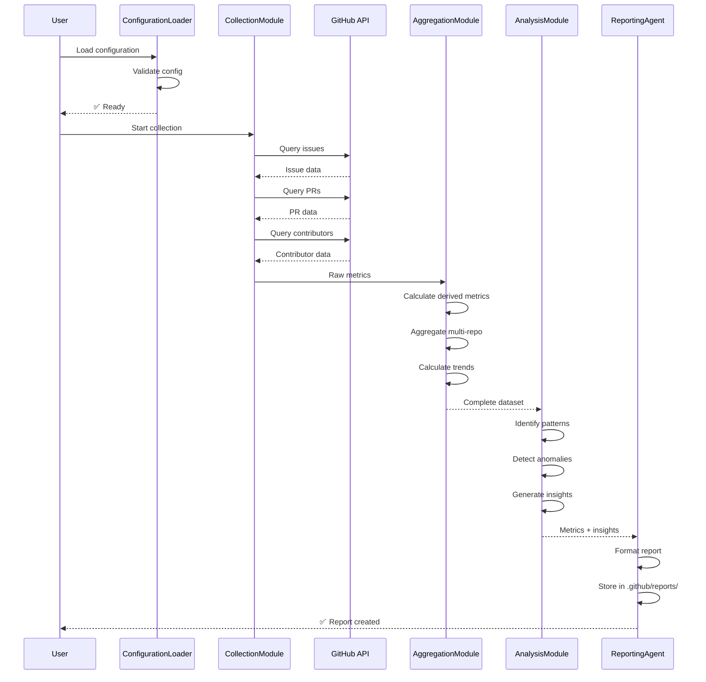

## Multi-Repository Aggregation

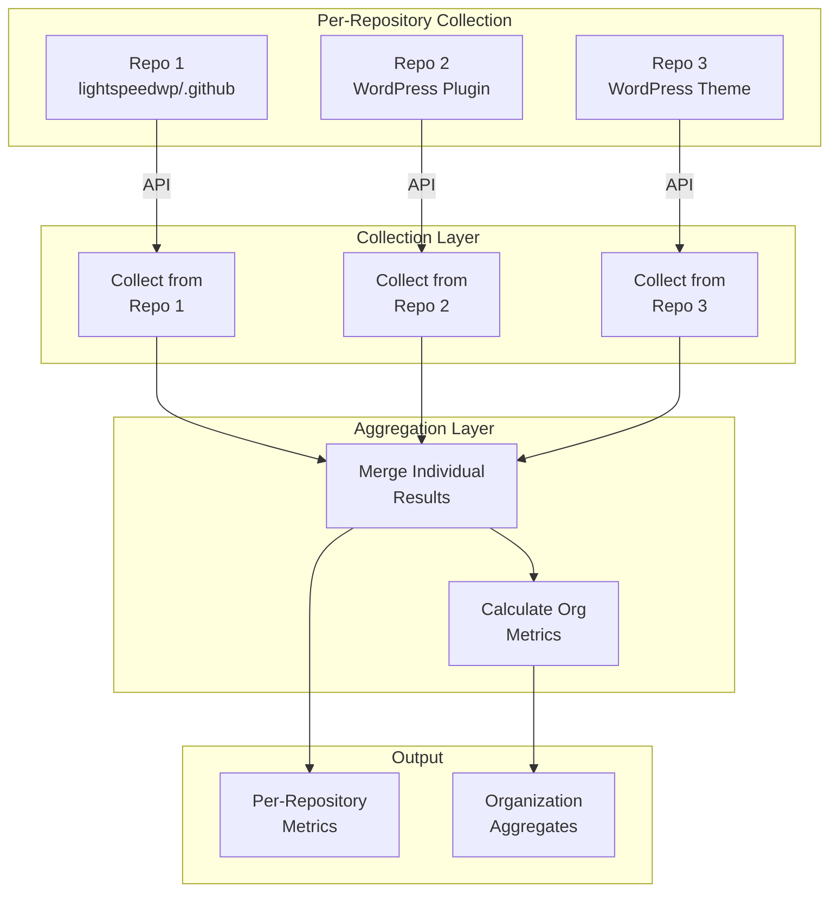

## Configuration-Driven Behavior

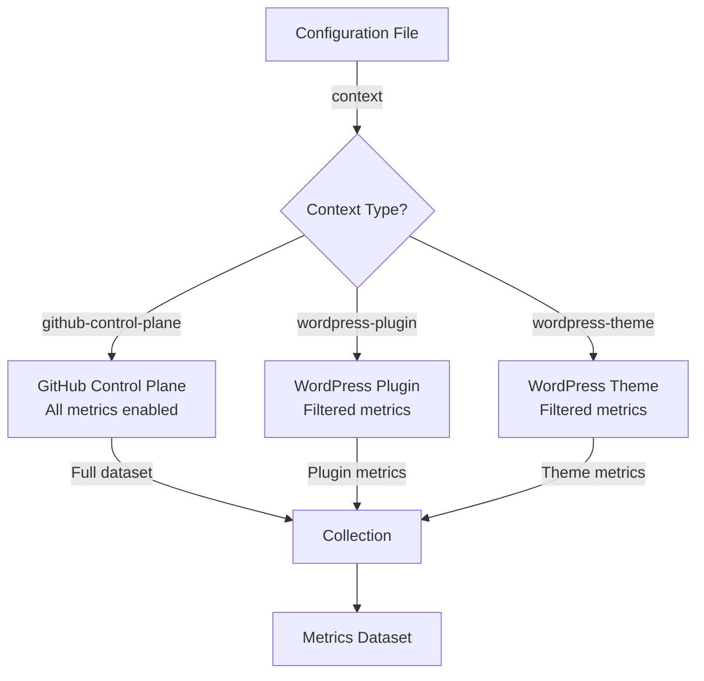

**Context-Specific Metric Subsets:**

| Context | Metrics | Purpose |
|---------|---------|---------|
| `github-control-plane` | All (Issues, PRs, Contributors, Health, Quality) | Governance dashboard |
| `wordpress-plugin` | Issues, PRs, Contributors, Quality | Community engagement |
| `wordpress-theme` | Issues, PRs, Contributors, Quality | Theme maintenance |

## Error Handling & Retry Strategy

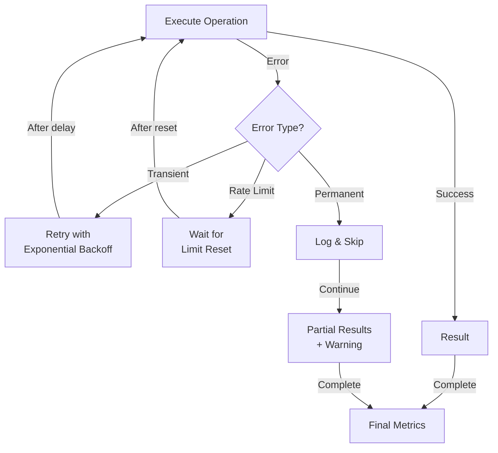

**Backoff Strategy:**

```
Attempt 1: Immediate
Attempt 2: Wait 2 seconds (2^1)
Attempt 3: Wait 4 seconds (2^2)
Attempt 4: Wait 8 seconds (2^3)
Attempt 5: Wait 16 seconds (2^4)
Max: 5 attempts (total ~31 seconds)
```

## Integration with Reporting Agent

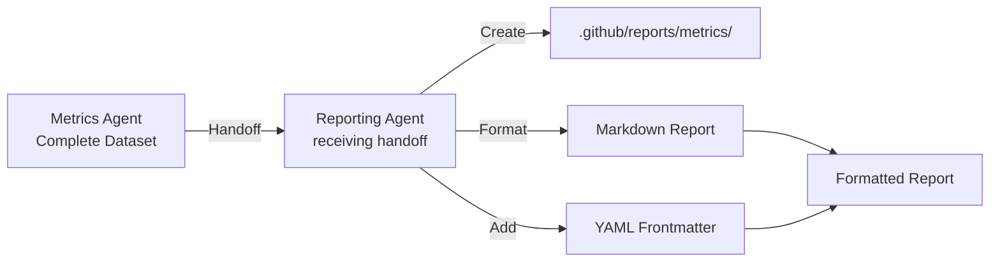

**Handoff Protocol:**

```json
{
  "action": "create_report",
  "category": "metrics",
  "title": "Weekly Metrics Summary — Aug 5-12",
  "data": { /* complete metrics dataset */ },
  "insights": [ /* array of insights */ ],
  "metadata": {
    "collection_period": "...",
    "context": "github-control-plane",
    "repositories": ["lightspeedwp/.github"]
  }
}
```

## Scalability & Performance

### Single vs Multi-Repository

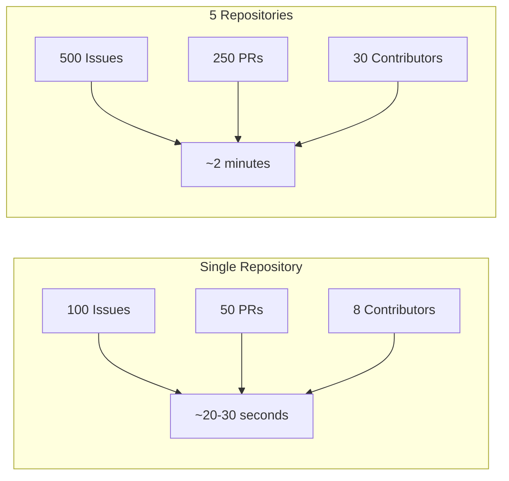

### Caching Strategy

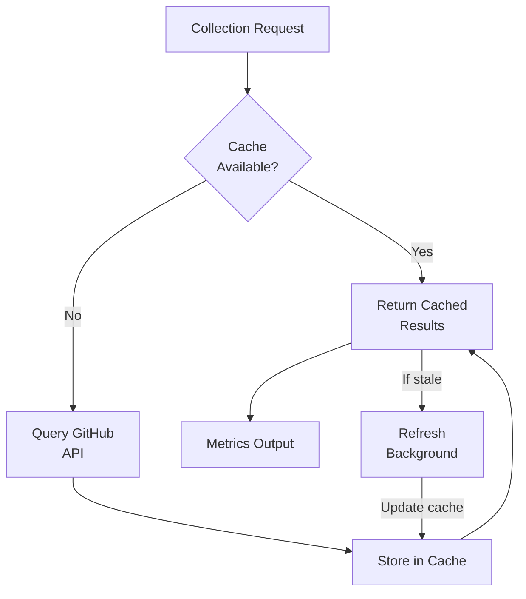

**Cache TTL:** 1 hour (configurable)

---

*Built by 🧱 LightSpeedWP with ☕, 🚀, and open-source spirit!*
