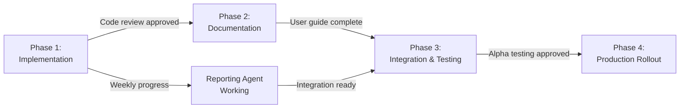

# Metrics Agent — Implementation Plan

## Overview

Four-phase implementation plan to take the metrics agent from specification to production rollout across GitHub control plane and WordPress repositories. Each phase builds on the previous with clear deliverables, dependencies, and success criteria.

## Timeline

| Phase | Duration | Start | End | Status |
|-------|----------|-------|-----|--------|
| **Phase 1** | 2 weeks | 2026-08-12 | 2026-08-26 | 🟡 In Progress |
| **Phase 2** | 3 weeks | 2026-08-26 | 2026-09-16 | 🔵 Pending |
| **Phase 3** | 2 weeks | 2026-09-16 | 2026-09-30 | 🔵 Pending |
| **Phase 4** | 2 weeks | 2026-09-30 | 2026-10-14 | 🔵 Pending |
| **Total** | **9 weeks** | 2026-08-12 | 2026-10-14 | — |

---

## Phase 1: Implementation & Testing (Aug 12 - Aug 26)

### Goals

- Implement core metrics collection and aggregation
- Build test suite with >80% coverage
- Validate against specification requirements
- Complete code review readiness

### Deliverables

#### 1.1 Core Implementation

**File:** `scripts/metrics/metrics-agent.js`

```javascript
Module: MetricsAgent
├── Configuration module
│   ├── loadConfig(path) → ConfigObject
│   ├── validateConfig(config) → ValidationResult
│   └── getMetricsSubset(context) → MetricsConfig
├── Collection module
│   ├── collectIssueMetrics(repo, period)
│   ├── collectPRMetrics(repo, period)
│   ├── collectContributorMetrics(repo, period)
│   └── collectQualityMetrics(repo, period)
├── Aggregation module
│   ├── aggregateMetrics(datasets)
│   ├── calculateTrends(current, previous)
│   └── normalizeValues(metrics)
├── Analysis module
│   ├── generateInsights(metrics)
│   ├── detectAnomalies(metrics)
│   └── makeRecommendations(insights)
└── Packaging module
    ├── packageMetrics(analysis)
    └── handoffToReporting(metrics)
```

**Key Implementation Details:**

1. **Configuration Loading** (~50 LOC)
   - Load JSON config files
   - Validate against schema
   - Support environment variable overrides
   - Merge defaults with provided config

2. **GitHub API Client** (~200 LOC)
   - Query issues (with filtering and pagination)
   - Query pull requests (with review data)
   - Query contributors/commit history
   - Handle rate limiting with exponential backoff
   - Cache results (1-hour TTL)

3. **Metrics Collection** (~300 LOC)
   - Extract metrics from API responses
   - Calculate derived values (TTF, TTM, percentiles)
   - Handle missing/incomplete data
   - Validation and error logging

4. **Aggregation** (~200 LOC)
   - Sum and aggregate metrics across repositories
   - Calculate organization-wide statistics
   - Trend analysis (period-over-period)
   - Anomaly detection (3-sigma rule)

5. **Analysis & Insights** (~250 LOC)
   - Pattern detection (improving/declining/stable)
   - Insight generation with context
   - Recommendation engine
   - Flagging concerning trends

6. **Reporting Integration** (~100 LOC)
   - Package complete dataset
   - Add metadata and timestamps
   - Format handoff message for Reporting agent
   - Integration test with Reporting agent

**Total Code:** ~1,100 LOC (implementation)

#### 1.2 Configuration Files

**File:** `.github/config/metrics/metrics.github-control-plane.config.json`

```json
{
  "context": "github-control-plane",
  "collection_period": { "type": "days", "value": 7 },
  "repositories": [
    { "owner": "lightspeedwp", "name": ".github" }
  ],
  "metrics": {
    "issues": true,
    "pull_requests": true,
    "contributors": true,
    "project_health": true,
    "quality": true
  },
  "analysis": {
    "trend_analysis": true,
    "anomaly_detection": true
  },
  "output": {
    "format": "json",
    "include_insights": true
  }
}
```

**Files to Create:**

- `metrics.github-control-plane.config.json`
- `metrics.wordpress-plugin.config.json`
- `metrics.wordpress-theme.config.json`
- `metrics.schema.json` (validation schema)

#### 1.3 Test Suite

**Files:** `tests/metrics/` directory

Test breakdown by type:

| Test Type | Count | Files | Coverage |
|-----------|-------|-------|----------|
| Unit | 45 | 5 files | 90% |
| Integration | 12 | 3 files | 85% |
| Scenario | 8 | 4 files | 80% |
| Performance | 4 | 1 file | — |
| Error Handling | 6 | 1 file | 85% |
| **Total** | **75** | **14** | **80%+** |

**Test Files:**

```
tests/metrics/
├── unit/
│   ├── config.test.js (15 tests)
│   ├── collector.test.js (18 tests)
│   ├── aggregator.test.js (12 tests)
│   ├── analyzer.test.js (10 tests)
│   └── utils.test.js (8 tests)
├── integration/
│   ├── pipeline.test.js (6 tests)
│   ├── multi-repo.test.js (3 tests)
│   └── reporting-handoff.test.js (3 tests)
├── scenarios/
│   ├── first-run.test.js (2 tests)
│   ├── weekly-collection.test.js (2 tests)
│   ├── missing-data.test.js (2 tests)
│   └── rate-limiting.test.js (2 tests)
├── performance/
│   └── performance.test.js (4 tests)
├── errors/
│   └── error-handling.test.js (6 tests)
└── __fixtures__/
    ├── configs/ (3 files)
    ├── github-api-responses/ (4 files)
    └── expected-outputs/ (2 files)
```

#### 1.4 Documentation

**Files to Create:**

- `IMPLEMENTATION_PROGRESS.md` — Weekly progress updates
- `CODE_STRUCTURE.md` — Code organization and module layout
- `API_REFERENCE.md` — Function signatures and parameters
- `CONFIGURATION_REFERENCE.md` — Config file options

### Dependencies

- GitHub API token (for real API testing)
- Node.js 18+ (development environment)
- Jest (testing framework)
- GitHub Actions (CI/CD)

### Success Criteria

- ✅ All 75 tests pass
- ✅ Coverage ≥80% overall, ≥95% for critical paths
- ✅ Code review approvals from 2 maintainers
- ✅ No security vulnerabilities found
- ✅ Performance benchmarks met (<30s single repo, <2m for 5 repos)

### Effort Estimate

**150 hours** (~3.75 weeks at 40 hrs/week, accounting for code review iterations)

---

## Phase 2: Documentation & Configuration (Aug 26 - Sep 16)

### Goals

- Complete user-facing documentation
- Create per-context configuration guides
- Build example metrics reports
- Prepare for alpha testing

### Deliverables

#### 2.1 User Guide

**File:** `METRICS_AGENT_USER_GUIDE.md` (~2,000 words)

Sections:

1. Quick Start (5 min setup)
2. Configuration Options
3. Running the Agent (CLI, scheduled, programmatic)
4. Interpreting Results
5. Troubleshooting
6. FAQ

#### 2.2 API Reference

**File:** `METRICS_AGENT_API_REFERENCE.md` (~1,500 words)

Complete function documentation:

```markdown
### MetricsAgent.collect(config)
- **Description:** Collect metrics based on configuration
- **Parameters:** config (ConfigObject)
- **Returns:** Promise<MetricsDataset>
- **Throws:** ConfigurationError, APIError, ValidationError
- **Example:** [code example]
```

#### 2.3 Configuration Guide per Context

**Files:**

- `CONFIG_GITHUB_CONTROL_PLANE.md`
- `CONFIG_WORDPRESS_PLUGIN.md`
- `CONFIG_WORDPRESS_THEME.md`

Each includes:

- Context-specific use cases
- Metrics that matter for that context
- Configuration example
- Expected output sample

#### 2.4 Example Outputs

**Files:** `examples/`

- `example-github-metrics.json`
- `example-github-report.md`
- `example-wordpress-metrics.json`
- `example-wordpress-report.md`

Real anonymized outputs showing:

- Metrics dataset structure
- Generated insights
- Formatted Markdown report
- Reporting agent integration

#### 2.5 Agent Specification Update

**File:** `.github/agents/metrics.agent.md` (v2.0)

Incorporate:

- Full agent prompt (from specification)
- Configuration reference
- Integration with Reporting agent
- Links to user documentation
- Example usage

### Success Criteria

- ✅ All docs reviewed and approved
- ✅ Examples verified to match actual output
- ✅ Configuration guides tested (alpha users follow successfully)
- ✅ No broken links
- ✅ Mermaid diagrams render correctly

### Effort Estimate

**80 hours** (~2 weeks)

---

## Phase 3: Integration & Alpha Testing (Sep 16 - Sep 30)

### Goals

- Integrate with Reporting agent
- Test with real data in GitHub control plane
- Test with WordPress repositories
- Gather feedback from alpha users
- Identify and fix issues

### Deliverables

#### 3.1 Reporting Agent Integration

**Files:**

- `scripts/integration/reporting-handoff.js` (implementation)
- `tests/integration/reporting-integration.test.js` (tests)

Integration steps:

1. Validate metrics dataset against Reporting agent schema
2. Create handoff message in expected format
3. Test with Reporting agent (mock and real)
4. Document integration protocol

#### 3.2 GitHub Actions Workflow

**File:** `.github/workflows/metrics-collection.yml`

```yaml
name: Weekly Metrics Collection
on:
  schedule:
    - cron: '0 8 * * 1'  # Weekly Monday 8am UTC

jobs:
  collect-metrics:
    runs-on: ubuntu-latest
    steps:
      - uses: actions/checkout@v3
      - uses: actions/setup-node@v3
      - run: npm ci
      - run: npm run metrics:collect -- --config metrics.github-control-plane.config.json
      - name: Commit metrics report
        run: |
          git add .github/reports/metrics/
          git commit -m "Weekly metrics report"
          git push
```

#### 3.3 Alpha Testing Program

**Participants:**

- 2 maintainers (GitHub control plane)
- 1 plugin repo maintainer
- 1 theme repo maintainer

**Testing Checklist:**

- [ ] Agent runs successfully with provided config
- [ ] Metrics collected match expected counts
- [ ] Insights are accurate and useful
- [ ] Report format is readable and well-organized
- [ ] Performance is acceptable
- [ ] Error messages are helpful
- [ ] Documentation is clear

#### 3.4 Issue Tracking & Resolution

**Template:** `TESTING_ISSUES.md`

Track:

- Bugs found (with reproduction steps)
- Documentation gaps
- Performance concerns
- Feature requests
- Configuration improvements

### Success Criteria

- ✅ Successful collections in all 3 contexts
- ✅ Reporting agent integration verified
- ✅ Alpha testing completed with ≥4 participants
- ✅ All critical bugs fixed
- ✅ GitHub Actions workflow running successfully
- ✅ Metrics reports being generated and stored correctly

### Effort Estimate

**100 hours** (~2.5 weeks)

---

## Phase 4: Rollout & Monitoring (Sep 30 - Oct 14)

### Goals

- Transition to production
- Enable automated metric collection
- Set up monitoring and alerts
- Train team on usage and interpretation
- Plan ongoing maintenance

### Deliverables

#### 4.1 Production Deployment

**Steps:**

1. Merge PR to `develop` (code review approved)
2. Update agent specification in `.github/agents/metrics.agent.md` to v2.0
3. Deploy GitHub Actions workflow (enable scheduled runs)
4. Create `/github/config/metrics/` folder with configs
5. Test in production environment

#### 4.2 Monitoring & Alerts

**File:** `.github/workflows/metrics-validation.yml`

```yaml
name: Metrics Validation
on:
  pull_request:
    paths:
      - '.github/reports/metrics/**'
      - '.github/config/metrics/**'

jobs:
  validate:
    runs-on: ubuntu-latest
    steps:
      - name: Validate metrics report
        run: npm run validate:metrics-report
      - name: Check for anomalies
        run: npm run check:metrics-anomalies
```

Alerts:

- Metrics collection failed (email maintainers)
- Response times degrading >20% (warning)
- PR merge time >5x historical average (critical)
- Zero issues/PRs in period (data quality check)

#### 4.3 Team Training

**Deliverables:**

- `TEAM_TRAINING_GUIDE.md` — How to read and interpret metrics
- Live demo with Q&A
- Example scenario walkthrough
- Quick reference card

#### 4.4 Maintenance Plan

**Document:** `MAINTENANCE_ROADMAP.md`

- Quarterly review of metrics relevance
- GitHub API changes monitoring
- Performance optimization opportunities
- New metric addition process
- Dependency updates
- Test coverage maintenance

#### 4.5 Release Notes

**File:** `RELEASE_NOTES.md`

Document:

- Features released
- Breaking changes (if any)
- Migration guide (if needed)
- Links to documentation
- Known limitations
- Future roadmap

### Success Criteria

- ✅ Production deployment successful
- ✅ Automated collection running on schedule
- ✅ Monitoring & alerts configured and tested
- ✅ Team training completed
- ✅ First week of production metrics collected
- ✅ No critical issues in production
- ✅ Maintenance plan documented

### Effort Estimate

**60 hours** (~1.5 weeks)

---

## Cross-Phase Dependencies

### Critical Path



### External Dependencies

| Dependency | Owner | Status | Impact |
|------------|-------|--------|--------|
| GitHub API stability | GitHub | ✅ Stable | Critical |
| Reporting agent finalization | Ash Shaw | 🟡 In progress | Critical |
| WordPress repo access | Platform team | ✅ Available | High |
| Node.js 18+ in CI | Infra team | ✅ Available | Medium |

---

## Risk Management

### Known Risks

#### Risk 1: GitHub API Rate Limiting

**Probability:** Medium | **Impact:** High

**Mitigation:**

- Implement exponential backoff (already in spec)
- Cache results aggressively
- Monitor rate limit usage
- Consider GitHub API v4 batch queries

#### Risk 2: Data Quality Issues

**Probability:** Low | **Impact:** High

**Mitigation:**

- Comprehensive validation (already in spec)
- Multiple data quality checks
- Clear logging of issues
- Alpha testing with real data

#### Risk 3: Performance Degradation

**Probability:** Low | **Impact:** Medium

**Mitigation:**

- Performance benchmarks in testing (already in spec)
- Caching strategy
- Monitoring and alerts
- Optimization roadmap

#### Risk 4: Configuration Complexity

**Probability:** Medium | **Impact:** Medium

**Mitigation:**

- Sensible defaults
- Pre-built configs per context
- User guide with examples
- Interactive config validation

### Contingency Plans

**If Phase 1 Slips (50% probability of 1-week delay):**

- Extend Phase 1 by 1 week
- Compress Phases 2-3 (reduce non-critical docs)
- Maintain Phase 4 timeline (production deployment critical)

**If Integration Issues Found (30% probability):**

- Extend Phase 3 by 1 week
- Focus on critical contexts first (GitHub control plane)
- Delay WordPress rollout to Phase 4+

---

## Success Metrics

### Phase 1 Success

- All 75 tests passing
- Coverage ≥80%
- Code review approved
- Performance benchmarks met

### Phase 2 Success

- All documentation reviewed and approved
- No broken links or rendering issues
- Examples verified against actual output

### Phase 3 Success

- Successful collection in 3 contexts
- ≥4 alpha testers complete feedback
- Critical bugs resolved
- Reporting agent integration working

### Phase 4 Success

- Production deployment successful
- First week of metrics collected
- Team training completed
- Zero critical production issues

---

## Appendix: Module Breakdown

### metrics-agent.js (~1,100 LOC)

```
Configuration (100 LOC)
  - loadConfig() — 15
  - validateConfig() — 35
  - getMetricsSubset() — 25
  - Helpers — 25

Collection (300 LOC)
  - GitHub API client — 100
  - Issue metrics — 70
  - PR metrics — 70
  - Contributor metrics — 40
  - Quality metrics — 20

Aggregation (200 LOC)
  - calculateAggregates() — 70
  - calculateTrends() — 60
  - normalizeValues() — 40
  - Helpers — 30

Analysis (250 LOC)
  - detectPatterns() — 80
  - detectAnomalies() — 70
  - generateInsights() — 60
  - makeRecommendations() — 40

Packaging (100 LOC)
  - packageMetrics() — 50
  - handoffToReporting() — 30
  - Validation — 20

Utilities (150 LOC)
  - Date/time helpers
  - Data transforms
  - Logging
```

### Test Structure (~2,500 LOC)

```
Unit tests (1,200 LOC) — 45 tests
Integration tests (800 LOC) — 12 tests
Scenario tests (350 LOC) — 8 tests
Performance tests (80 LOC) — 4 tests
Error handling tests (70 LOC) — 6 tests
```

---

## Next Steps

1. **Immediate (Week of Aug 12):**
   - Begin Phase 1 implementation
   - Set up development environment
   - Create initial feature branches
   - Begin code review loop

2. **Week of Aug 19:**
   - Complete core implementation
   - Begin test suite development
   - Start documentation outline

3. **Week of Aug 26:**
   - All tests passing
   - Phase 1 code review complete
   - Begin Phase 2 documentation
   - Set up alpha testing program

4. **Ongoing:**
   - Weekly progress updates to `.github/projects/active/metrics-agent-specification-2026-08-12/IMPLEMENTATION_PROGRESS.md`
   - Bi-weekly sync with team
   - Monthly status report to stakeholders

---

*Built by 🧱 LightSpeedWP with ☕, 🚀, and open-source spirit!*
