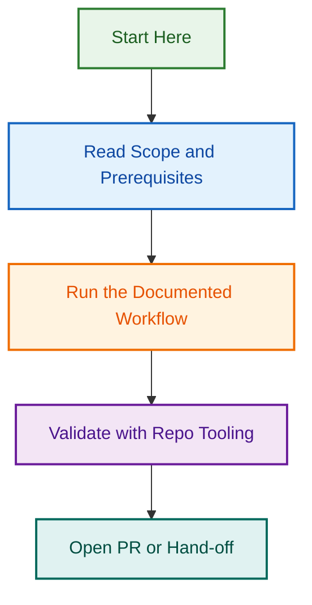

# Metrics Agent Specification — Phase 1

Comprehensive planning and specification for a universal metrics collection and reporting agent that works across the GitHub control plane and WordPress repository contexts.

## Overview

**Purpose:** Create a multi-context metrics agent that:

- Collects repository health metrics (issues, PRs, contributors, project health)
- Works in both GitHub control plane (`.github`) and WordPress plugin/theme repos
- Integrates with the Reporting agent for formatted output
- Includes comprehensive test coverage and documentation

**Target Repositories:**

- `.github` (LightSpeed control plane)
- WordPress block plugin repositories
- WordPress block theme repositories

**Deliverables:**

1. Agent specification (`metrics.agent.md` — v2.0)
2. Implementation plan with architecture diagrams
3. Test strategy and coverage plan
4. Documentation (user guide, API reference, configuration)
5. Example configurations per repo context

## Phase Timeline

| Phase | Deliverable | Target | Status |
|-------|-------------|--------|--------|
| **1** | Specification & Planning | 2026-08-12 | 🟡 In Progress |
| **2** | Implementation & Tests | 2026-08-26 | 🔵 Pending |
| **3** | Documentation & Examples | 2026-09-09 | 🔵 Pending |
| **4** | Integration & Rollout | 2026-09-23 | 🔵 Pending |

## Key Decisions

### Agent Architecture: Universal + Config-Driven

**Decision:** One metrics agent with repository-specific configurations

**Rationale:**

- Core metric collection logic is identical across contexts
- Differences are in what metrics are relevant per repo
- Reduces duplication and maintenance burden
- Easier to add new repo contexts in future

**Implementation:**

- Base agent in `.github/agents/metrics.agent.md`
- Configuration files in `.github/config/metrics/`:
  - `metrics.github-control-plane.config.json`
  - `metrics.wordpress-plugin.config.json`
  - `metrics.wordpress-theme.config.json`

### Integration with Reporting Agent

**Decision:** Metrics agent hands off to Reporting agent for formatting

**Flow:**

```
Metrics Agent
  ↓ collects & analyzes
Raw metrics dataset
  ↓ packages as handoff
Reporting Agent
  ↓ formats & stores
.github/reports/metrics/{filename}.md
```

## Related Issues

| Issue | Type | Purpose | Status |
|-------|------|---------|--------|
| [#1817](../../../issues/1817) | design | Linting Agent (related agent pattern) | 🔵 Open |
| [Metrics Epic](../../../issues) | epic | Master metrics initiative | 🔵 Planned |

## Files in This Project

```
.github/projects/active/metrics-agent-specification-2026-08-12/
├── README.md                    ← This file
├── SPECIFICATION.md             ← Agent specification & requirements
├── ARCHITECTURE.md              ← System design with diagrams
├── TEST_PLAN.md                 ← Testing strategy & coverage
├── IMPLEMENTATION_PLAN.md       ← Detailed implementation roadmap (open spec output)
├── CONFIGURATION_GUIDE.md       ← Config file documentation
└── EXAMPLES.md                  ← Example metrics & outputs
```

## Next Steps

1. ✅ Create active project folder
2. ⏳ Develop detailed specification (`SPECIFICATION.md`)
3. ⏳ Create architecture diagrams (`ARCHITECTURE.md`)
4. ⏳ Define test strategy (`TEST_PLAN.md`)
5. ⏳ Run open spec for implementation plan (`IMPLEMENTATION_PLAN.md`)
6. ⏳ Create configuration guide (`CONFIGURATION_GUIDE.md`)
7. ⏳ Add example outputs (`EXAMPLES.md`)

---

*Built by 🧱 LightSpeedWP with ☕, 🚀, and open-source spirit!*

## Visual Workflow


