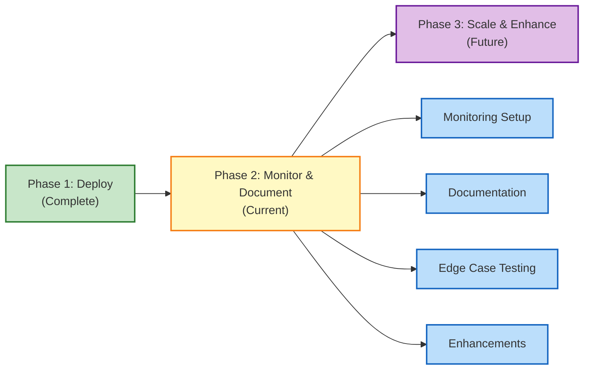

# Milestone Automation — Phase 2

## Project Status

🟡 **IN PROGRESS** — Phase 2 Follow-Up: Addressing CodeRabbit review findings before Phase 3 implementation.

**Status:** CodeRabbit Review Findings (10/28 resolved, 18 under investigation)  
**Progress:** 36% complete (10 critical/important/polish items merged)  
**Target Completion:** 2026-09-10  
**Current Branch:** `chore/phase-2-coderabbit-ci-integration`  
**Master Epic:** [#1240](https://github.com/lightspeedwp/.github/issues/1240) — Milestone Distribution Automation  
**Umbrella Issue:** [#1852](https://github.com/lightspeedwp/.github/issues/1852) — Phase 2 Final Validation & Merge Preparation

## Overview

Phase 2 of the milestone automation initiative focuses on:

1. **Operational readiness** — Monitoring workflow execution, handling failures, alerting
2. **Documentation** — Troubleshooting guides, runbooks, edge case handling
3. **Testing edge cases** — Validation against production scenarios
4. **Future enhancements** — Metrics dashboards, Slack notifications, manual triggers

This builds on Phase 1 (script and workflow deployment) which is already in production.

## Phase 1 Status (Complete)

✅ Scripts deployed:
- `scripts/automation/distribute-unallocated-milestones.js` — Allocate unallocated issues
- `scripts/automation/reassign-v1-to-v1-1.js` — Migrate milestones from v1 → v1.1

✅ GitHub Actions workflow created:
- `.github/workflows/milestone-distribution.yml` — Automated PR/issue milestone allocation

✅ Issue agent documentation updated

✅ PR #2465 merged to `develop`

✅ Workflow manually triggered for testing (Run #1)

## Key Components

### Documentation

- **README** — This overview document
- **PLANNING.md** — Objectives, phases, timeline, risks
- **ROADMAP.md** — Detailed roadmap with milestones
- **TROUBLESHOOTING.md** — Common failures and solutions
- **RUNBOOK.md** — Manual override procedures and operational tasks
- **OPENSPEC.md** — Technical specifications (generated)

### Planning Artifacts

- **Gantt Timeline** — Execution phases and dependencies
- **Dependency Graph** — Issue relationships and blocking factors
- **Risk Assessment** — Risk matrix with mitigation strategies

## Next Steps

1. **Monitor workflow execution** — Verify jobs complete, check Step Summary logs
2. **Create operational documentation** — Troubleshooting, runbook, edge case handling
3. **Set up monitoring** — Alerts, metrics, API rate limits
4. **Test edge cases** — Zero unallocated, 100+ issues, missing API key, dry-run
5. **Implement enhancements** — Metrics dashboard, Slack notifications, issue label triggers

## Related Documents

### Core Documentation

- [OPENSPEC.md](./OPENSPEC.md) — Technical specifications with Phase 2 progress
- [PLANNING.md](./PLANNING.md) — Strategic plan and phase timeline
- [ROADMAP.md](./ROADMAP.md) — Feature roadmap and dependencies
- [STATUS.md](./STATUS.md) — Completion evidence and metrics
- [TROUBLESHOOTING.md](./TROUBLESHOOTING.md) — Common failures and solutions
- [RUNBOOK.md](./RUNBOOK.md) — Operational procedures

### Phase 2 Follow-Up Tracking

- **[FOLLOW-UP-FIXES.md](./FOLLOW-UP-FIXES.md)** — 28-item CodeRabbit tracker with implementation plan
- **[ISSUE-LINKS.md](./ISSUE-LINKS.md)** — Central registry linking project to GitHub issues

### Design & Implementation

- [ENH-001-METRICS-DASHBOARD-DESIGN.md](./ENH-001-METRICS-DASHBOARD-DESIGN.md) — Metrics dashboard specification
- [ENH-002-SLACK-NOTIFICATIONS-DESIGN.md](./ENH-002-SLACK-NOTIFICATIONS-DESIGN.md) — Slack notifications design
- [ENH-003-MANUAL-TRIGGER-DESIGN.md](./ENH-003-MANUAL-TRIGGER-DESIGN.md) — Manual trigger system design
- [MON-001-WORKFLOW-ALERTS.md](./MON-001-WORKFLOW-ALERTS.md) — Workflow alert system
- [MON-002-RATE-LIMIT-MONITORING.md](./MON-002-RATE-LIMIT-MONITORING.md) — API rate limit monitoring
- [DOC-003-API-RATE-LIMITS-STRATEGY.md](./DOC-003-API-RATE-LIMITS-STRATEGY.md) — Rate limiting strategy

### Test Reports

- [TEST-001-ZERO-ISSUES-REPORT.md](./TEST-001-ZERO-ISSUES-REPORT.md) — Zero unallocated issues test
- [TEST-002-REPORT.md](./TEST-002-REPORT.md) — Large issue set test (100+ items)
- [TEST-003-API-KEY-FALLBACK-REPORT.md](./TEST-003-API-KEY-FALLBACK-REPORT.md) — API key fallback test
- [TEST-004-DRY-RUN-MODE-REPORT.md](./TEST-004-DRY-RUN-MODE-REPORT.md) — Dry-run mode validation

### Artifacts

- [ARTIFACTS.md](./ARTIFACTS.md) — Design artifacts and diagrams

## Visual Workflow

## Quick Links

| Link | Purpose |
|------|---------|
| [Epic #1240](https://github.com/lightspeedwp/.github/issues/1240) | Master epic tracking all work |
| [**FOLLOW-UP-FIXES.md**](./FOLLOW-UP-FIXES.md) | Phase 2 CodeRabbit tracker (28 items) |
| [**ISSUE-LINKS.md**](./ISSUE-LINKS.md) | Issue tracking & cross-project links |
| [OPENSPEC.md](./OPENSPEC.md) | Technical specifications + Phase 2 status |
| [STATUS.md](./STATUS.md) | Completion evidence & metrics |
| [PLANNING.md](./PLANNING.md) | Strategic planning & phases |
| [Workflow](.github/workflows/milestone-distribution.yml) | GitHub Actions workflow |
| [Scripts](scripts/automation/) | Automation scripts |

## 🔗 Related Issues

### Master Epic

| Issue | Title | Status |
|-------|-------|--------|
| [#1240](https://github.com/lightspeedwp/.github/issues/1240) | Milestone Distribution Automation | 🟢 Active |

### Phase 2 Issues (Current)

| Group | Issue | Title | Status |
|-------|-------|-------|--------|
| Monitoring | [#2558](https://github.com/lightspeedwp/.github/issues/2558) | MON-001: Set up GitHub Actions workflow alerts | ✅ Complete |
| Monitoring | [#2559](https://github.com/lightspeedwp/.github/issues/2559) | MON-002: Monitor GitHub API rate limits and quota | ✅ Complete |
| Monitoring | [#2560](https://github.com/lightspeedwp/.github/issues/2560) | MON-003: Create workflow execution dashboard | ✅ Complete |
| Documentation | [#2561](https://github.com/lightspeedwp/.github/issues/2561) | DOC-001: Create comprehensive troubleshooting guide | ✅ Complete |
| Documentation | [#2562](https://github.com/lightspeedwp/.github/issues/2562) | DOC-002: Create operational runbook with procedures | ✅ Complete |
| Documentation | [#2563](https://github.com/lightspeedwp/.github/issues/2563) | DOC-003: Document API rate limit handling strategy | ✅ Complete |
| Documentation | [#2564](https://github.com/lightspeedwp/.github/issues/2564) | DOC-004: Create edge case handling documentation | ✅ Complete |
| Testing | [#2565](https://github.com/lightspeedwp/.github/issues/2565) | TEST-001: Test workflow with zero unallocated issues | ✅ Complete |
| Testing | [#2566](https://github.com/lightspeedwp/.github/issues/2566) | TEST-002: Test workflow with large issue sets (100+) | ✅ Complete |
| Testing | [#2567](https://github.com/lightspeedwp/.github/issues/2567) | TEST-003: Test fallback when ANTHROPIC_API_KEY unavailable | ✅ Complete |
| Testing | [#2568](https://github.com/lightspeedwp/.github/issues/2568) | TEST-004: Validate dry-run mode operation | ✅ Complete |
| Enhancements | [#2569](https://github.com/lightspeedwp/.github/issues/2569) | ENH-001: Design metrics dashboard for milestone distribution | ✅ Complete |
| Enhancements | [#2571](https://github.com/lightspeedwp/.github/issues/2571) | ENH-002: Design Slack notification system | ✅ Complete |
| Enhancements | [#2572](https://github.com/lightspeedwp/.github/issues/2572) | ENH-003: Plan manual trigger system via issue labels/commands | ✅ Complete |

---

**Project Lead:** lightspeedwp/maintainers  
**Started:** 2026-08-29  
**Phase 2 Started:** 2026-09-02  
**Phase 2 Follow-Up Started:** 2026-09-03  
**Status:** 🟡 Active (Phase 2 Follow-Up)  
**Last Updated:** 2026-09-03  
**Target Completion:** 2026-09-10

**Key Tracking:**
- Progress: 36% (10/28 findings resolved)
- Branch: `chore/phase-2-coderabbit-ci-integration`
- PR: To be created
- Umbrella Issue: [#1852](https://github.com/lightspeedwp/.github/issues/1852)
