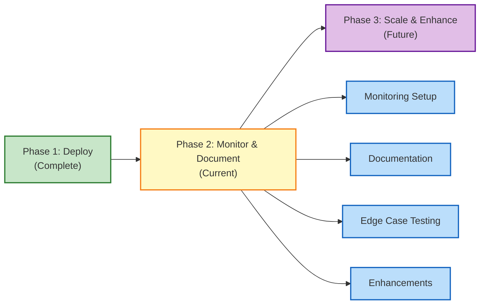

# Milestone Automation — Phase 2

## Project Status

🟢 **ACTIVE** — Planning, documentation, and operational setup in progress.

**Master Epic:** [#1240](https://github.com/lightspeedwp/.github/issues/1240) — Milestone Distribution Automation

## Overview

Phase 2 of the milestone automation initiative focuses on:

1. **Operational readiness** — Monitoring workflow execution, handling failures, alerting
2. **Documentation** — Troubleshooting guides, runbooks, edge case handling
3. **Testing edge cases** — Validation against production scenarios
4. **Future enhancements** — Metrics dashboards, Slack notifications, manual triggers

This builds on Phase 1 (script and workflow deployment) which is already in production.

## Phase 1 Status (Complete)

✅ Scripts deployed:
- `scripts/automation/distribute-unallocated-milestones.js` — Allocate unallocated issues
- `scripts/automation/reassign-v1-to-v1-1.js` — Migrate milestones from v1 → v1.1

✅ GitHub Actions workflow created:
- `.github/workflows/milestone-distribution.yml` — Automated PR/issue milestone allocation

✅ Issue agent documentation updated

✅ PR #2465 merged to `develop`

✅ Workflow manually triggered for testing (Run #1)

## Key Components

### Documentation

- **README** — This overview document
- **PLANNING.md** — Objectives, phases, timeline, risks
- **ROADMAP.md** — Detailed roadmap with milestones
- **TROUBLESHOOTING.md** — Common failures and solutions
- **RUNBOOK.md** — Manual override procedures and operational tasks
- **OPENSPEC.md** — Technical specifications (generated)

### Planning Artifacts

- **Gantt Timeline** — Execution phases and dependencies
- **Dependency Graph** — Issue relationships and blocking factors
- **Risk Assessment** — Risk matrix with mitigation strategies

## Next Steps

1. **Monitor workflow execution** — Verify jobs complete, check Step Summary logs
2. **Create operational documentation** — Troubleshooting, runbook, edge case handling
3. **Set up monitoring** — Alerts, metrics, API rate limits
4. **Test edge cases** — Zero unallocated, 100+ issues, missing API key, dry-run
5. **Implement enhancements** — Metrics dashboard, Slack notifications, issue label triggers

## Related Documents

- [PLANNING.md](./PLANNING.md) — Strategic plan and phase timeline
- [ROADMAP.md](./ROADMAP.md) — Feature roadmap and dependencies
- [TROUBLESHOOTING.md](./TROUBLESHOOTING.md) — Common failures and solutions
- [RUNBOOK.md](./RUNBOOK.md) — Operational procedures
- [OPENSPEC.md](./OPENSPEC.md) — Technical specifications

## Visual Workflow

## Quick Links

| Link | Purpose |
|------|---------|
| [Epic #1240](https://github.com/lightspeedwp/.github/issues/1240) | Master epic tracking all work |
| [PLANNING.md](./PLANNING.md) | Detailed planning document |
| [OPENSPEC.md](./OPENSPEC.md) | Technical specifications |
| [Workflow](.github/workflows/milestone-distribution.yml) | GitHub Actions workflow |
| [Scripts](scripts/automation/) | Automation scripts |

---

**Project Lead:** TBD  
**Started:** 2026-08-30  
**Status:** Active  
**Last Updated:** 2026-08-30
