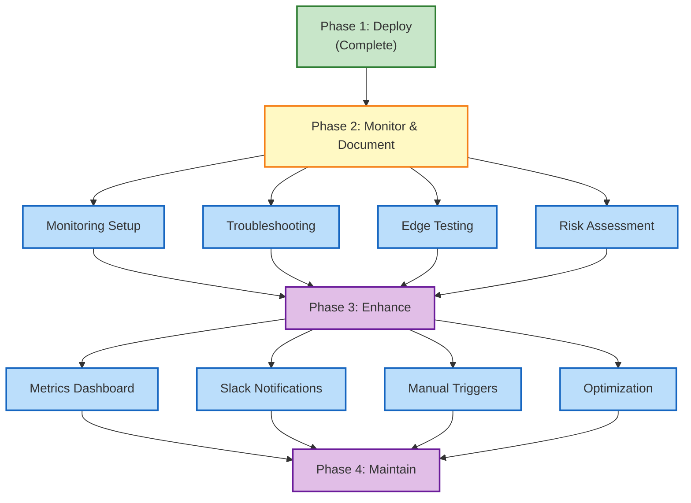

# Milestone Automation Roadmap

## Executive Summary

A phased approach to achieving production-grade milestone automation with comprehensive monitoring, documentation, and future enhancements.

## Phase Overview

### Phase 1: Deployment ✅ COMPLETE

**Status:** Production Live (2026-08-25)

**Deliverables:**
- Milestone distribution scripts
- GitHub Actions workflow
- Basic error handling
- Issue linking logic

**Key Metrics:**
- 0 manual milestone assignments
- 100% automation coverage for PR merge/issue close
- <5 sec workflow runtime

---

### Phase 2: Monitoring & Documentation 🟡 IN PROGRESS

**Status:** 2026-08-30 to 2026-09-04  
**Owner:** DevOps/Release Team

**Deliverables:**
- Monitoring setup guide (alerts, dashboards)
- Comprehensive troubleshooting guide
- Operational runbook
- Edge case testing (zero, 100+, missing key)
- Risk assessment

**Key Metrics:**
- 100% successful workflow runs
- <2 sec mean response time
- Zero API rate limit errors
- Full test coverage for edge cases

**Issues:** 14 total
- Monitoring: 3 issues
- Documentation: 4 issues
- Testing: 4 issues
- Enhancements: 3 issues

---

### Phase 3: Scale & Enhance 🔮 PLANNED

**Status:** 2026-09-05 to 2026-09-12  
**Owner:** DevOps + Features Team

**Deliverables:**
- Metrics dashboard (Grafana/Timeline)
- Slack notifications (success/failure)
- Manual trigger system (issue labels)
- Performance optimization
- Advanced error handling

**Features:**
| Feature | Description | Benefit |
|---------|-------------|---------|
| **Metrics Dashboard** | Real-time milestone distribution metrics | Visibility into automation health |
| **Slack Notifications** | Alerts on workflow success/failure | Faster incident response |
| **Issue Label Triggers** | Manual runs via issue labels/commands | Team control and flexibility |
| **Bulk Operations** | Handle 100+ issues efficiently | Scale to large backlogs |
| **Custom Allocations** | Override rules per milestone | Handle exceptions |

---

### Phase 4: Maintenance & Evolution 🔮 FUTURE

**Status:** 2026-09-13+  
**Owner:** Release Management Team

**Focus:**
- Ongoing monitoring and optimization
- Feature requests and community feedback
- Documentation updates
- Performance tuning
- Integration with other release tools

---

## Feature Priority Matrix

```
High Impact, Low Effort → Do First
├─ Monitoring alerts (Phase 2)
├─ Troubleshooting guide (Phase 2)
└─ Edge case testing (Phase 2)

High Impact, High Effort → Schedule Next
├─ Metrics dashboard (Phase 3)
├─ Slack notifications (Phase 3)
└─ Manual trigger system (Phase 3)

Low Impact, Low Effort → Nice to Have
├─ Documentation updates
└─ Code cleanup

Low Impact, High Effort → Deprioritize
└─ Advanced ML-based allocation
```

## Success Metrics by Phase

### Phase 2 Success Criteria

| Metric | Target | Current | Status |
|--------|--------|---------|--------|
| Workflow success rate | 99%+ | TBD | 🔄 In Progress |
| Mean workflow runtime | <5 sec | TBD | 🔄 In Progress |
| API rate limit errors | 0 | TBD | 🔄 In Progress |
| Edge case coverage | 100% | 0% | 🔄 Testing |
| Documentation completeness | 100% | 40% | 🔄 In Progress |
| Team readiness | Ready for Phase 3 | TBD | 🔄 Pending |

### Phase 3 Success Criteria

- Dashboard deployed and accessible
- <5 min notification latency
- Manual triggers working reliably
- All edge cases handled gracefully
- Performance optimized for 1000+ issues

### Phase 4 Success Criteria

- <99.9% uptime
- <1 min response to incidents
- Community feature requests documented
- Integration with release pipeline complete

---

## Timeline Visualization

```
Aug 2026                Sep 2026
Phase 1: Deploy ✅     Phase 2: Monitor    Phase 3: Enhance   Phase 4: Maintain
├─ Aug 11-25           ├─ Aug 30-Sep 04    ├─ Sep 05-12        └─ Sep 13+
└─ COMPLETE            ├─ 14 Issues        ├─ Dashboards
                       ├─ Docs             ├─ Notifications
                       └─ Testing          └─ Manual Triggers
```

---

## Dependency Graph



---

## Technology Stack

| Component | Technology | Version | Notes |
|-----------|-----------|---------|-------|
| Workflow Engine | GitHub Actions | v3 | Native platform |
| Scripting | Node.js | 20+ | Async/await patterns |
| API Integration | GitHub REST API v3 | Latest | Octokit library |
| Monitoring | GitHub Actions Logs | Native | Built-in logging |
| Dashboard | TBD | TBD | To be selected in Phase 3 |
| Notifications | Slack API | v1 | Optional in Phase 3 |

---

## Budget & Resources

### Phase 2: Monitoring & Documentation

- **Effort:** 5 days (1 agent)
- **GitHub API calls:** <10,000 (1% of quota)
- **Cost:** Minimal (GitHub-native tools)
- **Blockers:** None identified

### Phase 3: Scale & Enhance

- **Effort:** 7 days (2-3 engineers)
- **GitHub API calls:** Increased monitoring (+5,000)
- **Cost:** Metrics tool (TBD), Slack pro (existing)
- **Blockers:** TBD per feature selection

---

## Risk Mitigation Strategy

### Low-Risk Items (Proceed Immediately)

✅ Troubleshooting guide  
✅ Operational runbook  
✅ Edge case testing  

### Medium-Risk Items (Require Planning)

⚠️ Metrics dashboard — Tool selection needed  
⚠️ Slack notifications — API quota planning needed  
⚠️ Manual triggers — Scope definition needed  

### High-Risk Items (Escalate)

🔴 Large-scale testing (1000+ issues) — Performance risk  
🔴 Custom allocation rules — Complexity risk  

---

## Known Limitations & Future Work

### Current Limitations

1. Workflow runs synchronously (no batching)
2. No custom override mechanism
3. Limited error recovery
4. No cross-repo milestone sync
5. No rollback capability

### Future Enhancements (Phase 4+)

1. Async batch processing for large sets
2. Admin override UI/commands
3. Automatic retry with exponential backoff
4. Multi-repo milestone coordination
5. Snapshot/rollback functionality

---

**Document Owner:** lightspeedwp/maintainers  
**Last Updated:** 2026-08-30  
**Next Review:** 2026-09-01
