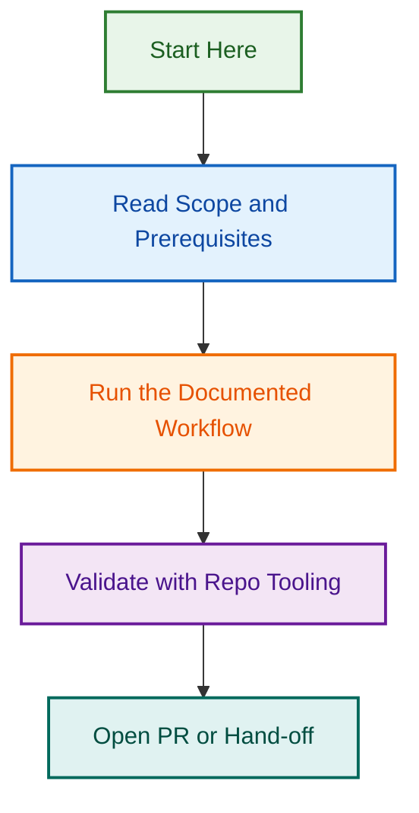

# Milestone Planning v1

## Project Status

🟡 **ACTIVE** — Roadmap development and planning in progress.

## Overview

Strategic planning initiative for project milestones and release cycles. Establishes clear roadmap and delivery timeline for upcoming work.

## Key Components

- **Roadmap Definition** — High-level project roadmap with phases and deliverables
- **Milestone Planning** — Detailed milestone definitions and success criteria
- **Release Coordination** — Integration with release management workflows
- **Timeline Visualization** — Visual representation of project timeline

## Related Documents

- See `ROADMAP.md` for detailed roadmap
- See `ROADMAP_VISUAL.md` for visual timeline

## Next Steps

- Finalize milestone definitions
- Coordinate with team leads
- Establish release schedule
- Set up tracking and monitoring

---

**Project Lead:** TBD  
**Started:** 2026-08-05  
**Status:** Active  
**Last Updated:** 2026-08-06

## Related Issues

This project is coordinated with:

- [#1733](https://github.com/lightspeedwp/.github/issues/1733) — Phase 2: Folder Structure & Linking

See [Linking Standard](https://github.com/lightspeedwp/.github/blob/develop/.github/projects/active/reports-projects-restructuring-2026-08-11/LINKING_STANDARD.md) for linking patterns.
## Visual Workflow

