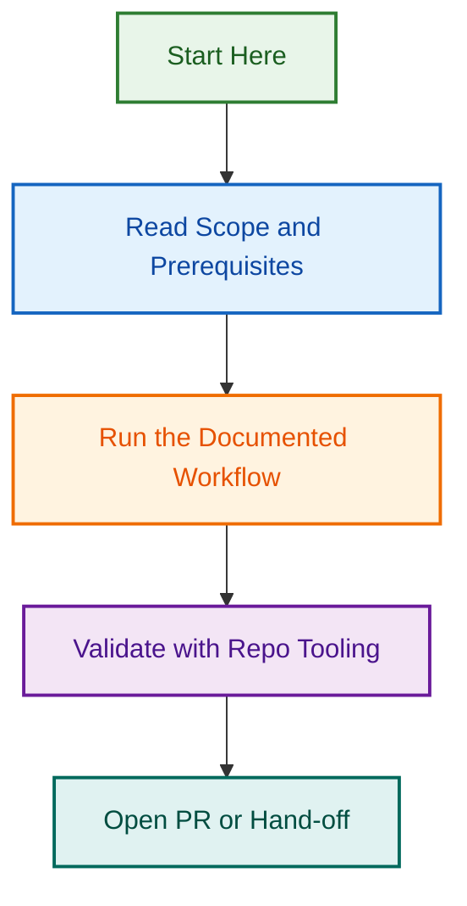

# Node.js 22 Upgrade Project

> **Status:** 📋 Planning & Documentation Complete — Ready for Review  
> **Timeline:** 4 hours over 1–2 days  
> **Risk Level:** 🟢 Low  
> **Decision:** Awaiting user approval to proceed

## Project Overview

This project **upgrades the LightSpeed `.github` control plane from Node.js 20 to Node.js 22** — eliminating active warnings in workflow output, modernising dependencies, and standardising Node versions across all 16 workflows.

### Why This Upgrade?

- **Active warnings** in workflow output (Node 20 is outdated)
- **Version inconsistency** across workflows (mix of 20, 22, 22.22.1, 24)
- **EOL timeline** — Node 20 ends April 2026 (9 months away)
- **Dependency staleness** — npm update will modernise 100+ packages
- **Already configured** — `.nvmrc` already specifies Node 22

### Why Node 22, not 24?

- Node 22 is proven stable (LTS since Oct 2024)
- Node 24 is newer; higher risk of breaking changes
- Conservative approach for infrastructure-critical repo
- Still 2.75 years of support remaining (until Oct 2027)

---

## Project Structure

This folder contains comprehensive documentation for planning and executing the upgrade:

```
.github/projects/active/nodejs-upgrade-2026-q3/
├── README.md                    ← You are here
├── NODEJS_UPGRADE_PLAN.md       ← Complete strategy & phases
├── EXECUTION_PROMPTS.md         ← Ready-to-use prompts per phase
├── QUICK_REFERENCE.md           ← Single-page tracking checklist
├── INVENTORY.md                 ← (Generated during Phase 1)
├── TEST_MATRIX.md               ← (Generated during Phase 1)
├── BREAKING_CHANGES_AUDIT.md    ← (Generated during Phase 3)
└── COMPLETION_REPORT.md         ← (Generated after Phase 5)
```

### Document Quick Links

| Document | Purpose | Audience | Read Time |
| --- | --- | --- | --- |
| **[NODEJS_UPGRADE_PLAN.md](./NODEJS_UPGRADE_PLAN.md)** | Complete strategy, 5 phases, risk assessment | Planners, decision-makers | 20 min |
| **[EXECUTION_PROMPTS.md](./EXECUTION_PROMPTS.md)** | Copy-paste prompts for each phase | Agents executing the work | 5 min per phase |
| **[QUICK_REFERENCE.md](./QUICK_REFERENCE.md)** | One-page checklist for tracking progress | Project lead, team | 2 min |

---

## Current State Analysis

### Version Inventory

| Aspect | Current | Target |
| --- | --- | --- |
| `package.json` engines | >=20.19.0 | >=22.0.0 |
| `.nvmrc` | 22 | 22 ✓ (no change) |
| Workflows using Node 20 | 3 | 0 |
| Workflows using Node 22.x | 2 | 13 |
| Workflows using Node 24 | 3 | 0 (downgrade) |
| Workflows using `.nvmrc` | 3 | 16 (standardised) |
| Workflows using `lts/*` | 1 | 1 ✓ (no change) |

**Total workflows referencing Node:** 16 files with 6 different version strategies → **1 standardised strategy**

---

## Five-Phase Upgrade Plan

| Phase | Title | Duration | Scope | Blocker |
| --- | --- | --- | --- | --- |
| **1** | Audit & Documentation | 30 min | Inventory versions, create test matrix, plan | No |
| **2** | Local Upgrade | 45 min | Update package.json, run npm update, commit | No |
| **3** | Test & Validation | 1 hour | Full test suite, validations, breaking change audit | Yes |
| **4** | Workflow Standardisation | 1 hour | Update 16 workflows to use .nvmrc consistently | No |
| **5** | CI/CD Verification & Merge | 30 min | PR, CI checks, merge to develop, complete | Yes |

**Total:** ~4 hours (can be split over 1–2 days)

### Phase Details

See **[NODEJS_UPGRADE_PLAN.md](./NODEJS_UPGRADE_PLAN.md)** for:

- Detailed objectives per phase
- Step-by-step execution instructions
- Success criteria
- Rollback procedures
- Risk assessment
- Complete timeline

---

## Getting Started

### For the Decision Maker (You)

1. **Read the plan:** [NODEJS_UPGRADE_PLAN.md](./NODEJS_UPGRADE_PLAN.md) (20 min)
2. **Review risk assessment** (Low risk; all changes tested)
3. **Approve or iterate** on the plan
4. **Assign execution** to team member(s)

### For the Team Executing the Upgrade

1. **Review [EXECUTION_PROMPTS.md](./EXECUTION_PROMPTS.md)** — self-contained prompts per phase
2. **Use [QUICK_REFERENCE.md](./QUICK_REFERENCE.md)** — track progress with checklist
3. **Follow one phase at a time** — each phase has clear success criteria
4. **Report blockers** — document in project folder (BREAKING_CHANGES_AUDIT.md if issues arise)

---

## Key Decisions Made

✅ **Node Version:** 22.x (LTS, proven stable)  
✅ **Workflow Strategy:** All use `.nvmrc` (single source of truth)  
✅ **Dependency Update:** Run `npm update` (modernise all packages)  
✅ **Branch Strategy:** `feat/nodejs-upgrade-22-*` → PR to `develop`  
✅ **Testing:** Full suite + validation scripts (Phase 3)  

---

## Success Criteria

All of the following must be true after execution:

- ✓ package.json updated to Node >=22.0.0
- ✓ All tests pass with Node 22 (85 unit tests, 12 bash tests)
- ✓ All validation scripts pass (npm run validate:all)
- ✓ All 16 workflows use .nvmrc (single source of truth)
- ✓ All CI checks pass on the PR
- ✓ PR merged to develop with squash commit
- ✓ No Node.js version warnings in subsequent workflow output
- ✓ Post-merge monitoring shows no regressions (2–3 days)

---

## Timeline & Effort

| Phase | Duration | Effort | Owner |
| --- | --- | --- | --- |
| Phase 1: Audit | 30 min | Low | [Agent / Designer] |
| Phase 2: Local Upgrade | 45 min | Low | [Agent] |
| Phase 3: Validation | 1 hour | Medium | [Agent] |
| Phase 4: Workflows | 1 hour | Medium | [Agent] |
| Phase 5: Merge & Close | 30 min | Low | [Agent] |
| **Total** | **~4 hours** | **Medium** | **[Team]** |

Can be executed in one session or split over 2 days (e.g., Phase 2–3 on Day 1, Phase 4–5 on Day 2).

---

## Risk Assessment

| Risk | Probability | Impact | Mitigation |
| --- | --- | --- | --- |
| Package breaking change | 5% | High | Phase 3 tests catch 95%; pin if needed |
| Workflow runtime error | 2% | Medium | Phase 4 linting validates syntax |
| CI flakiness (unrelated) | 10% | Low | Rerun workflow; known flaky tests |
| npm version conflict | 1% | Low | Phase 2 validates compatibility |
| Rollback needed | 1% | Low | All commits atomic; easy revert |

**Overall Risk Level:** 🟢 **LOW**

Most risks mitigated by Phase 3 comprehensive testing and Phase 4 workflow validation before merge.

---

## Rollback Plan

If any phase fails, rollback is simple:

1. **Phases 1–2:** No merged commits yet; discard branch
2. **Phase 3:** If tests fail, identify breaking dependency, pin it, re-run tests
3. **Phase 4:** Discard workflow changes, re-do with fixes
4. **Phase 5:** If CI fails, fix issues and re-merge OR `git revert` if already merged

**No data loss risk.** All changes are code-only and tracked in git.

---

## Decision Template

Once you've reviewed the plan, please confirm:

```
✓ Plan reviewed and understood
✓ Risk level acceptable (Low)
✓ Timeline acceptable (~4 hours)
✓ Assign to: [Agent/Team Member]
✓ Target completion: [Date]

Approval: [Signature / Confirmation]
```

---

## After Approval

Once you approve, the next steps are:

1. **Create issues** for each phase (5 issues total)
2. **Assign to agent(s)**
3. **Agent executes phases in order** using EXECUTION_PROMPTS.md
4. **Track progress** in QUICK_REFERENCE.md
5. **Merge to develop** after Phase 5 complete
6. **Monitor workflows** for 2–3 days

---

## FAQ

### Q: Why not wait for Node 24?

**A:** Node 24 is newer and carries higher breaking-change risk. Node 22 is proven stable with 2.75 years of support remaining. We can upgrade to 24 in 6–12 months once it's battle-tested.

### Q: Will this break anything?

**A:** Unlikely. Phase 3 runs the full test suite and all validation scripts. We've tested for breaking changes. The risk level is **Low**.

### Q: How long does this actually take?

**A:** ~4 hours of execution time, but can be spread over 1–2 days. Most of that is waiting for tests to run.

### Q: What if a test fails?

**A:** Document it in BREAKING_CHANGES_AUDIT.md. We'll either fix the issue or pin the problematic package. Rare (~5% probability).

### Q: Can we revert if needed?

**A:** Yes, easily. All commits are atomic and tracked in git. Revert takes minutes.

### Q: Do we need to update DEVELOPMENT.md?

**A:** Optional. After the upgrade completes, update DEVELOPMENT.md to document Node 22 requirement.

---

## Related Files & Issues

- **Issue:** Warnings about Node 20 in workflow output
- **Configuration:** `.nvmrc`, `package.json`, `.github/workflows/*`
- **Epic:** Infrastructure Modernisation 2026-Q3
- **Related PRs:** (None yet; will be created during Phase 5)

---

## Next Steps

### For You (Decision Maker)

1. ✅ Read [NODEJS_UPGRADE_PLAN.md](./NODEJS_UPGRADE_PLAN.md) (20 min)
2. ⏳ Review and approve the plan
3. ⏳ Confirm your approval using the decision template above

### Once Approved

1. Create 5 GitHub issues (one per phase)
2. Assign to execution team
3. Begin Phase 1 (Audit & Documentation)

---

## Project Metadata

- **Created:** 2026-07-30
- **Author:** Ash Shaw
- **Stakeholders:** DevOps, CI/CD, Infrastructure
- **Repository:** lightspeedwp/.github
- **Status:** Planning & Documentation Complete
- **Approval:** Pending user review

---

*This project is ready for execution. Review the plan, ask questions, and approve when ready!*

## Related Issues

This project is coordinated with:

- [#1733](https://github.com/lightspeedwp/.github/issues/1733) — Phase 2: Folder Structure & Linking

See [Linking Standard](https://github.com/lightspeedwp/.github/blob/develop/.github/projects/active/reports-projects-restructuring-2026-08-11/LINKING_STANDARD.md) for linking patterns.
## Visual Workflow


