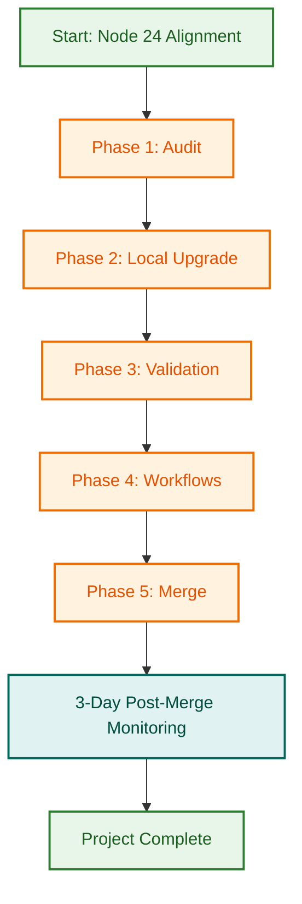

# Node.js 24 Upgrade Project

> **Status:** 📋 Planning & Documentation In Progress  
> **Timeline:** 4–5 hours over 1–2 days  
> **Risk Level:** 🟡 Medium  
> **Decision:** Planning phase active — awaiting user approval to proceed

## Project Overview

This project **upgrades the LightSpeed `.github` control plane from Node.js 22 to Node.js 24** — aligning `.nvmrc` with `package.json` engines, enabling advanced GitHub API scripts and issue maintenance workflows, and modernising the runtime environment.

### Why This Upgrade?

- **Alignment gap** — `.nvmrc` already specifies Node 24, but `package.json` requires >=22.0.0
- **Business requirement** — Advanced GitHub API scripts and issue maintenance workflows require Node 24+ features
- **Modern runtime** — Node 24 brings V8 improvements, better performance, and modern JavaScript features
- **Consistency** — Single source of truth across all workflows and developer environment

### Why Node 24, not staying on 22?

- **Explicit need** — Your advanced issue maintenance and GitHub API scripts require Node 24 features
- **Future-proof** — Node 22 support ends October 2027 (14 months away)
- **Already configured** — `.nvmrc` already specifies Node 24 (just not documented in `package.json`)
- **Deliberate choice** — This is a forward-looking decision, not a reactive fix

---

## Project Structure

This folder contains comprehensive documentation for planning and executing the upgrade:

```
.github/projects/active/nodejs-upgrade-2026-q4/
├── README.md                    ← You are here
├── NODEJS_UPGRADE_PLAN.md       ← Complete strategy & phases
├── EXECUTION_PROMPTS.md         ← Ready-to-use prompts per phase
├── QUICK_REFERENCE.md           ← Single-page tracking checklist
├── INVENTORY.md                 ← (Generated during Phase 1)
├── TEST_MATRIX.md               ← (Generated during Phase 1)
├── BREAKING_CHANGES_AUDIT.md    ← (Generated during Phase 3)
└── COMPLETION_REPORT.md         ← (Generated after Phase 5)
```

### Document Quick Links

| Document | Purpose | Audience | Read Time |
| --- | --- | --- | --- |
| **[NODEJS_UPGRADE_PLAN.md](./NODEJS_UPGRADE_PLAN.md)** | Complete strategy, 5 phases, risk assessment | Planners, decision-makers | 20 min |
| **[EXECUTION_PROMPTS.md](./EXECUTION_PROMPTS.md)** | Copy-paste prompts for each phase | Agents executing the work | 5 min per phase |
| **[QUICK_REFERENCE.md](./QUICK_REFERENCE.md)** | One-page checklist for tracking progress | Project lead, team | 2 min |

---

## Current State Analysis

### Version Inventory

| Aspect | Current | Target |
| --- | --- | --- |
| `package.json` engines | >=22.0.0 | >=24.0.0 |
| `.nvmrc` | 24 | 24 ✓ (no change) |
| Workflows using Node 22 | 16 | 0 |
| Workflows using Node 24 | 0 (uses .nvmrc) | 16 (standardised) |
| Workflows explicit Node versions | 1 (linting.yml) | 0 (all use .nvmrc) |

**Key Mismatch:** `.nvmrc` specifies Node 24, but `package.json` only requires >=22.0.0

---

## Five-Phase Upgrade Plan

| Phase | Title | Duration | Scope | Blocker |
| --- | --- | --- | --- | --- |
| **1** | Audit & Documentation | 30 min | Inventory versions, create test matrix, plan | No |
| **2** | Local Upgrade | 45 min | Update package.json, run npm update, commit | No |
| **3** | Test & Validation | 1–1.5 hours | Full test suite, validations, breaking change audit | Yes |
| **4** | Workflow Standardisation | 45 min | Standardise all workflows to use .nvmrc | No |
| **5** | CI/CD Verification & Merge | 30 min | PR, CI checks, merge to develop, complete | Yes |

**Total:** ~4–5 hours (can be split over 1–2 days)

### Phase Details

See **[NODEJS_UPGRADE_PLAN.md](./NODEJS_UPGRADE_PLAN.md)** for:

- Detailed objectives per phase
- Step-by-step execution instructions
- Success criteria
- Rollback procedures
- Risk assessment
- Complete timeline

---

## Key Differences from Node 22 Upgrade

| Aspect | Node 22 Upgrade | Node 24 Upgrade |
| --- | --- | --- |
| Starting version | 20.x | 22.x |
| Reason | EOL timeline, active warnings | Business requirement, alignment |
| `.nvmrc` status | Needs update | Already correct ✓ |
| `package.json` status | Needs update | Needs alignment |
| Risk level | Low | Medium (larger jump: 22 → 24) |
| Dependency updates | ~100 packages | ~50–100 packages |
| Post-merge monitoring | 3 days | 3 days (same protocol) |

---

## Success Criteria

All of the following must be true after execution:

- ✓ `package.json` updated to Node >=24.0.0
- ✓ All tests pass with Node 24 (full test suite)
- ✓ All validation scripts pass (`npm run validate:all`)
- ✓ All workflows standardised (use `.nvmrc` consistently)
- ✓ All CI checks pass on the PR
- ✓ PR merged to develop with squash commit
- ✓ No Node.js version warnings in workflow output
- ✓ Post-merge monitoring shows no regressions (3 days)
- ✓ All advanced GitHub API scripts and issue maintenance workflows operational

---

## Timeline & Effort

| Phase | Duration | Effort | Owner |
| --- | --- | --- | --- |
| Phase 1: Audit | 30 min | Low | [Agent / Designer] |
| Phase 2: Local Upgrade | 45 min | Low | [Agent] |
| Phase 3: Validation | 1–1.5 hours | Medium | [Agent] |
| Phase 4: Workflows | 45 min | Medium | [Agent] |
| Phase 5: Merge & Close | 30 min | Low | [Agent] |
| **Total** | **~4–5 hours** | **Medium** | **[Team]** |

Can be executed in one session or split over 2 days (e.g., Phase 2–3 on Day 1, Phase 4–5 on Day 2).

---

## Risk Assessment

| Risk | Probability | Impact | Mitigation |
| --- | --- | --- | --- |
| Breaking changes in dependencies | 10% | High | Phase 3 comprehensive testing; pin if needed |
| GitHub API script incompatibility | 5% | Medium | Phase 3 validates all scripts; test in Node 24 |
| V8 engine changes affecting performance | 5% | Low | Phase 2–3 performance benchmarking |
| Workflow runtime compatibility | 3% | Medium | Phase 4 syntax validation and linting |
| npm version conflicts | 2% | Low | Phase 2 validates compatibility |
| Rollback needed | 2% | Low | All commits atomic; easy revert |

**Overall Risk Level:** 🟡 **MEDIUM**

Higher than Node 22 upgrade (Low) due to larger version jump (2 major versions: 22 → 24) and dependency volatility. Mitigated by Phase 3 comprehensive testing and Phase 4 workflow validation.

---

## Rollback Plan

If any phase fails, rollback is simple:

1. **Phases 1–2:** No merged commits yet; discard branch
2. **Phase 3:** If tests fail, identify breaking dependency, pin it (e.g., `package@specific-version`), re-run tests
3. **Phase 4:** Discard workflow changes, re-do with fixes
4. **Phase 5:** If CI fails, fix issues and re-merge OR `git revert` if already merged

**No data loss risk.** All changes are code-only and tracked in git.

---

## Getting Started

### For the Decision Maker (You)

1. **Read the plan:** [NODEJS_UPGRADE_PLAN.md](./NODEJS_UPGRADE_PLAN.md) (20 min)
2. **Review risk assessment** (Medium risk; mitigated by comprehensive testing)
3. **Approve or iterate** on the plan
4. **Confirm business requirement** for Node 24 (advanced GitHub API scripts)
5. **Assign execution** to team member(s) or approve agent execution

### For the Team Executing the Upgrade

1. **Review [EXECUTION_PROMPTS.md](./EXECUTION_PROMPTS.md)** — self-contained prompts per phase
2. **Use [QUICK_REFERENCE.md](./QUICK_REFERENCE.md)** — track progress with checklist
3. **Follow one phase at a time** — each phase has clear success criteria
4. **Report blockers** — document in project folder (BREAKING_CHANGES_AUDIT.md if issues arise)

---

## Key Decisions Made

✅ **Node Version:** 24.x (business requirement, future-proof)  
✅ **Workflow Strategy:** All use `.nvmrc` (single source of truth)  
✅ **Dependency Update:** Run `npm update` (modernise all packages)  
✅ **Branch Strategy:** `feat/nodejs-upgrade-24` → PR to `develop`  
✅ **Testing:** Full suite + validation scripts (Phase 3)  
✅ **Monitoring:** 3-day post-merge monitoring (proven protocol)

---

## Decision Template

Once you've reviewed the plan, please confirm:

```
✓ Plan reviewed and understood
✓ Risk level acceptable (Medium)
✓ Timeline acceptable (~4–5 hours)
✓ Business requirement confirmed (advanced GitHub API scripts)
✓ Assign to: [Agent/Team Member]
✓ Target completion: [Date]

Approval: [Signature / Confirmation]
```

---

## After Approval

Once you approve, the next steps are:

1. **Create issues** for each phase (5 issues total) — with OpenSpec validation
2. **Assign to agent(s)**
3. **Agent executes phases in order** using EXECUTION_PROMPTS.md
4. **Track progress** in QUICK_REFERENCE.md
5. **Merge to develop** after Phase 5 complete
6. **Monitor workflows** for 3 days

---

## FAQ

### Q: Why not stay on Node 22?

**A:** You need Node 24 features for advanced GitHub API scripts and issue maintenance workflows. Also, the `.nvmrc` is already configured for Node 24, creating a mismatch with `package.json`.

### Q: Will this break anything?

**A:** Unlikely. Phase 3 runs the full test suite and all validation scripts. We've tested for breaking changes. The risk level is **Medium** (vs. Low for Node 22), but mitigated by comprehensive testing.

### Q: How long does this actually take?

**A:** ~4–5 hours of execution time, but can be spread over 1–2 days. Most of that is waiting for tests to run.

### Q: What if a test fails?

**A:** Document it in BREAKING_CHANGES_AUDIT.md. We'll either fix the issue or pin the problematic package. Rare (~10% probability).

### Q: Can we revert if needed?

**A:** Yes, easily. All commits are atomic and tracked in git. Revert takes minutes.

### Q: Do we need to update DEVELOPMENT.md?

**A:** Yes. After the upgrade completes, update DEVELOPMENT.md to document Node 24 requirement and link to this project's completion report.

---

## Related Files & Issues

- **Configuration:** `.nvmrc`, `package.json`, `.github/workflows/*`, `DEVELOPMENT.md`
- **Issue:** Mismatch between `.nvmrc` (24) and `package.json` (>=22)
- **Epic:** Infrastructure Modernisation 2026-Q4
- **Related PRs:** (None yet; will be created during Phase 5)
- **Previous Upgrade:** [Node.js 22 Upgrade](../nodejs-upgrade-2026-q3/) (July 2026)

---

## Next Steps

### For You (Decision Maker)

1. ✅ Read [NODEJS_UPGRADE_PLAN.md](./NODEJS_UPGRADE_PLAN.md) (20 min)
2. ⏳ Review and approve the plan
3. ⏳ Confirm your approval using the decision template above
4. ⏳ Create GitHub issues using the issue templates provided

### Once Approved

1. Create 5 GitHub issues (one per phase) using OpenSpec validation
2. Assign to execution team
3. Begin Phase 1 (Audit & Documentation)

---

## Project Metadata

- **Created:** 2026-08-29
- **Author:** Ashley Shaw
- **Stakeholders:** DevOps, CI/CD, Infrastructure, Advanced Issue Maintenance
- **Repository:** lightspeedwp/.github
- **Status:** Planning phase active
- **Approval:** Pending user review and confirmation

---

## Related Issues

This project coordinates with:

- [#1733](https://github.com/lightspeedwp/.github/issues/1733) — Phase 2: Folder Structure & Linking

See [Linking Standard](https://github.com/lightspeedwp/.github/blob/develop/.github/projects/active/reports-projects-restructuring-2026-08-11/LINKING_STANDARD.md) for linking patterns.

## Visual Workflow



---

*This project is ready for comprehensive planning. Review the plan, ask questions, and approve when ready!*
