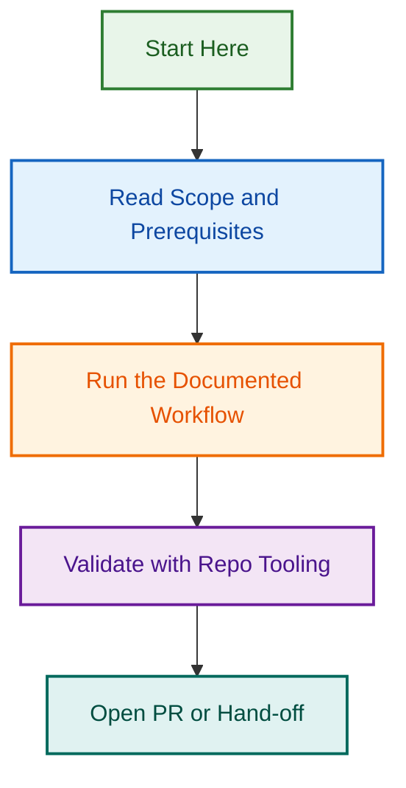

# OpenSpec Labels Automation

**Project Status:** 🟡 **Phase 2–3 Active**  
**Start Date:** 2026-08-18  
**Phases:** Template Validation (✅), Workflow Orchestration (🟡), Jira/Linear Integration (📋)

## Overview

OpenSpec Labels Automation implements an automated GitHub issue template system with Definition of Ready (DoR) and Definition of Done (DoD) injection. This project standardizes issue lifecycle management across 17 issue types with automated template validation, batch processing, and extensible workflow orchestration.

### Key Capabilities

✅ **Phase 2 Complete (2026-08-18)**
- 17 issue-type-specific DoR/DoD templates
- 85 comprehensive checklist items
- Batch validation & injection (300+ issues)
- Dry-run mode for safe testing
- 100% test coverage (43 tests passing)

🟡 **Phase 3 In Planning**
- Workflow orchestration framework
- Phase transition gates
- CI/CD pipeline integration
- Monitoring & alerts

## Project Structure

```
.github/projects/active/openspec-labels-automation-2026-08-18/
├── README.md                          ← You are here
├── PLANNING.md                        ← Detailed roadmap & phases
├── PHASE-2-SUMMARY.md                 ← Phase 2 deliverables
├── PHASE-3-HANDOFF.md                 ← Phase 3 planning
├── PHASE-2-SUMMARY-operations.md      ← Backup (legacy)
└── PHASE-3-HANDOFF-operations.md      ← Backup (legacy)
```

## Implementation Files

**Core Implementation:**
- `scripts/automation/dor-dod-templates.js` — 17 template definitions (85 items)
- `scripts/automation/validate-inject-dor-dod.js` — Validation & injection engine
- `scripts/automation/__tests__/dor-dod-validation.test.js` — Test suite (43 tests)

## Phases & Timeline

| Phase | Focus | Status | Dates |
|-------|-------|--------|-------|
| **Phase 2** | Template Validation & Injection | ✅ Complete | 2026-08-18 |
| **Phase 3** | Workflow Orchestration | 🟡 Planning | 2026-08-20–09-01 |
| **Phase 4** | External Tool Integration | 📋 Deferred | TBD |

## Deliverables

### Phase 2 ✅
- ✅ DoR/DoD templates for all 17 issue types
- ✅ Batch validation system (configurable limits)
- ✅ Dry-run mode with safe testing
- ✅ 43 tests, 100% passing, full coverage
- ✅ Helper functions (detect, retrieve, validate)

### Phase 3 🟡
- [ ] Workflow orchestrator
- [ ] Phase transition gates
- [ ] CI/CD integration
- [ ] Monitoring dashboard

### Phase 4 📋
- [ ] Jira integration
- [ ] Linear integration
- [ ] Multi-platform sync
- [ ] Unified reporting

## Related Issues

This project is coordinated with GitHub issues for tracking work items and progress.

| Issue | Type | Purpose | Status |
|-------|------|---------|--------|
| [#2048](../../../issues/2048) | epic | OpenSpec Labels Automation — Phase 2–3 Epic | 🟡 In Progress |
| [#2049](../../../issues/2049) | task | Phase 3: Workflow Orchestration | 📋 Planned |

*To link issues, see [LINKING_STANDARD.md](../reports-projects-restructuring-2026-08-11/LINKING_STANDARD.md)*

## Quick Start

### View Templates
```bash
node scripts/automation/dor-dod-templates.js --list
```

### Validate Issues (Dry Run)
```bash
node scripts/automation/validate-inject-dor-dod.js --dry-run --verbose
```

### Run Tests
```bash
npm test -- scripts/automation/__tests__/dor-dod-validation.test.js
```

## Documentation

- [PLANNING.md](./PLANNING.md) — Detailed roadmap, phases, and success metrics
- [PHASE-2-SUMMARY.md](./PHASE-2-SUMMARY.md) — Phase 2 completion summary
- [PHASE-3-HANDOFF.md](./PHASE-3-HANDOFF.md) — Phase 3 planning & requirements

## Success Metrics

| Metric | Target | Current |
|--------|--------|---------|
| Template Coverage | 100% | ✅ 17/17 (100%) |
| Test Coverage | ≥85% | ✅ 100% |
| Phase 2 Completion | 2026-08-18 | ✅ Complete |

## Team

- **Lead:** Claude (AI Agent)
- **Testing:** Jest-based unit tests (43 tests)
- **Maintenance:** Ongoing per OpenSpec lifecycle

---

**For full project details, see [PLANNING.md](./PLANNING.md) or the phase documentation files.**
## Visual Workflow


