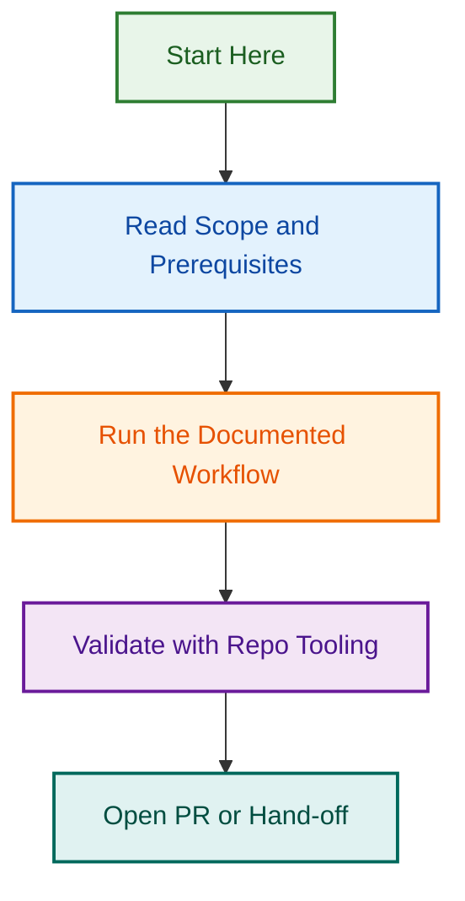

# OpenSpec Labels Automation

**Project Status:** ✅ **Phase 3 Complete**  
**Start Date:** 2026-08-18  
**Completion Date:** 2026-08-20  
**Phases:** Template Validation (✅ Complete), Workflow Orchestration (✅ Complete), Jira/Linear Integration (📋 Planned)

## Overview

OpenSpec Labels Automation implements an automated GitHub issue template system with Definition of Ready (DoR) and Definition of Done (DoD) injection, combined with event-driven workflow orchestration and automated phase progression. This project standardizes issue lifecycle management across 17 issue types with automated template validation, batch processing, and extensible workflow orchestration.

### Key Capabilities

✅ **Phase 2 Complete (2026-08-18)**
- 17 issue-type-specific DoR/DoD templates
- 85 comprehensive checklist items
- Batch validation & injection (300+ issues)
- Dry-run mode for safe testing
- 100% test coverage (43 tests passing)

✅ **Phase 3 Complete (2026-08-20)**
- Event-driven label syncing (`sync-labels-on-event.js`)
- Automated phase progression (`orchestrate-phase-progression.js`)
- GitHub Actions workflow integration
- Label validation with conflict detection
- Audit logging of all changes
- 83 integration tests (126 total tests, 100% passing)
- Complete documentation and team rollout guide

## Project Structure

```
.github/projects/active/openspec-labels-automation-2026-08-18/
├── README.md                          ← You are here
├── PLANNING.md                        ← Detailed roadmap & phases
├── PHASE-2-SUMMARY.md                 ← Phase 2 deliverables
├── PHASE-3-HANDOFF.md                 ← Phase 3 planning
├── PHASE-2-SUMMARY-operations.md      ← Backup (legacy)
└── PHASE-3-HANDOFF-operations.md      ← Backup (legacy)
```

## Implementation Files

**Core Implementation:**
- `scripts/automation/dor-dod-templates.js` — 17 template definitions (85 items)
- `scripts/automation/validate-inject-dor-dod.js` — Validation & injection engine
- `scripts/automation/__tests__/dor-dod-validation.test.js` — Test suite (43 tests)

## Phases & Timeline

| Phase | Focus | Status | Dates | Tests |
|-------|-------|--------|-------|-------|
| **Phase 2** | Template Validation & Injection | ✅ Complete | 2026-08-18 | 43/43 |
| **Phase 3** | Workflow Orchestration & Phase Progression | ✅ Complete | 2026-08-19–2026-08-20 | 126/126 |
| **Phase 4** | External Tool Integration (Jira/Linear) & Metrics | 📋 Planning | 2026-08-25–2026-09-25 | 50+ planned |

## Deliverables

### Phase 2 ✅
- ✅ DoR/DoD templates for all 17 issue types
- ✅ Batch validation system (configurable limits)
- ✅ Dry-run mode with safe testing
- ✅ 43 tests, 100% passing, full coverage
- ✅ Helper functions (detect, retrieve, validate)
- ✅ GitHub Actions workflow for scheduled validation

### Phase 3 ✅
- ✅ Event-driven label syncing (`sync-labels-on-event.js`)
- ✅ Automated phase progression (`orchestrate-phase-progression.js`)
- ✅ Phase state machine with 6 states and transitions
- ✅ Label validator with conflict detection
- ✅ Audit logging of all changes
- ✅ 5 event handlers (issue created/labeled/closed, PR opened/merged)
- ✅ GitHub Actions workflow integration
- ✅ 126 tests (43 Phase 2 + 83 Phase 3), 100% passing
- ✅ Complete documentation and team rollout guide

### Phase 4 📋 (Planning)
- [ ] Jira integration module (sync, webhooks, field mappings)
- [ ] Linear integration module (sync, webhooks, field mappings)
- [ ] Sync orchestrator (multi-platform coordination, conflict resolution)
- [ ] Metrics system (phase tracking, SLA calculation, capacity planning)
- [ ] Unified dashboard (HTML/JSON/CSV reporting)
- [ ] Audit logging system (immutable event trail)
- [ ] Rate limiting and retry logic
- [ ] Comprehensive documentation and team training
- [ ] 50+ integration tests (85%+ coverage target)
- [ ] Production deployment and rollout

## Related Issues

This project is coordinated with GitHub issues for tracking work items and progress. Phase 2–3 complete; Phase 4 planning in progress.

| Issue | Type | Purpose | Status |
|-------|------|---------|--------|
| [#2048](../../../issues/2048) | epic | OpenSpec Labels Automation — Phase 2–3 Epic | ✅ Complete |
| [#2049](../../../issues/2049) | task | Phase 3: Workflow Orchestration | ✅ Complete |
| [#2XXX](../../../issues/2XXX) | epic | Phase 4: External Tool Integration & Metrics | 📋 Planned |
| [#2XXX](../../../issues/2XXX) | task | Phase 4.1: Jira Integration Module | 📋 Planned |
| [#2XXX](../../../issues/2XXX) | task | Phase 4.2: Linear Integration Module | 📋 Planned |
| [#2XXX](../../../issues/2XXX) | task | Phase 4.3: Metrics System & SLA Tracking | 📋 Planned |
| [#2XXX](../../../issues/2XXX) | task | Phase 4.4: Unified Dashboard | 📋 Planned |
| [#2XXX](../../../issues/2XXX) | task | Phase 4.5: Multi-Platform Orchestration | 📋 Planned |

**Phase 2 Deliverable:** PR #2087 (feat/openspec-labels-phase3 → develop) — All Phase 3 code, tests, and documentation merged.

**Phase 4 Planning:** See [PHASE-4-ARCHITECTURE.md](./PHASE-4-ARCHITECTURE.md) and [PHASE-4-IMPLEMENTATION-PLAN.md](./PHASE-4-IMPLEMENTATION-PLAN.md) for full Phase 4 design and implementation strategy.

*To link issues, see [LINKING_STANDARD.md](../reports-projects-restructuring-2026-08-11/LINKING_STANDARD.md)*

## Quick Start

### View Templates
```bash
node scripts/automation/dor-dod-templates.js --list
```

### Validate Issues (Dry Run)
```bash
node scripts/automation/validate-inject-dor-dod.js --dry-run --verbose
```

### Run Tests
```bash
npm test -- scripts/automation/__tests__/dor-dod-validation.test.js
```

## Documentation

- [PLANNING.md](./PLANNING.md) — Detailed roadmap, phases, and success metrics
- [PHASE-2-SUMMARY.md](./PHASE-2-SUMMARY.md) — Phase 2 completion summary
- [PHASE-3-HANDOFF.md](./PHASE-3-HANDOFF.md) — Phase 3 planning & requirements
- [../openspec/PHASE-3-IMPLEMENTATION.md](../openspec/PHASE-3-IMPLEMENTATION.md) — Phase 3 comprehensive implementation guide (126 tests, live deployment)

## Phase 3 Completion Highlights

**Event-Driven Automation:** Issues now automatically advance through specification → implementation lifecycle phases based on:
- PR creation and merging
- Commit references
- Manual status label changes

**Label Orchestration:** Complete label validation with:
- Mutex group enforcement (no conflicting labels)
- Automatic suggested labels for each phase
- Conflict detection and reporting

**Audit Trail:** All label changes logged with:
- Timestamps and actor information
- Change history per issue
- Phase progression timeline

See [../openspec/PHASE-3-IMPLEMENTATION.md](../openspec/PHASE-3-IMPLEMENTATION.md) for comprehensive guide, usage examples, and team documentation.

## Success Metrics

| Metric | Target | Phase 2 | Phase 3 | Overall |
|--------|--------|---------|---------|---------|
| Template Coverage | 100% | ✅ 17/17 | — | ✅ 100% |
| Test Coverage | ≥85% | ✅ 43/43 | ✅ 126/126 | ✅ 100% |
| Phase 2 Completion | 2026-08-18 | ✅ 2026-08-18 | — | ✅ Complete |
| Phase 3 Completion | 2026-08-25 | — | ✅ 2026-08-20 | ✅ Early (5 days) |
| Event Handlers | 5 required | — | ✅ 5/5 | ✅ Complete |
| Integration Tests | 15+ required | — | ✅ 26 | ✅ Exceeded |

## Team

- **Lead:** Claude (AI Agent)
- **Testing:** Jest-based unit tests (43 tests)
- **Maintenance:** Ongoing per OpenSpec lifecycle

---

**For full project details, see [PLANNING.md](./PLANNING.md) or the phase documentation files.**
## Visual Workflow


