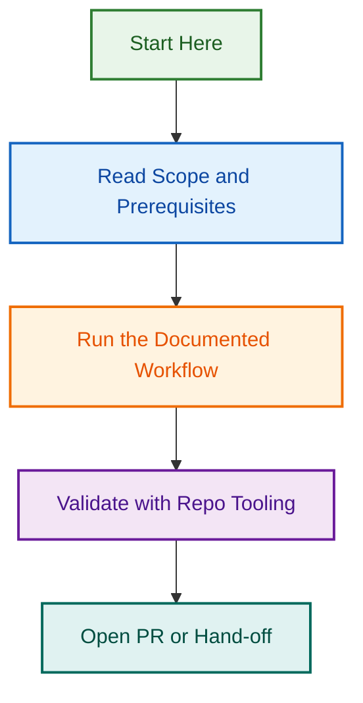

# OpenSpec Project Location

This repository keeps OpenSpec change data inside the active project area:

- `.github/projects/active/openspec/changes/...`

To remain compatible with the OpenSpec CLI, the repository root path `openspec` is a symlink that points to:

- `.github/projects/active/openspec`

## Why this setup

Current OpenSpec CLI configuration only supports global profile/workflow settings and does not expose a supported project-level key for overriding the changes directory.

The symlink keeps CLI behaviour unchanged while storing project artefacts in the preferred active planning structure.

## About This Project

OpenSpec is a **structured specification system** for tracking and coordinating major changes across the repository.

**What's Here:**

- `changes/` — Active specifications (proposals, designs, formal specs)
- `RFC.md` — Request for Comments establishing OpenSpec coordination model
- `COORDINATION_PLAN.md` — Implementation plan for GitHub issue linking

**Key Documents:**

- **[RFC.md](./RFC.md)** — Read this first to understand the OpenSpec coordination model
- **[COORDINATION_PLAN.md](./COORDINATION_PLAN.md)** — Step-by-step implementation plan

## Active Specifications

### 1. Agent-Tool Permission Alignment

**Purpose:** Canonical contract for agent tool access & permissions  
**Status:** 🟢 Active (Proposal phase)  
**Docs:** [proposal.md](./changes/agent-tool-permission-alignment/proposal.md) · [design.md](./changes/agent-tool-permission-alignment/design.md) · [spec.md](./changes/agent-tool-permission-alignment/specs/agent-tool-permission-contract/spec.md)

### 2. Test Coverage Implementation

**Purpose:** Expand test coverage to 80%+ (62-task programme)  
**Status:** 🟢 Active (Planning phase)  
**Docs:** [proposal.md](./changes/test-coverage-implementation/proposal.md) · [design.md](./changes/test-coverage-implementation/design.md) · [spec.md](./changes/test-coverage-implementation/specs/coverage-programme-issue-chain/spec.md)

## GitHub Issues

**Agent-Tool Permission Alignment Spec:**

- [#1738](https://github.com/lightspeedwp/.github/issues/1738) — Epic: Agent-Tool Permission Contract
- [#1739](https://github.com/lightspeedwp/.github/issues/1739) — Phase 1: Audit existing agent specs
- [#1740](https://github.com/lightspeedwp/.github/issues/1740) — Phase 2: Design contract & tiers
- [#1741](https://github.com/lightspeedwp/.github/issues/1741) — Phase 3: Implement validation & CI
- [#1742](https://github.com/lightspeedwp/.github/issues/1742) — Phase 4: Review & approve all specs

**Test Coverage Implementation Spec:**

- [#1743](https://github.com/lightspeedwp/.github/issues/1743) — Epic: Test Coverage Expansion to 80%+
- [#1744](https://github.com/lightspeedwp/.github/issues/1744) — Phase 1: Test Coverage Expansion
- [#1745](https://github.com/lightspeedwp/.github/issues/1745) — Phase 2: Test Coverage Expansion
- [#1746](https://github.com/lightspeedwp/.github/issues/1746) — Phase 3: Test Coverage Expansion
- [#1747](https://github.com/lightspeedwp/.github/issues/1747) — Phase 4: Test Coverage Expansion
- [#1748](https://github.com/lightspeedwp/.github/issues/1748) — Phase 5: Test Coverage Expansion
- [#1749](https://github.com/lightspeedwp/.github/issues/1749) — Phase 6: Test Coverage Expansion

## Operational notes

1. Run OpenSpec commands from repository root as usual.
2. New changes created by OpenSpec will resolve through the symlink and be written under `.github/projects/active/openspec/changes`.
3. Keep the `openspec` symlink committed in git.
4. If symlink drift occurs, recreate it from repository root:

   `ln -sfn .github/projects/active/openspec openspec`

## Related Issues

This project is coordinated with:

- [#1733](https://github.com/lightspeedwp/.github/issues/1733) — Phase 2: Folder Structure & Linking
- [#1739](https://github.com/lightspeedwp/.github/issues/1739) — OpenSpec: Agent-Tool Permission Alignment
- [#1740](https://github.com/lightspeedwp/.github/issues/1740) — OpenSpec: Test Coverage Implementation
- [#1741](https://github.com/lightspeedwp/.github/issues/1741) — OpenSpec: Specification Tracking Model
- [#1742](https://github.com/lightspeedwp/.github/issues/1742) — OpenSpec: GitHub Issue Coordination

See [Linking Standard](https://github.com/lightspeedwp/.github/blob/develop/.github/projects/active/reports-projects-restructuring-2026-08-11/LINKING_STANDARD.md) for linking patterns.
## Visual Workflow

