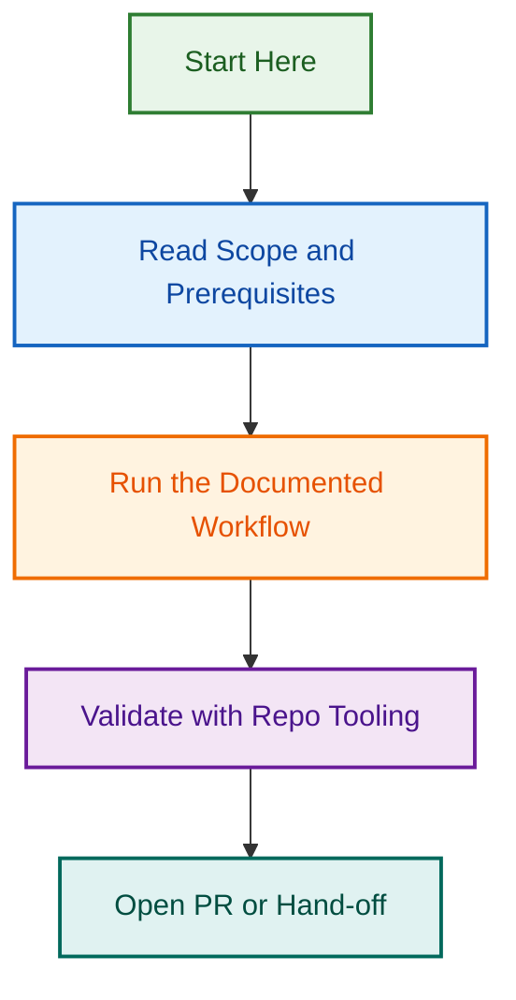

# Portable Prompt Engineer Agent — OpenSpec Specification

Portable Prompt Engineer Agent Specification & Implementation Planning

This project documents the OpenSpec specification for making the Prompt Engineer Agent portable across the LightSpeed organisation (`.github`, WordPress plugins, WordPress themes).

## Related Issues

| Issue | Type | Purpose | Status |
|-------|------|---------|--------|
| [#1805](../../../../../issues/1805) | epic | Portable Prompt Engineer Agent Initiative | 🟢 Open |
| [#1804](../../../../../pull/1804) | pull | OpenSpec Specification Phase (Phase 1) | ✅ Merged |
| [#1907](../../../../../pull/1907) | pull | Phase 2 Core Implementation | 🟢 Open |

## Project Contents

### Phase 1 (Specification - Complete ✅)

- **proposal.md** — OpenSpec proposal with problem statement, capabilities, and impact analysis
- **design.md** — Technical design with 7 key architectural decisions, risks, and migration plan
- **.openspec.yaml** — OpenSpec metadata and configuration

### Phase 2 (Core Implementation - Complete ✅)

**Skills (Documentation & Specification):**

- `agents/prompt-engineer/skills/analyze-prompt.skill.md` — Clarity analysis framework (500+ lines)
- `agents/prompt-engineer/skills/improve-prompt.skill.md` — Improvement suggestion engine (600+ lines)
- `agents/prompt-engineer/skills/validate-prompt.skill.md` — Format validation framework (500+ lines)

**Documentation:**

- `agents/prompt-engineer/README.md` — Quick start guide (400+ lines)
- `agents/prompt-engineer/API.md` — Complete API reference (1000+ lines)
- `agents/prompt-engineer/EXAMPLES.md` — Real-world examples (800+ lines)

**Configuration & Setup:**

- `agents/prompt-engineer/index.js` — Module entry point with placeholder implementations
- `agents/prompt-engineer/package.json` — NPM package configuration
- `agents/prompt-engineer/tests/unit/analyze-prompt.test.md` — Unit test specification

**Summary:**

- `PHASE_2_STATUS.md` — Phase 2 completion details and Phase 3 roadmap

### Phase 3 (Testing & Validation - Pending)

- Implement JavaScript functions (from specifications)
- Unit tests (80%+ coverage target)
- Integration tests (10+ per context)
- Multi-model validation
- Repository-specific testing

### Phase 4 (Documentation & Release - Pending)

- Comprehensive documentation (ARCHITECTURE.md, CONTRIBUTING.md, TROUBLESHOOTING.md)
- NPM packaging and distribution
- Migration guide and backward compatibility
- Release and announcement

## Visual Workflow

