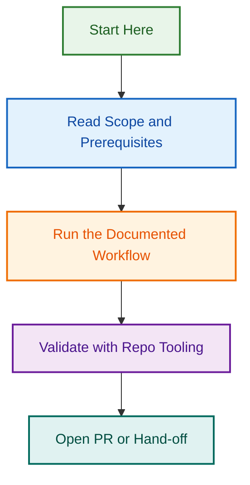

# Phase 2B Skills Architecture Audit

## Quick Facts

| Aspect | Details |
|--------|---------|
| Project | Phase 2B Skills Architecture Audit & Consolidation |
| Version | 1.1.0 (Batch 2-3 Complete) |
| Status | Phase A: Audit Complete (100%) |
| Scope | 16 agents (377 total skills), 123 root skills, 252 skills in Batch 2-3 |
| Deliverables | 8 audit documents, 3-phase consolidation strategy |
| Date Started | 2026-07-24 |
| Phase A Completed | 2026-07-24 |
| Related Issues | #1225, #1079, #1316, #1320, #1321, #1326-#1355 |
| Related PRs | #1221, #1198 |

## Current Task Status (Phase C)

| Metric | Value |
|--------|-------|
| Phase C parent epic | #1320 |
| Child execution issues normalised | #1326-#1355 |
| Child issue status | Open + status:ready |
| Template compliance update | Complete (DoR/DoD sections present) |
| Title quality update | Complete (task-specific naming applied) |

## Project Goals

1. **Establish Clear Taxonomy** — Classify all 123 root skills into Tier 0-3 based on portability
2. **Resolve Version Conflicts** — Identify duplicate implementations (root vs. agent-specific) and consolidation strategy
3. **Enable Agent Reusability** — Create framework for agents to reference shared vs. local skills
4. **Document Governance** — Define rules for skill ownership, location, and override patterns
5. **Support Phase 2C Rollout** — Provide implementation roadmap for all 16 agents

## Core Deliverables

### ✅ Batch 1: Skills Inventory (Completed)

**5 Agents Audited:**

- ai-readiness-estimator-agent (25 skills)
- website-content-strategist-agent (24 skills)
- website-scope-estimator-agent (22 skills)
- zendesk-support-agent (26 skills)
- client-website-discovery-assistant-agent (28 skills)

**Documentation:**

- Agent-by-agent skills breakdown with categorization
- Skill attachment strategy (agent-attached, local, plugin-provided, platform-managed)
- Initial conflict identification

### ✅ Batch 2-3: Remaining Agents (Completed)

**11 Agents Audited:**

- prd-factory-planner-agent (39 skills)
- tour-operator-config-agent (30 skills)
- woo-config-agent (21 skills)
- design-partner-agent (8 skills)
- harvest-analytical-agent (13 skills)
- linear-advisor-agent (42 skills — LARGEST)
- pagespeed-agent (5 skills — smallest)
- playwright-testing-agent (4 skills)
- prd-agent (43 skills)
- proposal-desk-agent (16 skills)
- wp-config-agent (31 skills)

**Timeline:** Completed 2026-07-24

### 📊 Root Skills Analysis

**Classification: 123 → 70 Active Skills**

#### Tier 0: Universal Utilities (Must Share)

- documents, pdfs, docx, slides, spreadsheets
- web-artifacts-builder, linear, github, google-drive
- **Status:** ✅ Stable, widely used

#### Tier 1: Domain-Specific Reusable (Should Share)

- figma-* (use, code-connect, generate-design, generate-library)
- audit-design-system, apply-design-system
- sync-figma-token
- **Status:** ⚠️ Mixed versions (conflicts identified)

#### Tier 2: Agency-Specific Skills (May Archive)

- lightspeed-ai-readiness (25+ variants)
- lightspeed-prd-generator
- lightspeed-project-researcher
- **Status:** 🔴 Requires classification

#### Tier 3: Niche WordPress/Specialized (Low Priority)

- wordpress-block-theme-router
- wordpress-template-generator
- wordpress-pattern-generator
- **Status:** 🟡 Requires agent mapping

### 🔍 Conflict Resolution Matrix

**Identified Conflicts:**

| Conflict | Root Version | Agent Version | Severity | Resolution |
|----------|--------------|---------------|----------|-----------|
| figma-use | 2023-09 | design-partner (2026-07) | HIGH | Use agent version, archive root |
| ai-readiness | Generic agency | estimator-agent specialized | HIGH | Keep separate, clarify ownership |
| audit-design-system | Root version | design-partner variant | MEDIUM | Consolidate to shared base + agent override |
| figma-code-connect | Archived (.zip) | design-partner active | HIGH | Restore from agent version |

### 📋 Three-Phase Consolidation Strategy

#### **PHASE A: Audit & Evaluation** (Weeks 1-2) — ✅ COMPLETE

- ✅ Batch 1 complete (5 agents, 125 skills total)
- ✅ Batch 2-3 complete (11 agents, 285 skills total)
- ✅ Root skills classification (123 → 70 active)
- ✅ Conflict matrix creation (HIGH/MEDIUM/LOW severity documented)
- **Deliverables:** Complete audit report (PHASE-2B-SKILLS-AUDIT.md), decision matrix

#### **PHASE B: Inventory & Planning** (Weeks 3-4)

- Document all agent-specific skill implementations
- Identify consolidation candidates (Tier 1 skills used by 2+ agents)
- Create skill dependency map
- Plan skill override system architecture
- **Deliverables:** Consolidation roadmap, implementation plan

#### **PHASE C: Implementation & Rollout** (Weeks 5-12)

- Move Tier 0 utilities to root (establish single source of truth)
- Consolidate Tier 1 reusable skills with agent override system
- Archive or integrate Tier 2-3 skills
- Update all 16 agents to reference consolidated skills
- Implement governance validation
- **Deliverables:** Consolidated skill architecture, updated agents, validation automation

## Implementation Timeline

| Phase | Timeline | Status | Hours | Deliverables |
|-------|----------|--------|-------|--------------|
| **PHASE A: Audit** | Week 1-2 | ✅ Complete | 15 | Full audit (410 skills), conflict matrix, decision docs |
| **PHASE B: Planning** | Week 3-4 | 🟡 In Progress | 10-12 | Roadmap, architecture, implementation plan |
| **PHASE C: Implementation** | Week 5-12 | ⏳ Upcoming | 40-50 | Consolidated skills, updated agents, governance |

## Success Metrics

- ✅ Complete audit of all 16 agents' skill directories
- ✅ Clear ownership definition for each skill (shared vs. local vs. override)
- ✅ Version conflict resolution documented with implementation strategy
- ✅ Scalable lookup system for agent developers
- ✅ Governance rules established and validated
- ✅ CI/CD automation for skill architecture validation

## Key Decisions & Trade-offs

### Shared Skills vs. Agent-Specific Customization

**Decision:** Support BOTH via override system

- **Shared Base Skills** — Root implementation (Tier 0)
- **Agent Customization** — Override mechanism for specialized needs (Tier 1)
- **Fully Local Skills** — Agent-only implementations (no root equivalent)

**Rationale:** Balances reusability with agent autonomy

### Root Skills Consolidation Strategy

**Tier 0 (Universal):** Force consolidation to root

- All agents reference shared implementations
- Central updates benefit all agents

**Tier 1 (Reusable):** Root + override pattern

- Shared base in root
- Agents can customize if needed
- Documented override contract

**Tier 2-3 (Specialized):** Keep agent-local or archive

- Agency-specific: Archive or deprecate
- WordPress-specific: Document usage, validate across agents

## Risk Mitigation

| Risk | Likelihood | Impact | Mitigation |
|------|-----------|--------|-----------|
| Skill version conflicts during consolidation | HIGH | MEDIUM | Comprehensive audit before consolidation |
| Agent functionality regression | MEDIUM | HIGH | Extensive testing of override system |
| Governance enforcement failure | MEDIUM | MEDIUM | CI/CD validation, documentation |

## Related Issues

- **Epic #1079** — Multi-Provider Agent Standardization Initiative
- **Issue #1225** — Phase 2B Skills Audit (linked to this project)
- **Issue #1198** — Agent finalization & skills audit (reopened)
- **PR #1221** — Phase 2B skills audit PR (parent PR with audit doc)

## Next Steps

1. **Complete Batch 2-3 Agent Audit** (This week)
   - Document remaining 11 agents' skills
   - Identify additional conflicts
   - Finalize root skills classification

2. **Create Consolidation Strategy Document** (Next week)
   - Detailed implementation plan
   - Architecture diagrams
   - Team communication plan

3. **Begin Phase B: Inventory Phase** (Week 3)
   - Create skill dependency map
   - Design override system architecture
   - Plan governance validation

4. **Phase C: Implementation Planning** (Week 4)
   - Create per-agent consolidation tasks
   - Estimate effort
   - Schedule rollout

---

**Project Lead**: Ash Shaw
**Started**: 2026-07-24
**Status**: Actively Building
**Next Review**: End of Week 2
**Related PR**: #1221

---

*Built by 🧱 LightSpeedWP with ☕, 🚀, and open-source spirit!*
## Visual Workflow

