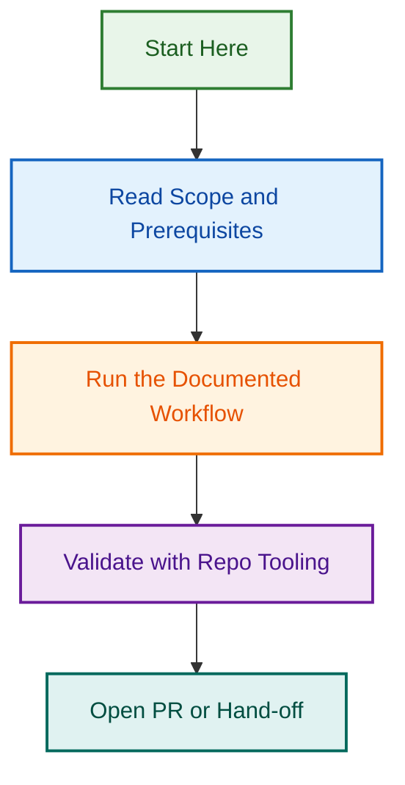

# Portable Prompt Engineer Agent — Specification & Planning

**Project Start Date:** 2026-08-12  
**Status:** 🟢 Phase 3.2 Complete — Framework Validation Rules  
**Owner:** Ash Shaw  
**Repository:** lightspeedwp/.github

## Overview

This project defines the specification and implementation plan for converting the `.github`-specific Prompt Engineer Agent into a **portable, multi-repository agent** usable across LightSpeed's GitHub organisation repositories, including:

- `.github` control plane (primary)
- WordPress block plugins
- WordPress block themes
- Supporting projects

## Key Questions & Decisions

**Strategic decisions to be documented:**

- Single agent vs. multiple specialized variants?
- Portability requirements across WordPress and non-WordPress contexts
- Test coverage strategy
- Documentation & diagram standards

See [QUESTIONS.md](./QUESTIONS.md) for the full question set.

## Deliverables

- [x] **QUESTIONS.md** — Strategic planning questions (complete)
- [x] **ANSWERS.md** — Best practice answers with rationale (complete)
- [x] **SCOPE.md** — Scope, constraints, and repository considerations (complete)
- [ ] **ARCHITECTURE.md** — Agent architecture with mermaid diagrams
- [ ] **IMPLEMENTATION_PLAN.md** — Detailed implementation roadmap with phases
- [ ] **TEST_STRATEGY.md** — Testing approach with coverage targets
- [ ] **DOCUMENTATION_PLAN.md** — Documentation requirements and structure

## Phase 3.2 Completion — Framework-Specific Validation Rules

**Status:** ✅ COMPLETE (2026-08-22)

**Deliverable:** Framework-Specific Validation Rules for Prompt Engineer  
**PR:** [#2324](https://github.com/lightspeedwp/.github/pull/2324) (merged)  
**Commit:** `67fa12ec908584b443b42127e74851cf6a10b587`

**Implementation Summary:**
- 154 framework-specific validation rules (exceeds 150+ target)
- 2,096 LOC across 4 files
- 52 GitHub control-plane rules (workflows, labels, governance)
- 50 WordPress plugin rules (hooks, blocks, metadata)
- 52 WordPress theme rules (theme.json, templates, accessibility)
- Master validation engine with context auto-detection and severity sorting
- Located in portable `agents/prompt-engineer/rules/` directory

## Related Issues

| Issue | Type | Purpose | Status |
|-------|------|---------|--------|
| [#1845](https://github.com/lightspeedwp/.github/issues/1845) | epic | Portable Prompt Engineer Phase 3 — Context Detection & Validation | ✅ Complete |
| [#2324](https://github.com/lightspeedwp/.github/pull/2324) | PR | Task 3.2: Framework-Specific Validation Rules | ✅ Merged |

## Related Files

- Source Agent: [.github/agents/prompt-engineer.agent.md](../../agents/prompt-engineer.agent.md)
- Branching Guide: [docs/BRANCHING_STRATEGY.md](../../../../docs/BRANCHING_STRATEGY.md)
- Agent Standards: [AGENTS.md](../../../../AGENTS.md)
- Two-Tier Agent Architecture: [CLAUDE.md](../../../../CLAUDE.md#two-tier-agent-structure-phase-1c)

---

*Built by 🧱 LightSpeedWP with ☕, 🚀, and open-source spirit!*
## Visual Workflow

