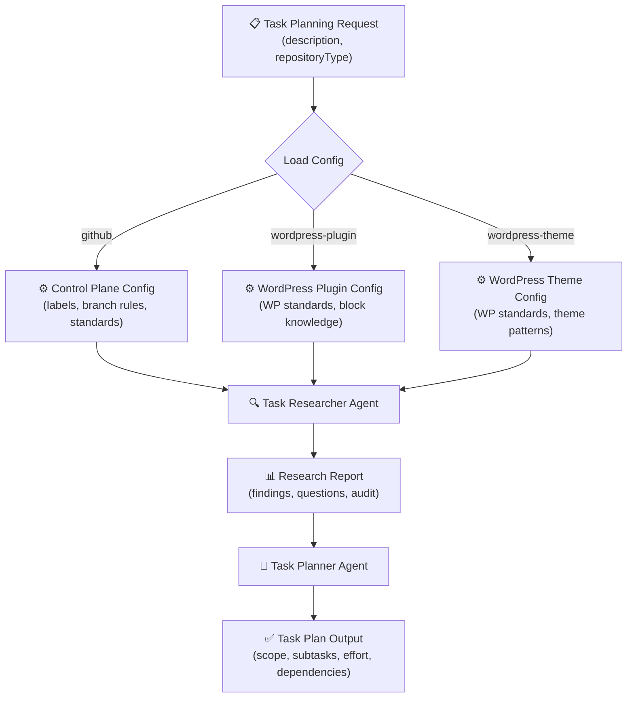
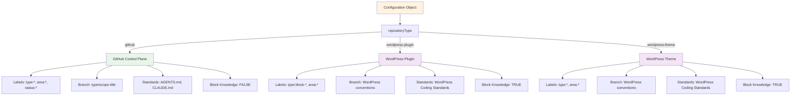
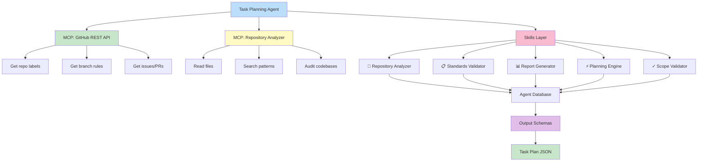
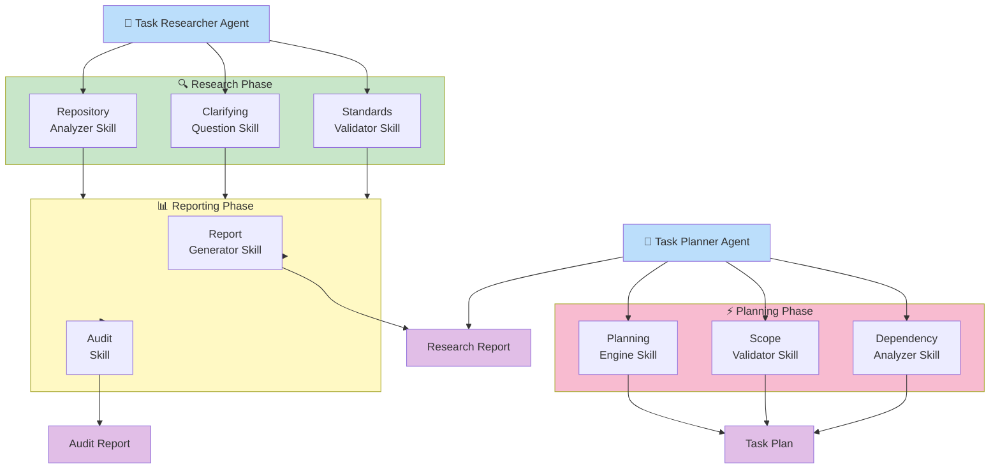
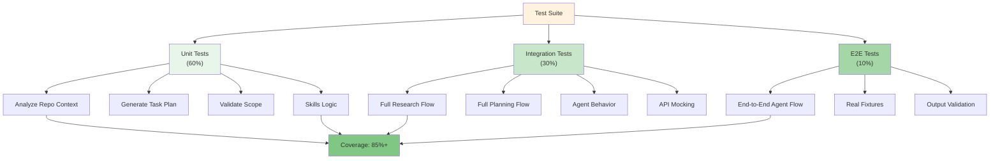

# Clarifying Questions & Answers: Portable Task Planning Agents

**Document Purpose:** Answer 6 critical architectural questions with best practice rationale.  
**Date:** 2026-08-12  
**Status:** ✅ Complete

---

## Q1: Agent Architecture Decision

### Question

Should we create:

- **(A)** One unified agent that accepts repository-type parameters?
- **(B)** Separate agents (task-planner-github, task-planner-wordpress)?

### Best Practice Answer: **(A) One Unified Agent**

**Rationale:**

1. **Single Source of Truth**
   - Shared core logic (research, planning, output formatting)
   - Parameter-driven adaptation (not code duplication)
   - Easier maintenance and bug fixes

2. **Configuration-Over-Code Pattern**
   - Repository type passed as parameter: `{ repositoryType: "github" | "wordpress-plugin" | "wordpress-theme" }`
   - Standards, labels, branch rules injected via configuration object
   - Reduces agent bloat and cognitive load

3. **LightSpeed Architectural Alignment**
   - Follows portable agent principles: one implementation, many contexts
   - Similar to how WordPress plugins use `wp_get_environment_type()` for context
   - Reduces maintenance burden (one agent, not three)

4. **Scalability**
   - Easy to add new repository types (monorepos, npm packages, etc.)
   - Parameter changes don't require new agent creation
   - Central place to document all supported types

**Implementation:**

```javascript
// Unified Agent Pattern
async function planTask(request) {
  const { repositoryType, taskDescription, context } = request;
  
  // Load repository-specific configuration
  const config = loadRepositoryConfig(repositoryType);
  
  // Unified research → planning flow
  const research = await researchTask(taskDescription, context);
  const plan = await generatePlan(research, config);
  
  return plan;
}
```

**Supported Repository Types:**

| Type | Context | Standards | Labels | Branch Rules |
|------|---------|-----------|--------|--------------|
| `github` | Control plane | AGENTS.md, CLAUDE.md | `.github/labels.yml` | `{type}/{scope}-{title}` |
| `wordpress-plugin` | Block plugin dev | WordPress Coding Standards | Plugin-specific set | WordPress standards + plugin rules |
| `wordpress-theme` | Block theme dev | WordPress Coding Standards | Theme-specific set | WordPress standards + theme rules |

**Decision:** ✅ **Adopt unified agent with parameter-driven configuration.**

---

## Q2: WordPress Block Context

### Question

For WordPress block plugins/themes, what governs task scoping?

- WordPress Coding Standards + ESLint/PHPCS?
- WordPress.org release guidelines?
- Specific label taxonomies?
- Different PR/branch workflows?

Should the agent understand WordPress block structure?

### Best Practice Answer

**What Governs Task Scoping in WordPress Projects:**

#### 1. **WordPress Coding Standards** (Primary)

- PHP: [WordPress Coding Standards](https://developer.wordpress.org/coding-standards/wordpress-coding-standards/)
- JavaScript: [WordPress JavaScript Coding Standards](https://developer.wordpress.org/coding-standards/javascript/)
- CSS: [WordPress CSS Coding Standards](https://developer.wordpress.org/coding-standards/wordpress-coding-standards/wordpress-css-coding-standards/)
- Tools: PHPCS, ESLint, Prettier (with WordPress configs)

#### 2. **WordPress.org Release Guidelines** (Secondary)

- Plugin/theme directory requirements
- Asset organization (images, languages, readme.txt structure)
- Internationalization (i18n) requirements
- Security review checklist

#### 3. **Repository-Specific Conventions** (Tertiary)

- Custom label taxonomy (e.g., `type:block`, `area:accessibility`, `priority:plugin-store`)
- PR workflow (plugin store submissions, changelog updates)
- Testing requirements (unit, integration, E2E with WordPress)
- Documentation standards (setup.md, block registration, etc.)

### Should the Agent Understand Block Structure?

**Yes, but strategically.**

**What the Agent Should Know:**

```json
{
  "blockKnowledge": {
    "blockStructure": {
      "registration": "wp.blocks.registerBlockType()",
      "attributes": "block attributes schema",
      "editComponent": "React component for editor",
      "saveComponent": "HTML output for frontend",
      "supports": "block.json supports field"
    },
    "commonPatterns": {
      "statefulBlocks": "useState for editor state",
      "nestedBlocks": "InnerBlocks component",
      "mediaUpload": "MediaUpload component from @wordpress/block-editor",
      "colors": "useBlockProps() for theme colors",
      "spacing": "margin/padding via useSetting()"
    },
    "testingPatterns": {
      "unitTests": "Jest with @testing-library/react",
      "integrationTests": "WordPress test environment (@wordpress/env)",
      "E2E": "Playwright with WordPress test site"
    }
  }
}
```

**Agent Capabilities for WordPress Projects:**

1. ✅ **Task Decomposition**
   - Understand block-specific tasks (attribute validation, save refactoring)
   - Recognize cross-cutting concerns (i18n, accessibility)
   - Identify testing gaps (unit vs. integration vs. E2E)

2. ✅ **Scope Validation**
   - Flag incomplete tasks (missing tests, i18n strings)
   - Suggest performance audits (block registration overhead)
   - Catch WordPress API misuse (deprecated functions, hooks)

3. ✅ **Best Practice Checks**
   - Verify block.json schema compliance
   - Ensure PHPCS/ESLint compliance in plan
   - Check accessibility requirements (WCAG 2.2 AA for plugins/themes)

4. ✅ **Standards Integration**
   - Accept WordPress Coding Standards config in task context
   - Validate against WordPress.org release checklist
   - Reference WordPress documentation in planning

5. ❌ **What the Agent Should NOT Do**
   - Generate or modify block code (use MCP/skills for that)
   - Validate complex PHP (use PHPCS directly)
   - Perform security audits (use WordPress security tools)

### WordPress Configuration Object

```javascript
const wordPressConfig = {
  repositoryType: "wordpress-plugin",
  projectName: "Awesome Block Plugin",
  codingStandards: {
    php: { tool: "phpcs", config: "wordpress", autofix: true },
    js: { tool: "eslint", config: "wordpress", autofix: true },
    css: { tool: "stylelint", config: "wordpress", autofix: true },
  },
  labels: [
    "type:block-feature",
    "type:block-fix",
    "area:accessibility",
    "area:performance",
    "status:needs-testing",
  ],
  blockKnowledge: true,  // Enable block-specific task understanding
  releaseChecklist: "https://developer.wordpress.org/plugins/plugin-basics/plugin-submission-requirements/",
  testingFramework: "jest", // WordPress plugins typically use Jest + @wordpress/env
};
```

**Decision:** ✅ **Agent should understand WordPress block structure strategically; knowledge stored in configuration object.**

---

## Q3: Agent Implementation Type

### Question

Should these be:

- **(A)** Spec-based agents (simple YAML/JSON in `.github/agents/`)?
- **(B)** Multi-file portable agents (root `agents/` with skills, schemas, configurations)?

### Best Practice Answer: **(B) Multi-File Portable Agents**

**Why NOT Spec-Based (`.github/agents/`):**

- ❌ Limited to 1 file per agent
- ❌ YAML/JSON can't express complex research logic
- ❌ No skill delegation (can't use external tools/agents)
- ❌ Not portable across repositories
- ❌ No test support
- ❌ Hard to maintain complex workflows

**Why Multi-File Portable (`agents/` root):**

1. **Complexity Support**
   - Task researcher needs to ask questions, generate audits, analyze codebases
   - Task planner needs to synthesize research, validate scope, produce structured output
   - Both need skills for specialized tasks

2. **Portability**
   - Other LightSpeedWP projects (plugins, themes) can install and use
   - No `.github/` assumptions in code
   - Reusable across contexts

3. **Maintainability**
   - Separate concerns: agent spec, skills, schemas, tests, docs
   - Clear file organization
   - Easier code review and updates

4. **Testing**
   - Unit tests for scripts
   - Integration tests for agent behavior
   - Test coverage reporting

5. **Skill Delegation**
   - Research agent can use dedicated skills:
     - `repository-analyzer.skill.md` — audit codebases
     - `standards-validator.skill.md` — check coding standards
     - `report-generator.skill.md` — create structured reports
   - Planner agent can use:
     - `planning-engine.skill.md` — generate task plans
     - `scope-validator.skill.md` — validate task scope

### Proposed Structure

```
agents/task-planner-agent/                 # Multi-file portable agent
├── task-planner.agent.md                  # Main agent spec
├── task-researcher.agent.md               # Research subagent
├── skills/
│   ├── repository-analyzer.skill.md       # Code audit skills
│   ├── standards-validator.skill.md
│   ├── report-generator.skill.md
│   ├── planning-engine.skill.md           # Planning skills
│   └── scope-validator.skill.md
├── schemas/
│   ├── task-plan-output.schema.json       # Output validation
│   ├── repository-context.schema.json
│   └── research-report.schema.json
├── scripts/
│   ├── analyze-repo-context.js            # Helper scripts
│   ├── generate-task-plan.js
│   ├── validate-coding-standards.js
│   └── tests/
│       ├── analyze-repo-context.test.js   # Full test coverage
│       ├── generate-task-plan.test.js
│       ├── integration.test.js
│       └── coverage-report.json
├── docs/
│   ├── README.md                          # Implementation guide
│   ├── ARCHITECTURE.md                    # Design decisions
│   ├── MERMAID_DIAGRAMS.md                # Workflow diagrams
│   └── EXAMPLES.md                        # Usage examples
└── .agent-config.json                     # Agent configuration
```

**Decision:** ✅ **Adopt multi-file portable agents in root `agents/` folder.**

---

## Q4: Testing & Scripts

### Question

- What testing framework? (Jest, Vitest, Node test runner?)
- Should the agents themselves be testable, or just supporting scripts?
- Integration tests (agent + GitHub API) or unit tests only?

### Best Practice Answer

#### Testing Framework: **Jest**

**Why Jest:**

1. ✅ Industry standard for Node.js projects
2. ✅ Out-of-box support for snapshots, mocking, coverage
3. ✅ Works with GitHub Actions (pre-installed in CI runners)
4. ✅ Excellent for integration testing (mocking GitHub API, file I/O)
5. ✅ LightSpeed precedent (used in existing projects)
6. ✅ Great documentation and community support

**Alternative Considered:** Node test runner

- ❌ Newer, less mature
- ❌ Limited ecosystem
- ❌ Not ideal for mocking complex APIs

#### Test Scope: **Both Scripts AND Agent Behavior**

**Script Tests (Unit + Integration):**

```javascript
// test/analyze-repo-context.test.js
describe("Analyze Repo Context", () => {
  test("extracts coding standards config from codebase", async () => {
    // Mock file system, validate extraction
  });
  
  test("detects existing label taxonomy", async () => {
    // Mock GitHub API, validate label parsing
  });
  
  test("integration: full context generation", async () => {
    // Full end-to-end with real file I/O or mocked API
  });
});
```

**Agent Behavior Tests (Integration):**

```javascript
// test/agent-behavior.test.js
describe("Task Researcher Agent", () => {
  test("asks clarifying questions when scope is ambiguous", async () => {
    const response = await agent.research({
      description: "Update accessibility",
      context: { repositoryType: "wordpress-theme" },
    });
    
    expect(response.clarifyingQuestions).toHaveLength(3);
    expect(response.questions[0]).toMatch(/WCAG/i);
  });
  
  test("generates audit report for GitHub control plane", async () => {
    const response = await agent.research({
      description: "Review label hygiene",
      context: { repositoryType: "github" },
    });
    
    expect(response).toHaveProperty("auditReport");
    expect(response.auditReport).toMatchSchema(auditReportSchema);
  });
});
```

#### Test Coverage Strategy

**Coverage Targets:**

| Component | Target | Priority |
|-----------|--------|----------|
| Scripts (analyze, generate, validate) | 85%+ | High |
| Skills (research, planning) | 80%+ | High |
| Integration (agent + API) | 75%+ | Medium |
| Edge cases & error handling | 70%+ | Medium |

**Test Types:**

1. **Unit Tests** (60% of suite)
   - Individual functions, pure logic
   - Mocked dependencies
   - Fast execution

2. **Integration Tests** (30% of suite)
   - Scripts + skills together
   - Mocked GitHub API / file system
   - Realistic workflows

3. **E2E Tests** (10% of suite)
   - Full agent flow with real fixtures
   - Validates output schemas
   - Slower, run before merge only

**Testing Patterns:**

```javascript
// Mock GitHub API
jest.mock("@octokit/rest", () => ({
  Octokit: jest.fn(() => ({
    repos: {
      getContent: jest.fn().mockResolvedValue({
        data: { content: Buffer.from("...").toString("base64") },
      }),
    },
  })),
}));

// Mock file system
jest.mock("fs/promises", () => ({
  readFile: jest.fn().mockResolvedValue("file content"),
  readdir: jest.fn().mockResolvedValue(["file1", "file2"]),
}));

// Test with fixtures
const contextFixture = require("./fixtures/repo-context-github.json");
```

**Decision:** ✅ **Jest for testing; unit + integration tests for scripts and agent behavior; 80%+ coverage target.**

---

## Q5: Scope & Timeline

### Question

- Phase 1: Specification + design docs only? Or include implementation?
- Expected delivery: Sprint-based, or open-ended?
- Who will be the primary user/maintainer?

### Best Practice Answer

#### Phase 1: Specification & Design Only

**What's Included:**

1. ✅ Clarifying questions answered (THIS DOCUMENT)
2. ✅ Architecture decisions documented
3. ✅ Repository-type configuration mapping
4. ✅ Test strategy and framework selection
5. ✅ Implementation roadmap with phases
6. ✅ Comprehensive documentation spec with mermaid diagrams
7. ✅ Skill definitions (what skills are needed, not implementation)
8. ✅ Schema definitions (JSON schemas for inputs/outputs)

**What's NOT Included:**

- ❌ Agent implementation code
- ❌ Skill implementations
- ❌ Support scripts
- ❌ Tests (test framework selected, test cases designed, but not written)

**Deliverable:**

PR with specification documents + implementation roadmap. Ready for Phase 2 kick-off.

#### Timeline: Sprint-Based

**Phase 1: Specification (Current)**

- Duration: 1 week
- End date: 2026-08-19 (estimated)
- Deliverable: Specification PR to `develop`

**Phase 2: Implementation (Planned)**

- Duration: 3-4 weeks
- Deliverable: Agent implementations + full test suite
- New branch: `feat/task-planning-agents-implementation`

**Phase 3: Validation & Integration (Planned)**

- Duration: 2 weeks
- Deliverable: Integration tests pass, documentation review complete
- Merge to `develop`

#### Primary User/Maintainer: **TBD**

**Ownership Model:**

| Role | Responsibility |
|------|-----------------|
| **Initiative Lead** | Overall project roadmap, decision-making, stakeholder communication |
| **Agent Developer** | Implement task-planner and task-researcher agents |
| **Skills Developer** | Implement reusable skills (research, planning, validation) |
| **Test Lead** | Design and implement test suite, coverage validation |
| **Documentation Lead** | Write comprehensive guides, mermaid diagrams, examples |

**Recommendation:** Identify one **initiative lead** who owns the project end-to-end. Distribute implementation tasks across team.

**Decision:** ✅ **Phase 1 = specification only; 1 week timeline; identify ownership before Phase 2.**

---

## Q6: Documentation Requirements

### Question

Should diagrams show:

- Agent decision flows?
- Data flow (research → planning → output)?
- Repository-type branching?
- Integration points (GitHub API, MCP servers, skills)?

### Best Practice Answer: **ALL OF THE ABOVE**

**Diagram Set:**

#### Diagram 1: Agent Decision Flow (High-Level)

Shows how the unified agent handles different repository types.

```
┌─────────────────────────────────────────┐
│  Task Planning Request (repositoryType) │
└────────────┬────────────────────────────┘
             │
             ├─→ repositoryType = "github"     → Load GitHub config
             ├─→ repositoryType = "wp-plugin"  → Load WordPress Plugin config
             └─→ repositoryType = "wp-theme"   → Load WordPress Theme config
                                                    │
                                                    ▼
             ┌──────────────────────────────────────────┐
             │  Task Researcher Agent                   │
             │  ├─ Analyze repository context           │
             │  ├─ Ask clarifying questions             │
             │  └─ Generate research report             │
             └────────────────┬─────────────────────────┘
                              │
                              ▼
             ┌──────────────────────────────────────────┐
             │  Task Planner Agent                      │
             │  ├─ Synthesize research                  │
             │  ├─ Generate execution plan              │
             │  └─ Validate scope & dependencies        │
             └────────────────┬─────────────────────────┘
                              │
                              ▼
             ┌──────────────────────────────────────────┐
             │  Output: Structured Task Plan            │
             │  ├─ Goals & objectives                   │
             │  ├─ Acceptance criteria                  │
             │  ├─ Estimated effort                     │
             │  ├─ Subtasks & dependencies              │
             │  └─ Success metrics                      │
             └──────────────────────────────────────────┘
```

**Mermaid:**



#### Diagram 2: Data Flow (Detailed)

Shows how data flows from research through planning to output.

```mermaid
graph LR
    A["🔍 Raw Input<br/>(task description)"] 
    --> B["📂 Repository<br/>Analyzer Skill"]
    
    B --> C["📊 Repository<br/>Context"]
    C --> D["❓ Question<br/>Engine"]
    
    D --> E["💬 Clarifying<br/>Questions"]
    E --> F["✏️ User<br/>Answers"]
    
    F --> G["🔎 Standards<br/>Validator Skill"]
    G --> H["📋 Coding<br/>Standards Check"]
    
    H --> I["📈 Report<br/>Generator Skill"]
    I --> J["📄 Research<br/>Report"]
    
    J --> K["⚡ Planning<br/>Engine Skill"]
    K --> L["✅ Task Plan<br/>Output"]
    
    L --> M["✓ Scope<br/>Validator Skill"]
    M --> N["🎯 Final<br/>Task Plan"]
    
    style A fill:#e1f5ff
    style N fill:#c8e6c9
```



#### Diagram 3: Repository-Type Branching

Shows how configuration differs per repository type.



#### Diagram 4: Integration Points

Shows how agents integrate with GitHub API, MCP servers, and skills.



#### Diagram 5: Skill Architecture

Shows how skills are organized and called by agents.



#### Diagram 6: Test Coverage Map

Shows what's tested and how.



### Documentation Spec

**Files to Create:**

1. **ARCHITECTURE.md** (5-8 pages)
   - Agent decision flows
   - Repository-type configuration mapping
   - Integration points with GitHub API / MCP
   - Skill architecture and responsibilities

2. **MERMAID_DIAGRAMS.md** (2-4 pages)
   - All 6 diagrams above
   - Description and interpretation for each
   - Usage tips and customization

3. **IMPLEMENTATION_ROADMAP.md** (3-5 pages)
   - Phase breakdown with timelines
   - Deliverables per phase
   - Success criteria
   - Risk mitigation

4. **TEST_STRATEGY.md** (4-6 pages)
   - Test framework selection rationale
   - Test coverage targets
   - Testing patterns and examples
   - CI/CD integration

5. **EXAMPLES.md** (3-5 pages)
   - Example usage: control plane task
   - Example usage: WordPress plugin task
   - Example usage: WordPress theme task
   - Common variations and edge cases

**Decision:** ✅ **Include all diagram types (decision flow, data flow, repo-type branching, integration, skills, tests); 5 comprehensive documentation files.**

---

## Summary: Key Decisions

| Decision | Choice | Rationale |
|----------|--------|-----------|
| **Q1: Agent Architecture** | ✅ One unified agent with parameters | Shared logic, configuration-driven, scalable |
| **Q2: WordPress Knowledge** | ✅ Strategic block understanding | Scope validation, best practices, but not code generation |
| **Q3: Implementation Type** | ✅ Multi-file portable agents | Complexity, skills, tests, portability |
| **Q4: Testing** | ✅ Jest; unit + integration; 80%+ coverage | Industry standard, mocking, agent behavior testing |
| **Q5: Timeline** | ✅ Phase 1 = spec only; sprint-based | Clear deliverables, identify ownership before Phase 2 |
| **Q6: Documentation** | ✅ All diagram types + 5 comprehensive docs | Complete picture of architecture, flow, and implementation |

---

## Next Steps

1. ✅ Review and approve decisions
2. ⬜ Create GitHub issues for each phase
3. ⬜ Identify initiative lead and team
4. ⬜ Use EnterPlanMode to flesh out implementation roadmap
5. ⬜ Create Phase 2 implementation plan (separate document)

---

**Document Status:** ✅ Complete  
**Last Updated:** 2026-08-12  
**Author:** Ash Shaw (AI-assisted planning)
