# PR Creation Agent Design Initiative

**Project Status:** 🟢 Active — Design Phase  
**Start Date:** 2026-08-12  
**Initiative Type:** Agent Architecture & Design  
**Scope:** Portable PR creation/implementer agent for multi-repo usage

## 🔗 GitHub Tracking

| Item | Link | Status |
|------|------|--------|
| **Design Issue** | [#1812 — PR Creation Agent Design Initiative](https://github.com/lightspeedwp/.github/issues/1812) | 🟢 Open |
| **Delivery PR** | [#1796 — Design Phase Implementation](https://github.com/lightspeedwp/.github/pull/1796) | 📋 In Review |
| **Parent Epic** | [#1722 — Repository Restructuring & Agent Standardisation](https://github.com/lightspeedwp/.github/issues/1722) | 🟢 Open |

## Overview

This project defines a **portable PR creation agent** that can automate pull request generation across the LightSpeed ecosystem. The agent will encapsulate best practices for:

- Branch naming and validation
- Template routing and PR composition
- Label enforcement and issue linking
- Changelog generation and feedback tracking
- Multi-repo portability and customisation

## Strategic Objectives

1. **Define Core Architecture** — Establish agent tier (spec-based vs. multi-file), skill composition, and integration points
2. **Design Portability** — Enable installation in any LightSpeedWP repo without control-plane-specific assumptions
3. **Standardise PR Creation** — Enforce consistent labeling, branching, and documentation across repos
4. **Enable Automation** — Support both manual triggers and workflow-driven PR creation
5. **Document Best Practices** — Provide comprehensive guidelines for PR agent implementation

## Phases

### Phase 1: Design & Requirements (Current)

**Deliverables:**

- Design questions and best-practice answers (DESIGN_QUESTIONS.md)
- Agent specification (scope, tier, skills, integration points)
- Portability strategy and configuration model
- Skill architecture and reuse patterns

**Timeline:** 2026-08-12 → 2026-08-16  
**Owner:** Design Initiative

### Phase 2: Specification & Planning

**Deliverables:**

- Agent specification (SPEC.md) with schema
- Skill definitions and interfaces
- Integration architecture document
- Example configurations for target repos

**Timeline:** 2026-08-16 → 2026-08-20

### Phase 3: Implementation & Validation

**Deliverables:**

- Agent implementation (multi-file or spec-based per decision)
- Skills implementation
- Test suite and integration tests
- Documentation and examples

**Timeline:** 2026-08-20 → 2026-09-02

### Phase 4: GA & Rollout

**Deliverables:**

- Tested, production-ready agent
- Installation guide for new repos
- Rollout checklist and monitoring

**Timeline:** 2026-09-02 → 2026-09-09

## Key Design Questions

See [DESIGN_QUESTIONS.md](./DESIGN_QUESTIONS.md) for 9 critical design questions and best-practice recommendations:

1. What initiates PR creation?
2. What scope of changes?
3. Autonomy level?
4. Integration with existing systems?
5. Required PR content?
6. Skill composition?
7. Existing skills to reuse?
8. Target repos?
9. Repo-specific customisation?

## Related Issues & Documents

| Item | Type | Purpose | Status |
|------|------|---------|--------|
| [#1812](https://github.com/lightspeedwp/.github/issues/1812) | design | PR Creation Agent Design Initiative | 🟢 Tracking |
| [#1796](https://github.com/lightspeedwp/.github/pull/1796) | pr | Design phase delivery PR | 📋 In Review |
| [#1722](https://github.com/lightspeedwp/.github/issues/1722) | epic | Repository restructuring & agent standardisation | 🟢 Open |
| [OPENSPEC.md](./OPENSPEC.md) | spec | Formal specification document | ✅ Complete |
| [DESIGN_QUESTIONS.md](./DESIGN_QUESTIONS.md) | qa | 9 design questions & answers | ✅ Complete |

## Key Files

### Phase 1 (Complete)

- **[OPENSPEC.md](./OPENSPEC.md)** — Formal specification with design decisions
- **[DESIGN_QUESTIONS.md](./DESIGN_QUESTIONS.md)** — 9 critical questions + comprehensive answers
- **[README.md](./README.md)** — Project overview and planning

### Phase 2–4 (Planned)

- **SPECIFICATION.md** — Agent specification and schema
- **ARCHITECTURE.md** — Integration and portability architecture
- **IMPLEMENTATION_PLAN.md** — Implementation roadmap
- **INTEGRATION_GUIDE.md** — Per-repo installation guide

## Architecture Decisions (Phase 1 Complete)

- **Agent Tier:** ✅ **Multi-file agent** (not spec-based) — Complexity & skill reuse justify it
- **Skill Approach:** ✅ **Skill-delegating** — 4 existing + 6 new skills for better reusability
- **Configuration Model:** ✅ **Config-driven** — `.claude/pr-agent.config.yml` + optional hooks
- **Integration Points:** ✅ **Full governance stack** — Branch naming, templates, labels, issues, feedback, Mergify
- **Autonomy Level:** ✅ **Level 2 (Create + Commit + PR)** — Balance automation with safety & audit trail
- **Portability:** ✅ **Single codebase, per-repo config** — Supports 8–12+ target repos

## Success Criteria

- ✅ All 9 design questions answered with rationale
- ✅ Agent tier and skill architecture decided
- ✅ Portability strategy defined and documented
- ✅ Integration points with 3+ target repos identified
- ✅ Specification document ready for Phase 2

## Notes

- This agent must be **portable** — no control-plane-specific assumptions in core implementation
- Target repos: LightSpeed organisation WordPress plugins, themes, and internal tools
- Integration with existing PR validation workflows (template enforcement, AI feedback tracking, branch naming)
- Reuse existing skills where possible (code-review, commit-push-pr, documentation generation)

---

**Project Created:** 2026-08-12  
**Related Initiative:** Repository restructuring & agent standardisation (Epic #1722)
## Visual Workflow

```mermaid
flowchart TD
  A[Start Here] --> B[Read Scope and Prerequisites]
  B --> C[Run the Documented Workflow]
  C --> D[Validate with Repo Tooling]
  D --> E[Open PR or Hand-off]

  classDef start fill:#E8F5E9,stroke:#2E7D32,stroke-width:2px,color:#1B5E20;
  classDef prep fill:#E3F2FD,stroke:#1565C0,stroke-width:2px,color:#0D47A1;
  classDef run fill:#FFF3E0,stroke:#EF6C00,stroke-width:2px,color:#E65100;
  classDef gate fill:#F3E5F5,stroke:#6A1B9A,stroke-width:2px,color:#4A148C;
  classDef done fill:#E0F2F1,stroke:#00695C,stroke-width:2px,color:#004D40;

  class A start;
  class B prep;
  class C run;
  class D gate;
  class E done;
```

