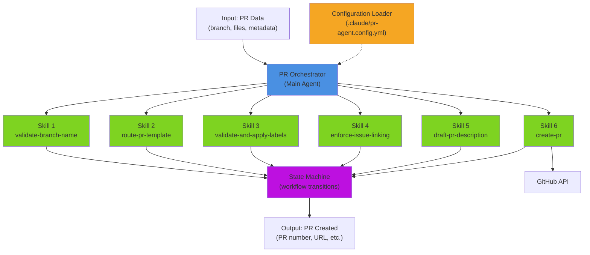
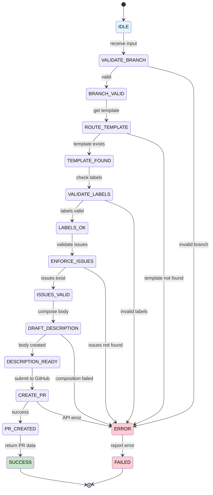
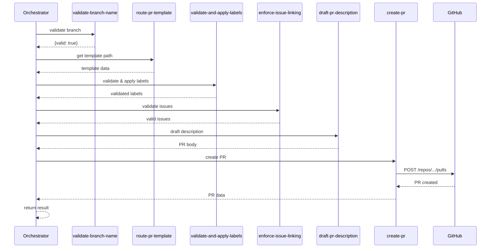
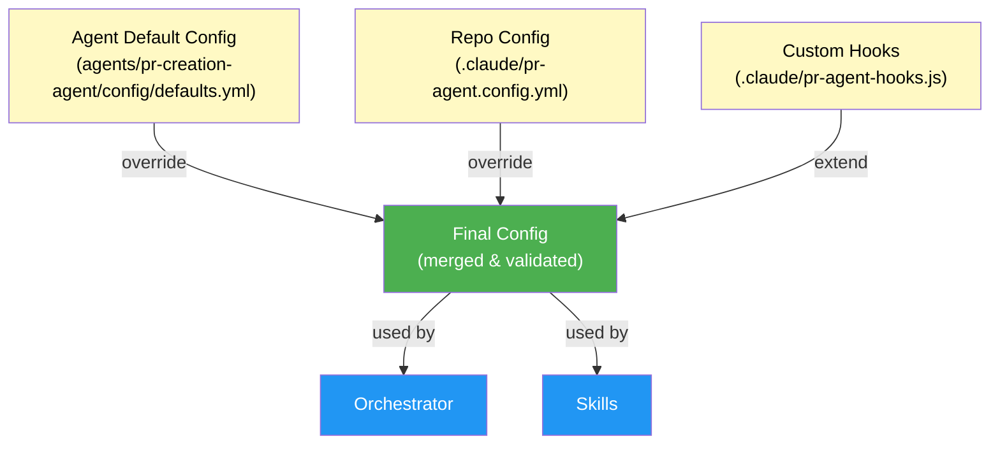
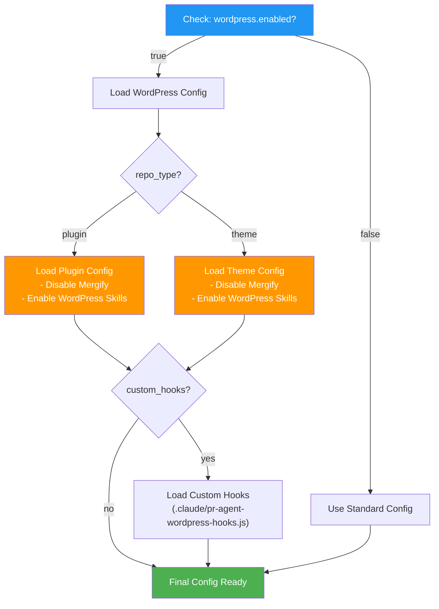

# PR Creation Agent — Architecture & Design

**Phase:** 2 (Specification)  
**Document Type:** Architecture & Integration Patterns  
**Timeline:** Reference for Phase 3 Implementation (2026-08-20 → 2026-09-02)

---

## 1. AGENT ARCHITECTURE OVERVIEW

### 1.1 High-Level System Diagram



---

## 2. AGENT WORKFLOW STATE MACHINE

### 2.1 State Diagram



---

## 3. SKILL EXECUTION SEQUENCE

### 3.1 Sequential Skill Flow



---

## 4. CONFIGURATION HIERARCHY

### 4.1 Configuration Loading Diagram



---

## 5. SKILL INTERFACE CONTRACTS

### 5.1 Skill 1: validate-branch-name

```
Interface: validateBranchName(branchName, config)
Input:
  - branchName: string (e.g., 'feat/pr-creation-agent')
  - config: {
      allowedTypes: string[],
      customRules?: function,
      maxLength?: number
    }

Output:
  {
    valid: boolean,
    errors: string[],
    branch: {
      type: string,
      scope: string,
      title: string
    }
  }

Contract:
  ✓ Must validate format {type}/{scope}-{short-title}
  ✓ Must check type against allowed_types config
  ✓ Must call custom validation hooks if provided
  ✓ Must return actionable error messages
```

### 5.2 Skill 2: route-pr-template

```
Interface: routePRTemplate(branchName, templatesPath, config)
Input:
  - branchName: string
  - templatesPath: string
  - config: {
      customRouting?: object,
      fallbackTemplate?: string
    }

Output:
  {
    templatePath: string,
    templateType: string,
    metadata: {
      requiredSections: string[],
      optionalSections: string[]
    }
  }

Contract:
  ✓ Must load from .github/PULL_REQUEST_TEMPLATE/config.yml
  ✓ Must support custom routing via config
  ✓ Must return template metadata (sections, etc.)
  ✓ Must provide fallback template
```

### 5.3 Skill 3: validate-and-apply-labels

```
Interface: validateAndApplyLabels(userLabels, files, config)
Input:
  - userLabels: string[]
  - files: string[]
  - config: {
      canonicalLabelsPath: string,
      inferFromFiles: boolean,
      filePatterns?: object
    }

Output:
  {
    validLabels: string[],
    inferredLabels: string[],
    allLabels: string[],
    errors: string[]
  }

Contract:
  ✓ Must validate against canonical label set
  ✓ Must infer labels from files if enabled
  ✓ Must support file pattern mapping
  ✓ Must return deduplicated label list
```

### 5.4 Skill 4: enforce-issue-linking

```
Interface: enforceIssueLinking(linkedIssues, config, githubClient)
Input:
  - linkedIssues: string[] (e.g., ['#1234', '#1235'])
  - config: {
      required: boolean,
      allowedVerbs: string[]
    }
  - githubClient: GitHub API client

Output:
  {
    validIssues: object[],
    errors: string[],
    requirementMet: boolean
  }

Contract:
  ✓ Must validate issue numbers exist
  ✓ Must check issues are open (not closed)
  ✓ Must enforce required linking if configured
  ✓ Must validate verb format (Resolves, Closes, etc.)
```

### 5.5 Skill 5: draft-pr-description

```
Interface: draftPRDescription(template, metadata, config)
Input:
  - template: string (markdown template)
  - metadata: {
      userDescription: string,
      linkedIssues: object[],
      files: string[],
      scope: 'single-file' | 'multi-file' | 'complex'
    }
  - config: {
      changelogFile: string,
      changelogRequired: boolean
    }

Output:
  {
    prBody: string,
    metadata: {
      sections: string[],
      hasChangelog: boolean,
      scope: string
    }
  }

Contract:
  ✓ Must populate all template sections
  ✓ Must adapt description depth based on scope
  ✓ Must include linked issues in PR body
  ✓ Must optionally generate changelog entry
```

### 5.6 Skill 6: create-pr

```
Interface: createPR(prData, githubClient)
Input:
  - prData: {
      title: string,
      body: string,
      branch: string,
      labels: string[],
      draft?: boolean,
      repo: string
    }
  - githubClient: GitHub API client

Output:
  {
    pr: {
      number: number,
      url: string,
      sha: string,
      draft: boolean
    },
    error?: string
  }

Contract:
  ✓ Must create PR on specified branch
  ✓ Must apply labels programmatically
  ✓ Must support draft/ready modes
  ✓ Must handle GitHub API rate limits
  ✓ Must return PR details or error
```

---

## 6. ERROR HANDLING ARCHITECTURE

### 6.1 Error Flow Diagram

```mermaid
graph TB
    Error["Error Occurs<br/>(in any skill)"]
    Classify["Classify Error<br/>(type & severity)"]
    
    Transient{"Transient<br/>(network, rate limit)?"}
    Permanent{"Permanent<br/>(validation, config)?"}
    
    Retry["Retry Logic<br/>(exponential backoff)"]
    RetrySuccess{"Retry<br/>Successful?"}
    
    Report["Report Error<br/>(user-facing message)"]
    Abort["Abort Workflow<br/>(rollback if needed)"]
    
    Error --> Classify
    Classify --> Transient
    
    Transient -->|yes| Retry
    Transient -->|no| Permanent
    
    Retry --> RetrySuccess
    RetrySuccess -->|yes| Success["✓ Continue"]
    RetrySuccess -->|no| Report
    
    Permanent -->|yes| Report
    
    Report --> Abort
    Abort --> [*]
    
    style Error fill:#ffcdd2
    style Retry fill:#fff9c4
    style Report fill:#ffcdd2
    style Success fill:#c8e6c9
```

---

## 7. CONFIGURATION LOADING SEQUENCE

### 7.1 Config Loading Flow

```
1. Check for .claude/pr-agent.config.yml
   ├─ If exists: load and validate
   └─ If not: use defaults

2. Load defaults from agents/pr-creation-agent/config/defaults.yml

3. Merge: defaults + repo config
   ├─ Repo config overrides defaults
   └─ Validate merged config against schema

4. Check for .claude/pr-agent-hooks.js
   ├─ If exists: load custom hooks
   └─ Register hooks with orchestrator

5. Validate complete config
   ├─ Schema validation
   ├─ Path existence checks
   └─ Permission verification

6. Return config to orchestrator
```

---

## 8. INTEGRATION POINTS

### 8.1 GitHub Integration Points

| Integration | Method | Purpose |
|-------------|--------|---------|
| **Load Templates** | GitHub API `GET /repos/.../contents/.github/PULL_REQUEST_TEMPLATE/` | Fetch PR templates |
| **Load Labels** | GitHub API `GET /repos/.../labels` | Get canonical label set |
| **Validate Issues** | GitHub API `GET /repos/.../issues/{number}` | Check issue exists & status |
| **Create PR** | GitHub API `POST /repos/.../pulls` | Create pull request |
| **Apply Labels** | GitHub API `PATCH /repos/.../pulls/{pr}/labels` | Add labels to PR |

### 8.2 Existing Skill Integrations

| Skill | Integration | Usage |
|-------|-------------|-------|
| **code-review** | Optional pre-PR review | Can be called before PR creation |
| **commit-push-pr** | Git operations | Uses patterns from this skill |
| **commit** | Commit signing | Uses agent signature pattern |
| **figma** | Design-to-code | Optional for design-driven PRs |

---

## 9. EXTENSION POINTS

### 9.1 Custom Hooks Architecture

```javascript
// .claude/pr-agent-hooks.js

module.exports = {
  // Called before validation
  onBeforeValidate: async (input) => {
    // Custom pre-validation logic
    return input; // modified input or original
  },
  
  // Called after branch validation
  onAfterValidateBranch: async (result) => {
    // Custom branch handling
    return result;
  },
  
  // Called for custom label inference
  inferLabelsCustom: async (files, config) => {
    // Custom label inference
    return ['type:custom', 'area:custom'];
  },
  
  // Called before PR creation
  onBeforeCreatePR: async (prData) => {
    // Final modifications to PR data
    return prData;
  },
  
  // Called after PR creation
  onAfterCreatePR: async (pr) => {
    // Post-creation actions (Slack, etc.)
    return pr;
  }
};
```

---

## 10. WORDPRESS-SPECIFIC ARCHITECTURE

### 10.1 WordPress Config Integration



---

## 11. DEPLOYMENT ARCHITECTURE

### 11.1 Multi-Repo Deployment Pattern

```
Agent Location: agents/pr-creation-agent/

Per-Repo Configuration:
├── lightspeedwp/.github/
│   └── .claude/pr-agent.config.yml (GitHub control plane config)
│
├── lightspeedwp/wordpress-plugin-a/
│   └── .claude/pr-agent.config.yml (plugin config)
│   └── .claude/pr-agent-hooks.js (optional plugin hooks)
│
├── lightspeedwp/wordpress-theme-b/
│   └── .claude/pr-agent.config.yml (theme config)
│
└── ... 9 more repos (all with repo-specific config)

Skill Usage:
├── validate-branch-name (all repos)
├── route-pr-template (all repos)
├── validate-and-apply-labels (all repos)
├── enforce-issue-linking (all repos)
├── draft-pr-description (all repos)
├── create-pr (all repos)
└── WordPress-specific skills (enabled only if wordpress.enabled: true)
```

---

## 12. PHASE 3 IMPLEMENTATION GUIDANCE

**Based on this architecture, Phase 3 will implement:**

1. **Core Agent Files**
   - `pr-orchestrator.js` — main orchestrator following state machine
   - `config-loader.js` — configuration loading with hierarchy
   - `state-machine.js` — workflow state transitions

2. **Skill Implementations**
   - Each skill file implements its contract
   - All skills follow orchestrator interface
   - Custom hooks supported throughout

3. **Integration Layer**
   - GitHub API client wrapper
   - Error handling & retries
   - Rate limit management

4. **Test Suite**
   - Unit tests per skill (95%+ coverage)
   - Integration tests with mock GitHub API
   - E2E tests against real repos

---

**Architecture Complete. Ready for Phase 3 Implementation.**
