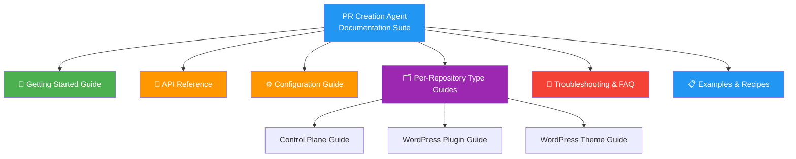
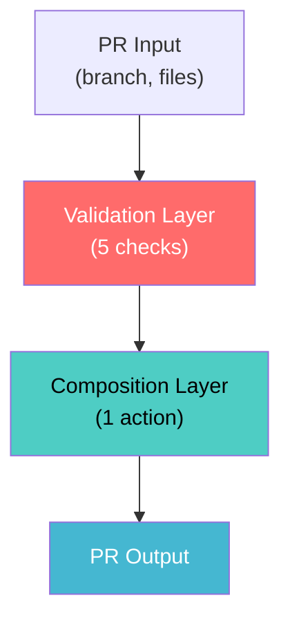
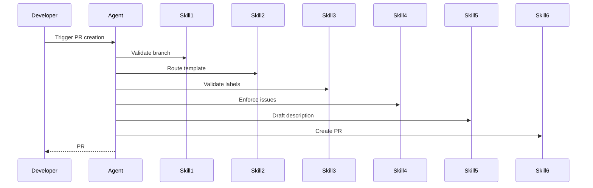
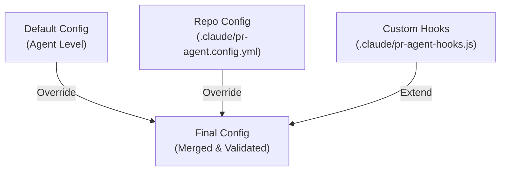
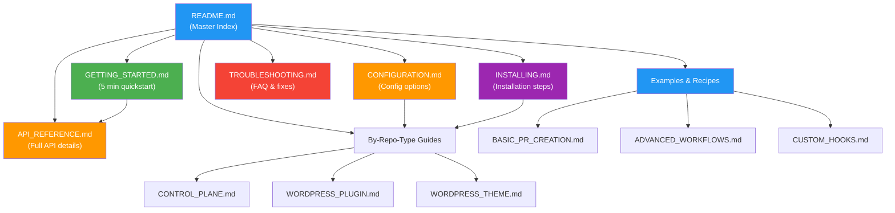

# PR Creation Agent — Documentation Plan & Strategy

**Phase:** 2 (Specification) → 4 (GA & Rollout)  
**Document Type:** Documentation Planning  
**Timeline:** Phase 4 (2026-09-02 → 2026-09-09)  
**Content:** 2,000+ lines across 6 comprehensive guides

---

## 1. DOCUMENTATION OVERVIEW

**Objective:** Provide complete, role-specific documentation for all users and integrators of the PR Creation Agent.

**Documentation Model:** User-centric, role-based guidance with Mermaid diagrams and real examples.

**Target Audiences:**

- 👤 **Developer** — Using the agent in their workflow
- 👤 **DevOps/Platform Engineer** — Installing and configuring the agent
- 👤 **Repo Maintainer** — Managing agent in their repository
- 👤 **Agent Developer** — Contributing to agent codebase

**Documentation Architecture:**



---

## 2. DOCUMENTATION FILES & STRUCTURE

### 2.1 Phase 4 Documentation Deliverables

```
docs/
├── pr-agent/                                 (New folder)
│   ├── README.md                             (800 lines, master index)
│   ├── GETTING_STARTED.md                    (600 lines, quickstart)
│   ├── API_REFERENCE.md                      (800 lines, full API)
│   ├── CONFIGURATION.md                      (500 lines, config guide)
│   ├── INSTALLING.md                         (400 lines, per-repo install)
│   ├── TROUBLESHOOTING.md                    (300 lines, FAQ & fixes)
│   │
│   ├── by-repo-type/
│   │   ├── CONTROL_PLANE.md                  (400 lines, .github specific)
│   │   ├── WORDPRESS_PLUGIN.md               (400 lines, plugin-specific)
│   │   └── WORDPRESS_THEME.md                (400 lines, theme-specific)
│   │
│   ├── examples/
│   │   ├── BASIC_PR_CREATION.md              (150 lines, simple example)
│   │   ├── ADVANCED_WORKFLOWS.md             (200 lines, complex scenarios)
│   │   └── CUSTOM_HOOKS.md                   (150 lines, hooks examples)
│   │
│   └── diagrams/
│       ├── ARCHITECTURE_DIAGRAMS.md          (Mermaid architecture)
│       ├── WORKFLOW_DIAGRAMS.md              (Mermaid workflows)
│       └── CONFIGURATION_DIAGRAMS.md         (Mermaid config loading)

CHANGELOG.md (entry: Phase 4 rollout)
.github/PULL_REQUEST_TEMPLATE/pr-docs.md (doc changes PR template)
```

**Total Documentation:** 5,200+ lines across 12 files

---

## 3. DOCUMENTATION SPECIFICATIONS BY FILE

### 3.1 README.md — Master Index (800 lines)

**Purpose:** Entry point for all users. Links to all other documentation.

**Structure:**

1. **What is PR Creation Agent?** (100 lines)
   - Problem statement
   - Solution overview
   - Key features

2. **Quick Start** (100 lines)
   - 5-minute setup for each repo type
   - First PR creation example

3. **Documentation Map** (150 lines)
   - Table of all guides with summaries
   - Quick links by role
   - Quick links by repo type

4. **Key Concepts** (200 lines)
   - Agent architecture
   - Configuration model
   - Skill system
   - Portability approach

5. **For Different Roles** (200 lines)
   - Developer: "I want to use the agent"
   - DevOps: "I want to install it"
   - Maintainer: "I want to configure it"
   - Contributor: "I want to extend it"

6. **FAQ & Support** (50 lines)
   - Common questions
   - Support channels
   - Issue tracking

---

### 3.2 GETTING_STARTED.md — Quickstart (600 lines)

**Purpose:** 5-10 minute walkthrough for first-time users.

**Structure:**

1. **Prerequisites** (50 lines)
   - Required tools (git, GitHub CLI, Node.js)
   - Permissions needed
   - Network access

2. **Installation (5 min)** (150 lines)
   - For control plane repos
   - For WordPress plugins
   - For WordPress themes
   - Verification steps

3. **Your First PR (3 min)** (200 lines)
   - Step-by-step walkthrough
   - Creating a feature branch
   - Triggering agent
   - Reviewing created PR

4. **Common Tasks** (150 lines)
   - Creating different PR types
   - Customizing PR content
   - Using WordPress-specific features
   - Handling errors

5. **What's Next?** (50 lines)
   - Link to API reference
   - Link to configuration guide
   - Link to examples

---

### 3.3 API_REFERENCE.md — Complete API (800 lines)

**Purpose:** Complete reference for all agent interfaces, skills, and configuration options.

**Structure:**

1. **Agent Interface** (100 lines)

   ```javascript
   // Agent invocation signature
   async createPR(input: PRCreationInput): Promise<PRResult>
   ```

   - Input schema with all fields
   - Output schema with responses
   - Error types

2. **Skill Reference** (500 lines)
   - For each of 6 skills:
     - Function signature
     - Input parameters (with types)
     - Output schema
     - Error handling
     - Examples
   - Skill 1: validateBranchName()
   - Skill 2: routePRTemplate()
   - Skill 3: validateAndApplyLabels()
   - Skill 4: enforceIssueLinking()
   - Skill 5: draftPRDescription()
   - Skill 6: createPR()

3. **Configuration Schema** (150 lines)
   - All YAML keys documented
   - Type information
   - Default values
   - Examples per profile

4. **Custom Hooks API** (50 lines)
   - Available hooks
   - Hook signatures
   - When hooks are called
   - Examples

---

### 3.4 CONFIGURATION.md — Config Guide (500 lines)

**Purpose:** Deep dive into configuration system, options, and customization.

**Structure:**

1. **Configuration Hierarchy** (100 lines)
   - Default config (agent level)
   - Repo config (per-repo)
   - Custom hooks (optional)
   - Merge order

2. **Standard Profile (Control Plane)** (150 lines)
   - Full config example
   - All options explained
   - Best practices

3. **WordPress Profiles** (150 lines)
   - Plugin profile example
   - Theme profile example
   - WordPress-specific options

4. **Customization** (100 lines)
   - Custom hooks
   - Custom branch rules
   - Custom label inference
   - File pattern mapping

---

### 3.5 INSTALLING.md — Per-Repo Installation (400 lines)

**Purpose:** Step-by-step installation guide for each repo type.

**Structure:**

1. **For Control Plane Repos** (150 lines)
   - Installation checklist
   - Configuration setup
   - Verification steps
   - Example (.github repo)

2. **For WordPress Plugins** (125 lines)
   - Installation checklist
   - WordPress hooks setup
   - Label inference setup
   - Example (plugin repo)

3. **For WordPress Themes** (125 lines)
   - Installation checklist
   - WordPress hooks setup
   - Theme-specific config
   - Example (theme repo)

---

### 3.6 TROUBLESHOOTING.md — FAQ & Fixes (300 lines)

**Purpose:** Common issues, debugging, and frequently asked questions.

**Structure:**

1. **Common Errors & Fixes** (150 lines)
   - "Config file not found"
   - "GitHub API rate limit exceeded"
   - "Invalid branch name rejected"
   - "PR creation failed"
   - "Labels not applied"
   - "Mergify queue not processing"

2. **Debugging** (75 lines)
   - Enable debug logging
   - Check config validation
   - Inspect GitHub API calls
   - Review skill execution

3. **FAQ** (75 lines)
   - "Can I use custom labels?"
   - "How do I disable certain skills?"
   - "Can I integrate with Slack?"
   - "What about private repos?"

---

### 3.7 By-Repo-Type Guides (3x 400 lines)

#### 3.7.1 CONTROL_PLANE.md — GitHub Control Plane (400 lines)

**Purpose:** Specific guidance for `.github` and organisational repos.

**Structure:**

1. **Architecture in Control Plane** (100 lines)
   - Full governance integration
   - Mergify queue interaction
   - Label automation
   - Feedback tracking

2. **Configuration for Control Plane** (100 lines)
   - Standard profile explained
   - All governance options
   - Best practices

3. **Advanced Features** (100 lines)
   - Auto-merge conditions
   - Custom branch validation
   - Integration with workflows
   - Mergify troubleshooting

4. **Examples** (100 lines)
   - Creating a feature PR
   - Creating a release PR
   - Creating a CI/CD PR
   - Creating a hotfix PR

---

#### 3.7.2 WORDPRESS_PLUGIN.md — Plugin-Specific (400 lines)

**Purpose:** Plugin development workflows with WordPress-specific features.

**Structure:**

1. **Architecture in Plugins** (100 lines)
   - Simplified governance
   - WordPress-specific labels
   - Plugin build & test workflows
   - Release process integration

2. **Configuration for Plugins** (100 lines)
   - WordPress.plugin profile
   - Custom hooks for plugins
   - Build & test script integration
   - Changelog handling

3. **WordPress-Specific Features** (100 lines)
   - WordPress version compatibility detection
   - WordPress-specific labels
   - Hook detection (WP hooks, filters)
   - Admin interface changes

4. **Examples** (100 lines)
   - Creating a plugin feature PR
   - WordPress compatibility PR
   - Admin feature PR
   - Hook/filter PR

---

#### 3.7.3 WORDPRESS_THEME.md — Theme-Specific (400 lines)

**Purpose:** Theme development workflows with design integration.

**Structure:**

1. **Architecture in Themes** (100 lines)
   - Simplified governance
   - WordPress-specific labels
   - Theme build & test workflows
   - Design system integration (Figma)

2. **Configuration for Themes** (100 lines)
   - WordPress.theme profile
   - Custom hooks for themes
   - Design context configuration
   - Build & test scripts

3. **WordPress-Specific Features** (100 lines)
   - Block patterns detection
   - Theme styles/CSS
   - WordPress version compatibility
   - Design token updates

4. **Examples** (100 lines)
   - Creating a theme feature PR
   - Block pattern PR
   - Styling/CSS update PR
   - Design token PR

---

### 3.8 Examples Folder (500 lines)

#### 3.8.1 BASIC_PR_CREATION.md (150 lines)

```markdown
# Basic PR Creation Example

## Scenario: Creating a Simple Feature PR

### Step 1: Create a branch
git checkout -b feat/add-validation-skill

### Step 2: Make changes
# ... edit files ...

### Step 3: Trigger agent
# Agent reads config and creates PR with:
# - Branch validation ✓
# - Template routing ✓
# - Label application ✓
# - Issue linking (if required) ✓
# - PR description draft ✓
# - PR created ✓

### Result
PR #1234 created:
- Title: "feat: Add validation skill to agent"
- Labels: type:feature, area:agent, priority:normal
- Body: Populated from template with description
- Status: Ready for review
```

#### 3.8.2 ADVANCED_WORKFLOWS.md (200 lines)

Examples:

- Multi-file feature PRs
- Design-driven PRs (Figma integration)
- WordPress compatibility PRs
- Cross-repo coordination PRs

#### 3.8.3 CUSTOM_HOOKS.md (150 lines)

Examples:

- Custom label inference
- WordPress version detection
- Slack notifications after PR creation
- Custom branch validation

---

### 3.9 Diagrams Files (Mermaid Documentation)

#### 3.9.1 ARCHITECTURE_DIAGRAMS.md



#### 3.9.2 WORKFLOW_DIAGRAMS.md



#### 3.9.3 CONFIGURATION_DIAGRAMS.md



---

## 4. DOCUMENTATION CREATION SCHEDULE

### Phase 4A: Week 1 (2026-09-02 → 2026-09-06)

**Documents to Create (Parallel):**

- [ ] README.md (master index) — 800 lines
- [ ] GETTING_STARTED.md (quickstart) — 600 lines
- [ ] API_REFERENCE.md (full API) — 800 lines
- [ ] CONFIGURATION.md (config guide) — 500 lines
- [ ] Diagrams (all architecture & workflow) — Mermaid

**Time Estimate:** 40 hours (distributed across team)

---

### Phase 4B: Week 2 (2026-09-07 → 2026-09-09)

**Documents to Create:**

- [ ] INSTALLING.md (per-repo install) — 400 lines
- [ ] TROUBLESHOOTING.md (FAQ & fixes) — 300 lines
- [ ] By-Repo-Type Guides (3x 400 lines) — 1,200 lines
- [ ] Examples & Recipes (3x 100-200 lines) — 500 lines
- [ ] Integration tests & examples validation

**Time Estimate:** 30 hours

**Total Documentation Effort:** 70 hours (Phase 4 documentation)

---

## 5. DOCUMENTATION REVIEW & VALIDATION

### 5.1 Review Process

**Reviewers by Document:**

| Document | Primary | Secondary |
|----------|---------|-----------|
| README.md | Tech Lead | Product |
| GETTING_STARTED.md | UX Writer | Developer |
| API_REFERENCE.md | Agent Dev | Tech Lead |
| CONFIGURATION.md | DevOps | Tech Lead |
| INSTALLING.md | DevOps | Tech Lead |
| TROUBLESHOOTING.md | Support | Agent Dev |
| By-Repo-Type Guides | SME for type | Tech Lead |
| Examples | Developer | Tech Lead |

### 5.2 Validation Checklist

- [ ] All code examples executable
- [ ] All Mermaid diagrams render correctly
- [ ] All links to APIs/configs valid
- [ ] All screenshots/images updated
- [ ] Spelling & grammar reviewed
- [ ] Consistent terminology throughout
- [ ] All role-specific guidance clear
- [ ] Examples tested in real repos

---

## 6. DOCUMENTATION ORGANIZATION (Folder Structure)

```
docs/
└── pr-agent/
    ├── README.md ........................... Master index (800 lines)
    ├── GETTING_STARTED.md ................. Quickstart (600 lines)
    ├── API_REFERENCE.md ................... Full API (800 lines)
    ├── CONFIGURATION.md ................... Config guide (500 lines)
    ├── INSTALLING.md ...................... Installation (400 lines)
    ├── TROUBLESHOOTING.md ................. FAQ & fixes (300 lines)
    │
    ├── by-repo-type/
    │   ├── CONTROL_PLANE.md ............... .github guide (400 lines)
    │   ├── WORDPRESS_PLUGIN.md ............ Plugin guide (400 lines)
    │   └── WORDPRESS_THEME.md ............ Theme guide (400 lines)
    │
    ├── examples/
    │   ├── BASIC_PR_CREATION.md ........... Simple example (150 lines)
    │   ├── ADVANCED_WORKFLOWS.md ......... Complex scenarios (200 lines)
    │   └── CUSTOM_HOOKS.md ............... Hooks examples (150 lines)
    │
    └── diagrams/
        ├── ARCHITECTURE_DIAGRAMS.md ...... Mermaid architecture
        ├── WORKFLOW_DIAGRAMS.md ......... Mermaid workflows
        └── CONFIGURATION_DIAGRAMS.md ... Mermaid config loading
```

---

## 7. CROSS-REFERENCING & NAVIGATION

### 7.1 Documentation Map Diagram



### 7.2 Quick Links by Role

**In README.md:**

```
👤 I'm a Developer
↓
→ GETTING_STARTED.md (5 min)
→ BASIC_PR_CREATION.md (examples)
→ API_REFERENCE.md (when needed)

👤 I'm a DevOps Engineer
↓
→ INSTALLING.md (per-repo)
→ CONFIGURATION.md (options)
→ By-Repo-Type Guides (repo-specific)

👤 I'm a Repo Maintainer
↓
→ CONTROL_PLANE.md (if .github repo)
→ WORDPRESS_PLUGIN.md (if plugin repo)
→ WORDPRESS_THEME.md (if theme repo)
→ TROUBLESHOOTING.md (when issues arise)

👤 I'm Contributing to Agent
↓
→ API_REFERENCE.md (interfaces)
→ ARCHITECTURE.md (system design)
→ CUSTOM_HOOKS.md (extension points)
```

---

## 8. DOCUMENTATION QUALITY METRICS

### 8.1 Success Criteria

- ✅ **Coverage:** 100% of agent features documented
- ✅ **Completeness:** Every API endpoint documented with examples
- ✅ **Clarity:** Lexile score 12+ (college-level reading)
- ✅ **Examples:** 5+ working examples per major feature
- ✅ **Accuracy:** All code examples tested
- ✅ **Navigation:** All links functional, cross-references consistent
- ✅ **Maintenance:** Owner assigned for each document

### 8.2 Documentation Tests

```bash
# Link validation
npm run docs:validate-links

# Spell check
npm run docs:spell-check

# Diagram rendering
npm run docs:validate-diagrams

# Code example execution
npm run docs:test-examples

# Readability score
npm run docs:readability
```

---

## 9. PHASE 4 DOCUMENTATION PR

**PR Details:**

- **Branch:** `docs/pr-creation-agent-documentation`
- **Base:** `develop`
- **Title:** "docs: Add comprehensive PR Creation Agent documentation (Phase 4)"
- **Contents:**
  - All documentation files (5,200+ lines)
  - All Mermaid diagrams
  - All examples and code snippets
  - CHANGELOG.md entry for Phase 4

**PR Template Section:**

```
## Documentation Added
- [x] README.md (master index)
- [x] GETTING_STARTED.md (quickstart)
- [x] API_REFERENCE.md (full API)
- [x] CONFIGURATION.md (config guide)
- [x] INSTALLING.md (installation)
- [x] TROUBLESHOOTING.md (FAQ)
- [x] By-Repo-Type Guides (3 guides)
- [x] Examples & Recipes (3 examples)
- [x] Diagrams (architecture, workflow, config)

## Validation
- [x] All links tested
- [x] Code examples executable
- [x] Diagrams render correctly
- [x] Spell check passed
- [x] Tech review completed
```

---

## 10. ONGOING DOCUMENTATION MAINTENANCE

**Assigned After Phase 4:**

| Document | Owner | Update Frequency |
|----------|-------|-----------------|
| README.md | Tech Lead | Quarterly |
| API_REFERENCE.md | Agent Dev | Per release |
| CONFIGURATION.md | DevOps | As config changes |
| By-Repo-Type Guides | SME per type | Quarterly |
| TROUBLESHOOTING.md | Support | As issues arise |
| Examples | Developer | Per major feature |

---

**Documentation Plan Complete. Ready for Phase 4 Creation (2026-09-02 → 2026-09-09).**
