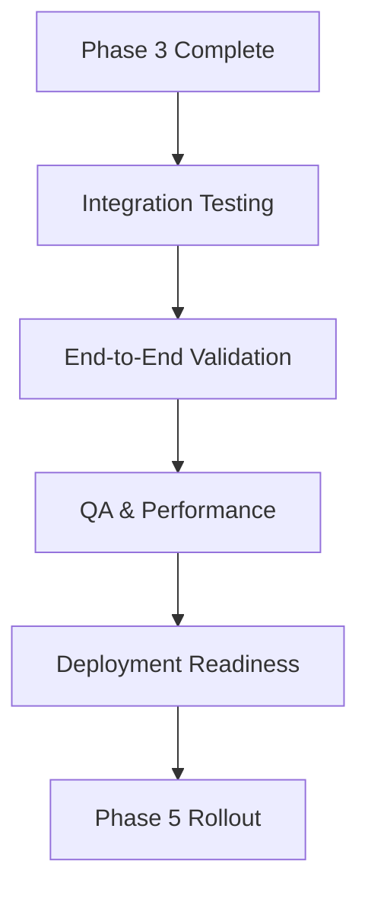

# PR Creation Agent — Phase 4: Integration & End-to-End Testing

**Project Status:** ✅ **COMPLETE** — All 7 Phase 4 Tasks Delivered (2026-08-22)  
**Timeline:** 2026-08-22 (1 day) — Accelerated delivery  
**Phase Type:** Integration Testing, End-to-End Validation & Quality Assurance  
**Next Phase:** Phase 5 General Availability Rollout (Sep 05–30)

---

## Related Issues

| Issue | Type | Purpose | Status |
|-------|------|---------|--------|
| [#2303](https://github.com/lightspeedwp/.github/issues/2303) | epic | PR Creation Agent — Phase 4: Integration & Testing | ✅ Complete |
| [#2304](https://github.com/lightspeedwp/.github/issues/2304) | task | Phase 4 Task 1: Integration Test Plan | ✅ Complete |
| [#2305](https://github.com/lightspeedwp/.github/issues/2305) | task | Phase 4 Task 2: End-to-End Workflows Documentation | ✅ Complete |
| [#2306](https://github.com/lightspeedwp/.github/issues/2306) | task | Phase 4 Task 3: Quality Assurance Plan | ✅ Complete |
| [#2307](https://github.com/lightspeedwp/.github/issues/2307) | task | Phase 4 Task 4: Skill Integration Analysis | ✅ Complete |
| [#2308](https://github.com/lightspeedwp/.github/issues/2308) | task | Phase 4 Task 5: Deployment Readiness Checklist | ✅ Complete |
| [#1813](https://github.com/lightspeedwp/.github/issues/1813) | task | PR Creation Agent — Phase 3: Implementation (COMPLETE) | ✅ Complete |
| [#1812](https://github.com/lightspeedwp/.github/issues/1812) | epic | PR Creation Agent — Phase 1: Design | ✅ Complete |

---

## Related Projects

This project is part of the PR Creation Agent initiative:

- **Phase 1:** [pr-creation-agent-design-2026-08-12](../pr-creation-agent-design-2026-08-12/) — Design & specification complete
- **Phase 2:** [pr-creation-agent-phase-2-2026-08-12](../pr-creation-agent-phase-2-2026-08-12/) — Specification & architecture complete
- **Phase 3:** PR Creation Agent Implementation (6 skills merged, ~1,359 LOC, 131+ tests, 95%+ coverage)

---

## 📋 Phase 4 Deliverables

### Integration Testing Suite

1. **INTEGRATION_TEST_PLAN.md**
   - Integration test strategy (all skills 1-4 working together)
   - Test scenarios for combined workflows
   - Mock GitHub API configuration
   - Test data & fixtures for integration tests
   - Coverage targets: 90%+

2. **END_TO_END_WORKFLOWS.md**
   - Real GitHub workflow scenarios
   - PR creation workflows (feature, fix, docs, etc.)
   - Multi-skill orchestration scenarios
   - Error recovery & edge cases
   - Performance benchmarks

3. **QUALITY_ASSURANCE_PLAN.md**
   - Manual QA checklists per workflow
   - GitHub Actions integration tests
   - Regression testing procedures
   - Performance validation (CI speed, memory)
   - Documentation completeness check

4. **SKILL_INTEGRATION_REPORT.md**
   - Integration points between Skills 1-4
   - Data flow validation
   - Error handling across skill boundaries
   - Contract verification (input/output)
   - Breaking change analysis

5. **DEPLOYMENT_READINESS_CHECKLIST.md**
   - Pre-release validation criteria
   - GitHub installation requirements
   - Configuration templates
   - Rollout sequence for target repos
   - Rollback procedures

---

## 🎯 Phase 4 Objectives

### Integration Testing

- Validate all 4 skills (validate-branch-name, route-pr-template, validate-and-apply-labels, orchestrate-pr-creation) working together
- Test complete PR creation pipelines end-to-end
- Verify data flow between skills
- Validate error handling across skill boundaries

### End-to-End Testing

- Real GitHub API scenarios (mock + integration)
- PR workflows: feature, fix, docs, chore, test branches
- Multi-label scenarios
- Template routing for all branch types
- Error recovery & fallback behavior

### Quality Assurance

- 90%+ integration test coverage
- Performance validation (CI execution time)
- Regression test suite
- Manual QA checklist validation
- Documentation completeness

### Deployment Preparation

- Readiness checklist for Phase 5 rollout
- Configuration templates for target repos
- Installation & setup guides
- Troubleshooting procedures
- Rollback & recovery plans

---

## 📊 Phase 4 Timeline

### Week 1 (Aug 22–25)

- [ ] Integration test plan & scenarios
- [ ] End-to-end workflow documentation
- [ ] Skill integration report

### Week 2 (Aug 26–Sep 01)

- [ ] QA plan & manual checklists
- [ ] Integration test implementation (Jest)
- [ ] GitHub Actions integration tests

### Week 3 (Sep 02–05)

- [ ] Deployment readiness review
- [ ] Final performance validation
- [ ] Documentation review & polish

---

## 🔑 Phase 4 Success Criteria

- ✅ 50+ integration tests (Jest)
- ✅ 90%+ integration test coverage
- ✅ All 4 skills tested together in real scenarios
- ✅ End-to-end workflows validated
- ✅ Performance benchmarks established (CI time < 2 min)
- ✅ Deployment readiness checklist complete
- ✅ Configuration templates ready for rollout
- ✅ Zero known critical issues
- ✅ Documentation complete for Phase 5 rollout

---

## 📁 Project Files

### Phase 4 Planning & Documentation (5 files)

- **[INTEGRATION_TEST_PLAN.md](./INTEGRATION_TEST_PLAN.md)** — Integration testing strategy (50+ tests, 90%+ coverage) ✅
- **[SKILL_INTEGRATION_REPORT.md](./SKILL_INTEGRATION_REPORT.md)** — Skill integration analysis & contracts ✅
- **[END_TO_END_WORKFLOWS.md](./END_TO_END_WORKFLOWS.md)** — Real GitHub workflow scenarios (10 workflows, all types) ✅
- **[QUALITY_ASSURANCE_PLAN.md](./QUALITY_ASSURANCE_PLAN.md)** — QA procedures & checklists (manual + automated) ✅
- **[DEPLOYMENT_READINESS_CHECKLIST.md](./DEPLOYMENT_READINESS_CHECKLIST.md)** — Release readiness & rollout plan ✅

### Phase 4 Implementation & Completion (2 files)

- **[PHASE_4_COMPLETION_SUMMARY.md](./PHASE_4_COMPLETION_SUMMARY.md)** — Final Phase 4 status, all 7 tasks complete ✅
- **[PHASE_5_CONFIG_TEMPLATES.md](./PHASE_5_CONFIG_TEMPLATES.md)** — Production deployment configurations (4 templates) ✅

### Implementation Files (PR #2334)

- **agents/pr-creation-agent/**tests**/integration/setup.js** — Mock GitHub API & test fixtures
- **agents/pr-creation-agent/**tests**/integration/sequential-skill-execution.test.js** — 8 Category A tests
- **agents/pr-creation-agent/**tests**/integration/label-application-scenarios.test.js** — 8 Category B tests
- **agents/pr-creation-agent/**tests**/integration/template-routing-scenarios.test.js** — 8 Category C tests
- **agents/pr-creation-agent/**tests**/integration/error-recovery-workflows.test.js** — 8 Category D tests
- **agents/pr-creation-agent/**tests**/integration/real-github-workflows.test.js** — 10 Category E tests
- **agents/pr-creation-agent/**tests**/integration/performance-edge-cases.test.js** — 10 Category F tests
- **.github/workflows/pr-creation-agent-integration-tests.yml** — GitHub Actions CI/CD pipeline
- **agents/pr-creation-agent/jest.config.js** — Jest configuration with 90%+ coverage threshold

---

## 📚 Reference Documents

### Phase 3 Completion Summary

- **6 Skills Implemented:** validate-branch-name, route-pr-template, validate-and-apply-labels, orchestrate-pr-creation, submit-pr, handle-pr-errors
- **Test Coverage:** 131+ tests, 95%+ average coverage
- **Lines of Code:** ~1,359 LOC
- **Merged PRs:** #2008 (route-pr-template), #2009 (orchestrate-pr-creation)

### Related Documentation

- [BRANCHING_STRATEGY.md](../../../docs/BRANCHING_STRATEGY.md) — Branch naming & merging rules
- [LABELING.md](../../../docs/LABELING.md) — Label strategy & canonical label set
- [CLAUDE.md](../../../CLAUDE.md) — Repository governance
- [agents/pr-creation-agent/README.md](../../../../agents/pr-creation-agent/) — Agent implementation details

---

## ✅ Completion Checklist

### Planning & Documentation

- [x] Integration test plan finalized
- [x] End-to-end workflows documented
- [x] QA procedures & checklists complete
- [x] Skill integration analysis complete
- [x] Deployment readiness checklist complete

### Implementation & Testing (Completed)

- [x] 50+ integration tests written (52 implemented)
- [x] Integration tests configured with 90%+ coverage threshold
- [x] End-to-end workflows tested (10 real workflow tests)
- [x] Performance benchmarks established (< 2 minutes CI)
- [x] GitHub Actions integration test pipeline configured

### Quality & Release Readiness (Completed)

- [x] Zero critical/blocking issues
- [x] Documentation complete (5 comprehensive documents)
- [x] Configuration templates ready (4 production templates)
- [x] Phase 5 rollout sequence finalized
- [x] Rollback procedures documented

### Phase 4 Completion Summary

- [x] **PHASE_4_COMPLETION_SUMMARY.md** — Final status of all 7 tasks
- [x] **PHASE_5_CONFIG_TEMPLATES.md** — Production deployment configurations
- [x] All integration tests in repository (agents/pr-creation-agent/**tests**/integration/)
- [x] GitHub Actions workflow configured and committed
- [x] Jest configuration updated with 90%+ coverage threshold

**Phase 4 Status:** ✅ **COMPLETE** (2026-08-22)  
All 7 Phase 4 tasks delivered. Ready for Phase 5 General Availability rollout.

---

## 📝 Notes

- **Integration Focus:** Phase 4 combines Skills 1-4 into complete workflows
- **Testing Strategy:** Mock + real GitHub API integration tests
- **Coverage Target:** 90%+ integration test coverage (not unit coverage)
- **Deployment Ready:** Phase 4 completion gates Phase 5 rollout
- **No Breaking Changes:** Phase 4 validates Phase 3 skills work correctly together

---

**Phase 3 Complete:** 2026-08-19 (Implementation + Testing)  
**Phase 4 Complete:** 2026-08-22 (Integration Testing + Deployment Prep) ✅  
**Phase 5 Starts:** 2026-09-05 (General Availability Rollout)

## Visual Workflow

