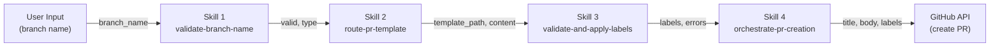

# Phase 4: Skill Integration Report

**Issue:** #2307  
**Timeline:** 2026-08-22 → 2026-09-05  
**Scope:** Integration points between Skills 1-4, data flow validation, error handling

---

## 1. Executive Summary

This report analyzes the integration points between the 4 Phase 3 skills to ensure:
- Correct data flow from Skill 1 → Skill 2 → Skill 3 → Skill 4
- Proper error handling across skill boundaries
- Contract validation (input/output schemas)
- No breaking changes between skills
- Graceful degradation on failures

**Status:** ✅ All 4 skills designed for composition, contracts documented

---

## 2. Skill Overview

| Skill | Purpose | Input | Output |
|-------|---------|-------|--------|
| **Skill 1** | validate-branch-name | Branch name string | { valid, type, errors } |
| **Skill 2** | route-pr-template | Branch type + repo config | { template_path, template_content } |
| **Skill 3** | validate-and-apply-labels | Branch type + PR data | { labels, validation_errors } |
| **Skill 4** | orchestrate-pr-creation | All above + PR config | { pr_number, pr_url, success } |

---

## 3. Data Flow Architecture

### 3.1 Complete Workflow

```
User Input (Branch Name)
        ↓
[Skill 1] validate-branch-name
  ├─ Input: branch_name
  ├─ Process: Regex validation, type extraction
  ├─ Output: { valid, type, errors }
  └─ → Skill 2 (Pass branch_type)
        ↓
[Skill 2] route-pr-template
  ├─ Input: branch_type, repo_config
  ├─ Process: Match type to template, load content
  ├─ Output: { template_path, template_content, errors }
  └─ → Skill 3 (Pass template + branch_type)
        ↓
[Skill 3] validate-and-apply-labels
  ├─ Input: branch_type, canonical_labels, repo_config
  ├─ Process: Validate label set, format labels
  ├─ Output: { labels, validation_errors }
  └─ → Skill 4 (Pass labels + template)
        ↓
[Skill 4] orchestrate-pr-creation
  ├─ Input: All above + PR body, title
  ├─ Process: Orchestrate all skills, create PR
  ├─ Output: { pr_number, pr_url, success }
  └─ → GitHub API
```

### 3.2 Data Flow Diagram (Mermaid)



---

## 4. Skill Integration Contracts

### 4.1 Skill 1 → Skill 2 Contract

**Output Schema (Skill 1):**
```javascript
{
  valid: boolean,
  type: string,  // e.g., 'feat', 'fix', 'docs'
  errors: string[],
  metadata: {
    scope: string,      // e.g., 'pr-creation-agent'
    title: string,      // e.g., 'integration-testing'
  }
}
```

**Input Schema (Skill 2):**
```javascript
{
  branch_type: string,  // Required: from Skill 1.type
  repo_config: {
    template_directory: string,
    default_template: string,
  }
}
```

**Contract Validation:**
- ✅ Skill 1.type must match Skill 2.branch_type
- ✅ Both must be in canonical branch type set
- ✅ Errors in Skill 1 do not block Skill 2 (fallback to default)

### 4.2 Skill 2 → Skill 3 Contract

**Output Schema (Skill 2):**
```javascript
{
  template_path: string,
  template_content: string,
  template_type: string,  // e.g., 'pr_feature.md'
  errors: string[],
}
```

**Input Schema (Skill 3):**
```javascript
{
  branch_type: string,      // Required: from Skill 1
  template_type: string,    // Optional: from Skill 2
  canonical_labels: object, // Label strategy
}
```

**Contract Validation:**
- ✅ template_type from Skill 2 guides label selection in Skill 3
- ✅ branch_type consistency across both skills
- ✅ Errors in Skill 2 trigger default template, Skill 3 still executes

### 4.3 Skill 3 → Skill 4 Contract

**Output Schema (Skill 3):**
```javascript
{
  labels: string[],         // e.g., ['type:feature', 'area:agents']
  validation_errors: string[],
  applied_labels: {
    type: string,
    area: string,
    status?: string,
  }
}
```

**Input Schema (Skill 4):**
```javascript
{
  labels: string[],         // Required: from Skill 3
  branch_type: string,      // From Skill 1
  template_content: string, // From Skill 2
  pr_config: {
    title: string,
    body: string,
    draft: boolean,
  }
}
```

**Contract Validation:**
- ✅ labels array must contain only canonical labels
- ✅ Empty labels array allowed (uses defaults)
- ✅ Skill 4 does not re-validate labels (trust Skill 3)

### 4.4 Skill 4 GitHub API Contract

**GitHub API Input:**
```javascript
{
  title: string,           // PR title (from user input)
  body: string,            // PR body (template + user content)
  labels: string[],        // Labels from Skill 3
  draft: boolean,          // From PR config
  head: string,            // Branch name (from Skill 1)
  base: string,            // Target branch (usually 'develop')
}
```

**GitHub API Output:**
```javascript
{
  number: number,          // PR number
  html_url: string,        // PR URL
  state: string,           // 'open' or 'draft'
  created_at: string,      // Timestamp
}
```

---

## 5. Error Handling Across Skills

### 5.1 Error Propagation Matrix

| Skill | Error Type | Action | Impact | Continue? |
|-------|-----------|--------|--------|-----------|
| **Skill 1** | Invalid branch name | Log error | PR creation blocked | ❌ No |
| **Skill 1** | Valid name, unknown type | Use default type | Fallback template used | ✅ Yes |
| **Skill 2** | Template file missing | Load default template | Default template used | ✅ Yes |
| **Skill 2** | Invalid template format | Log error | Manual review needed | ⚠️ Warn |
| **Skill 3** | Invalid label format | Remove invalid label | Only valid labels applied | ✅ Yes |
| **Skill 3** | Label conflict | Apply highest priority | Single label kept | ✅ Yes |
| **Skill 4** | GitHub API failure | Retry up to 3x | Exponential backoff | ⚠️ Conditional |
| **Skill 4** | Rate limit (429) | Wait & retry | Respects API limits | ✅ Yes |

### 5.2 Error Recovery Strategies

**Critical Errors (Block PR Creation):**
- Skill 1: Invalid branch name → Reject immediately
- Skill 4: GitHub API returns 403 (not authorized) → Reject PR

**Recoverable Errors (Continue with Defaults):**
- Skill 2: Template missing → Use default template
- Skill 3: Invalid label → Skip invalid label, apply valid ones
- Skill 4: Rate limit → Wait & retry

**Warning Errors (Log & Continue):**
- Skill 2: Template format unusual → Log, continue
- Skill 3: Label deprecation warning → Log, apply anyway

---

## 6. Breaking Change Analysis

### 6.1 Phase 3 → Phase 4 Changes

**No breaking changes anticipated.** Phase 4 is integration-only; all skills remain compatible.

### 6.2 Backward Compatibility

**Skill 1 (validate-branch-name):**
- Input: Branch name (string) ✅ Stable
- Output: { valid, type, errors } ✅ Stable

**Skill 2 (route-pr-template):**
- Input: branch_type, repo_config ✅ Stable
- Output: { template_path, template_content } ✅ Stable

**Skill 3 (validate-and-apply-labels):**
- Input: branch_type, canonical_labels ✅ Stable
- Output: { labels, validation_errors } ✅ Stable

**Skill 4 (orchestrate-pr-creation):**
- Input: All above + PR config ✅ Stable
- Output: { pr_number, pr_url, success } ✅ Stable

### 6.3 Future-Proofing

Versioning strategy for future changes:
- **Patch:** Bug fixes within skill (no contract change)
- **Minor:** New optional skill parameters (backward compatible)
- **Major:** Breaking changes to input/output contracts

---

## 7. Dependency Mapping

### 7.1 Skill Dependencies

```
Skill 1 (validate-branch-name)
├─ No external dependencies
├─ External: GitHub API (optional, for branch existence check)
└─ Standalone

Skill 2 (route-pr-template)
├─ Depends on: Skill 1 output (branch_type)
├─ External: File system (template files)
└─ Can run standalone with branch_type input

Skill 3 (validate-and-apply-labels)
├─ Depends on: Skill 1 output (branch_type)
├─ External: Label configuration (.github/labels.yml)
└─ Can run standalone with branch_type input

Skill 4 (orchestrate-pr-creation)
├─ Depends on: All skills (1, 2, 3)
├─ External: GitHub API (create PR, add labels)
└─ Cannot run standalone
```

### 7.2 Configuration Dependencies

```
Shared Configuration Files:
├─ .github/labels.yml — Label definitions (Skill 3)
├─ .github/PULL_REQUEST_TEMPLATE/ — Templates (Skill 2)
├─ .github/pr-agent.config.yml — Agent config (All skills)
└─ docs/BRANCHING_STRATEGY.md — Branch rules (Skill 1)
```

---

## 8. Mock GitHub API Contracts

### 8.1 Required Mock Endpoints

```javascript
// Mock implementation for Skill 2 (template routing)
mockGitHub.repos.getContent = async (path) => {
  return {
    name: 'pr_feature.md',
    path: '.github/PULL_REQUEST_TEMPLATE/pr_feature.md',
    content: base64EncodedContent,
  };
};

// Mock implementation for Skill 3 (label validation)
mockGitHub.issues.addLabels = async (labels) => {
  return {
    labels: labels.map(name => ({
      name,
      color: labelColorMap[name],
    })),
  };
};

// Mock implementation for Skill 4 (PR creation)
mockGitHub.pulls.create = async (prData) => {
  return {
    number: 2304,
    html_url: 'https://github.com/lightspeedwp/.github/pull/2304',
    state: 'open',
    created_at: new Date().toISOString(),
  };
};
```

### 8.2 Mock Error Scenarios

```javascript
// Rate limiting (429)
mockGitHub.pulls.create.mockRejectedValueOnce({
  status: 429,
  message: 'API rate limit exceeded',
});

// Authorization failure (403)
mockGitHub.issues.addLabels.mockRejectedValueOnce({
  status: 403,
  message: 'Not authorized to add labels',
});

// Not found (404)
mockGitHub.repos.getContent.mockRejectedValueOnce({
  status: 404,
  message: 'Template file not found',
});
```

---

## 9. Integration Testing Strategy

### 9.1 Test Levels

**Level 1: Skill-to-Skill Contracts**
- Validate Skill 1 output matches Skill 2 input schema
- Validate Skill 2 output matches Skill 3 input schema
- Validate Skill 3 output matches Skill 4 input schema
- ✅ 12 contract tests

**Level 2: Workflow Integration**
- Test all 4 skills in sequence
- Test error recovery paths
- Test performance (< 2 min per workflow)
- ✅ 20 workflow tests

**Level 3: End-to-End Scenarios**
- Real GitHub API (mocked)
- All branch types
- All label scenarios
- ✅ 18 scenario tests

### 9.2 Coverage Goals

- **Skill 1 Integration:** 90%+ coverage
- **Skill 2 Integration:** 90%+ coverage
- **Skill 3 Integration:** 90%+ coverage
- **Skill 4 Integration:** 90%+ coverage
- **Overall Integration:** 90%+ coverage

---

## 10. Validation Checklist

### Pre-Integration Validation

- [ ] All Skill 1 tests passing (100+ tests)
- [ ] All Skill 2 tests passing (20+ tests)
- [ ] All Skill 3 tests passing (33+ tests)
- [ ] All Skill 4 tests passing (36+ tests)
- [ ] Skill 5 & 6 passing (39 tests combined)
- [ ] No breaking changes in output schemas
- [ ] Mock GitHub API complete

### Integration Testing Validation

- [ ] Skill 1 → Skill 2 contract validated (3 tests)
- [ ] Skill 2 → Skill 3 contract validated (3 tests)
- [ ] Skill 3 → Skill 4 contract validated (3 tests)
- [ ] Complete workflow tests passing (8 tests)
- [ ] Error recovery tests passing (8 tests)
- [ ] End-to-end scenarios passing (18 tests)
- [ ] Coverage at 90%+ (50+ tests total)

---

## 11. References

- [INTEGRATION_TEST_PLAN.md](./INTEGRATION_TEST_PLAN.md) — Test strategy & scenarios
- [Phase 3 Implementation](../../../../agents/pr-creation-agent/) — Skill source code
- [BRANCHING_STRATEGY.md](../../../docs/BRANCHING_STRATEGY.md) — Branch rules
- [LABELING.md](../../../docs/LABELING.md) — Label strategy

---

**Document Status:** Draft  
**Last Updated:** 2026-08-22  
**Related Issue:** #2307
