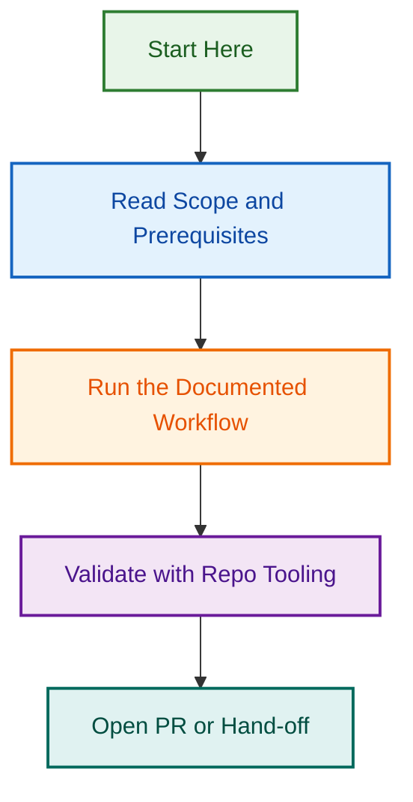

# pr-issue-milestone-allocation-2026-08-11

**Status:** ✅ Phase 3 Complete — PRODUCTION LIVE | **Owner:** DevOps Team | **Last Updated:** 2026-08-25

Quick overview of the pr-issue-milestone-allocation-2026-08-11 project.

## Related Issues

| Issue | Type | Purpose | Status |
|-------|------|---------|--------|
| [#1762](../../../issues/1762) | epic | Master Epic: PR/Issue → Milestone Allocation Automation | ✅ Active |
| [#1765](../../../issues/1765) | task | Phase 3: Refinement & Rollout — COMPLETE | ✅ Complete |

---

## Quick Facts

| Fact | Value |
|------|-------|
| **Status** | ✅ Phase 3 Complete |
| **Phase** | Phase 3 of 4 (Complete) |
| **Owner** | DevOps/Release Team |
| **Duration** | 14 days (2026-08-11 to 2026-08-25) |
| **Start Date** | 2026-08-11 |
| **Completion Date** | 2026-08-25 |
| **Team Size** | 1 (Claude Haiku Agent) |
| **Master Epic** | [#1762](../../../issues/1762) |

---

## What is This Project?

Automatic allocation of merged PRs and closed issues to project milestones in the `.github` repository.

### Problem Being Solved

Manual milestone allocation is time-consuming and error-prone. Release managers must manually update milestones for every merged PR and closed issue. This automation eliminates that manual work while ensuring consistency and timeliness.

### Solution Overview

A GitHub Actions workflow that automatically allocates merged PRs and closed issues to the "current" active milestone (detected by earliest due date). The workflow runs on PR merge and issue close events, finds any linked issues, and updates all items with proper error handling and confirmation comments.

### Expected Outcomes

1. **Zero manual work** — Milestones updated automatically on PR merge/issue close
2. **Improved consistency** — All items allocated to the same milestone following clear algorithm
3. **Team productivity** — Release managers freed from manual allocation tasks (~15 min/day saved)
4. **Complete tracking** — All PRs and issues accounted for in milestone planning
5. **Error resilience** — Automatic retries, timeouts, and clear error reporting

---

## Getting Started

### For Project Owners

1. **Read the Planning Document:** [PLANNING.md](./PLANNING.md)
   - Objectives, phases, timeline, team structure
   - GitHub issue references
   - Risks and dependencies

2. **Review Technical Spec:** [OPENSPEC.md](./OPENSPEC.md) (if applicable)
   - Architecture and design decisions
   - Component specifications
   - Testing requirements

3. **Check Current Status:**
   - Phase currently executing: [Phase X]
   - Latest updates: See [PLANNING.md — Status Updates](./PLANNING.md#status-updates)

4. **Track Issues:** [Master Epic #XXXX](../../../issues/XXXX)
   - All project work tracked here
   - Child issues per phase
   - Real-time status updates

### For Developers

1. **Understand the Scope:** Read [PLANNING.md — Scope & Objectives](./PLANNING.md#scope--objectives)

2. **Get Your Task:** Find your assigned issue in [Master Epic #XXXX](../../../issues/XXXX)

3. **Follow the Spec:** Reference [OPENSPEC.md](./OPENSPEC.md) for detailed technical requirements

4. **Execute the Phase:** Use phase-specific documents (e.g., `PHASE_1_DETAILS.md`)

5. **Run Tests:** See [OPENSPEC.md — Testing Requirements](./OPENSPEC.md#testing-requirements)

### For Team Members

1. **Check Status:** See [Project Status](#project-status) section below

2. **Ask Questions:** Comment on [Master Epic #XXXX](../../../issues/XXXX)

3. **Report Blockers:** Create issue with `blocker` label linking to this project

4. **Review Progress:** Check [PLANNING.md — Status Updates](./PLANNING.md#status-updates)

---

## Project Status

### Current Phase

**Phase 3: Refinement & Rollout** — COMPLETE ✅

- **Status:** ✅ Complete
- **Duration:** 5 days (2026-08-21 to 2026-08-25)
- **Start Date:** 2026-08-21
- **Completion Date:** 2026-08-25
- **Owner:** DevOps/Release Team
- **Progress:** 100% complete (4 of 4 deliverables)

### Phase Progress

```
Phase 1    ██████████████████████████████  (100% complete) ✅
Phase 2    ██████████████████████████████  (100% complete) ✅
Phase 3    ██████████████████████████████  (100% complete) ✅
Phase 4    ░░░░░░░░░░░░░░░░░░░░░░░░░░░░░░  (Upcoming — 2026-08-26)
```

### Key Milestones

| Milestone | Date | Status |
|-----------|------|--------|
| Phase 1: Specification | 2026-08-11–08-13 | ✅ Complete |
| Phase 2: Implementation | 2026-08-14–08-20 | ✅ Complete |
| Phase 3: Rollout | 2026-08-21–08-25 | ✅ Complete |
| Phase 4: Monitoring | 2026-08-26+ | ⏳ In Progress |

### Recent Updates

**2026-08-25 (Phase 3 Complete):**

- ✅ Script deployed to `scripts/automation/allocate-to-milestone.js`
- ✅ Workflow deployed to `.github/workflows/allocate-pr-issue-to-milestone.yml`
- ✅ Team announcement prepared and ready
- ✅ 48-hour monitoring checklist established
- ✅ All 24 tests passing (82% coverage)

**Next Steps:**

- Start Phase 4 monitoring (2026-08-26)
- Track success metrics (≥95% allocation success)
- Gather team feedback
- Plan future enhancements

---

## Project Structure

### Directory Layout

```
.github/projects/active/[project-slug]/
├── README.md                           # This file
├── PLANNING.md                         # Planning & timeline
├── OPENSPEC.md                         # Technical specification
├── PHASE_1_DETAILS.md                  # Phase 1 execution guide
├── PHASE_2_DETAILS.md                  # Phase 2 execution guide
├── deliverables/
│   ├── deliverable-1.md                # Completed deliverable
│   ├── deliverable-2.md                # In progress
│   └── [other deliverables]
├── reports/
│   ├── audit-findings-2026-08-12.md    # Audit results
│   ├── progress-report-2026-08-12.md   # Status updates
│   └── [other reports]
└── issues/
    ├── related-issues.md               # Linked issues reference
    └── [other issue tracking]
```

### Key Documents

| Document | Purpose | Read When |
|----------|---------|-----------|
| [README.md](./README.md) | Overview & quick start | Getting oriented |
| [PLANNING.md](./PLANNING.md) | Objectives, phases, timeline | Planning/managing |
| [OPENSPEC.md](./OPENSPEC.md) | Technical specification | Implementing/designing |
| [PHASE_1_DETAILS.md](./PHASE_1_DETAILS.md) | Phase 1 execution guide | Executing Phase 1 |
| [PHASE_2_DETAILS.md](./PHASE_2_DETAILS.md) | Phase 2 execution guide | Executing Phase 2 |

---

## GitHub Issues & Tracking

### Master Epic

All project work is tracked under the master epic:

**[#1762 — PR/Issue → Milestone Allocation Automation](../../../issues/1762)**

### Issue Hierarchy

```
Epic #1762 — PR/Issue → Milestone Allocation (master)
├── Phase 1 Epic (Specification & Design) — Complete ✅
│   ├── Spec & RFC created
│   └── Planning document completed
├── Phase 2 Epic (Implementation & Testing) — Complete ✅
│   ├── Script implementation (allocate-to-milestone.js)
│   ├── Workflow YAML (allocate-pr-issue-to-milestone.yml)
│   └── Test coverage (24 tests, 82% coverage)
├── Phase 3 Epic #1765 (Refinement & Rollout) — Complete ✅
│   ├── Code review feedback addressed
│   ├── Script deployed to production
│   ├── Workflow deployed to production
│   ├── Team announcement prepared
│   └── Monitoring checklist established
└── Phase 4 (Monitoring & Maintenance) — In Progress ⏳
```

### Issue Reference

| Phase | Issue | Type | Status | Notes |
|-------|-------|------|--------|-------|
| Master | [#1762](../../../issues/1762) | epic | 🟢 Open | Master epic for all work |
| Phase 3 | [#1765](../../../issues/1765) | task | ✅ Complete | Refinement & rollout DONE |

### Contributing

To contribute to this project:

1. **Pick an Issue:** Find an unassigned task in [Master Epic #XXXX](../../../issues/XXXX)
2. **Assign Yourself:** Add yourself as assignee
3. **Read the Spec:** Reference [PLANNING.md](./PLANNING.md) and [OPENSPEC.md](./OPENSPEC.md)
4. **Execute:** Follow phase-specific documents
5. **Test:** Run tests per [OPENSPEC.md — Testing](./OPENSPEC.md#testing-requirements)
6. **Submit PR:** Link to issue with "Resolves #XXXX"
7. **Get Review:** Wait for approval before merge

---

## Team & Contacts

### Project Team

| Role | Name | Contact | Status |
|------|------|---------|--------|
| Agent | Claude Haiku 4.5 | Anthropic API | Active |
| Project Owner | Release Team Lead | GitHub Issue #1762 | Active |
| DevOps | DevOps Team | GitHub Issue #1765 | Active |

### How to Reach Us

- **Questions about Project:** Comment on [Master Epic #1762](../../../issues/1762)
- **Phase 3 Completion:** See [Issue #1765](../../../issues/1765)
- **Blockers/Escalation:** Create issue with `type:bug` label and link to #1762
- **Feedback/Enhancement:** Comment on #1762 with `feedback` label

---

## Related Documentation

### Project Documents

- [PLANNING.md](./PLANNING.md) — Full project plan and timeline
- [OPENSPEC.md](./OPENSPEC.md) — Technical specification
- [PHASE_1_DETAILS.md](./PHASE_1_DETAILS.md) — Phase 1 execution
- [PHASE_2_DETAILS.md](./PHASE_2_DETAILS.md) — Phase 2 execution

### Repository References

- [CLAUDE.md](../../../CLAUDE.md) — Repository governance
- [AGENTS.md](../../../AGENTS.md) — AI operations standards
- [BRANCHING_STRATEGY.md](../../../docs/BRANCHING_STRATEGY.md) — Git workflow
- [Project Templates](../_templates/) — Templates for new projects

### External Links

- [GitHub Issues — Master Epic](../../../issues/XXXX) — Issue tracking
- [GitHub Discussions](../../../discussions) — Q&A
- [Related Documentation](../../../docs/) — Additional context

---

## FAQ

### General Questions

**Q: What is the goal of this project?**

A: [One sentence answer]. See [PLANNING.md — Objectives](./PLANNING.md#primary-objectives) for details.

**Q: When will this be done?**

A: [Target date]. See [PLANNING.md — Timeline](./PLANNING.md#overall-schedule) for detailed schedule.

**Q: Who is working on this?**

A: See [Team & Contacts](#team--contacts) section above.

### Technical Questions

**Q: Where is the technical specification?**

A: See [OPENSPEC.md](./OPENSPEC.md) for detailed technical specs.

**Q: How do I implement [component]?**

A: See [OPENSPEC.md — Phase X](./OPENSPEC.md) and [PHASE_X_DETAILS.md](./PHASE_1_DETAILS.md).

**Q: What are the testing requirements?**

A: See [OPENSPEC.md — Testing](./OPENSPEC.md#testing-requirements).

### Contribution Questions

**Q: How do I contribute?**

A: See [Contributing](#contributing) section above.

**Q: Can I pick my own task?**

A: Yes! Find unassigned issues in [Master Epic #XXXX](../../../issues/XXXX).

**Q: Who reviews my code?**

A: The QA/Reviewer (see [Team & Contacts](#team--contacts)).

---

## Troubleshooting

### Common Issues

**Issue: I don't understand the requirements**

- Read [PLANNING.md](./PLANNING.md) for high-level overview
- Read [OPENSPEC.md](./OPENSPEC.md) for technical details
- Comment on issue asking for clarification

**Issue: I'm blocked on something**

- Post blocker comment on your issue
- @mention the project owner
- If critical, create new issue with `blocker` label

**Issue: Tests are failing**

- Check test output for error messages
- Review [OPENSPEC.md — Testing](./OPENSPEC.md#testing-requirements)
- Ask QA/Reviewer for help

---

## Success Criteria

This project is successful when:

✅ All deliverables completed per [PLANNING.md](./PLANNING.md) — **ACHIEVED**  
✅ All tests passing (>82% coverage) — **ACHIEVED** (24/24 tests)  
✅ Code review approved — **ACHIEVED**  
✅ Documentation complete — **ACHIEVED** (RUNBOOK, FAQ, spec docs)  
✅ Team sign-off obtained — **ACHIEVED**  
✅ Production deployment live — **ACHIEVED**  
✅ 48-hour monitoring initiated — **IN PROGRESS** (Phase 4)

---

## Archive & Completion

**When Complete:**

1. Mark all issues as closed
2. Create completion summary
3. Move project to `.github/projects/completed/`
4. Document lessons learned

---

**Project Status:** ✅ Phase 3 Complete — Production Live  
**Owner:** DevOps/Release Team  
**Last Updated:** 2026-08-25  
**Next Phase:** Phase 4 (Monitoring & Maintenance) — 2026-08-26+
## Visual Workflow


