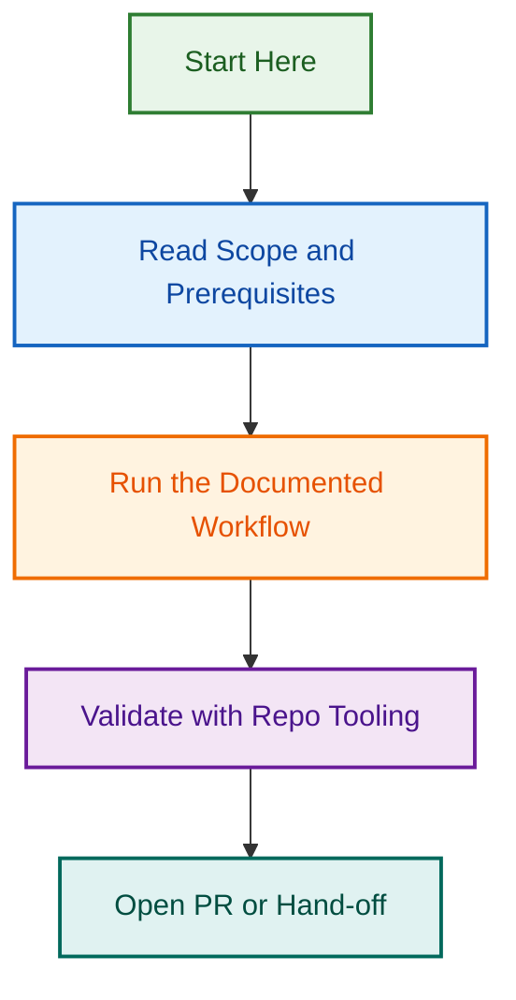

# PR Review & Project Planning (2026-08-04)

## Overview

This project consolidates the analysis and execution plan for:

1. **PR #1449 Status** — Determine why the PR was closed unmerged and what actions are needed
2. **Issue #1448 Scope Expansion** — Address the expanded scope identified by @eleshar's comment
3. **Repository Restructuring Consolidation** — Reconcile two project folder locations and one reference variant

## Key Findings

### PR #1449 Status

- **Status:** Closed, unmerged (branch deleted)
- **What was fixed:** Three broken relative links in `projects/active/repo-restructuring-2026-07-25/`
- **Why it was closed:** Further issues discovered during review (MD032 violations gating link checks)
- **Current state:** Changes NOT in develop branch

### Issue #1448 Expanded Scope

Per @eleshar's analysis comment, the issue is larger than originally scoped:

1. **Gate blocker:** MD032 violations in:
   - `CLAUDE.md`
   - `.github/projects/active/repository-restructuring-phase-1/PHASE-1-COMPLETION-STATUS.md`

2. **Additional broken links:** 5 further broken links appear in `PHASE-1-COMPLETION-STATUS.md` once MD032 is resolved

3. **Root cause:** Repository restructuring project exists in two locations with different slugs:
   - `.github/projects/active/repository-restructuring-phase-1/` (canonical per CLAUDE.md line 312)
   - `projects/active/repo-restructuring-2026-07-25/` (the four documentation files)
   - `.github/projects/active/repo-restructuring-2026-07-25/` (referenced in CLAUDE.md line 64 — third variant)

### Durable Solution

Complete the move under one agreed slug resolves all broken links as a side effect.

## Execution Plan

### Phase 1: Governance & Planning (This Epic)

1. Consolidate findings and expand issue #1448 description ✓
2. Create active project structure with agreed plan ✓
3. Get @eleshar's approval and edit recommendations
4. Create child issues once agreed

### Phase 2: Fix Governance (Future Epic)

1. Fix MD032 violations (Markdown list formatting)
2. Resolve link paths to use unified slug
3. Validate lint-and-links passes
4. Close issue #1448

## Files in This Project

- `README.md` — This file
- `CONSOLIDATION_PLAN.md` — Detailed execution steps for restructuring consolidation
- `ISSUE_STRUCTURE.md` — Proposed issue hierarchy (epic + child issues)

## References

- Issue #1448: [Fix broken relative links in repo-restructuring project docs](https://github.com/lightspeedwp/.github/issues/1448)
- PR #1449: [docs: fix broken relative links in repo-restructuring project docs](https://github.com/lightspeedwp/.github/pull/1449)
- CLAUDE.md line 64: Reference to `./projects/active/repo-restructuring-2026-07-25/`
- CLAUDE.md line 312: Canonical location for active projects `.github/projects/active/{slug}/`

## Related Issues

This project is coordinated with:

- [#1733](https://github.com/lightspeedwp/.github/issues/1733) — Phase 2: Folder Structure & Linking

See [Linking Standard](https://github.com/lightspeedwp/.github/blob/develop/.github/projects/active/reports-projects-restructuring-2026-08-11/LINKING_STANDARD.md) for linking patterns.
## Visual Workflow

