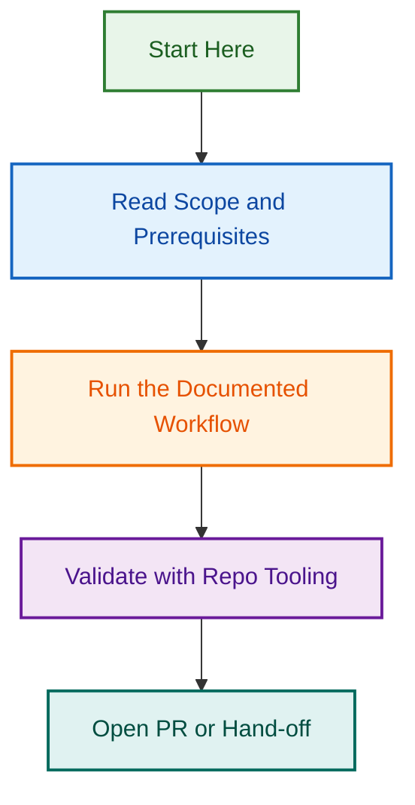

# PRD Combined Agent – Phase 2 Batch 2

Unifies two complementary product planning agents into a single multi-provider planning tool.

## Quick Facts

| Aspect | Details |
|--------|---------|
| Agent | PRD Agent (Product Requirements) |
| Version | 2.0.0 |
| Status | Active |
| Providers | Claude, Copilot, OpenAI |
| Merged | `prd-agent` + `prd-factory-planner-agent` |
| Capabilities | 14 core across all planning phases |
| Date | 2026-07-23 |

## Core Capabilities

### PRD & Documentation

- Executive summaries, requirements, metrics, constraints, risks

### Feature Planning

- Breakdown, impact/effort matrices, user stories, criteria

### Timeline & Roadmap

- Release planning, milestones, sprints, estimation, dependencies

### Stakeholder Alignment

- Requirements gathering, workflows, change management, templates

## Validation ✅

- ✅ Agent specification merged
- ✅ Multi-provider configurations verified
- ✅ Tool integrations confirmed
- ✅ Capabilities documented
- ✅ All resources documented
- ✅ Agent catalogued

**Part of:** Agent Standardisation Initiative – Phase 2 (Epic #1079)  
**Completed:** 2026-07-23 | **Maintainer:** Ash Shaw

---

*Built by 🧱 LightSpeedWP with ☕, 🚀, and open-source spirit!*

## Related Issues

This project is coordinated with:

- [#1733](https://github.com/lightspeedwp/.github/issues/1733) — Phase 2: Folder Structure & Linking

See [Linking Standard](https://github.com/lightspeedwp/.github/blob/develop/.github/projects/active/reports-projects-restructuring-2026-08-11/LINKING_STANDARD.md) for linking patterns.
## Visual Workflow

