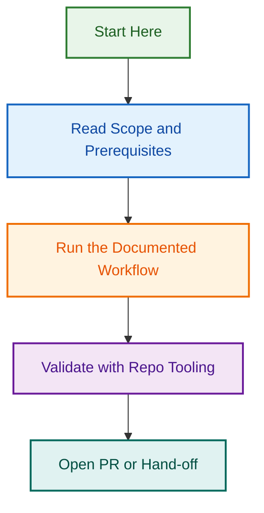

# PRD Combined Agent – Phase 2 Batch 2 + Phase 3 Consolidation

Unifies two complementary product planning agents into a single multi-provider planning tool.

> **2026-09-10 update:** Phase 2 Batch 2 merged the two agents at the catalogue/registry level only. A folder-level audit found the underlying `agents/prd-agent/` and `agents/prd-factory-planner-agent/` folders were never actually consolidated — see [FOLDER_STRUCTURE_PLAN.md](./FOLDER_STRUCTURE_PLAN.md) for the audit and target structure, and [PLANNING.md — Phase 3](./PLANNING.md#phase-3-structural-consolidation-scoped-) for status.
>
> **2026-09-10 update:** The sibling project `prd-agent-prompt-improvements-2026-08` (core-prompt v2.1 content enhancement, testing, and team rollout) has been folded into this project — its README and PLANNING content now live here as Phases 4-7 in [PLANNING.md](./PLANNING.md#phase-4-prompt-enhancement-complete-). That project's folder is being retired; see [PLANNING.md — Prompt Enhancement Track](./PLANNING.md#prompt-enhancement-track-merged-from-prd-agent-prompt-improvements-2026-08) for the merged scope.
>
> **2026-09-10 update:** Phase 3 has now been fully audited, file-by-file, across all three of `prd-factory-planner-agent`'s top-level areas — see [SKILL_RECONCILIATION_REPORT.md](./SKILL_RECONCILIATION_REPORT.md) (skills/), [AGENT_FOLDER_RECONCILIATION_REPORT.md](./AGENT_FOLDER_RECONCILIATION_REPORT.md) (agent/), and [ROOT_FILES_RECONCILIATION_REPORT.md](./ROOT_FILES_RECONCILIATION_REPORT.md) (AGENT.md/README.md). **The real merge scope turned out to be much smaller than assumed:** almost everything in `prd-factory-planner-agent` is either an exact duplicate or fabricated/aspirational content, not unique logic. The folder can be deleted outright once a handful of specific items are ported forward — see [PLANNING.md — Phase 3](./PLANNING.md#phase-3-structural-consolidation-scoped-) for the finalized, scoped deliverable list.

## Quick Facts

| Aspect | Details |
|--------|---------|
| Agent | PRD Agent (Product Requirements) |
| Version | 2.0.0 |
| Status | Active |
| Providers | Claude, Copilot, OpenAI |
| Merged | `prd-agent` + `prd-factory-planner-agent` |
| Capabilities | 14 core across all planning phases |
| Date | 2026-07-23 |

## Core Capabilities

### PRD & Documentation

- Executive summaries, requirements, metrics, constraints, risks

### Feature Planning

- Breakdown, impact/effort matrices, user stories, criteria

### Timeline & Roadmap

- Release planning, milestones, sprints, estimation, dependencies

### Stakeholder Alignment

- Requirements gathering, workflows, change management, templates

## Validation ✅

- ✅ Agent specification merged
- ✅ Multi-provider configurations verified
- ✅ Tool integrations confirmed
- ✅ Capabilities documented
- ✅ All resources documented
- ✅ Agent catalogued

**Part of:** Agent Standardisation Initiative – Phase 2 (Epic #1079)  
**Completed:** 2026-07-23 | **Maintainer:** Ash Shaw

---

## Project Documents

| Document | Purpose | Status |
|---|---|---|
| [PLANNING.md](./PLANNING.md) | Master phase plan — Phase 1-2 (catalogue merge, done), Phase 3 (structural consolidation, scoped), Phases 4-7 (Prompt Enhancement Track) | 🟡 Active |
| [OPENSPEC.md](./OPENSPEC.md) | Technical-spec stub — points to FOLDER_STRUCTURE_PLAN.md until a real OpenSpec change proposal is created | 🔵 Stub |
| [FOLDER_STRUCTURE_PLAN.md](./FOLDER_STRUCTURE_PLAN.md) | Phase 3 master plan — target `agents/prd-agent/` structure, open decisions, execution phases | 🟡 Active |
| [SKILL_RECONCILIATION_REPORT.md](./SKILL_RECONCILIATION_REPORT.md) | File-by-file diff of every `skills/` folder shared between the two agents | ✅ Complete |
| [AGENT_FOLDER_RECONCILIATION_REPORT.md](./AGENT_FOLDER_RECONCILIATION_REPORT.md) | File-by-file diff of the `agent/` export tree | ✅ Complete |
| [ROOT_FILES_RECONCILIATION_REPORT.md](./ROOT_FILES_RECONCILIATION_REPORT.md) | Diff of root `AGENT.md`/`README.md` | ✅ Complete |
| [INTRA_FOLDER_SKILL_AUDIT_SCOPE.md](./INTRA_FOLDER_SKILL_AUDIT_SCOPE.md) | Scope for a fourth reconciliation pass — `prd-agent` duplicating itself across 17 skill clusters, found via `/speckit-plan` | ✅ Complete |
| [SKILL_DUPLICATION_AUDIT_REPORT.md](./SKILL_DUPLICATION_AUDIT_REPORT.md) | File-by-file diff/read results for all 17 clusters — verdicts, what to keep, what content would be lost. Curated skill count: 46 → 28 (27 once `frontend-skill` is removed) | ✅ Complete |
| [IMPLEMENTATION_NOTES.md](./IMPLEMENTATION_NOTES.md) | Historical decision log for the original Phase 1-2 catalogue merge | 📋 Historical (Phase 1-2 only) |
| [COMPLETION_SUMMARY.md](./COMPLETION_SUMMARY.md) | Original Phase 1-2 completion record | 📋 Historical (Phase 1-2 only — Phase 3 is separately tracked and not yet complete) |

---

*Built by 🧱 LightSpeedWP with ☕, 🚀, and open-source spirit!*

## Related Issues

This project is coordinated with:

- [#1733](https://github.com/lightspeedwp/.github/issues/1733) — Phase 2: Folder Structure & Linking
- [#1896](https://github.com/lightspeedwp/.github/issues/1896) — Phase 5: Prompt Testing & Validation (merged from `prd-agent-prompt-improvements-2026-08`)
- [#1897](https://github.com/lightspeedwp/.github/issues/1897) — Phase 6: Team Rollout & Documentation (merged from `prd-agent-prompt-improvements-2026-08`)
- [#1899](https://github.com/lightspeedwp/.github/issues/1899) — Phase 7: Optional Spec-Based Agent Sync (merged from `prd-agent-prompt-improvements-2026-08`)

See [Linking Standard](https://github.com/lightspeedwp/.github/blob/develop/.github/projects/active/reports-projects-restructuring-2026-08-11/LINKING_STANDARD.md) for linking patterns.

## Visual Workflow

