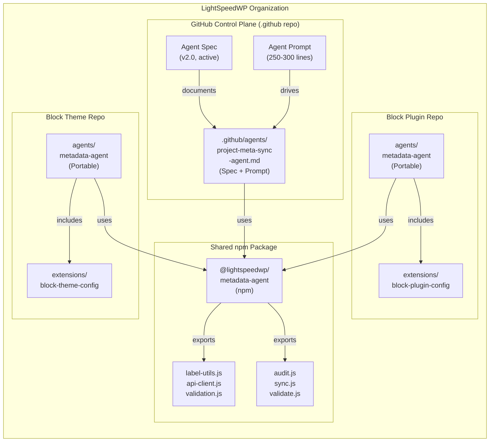
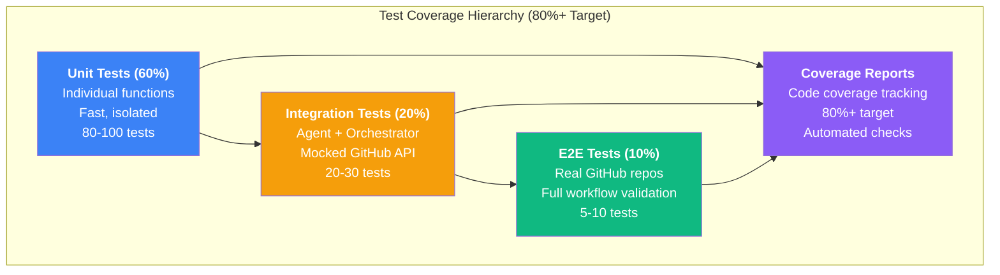
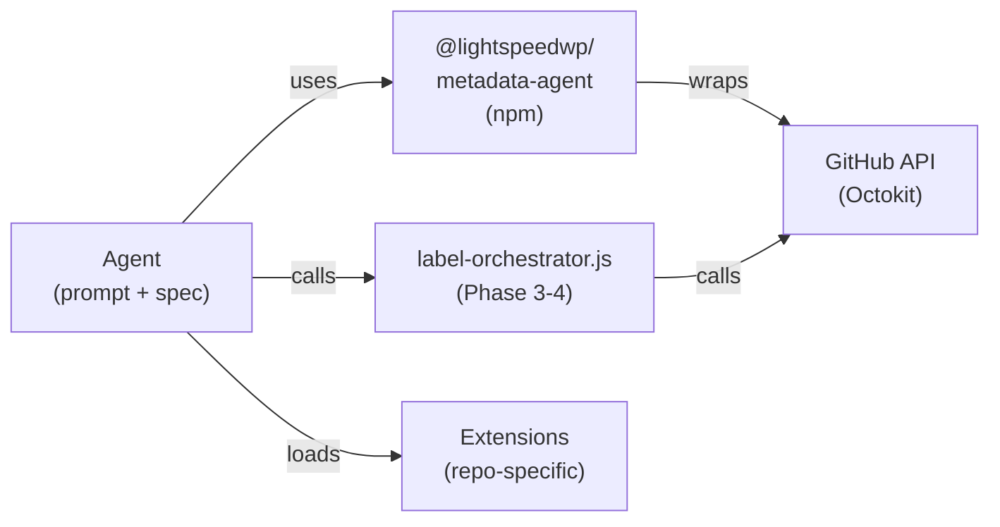
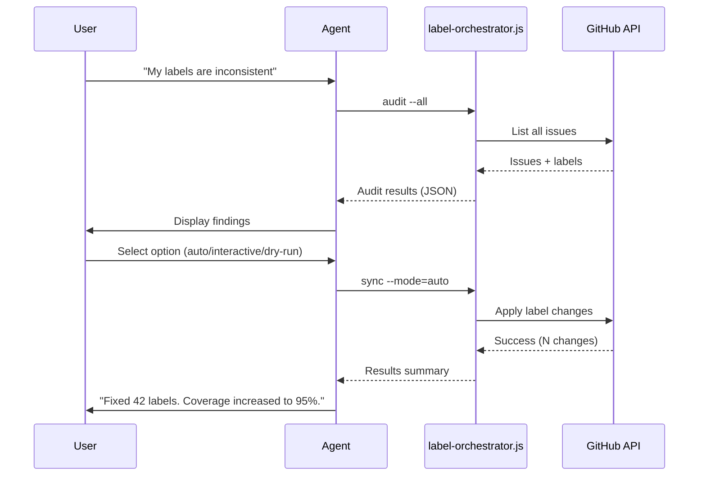
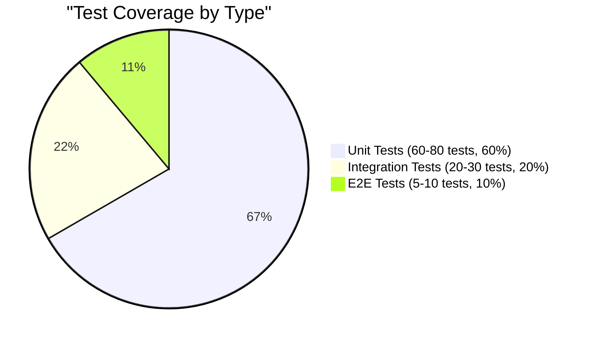

# Implementation Plan: Project Meta Sync Agent v2

**Scope:** Hybrid agent (base + repo-specific extensions) with shared npm package  
**Target:** Portable, reusable across GitHub control plane + WordPress block repos  
**Test Coverage:** 80%+ (unit + integration + E2E + static)  
**Duration:** 4-5 days (Phases 5B.2 through 5B.5)

---

## 1. Architecture Overview

### 1.1 High-Level Design



### 1.2 Component Structure

```
agents/metadata-agent/                      # Portable base agent
├── agent.md                                # Spec (generic, repo-agnostic)
├── prompt.md                               # Prompt (generic)
├── scripts/
│   ├── audit.js                            # Audit metadata
│   ├── sync.js                             # Sync labels/fields
│   ├── validate.js                         # Validate metadata state
│   └── __tests__/                          # Unit tests (80%+ coverage)
├── extensions/
│   ├── github-control-plane.js            # .github repo config
│   ├── block-plugin.js                     # Block plugin config
│   ├── block-theme.js                      # Block theme config
│   └── __tests__/                          # Extension tests
├── integration/
│   ├── github-api-adapter.js              # GitHub API wrapper
│   ├── orchestrator-adapter.js            # label-orchestrator.js integration
│   └── __tests__/                          # Integration tests
└── README.md                                # Agent usage guide

packages/metadata-agent/                    # Shared npm package
├── package.json
├── src/
│   ├── label-utils.js                      # Label operations
│   ├── api-client.js                       # GitHub API client
│   ├── validation.js                       # Validation logic
│   ├── confidence-scorer.js                # Confidence scoring
│   └── __tests__/                          # Unit tests
├── tests/
│   ├── integration/                        # Integration tests
│   ├── e2e/                                # End-to-end tests
│   └── coverage/                           # Coverage reports
└── README.md                                # Package documentation

.github/agents/project-meta-sync.agent.md   # Control plane spec (v2.0)
.github/agents/project-meta-sync-prompt.md # Control plane prompt
```

---

## 2. Test Strategy

### 2.1 Test Pyramid & Coverage



### 2.2 Test Execution Plan

#### Unit Tests (80-100 tests, 60% coverage)

**Location:** `agents/metadata-agent/scripts/__tests__/`  
**Framework:** Jest  
**Coverage Target:** 80%+

```javascript
// audit.js tests
- test('audit() returns coverage by label family')
- test('audit() identifies missing labels')
- test('audit() handles empty repository')
- test('audit() respects exclusion rules')
- test('audit() generates recommendations')

// sync.js tests
- test('sync() applies label changes')
- test('sync() supports --dry-run mode')
- test('sync() supports --interactive mode')
- test('sync() supports --auto mode with confidence')
- test('sync() handles API errors gracefully')
- test('sync() validates label existence before applying')

// validate.js tests
- test('validate() passes Tier 1 blockers')
- test('validate() passes Tier 2 warnings')
- test('validate() fails on blocking issues')
- test('validate() returns correct recommendation')
- test('validate() works for patch/minor/major releases')

// GitHub API adapter tests
- test('api-client() authenticates with GITHUB_TOKEN')
- test('api-client() handles rate limiting')
- test('api-client() retries on transient errors')
- test('api-client() returns structured responses')

// Label utils tests
- test('labelUtils.parse() extracts family and name')
- test('labelUtils.validate() checks canonical list')
- test('labelUtils.suggest() finds similar labels')
- test('labelUtils.score() ranks by relevance')
```

#### Integration Tests (20-30 tests, 20% coverage)

**Location:** `packages/metadata-agent/tests/integration/`  
**Framework:** Jest + mocked GitHub API  
**Scope:** Agent calling orchestrator, workflows firing

```javascript
// Orchestrator integration
- test('agent.audit() calls label-orchestrator --all')
- test('agent.sync() calls label-orchestrator sync')
- test('agent.validate() calls label-orchestrator validate')

// GitHub API integration (mocked)
- test('agent fetches issues from GitHub API')
- test('agent applies label changes via API')
- test('agent handles concurrent requests')

// Workflow integration
- test('agent summary appears in PR comment')
- test('agent validation triggers workflow')

// Error handling
- test('agent recovers from API timeout')
- test('agent suggests alternative labels')
- test('agent hands off to specialist agent')
```

#### E2E Tests (5-10 tests, 10% coverage)

**Location:** `packages/metadata-agent/tests/e2e/`  
**Framework:** Jest + real test GitHub repo  
**Scope:** Full user workflow end-to-end

```javascript
// Real GitHub repo tests (test repo: lightspeedwp-test-metadata-agent)
- test('user: My labels are inconsistent. Full workflow.')
  - Audit → Present options → Execute → Verify

- test('user: How do I sync project fields? Full workflow.')
  - Explain → Run derivation → Validate → Confirm

- test('user: Help me prepare for release. Full workflow.')
  - Validate Tier 1/2 → Return result → Recommend action

- test('agent: Label taxonomy discovery. Full workflow.')
  - Teach Tier 1 → Offer Tier 2 → Point to reference

- test('error: API rate limit. Recovery workflow.')
  - Hit limit → Wait → Retry → Succeed

- test('error: Missing label. Recovery workflow.')
  - Suggest alternative → User confirms → Apply

- test('handoff: Redesign labels. Agent escalation.')
  - Recognize out-of-scope → Handoff context → Transfer
```

### 2.3 Coverage Report Strategy

**Tools:**

- `jest --coverage` — Generate coverage reports
- `nyc` — Coverage tracking across test runs
- `coveralls.io` — Public coverage badges (optional)

**Targets:**

- Line coverage: 80%+
- Branch coverage: 75%+
- Function coverage: 80%+
- Statement coverage: 80%+

**Automation:**

```bash
# Pre-commit hook: Check coverage thresholds
npm run test:coverage -- --bail --maxWorkers=4

# CI workflow: Fail if coverage drops below 80%
npm run test:coverage -- --coverage-threshold=80

# Generate coverage report
npm run test:coverage -- --coverage-reporters=html
```

---

## 3. npm Package Design (@lightspeedwp/metadata-agent)

### 3.1 Package Structure

```
packages/metadata-agent/
├── package.json                            # Shared package
├── src/
│   ├── index.js                            # Main entry point
│   ├── label-utils.js                      # Label operations
│   ├── api-client.js                       # GitHub API wrapper
│   ├── validation.js                       # Validation logic
│   ├── confidence-scorer.js                # Confidence scoring
│   ├── error-handler.js                    # Error recovery
│   └── __tests__/                          # Unit tests
├── tests/
│   ├── integration/                        # Integration tests
│   ├── e2e/                                # E2E tests
│   ├── fixtures/                           # Test data
│   └── coverage/                           # Coverage reports
├── types/                                  # TypeScript types
│   ├── index.d.ts
│   ├── api.d.ts
│   └── validation.d.ts
├── README.md                               # Usage documentation
└── CHANGELOG.md                            # Version history
```

### 3.2 Exported Functions

```javascript
// Label operations
export const labelUtils = {
  parse(label),           // Extract family & name
  validate(label),        // Check canonical list
  suggest(label),         // Find similar labels
  score(label, context),  // Rank by relevance
}

// GitHub API
export const apiClient = {
  authenticate(token),
  getIssues(options),
  applyLabels(issues, labels),
  setProjectFields(issues, fields),
  handleRateLimit(),
}

// Validation
export const validation = {
  validateTier1(issues),  // Check blockers
  validateTier2(issues),  // Check warnings
  validateTier3(issues),  // Check info
  getRecommendation(),    // Recommend action
}

// Error handling
export const errorHandler = {
  catch(error),           // Catch & recover
  retry(fn, maxAttempts),
  suggest(error),         // Suggest fix
}

// Confidence scoring
export const confidenceScore = {
  calculate(label, issue),
  getThreshold(),
  isConfident(score),
}
```

### 3.3 Package Dependencies

**Runtime:**

```json
{
  "dependencies": {
    "@octokit/rest": "^19.0.0",        // GitHub API
    "dotenv": "^16.0.0",                // Environment vars
    "lodash": "^4.17.0",                // Utilities
    "pino": "^8.0.0"                    // Logging
  }
}
```

**Development:**

```json
{
  "devDependencies": {
    "jest": "^29.0.0",
    "@testing-library/jest-dom": "^5.0.0",
    "jest-mock-extended": "^3.0.0",    // Mocking
    "nock": "^13.0.0",                  // HTTP mocking
    "supertest": "^6.0.0",              // HTTP testing
    "nyc": "^15.0.0",                   // Coverage
    "eslint": "^8.0.0",
    "prettier": "^2.8.0"
  }
}
```

---

## 4. Repo-Specific Extensions

### 4.1 GitHub Control Plane Extension

**File:** `agents/metadata-agent/extensions/github-control-plane.js`

```javascript
export const githubControlPlaneConfig = {
  // Label families
  labelFamilies: ['type:', 'status:', 'area:', 'meta:', 'priority:'],
  
  // Project fields mapping
  projectFields: {
    'Type': 'type:*',
    'Status': 'status:*',
    'Area': 'area:*',
    'Priority': 'priority:*',
  },
  
  // Validation tiers
  validationTiers: {
    tier1: [
      'All issues in milestone have type:* label',
      'No conflicting labels',
      'All PRs have changelog status',
    ],
    tier2: [
      '95%+ have priority:* label',
      'All have area:* label',
    ],
  },
  
  // Release requirements
  releaseRequirements: {
    patch: ['tier1'],
    minor: ['tier1', 'tier2'],
    major: ['tier1', 'tier2', 'full_audit'],
  },
};
```

### 4.2 WordPress Block Plugin Extension

**File:** `agents/metadata-agent/extensions/block-plugin.js`

```javascript
export const blockPluginConfig = {
  // Label families (subset)
  labelFamilies: ['type:', 'status:', 'area:'],
  
  // Simplified project fields
  projectFields: {
    'Type': 'type:*',
    'Status': 'status:*',
  },
  
  // Validation tiers (simplified)
  validationTiers: {
    tier1: [
      'All issues have type:* label',
      'All PRs have type:*',
    ],
  },
  
  // Release requirements (simplified)
  releaseRequirements: {
    patch: ['tier1'],
    minor: ['tier1'],
    major: ['tier1'],
  },
};
```

### 4.3 WordPress Block Theme Extension

**File:** `agents/metadata-agent/extensions/block-theme.js`

```javascript
// Similar to block-plugin, with theme-specific customizations
export const blockThemeConfig = {
  // ...same structure as block-plugin
};
```

---

## 5. Implementation Phases

### Phase 5B.2: Agent Spec & Prompt (1-2 days)

**Deliverables:**

- [ ] `.github/agents/project-meta-sync.agent.md` rewritten (v2.0, active)
- [ ] `.github/agents/project-meta-sync-prompt.md` created (250-300 lines)
- [ ] Integration guide updated

**Tasks:**

1. Update agent spec with active status, v2.0, dependencies
2. Create comprehensive agent prompt with:
   - Role & context
   - Core workflows
   - Label taxonomy (tiered)
   - GitHub Project fields
   - Operational patterns
   - Handoff triggers
   - Commands & error handling
   - Example conversations
3. Test agent prompt with 3 core scenarios

### Phase 5B.3: npm Package Foundation (1 day)

**Deliverables:**

- [ ] `packages/metadata-agent/package.json` created
- [ ] Core exports (labelUtils, apiClient, validation)
- [ ] 20+ unit tests with 80%+ coverage
- [ ] README with usage examples

**Tasks:**

1. Create npm package structure
2. Implement label-utils.js (parse, validate, suggest, score)
3. Implement api-client.js (GitHub API wrapper)
4. Implement validation.js (Tier 1/2/3 checks)
5. Write unit tests (80%+ coverage target)

### Phase 5B.4: Portable Agent & Extensions (1 day)

**Deliverables:**

- [ ] `agents/metadata-agent/` created (portable)
- [ ] Base agent spec & prompt (repo-agnostic)
- [ ] Extension files (control-plane, block-plugin, block-theme)
- [ ] 20+ integration tests
- [ ] 5-10 E2E tests

**Tasks:**

1. Create portable agent folder structure
2. Copy spec & prompt to agents/ (make repo-agnostic)
3. Implement extensions for each repo type
4. Create integration tests (orchestrator, API, workflows)
5. Create E2E tests (real GitHub test repo)

### Phase 5B.5: Documentation & Validation (1 day)

**Deliverables:**

- [ ] Full documentation with mermaid diagrams
- [ ] Test coverage reports (80%+ achieved)
- [ ] README files for all components
- [ ] OpenSpec implementation completed
- [ ] PR ready for review

**Tasks:**

1. Write comprehensive documentation
2. Generate test coverage reports
3. Create mermaid diagrams (architecture, test pyramid, data flow)
4. Write README for npm package
5. Write README for portable agent
6. Run full test suite (unit + integration + E2E)

---

## 6. Mermaid Diagrams

### 6.1 Component Dependency Graph



### 6.2 Data Flow: Label Audit & Sync



### 6.3 Test Coverage Distribution



---

## 7. Success Metrics

| Metric | Target | Verification |
|--------|--------|---|
| **Test Coverage** | 80%+ | `jest --coverage` report |
| **Unit Tests** | 60-80 tests | Pass all tests |
| **Integration Tests** | 20-30 tests | Pass with mocked API |
| **E2E Tests** | 5-10 tests | Pass against test repo |
| **npm Package** | Published | Available on npm |
| **Documentation** | 4+ mermaid diagrams | Clarity + completeness |
| **Code Quality** | No ESLint errors | `npm run lint` passes |
| **Agent Scenarios** | 8 scenarios validated | All acceptance criteria met |

---

## 8. Key Questions Answered

### Q: Single agent or multiple?

**A:** Hybrid approach (base + extensions). One portable agent with repo-specific configuration files allows code reuse while supporting customization.

### Q: WordPress scope?

**A:** Same as control plane (GitHub Projects sync). Not handling block.json or WP-specific metadata — focus stays on Issues/PRs → GitHub Projects.

### Q: Test coverage?

**A:** Comprehensive (unit + integration + E2E). 80%+ target ensures production quality without overengineering.

### Q: npm package?

**A:** Yes, `@lightspeedwp/metadata-agent` enables code reuse and standardized deployment across repos.

### Q: Portability?

**A:** Full. Agent lives in `agents/` (root), installable in any LightSpeedWP repo with minimal configuration.

---

## 9. Dependencies & Blockers

### Depends On

- ✅ Phase 3-4 (Issue Maintenance Scripts) — label-orchestrator.js available
- ✅ Phase 5B.1 (This plan) — Specification complete

### Blocks

- ⏳ Phase 5A (Release Agentic Workflows) — Waits for agent spec to be active
- ⏳ Phase 5C (Portable Agents) — Waits for npm package to be published

### External Requirements

- [ ] GitHub test repository (for E2E tests)
- [ ] npm publish permissions (@lightspeedwp org)
- [ ] CI/CD pipeline supporting test execution

---

## 10. Risk Mitigation

| Risk | Mitigation |
|------|---|
| **Test flakiness** | Use nock for API mocking; isolate test data |
| **Rate limiting in tests** | Use test GitHub repo with generous limits; implement retry logic |
| **npm publish failures** | Pre-test with `npm publish --dry-run`; use semantic versioning |
| **Extension configuration conflicts** | Validate config in extension loader; clear error messages |
| **Agent prompt drift** | Pin prompt version in code; semantic versioning for breaking changes |

---

*Built by 🧱 LightSpeedWP with ☕, 🚀, and open-source spirit!*
