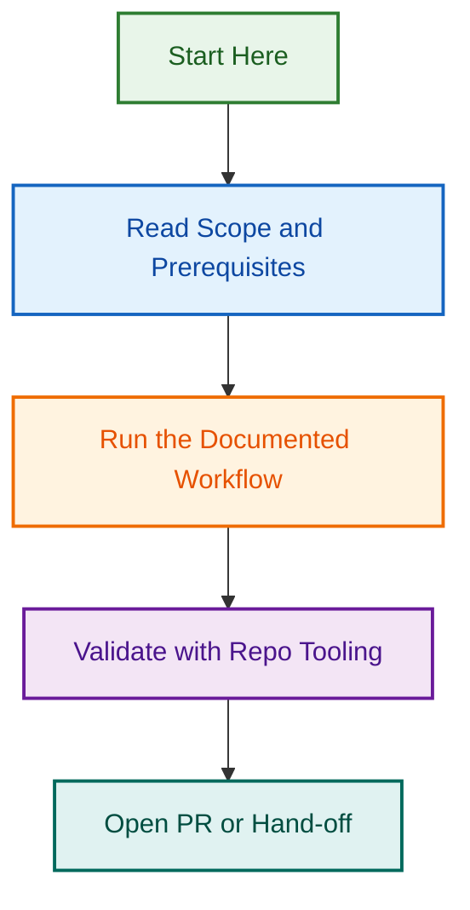

# Project Meta Sync Agent v2 — Modernization & Integration

**Status:** 🟢 Active | **Phase:** 5B | **Start:** 2026-08-12 | **Related Epic:** #1680 (Issue Metadata Triage Expansion)

Modernize the deprecated `project-meta-sync.agent.md` spec to reflect the current state of metadata governance, create a comprehensive agent prompt for LLM orchestration, and establish integration patterns with Phase 3-4 (Issue Maintenance Scripts) and Phase 5A (Release Agentic Workflows).

---

## Quick Overview

### Problem Statement

- ❌ Current `project-meta-sync.agent.md` marked as "deprecated compatibility spec"
- ❌ Active automation lives in 3 workflows + 5+ helper scripts, but no unified agent guidance
- ❌ Users unclear on when/how to use label-orchestrator.js, metadata-governance.yml, etc.
- ❌ Phase 5A (Release Agentic Workflows) blocked pending modernized metadata agent
- ✅ Infrastructure exists (workflows, scripts, Phase 3-4 deliverables)

### Solution

Create a **modernized agent v2** that:

1. **Reflects current state** — Active workflows, scripts, helper functions
2. **Unifies user experience** — Single agent guides users through all metadata operations
3. **Orchestrates tooling** — Leverages label-orchestrator.js, metadata-governance.yml
4. **Enables Phase 5A** — Provides metadata validation handoff for release workflows
5. **Integrates Phase 3-4** — Teaches users about issue maintenance scripts

### Success Metrics

- ✅ Agent spec rewritten (active status, v2.0)
- ✅ Agent prompt created (150+ lines, with taxonomy, commands, patterns)
- ✅ Integration guide documented (relationships to Phase 3-4, Phase 5A)
- ✅ Validated with 3+ real-world scenarios (label sync, audit, project fields)
- ✅ PR merged to develop with clean history

---

## Detailed Scope

### Phase 5B Deliverables

#### 1. Agent Spec Rewrite

**File:** `.github/agents/project-meta-sync.agent.md`

**Changes:**

- Update frontmatter: `status: active`, `version: v2.0`, `last_updated: 2026-08-12`
- Replace "deprecated compatibility spec" with modernized spec
- Add comprehensive prompt structure section
- Reference Phase 3-4 deliverables
- Document handoff patterns to Release Agent

**Sections:**

- [ ] Updated frontmatter (status, version, dependencies)
- [ ] Purpose & scope (active responsibilities)
- [ ] Workflow reference (3 active workflows)
- [ ] Helper scripts reference (5+ scripts)
- [ ] Label taxonomy (prefixes: type:, status:, area:, meta:, priority:)
- [ ] Integration with Phase 3-4
- [ ] Integration with Phase 5A
- [ ] Handoff patterns
- [ ] Related projects & documentation

#### 2. Agent Prompt

**File:** `.github/agents/project-meta-sync-prompt.md`

**Content:**

- [ ] Role & context (LLM instructions)
- [ ] Core workflows you control (metadata-governance, meta-labels-sync, label-audit-report)
- [ ] Label taxonomy reference (15+ labels per prefix)
- [ ] GitHub Project fields mapping
- [ ] Operational patterns (audit → diagnose → present options → execute → summarize)
- [ ] Handoff triggers (release, template, label strategy, migration)
- [ ] Commands you can execute (workflows, scripts, reports)
- [ ] Error handling (rate limits, missing labels, field issues)
- [ ] Example conversations (3-5 real scenarios)

**Target:** 250-300 lines (comprehensive but focused)

#### 3. Integration Guide

**File:** `.github/projects/active/project-meta-sync-agent-v2-2026-08-12/INTEGRATION_GUIDE.md`

**Content:**

- [ ] Phase 3-4 Integration
  - How agent works with label-orchestrator.js
  - CLI command mapping (audit, sync, manage)
  - Modes: --dry-run, --interactive, --auto
  - Examples from docs

- [ ] Phase 5A Integration
  - Metadata as pre-check for release workflows
  - Which metadata impacts releases
  - Handoff to Release Agent
  - Example: "Help me prepare metadata for release"

- [ ] User Scenarios (3-5 walkthroughs)
  - "My issue labels are inconsistent"
  - "How do I sync project fields?"
  - "Prepare for release"
  - "Design a new label taxonomy"

---

## Project Structure

```
.github/projects/active/project-meta-sync-agent-v2-2026-08-12/
├── README.md                          # This file
├── OPENSPEC.md                        # OpenSpec specification
├── IMPLEMENTATION_CHECKLIST.md        # Phased delivery checklist
├── DESIGN_DECISIONS.md                # Architecture & rationale
├── INTEGRATION_GUIDE.md               # Phase 3-4 & Phase 5A integration
├── VALIDATION_SCENARIOS.md            # Test cases & acceptance criteria
└── QUESTIONS.md                       # Key questions & best practices
```

---

## Key Questions & Best Practices

See [QUESTIONS.md](./QUESTIONS.md) for detailed exploration of design decisions, integration patterns, and validation strategies.

**Quick reference:**

1. **Agent Scope** — What should the agent do vs. delegate? (See QUESTIONS.md Q1)
2. **Label Taxonomy** — How should we present 50+ labels to users? (See QUESTIONS.md Q2)
3. **Workflow Integration** — Which workflows should agent invoke directly? (See QUESTIONS.md Q3)
4. **Error Handling** — How to handle GitHub API limits, missing data? (See QUESTIONS.md Q4)
5. **Phase 5A Readiness** — What metadata validation does Release Agent need? (See QUESTIONS.md Q5)

---

## Phased Delivery

| Phase | Component | Duration | Status |
|-------|-----------|----------|--------|
| **Phase 5B.1** | Analysis & Design | 1 day | 🟢 COMPLETE |
| **Phase 5B.2** | Agent Spec & Prompt | 2 days | 📋 IN PROGRESS |
| **Phase 5B.3** | Integration Guide | 1 day | 📋 PLANNED |
| **Phase 5B.4** | Validation & Scenarios | 1 day | 📋 PLANNED |
| **Phase 5B.5** | PR & Review | 1 day | 📋 PLANNED |

---

## Success Criteria

### Specification Quality

- [ ] Agent spec is clear, unambiguous, and actionable
- [ ] Prompt structure enables LLM to guide users effectively
- [ ] Integration patterns documented with examples
- [ ] No circular dependencies between Phase 3-4, Phase 5A, this work

### User Validation

- [ ] 3 scenarios tested with actual agent prompt
- [ ] All error cases handled
- [ ] Handoff patterns work as expected
- [ ] Users understand label taxonomy

### Process Quality

- [ ] PR has clean git history (no merge commits)
- [ ] All files follow org conventions (.md format, frontmatter, etc.)
- [ ] Related issues properly linked (#1680, #1761, #1773)
- [ ] PR description references OpenSpec, design decisions, integration guide

---

## Related Issues & Documentation

**Parent Epic:**

- #1680 — Issue Metadata Triage Expansion

**Related Phases:**

- Phase 3-4 ✅ COMPLETE: [Issue Maintenance Scripts](../issue-maintenance-scripts-2026-08-10/)
- Phase 5A 📋 PLANNING: [Release Agentic Workflows](../release-agentic-workflows-2026-08-11/)
- Phase 4 ✅ COMPLETE: [Release Process Redesign](../release-process-redesign-2026-08-05/)

**Reference Documentation:**

- `.github/agents/project-meta-sync.agent.md` — Current spec (to be updated)
- `docs/ISSUE_MAINTENANCE_SCRIPTS.md` — Phase 3-4 system guide
- `docs/LABEL_MANAGEMENT_CLI.md` — Phase 3-4 CLI reference
- `.github/labels.yml` — Canonical label definitions
- `scripts/agents/includes/issue-pr-metadata.cjs` — Core metadata sync
- `.github/workflows/metadata-governance.yml` — Active workflow

---

## Next Steps

1. ✅ Create this project folder
2. ⏳ Answer QUESTIONS.md (design decisions, best practices)
3. ⏳ Rewrite agent spec (.github/agents/project-meta-sync.agent.md)
4. ⏳ Create agent prompt (.github/agents/project-meta-sync-prompt.md)
5. ⏳ Write integration guide
6. ⏳ Run validation scenarios
7. ⏳ Create PR (branch: feat/project-meta-sync-agent-v2-prompt)
8. ⏳ Merge to develop

---

**Project Owner:** Ash Shaw  
**Created:** 2026-08-12  
**Status:** 🟢 Active → Implementation
## Visual Workflow


