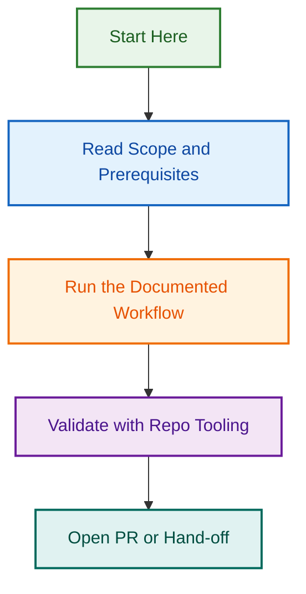

# GitHub Agentic Workflows Release Agent — Phase 5A

## Project Overview

**Objective:** Implement GitHub Agentic Workflows to orchestrate release automation, augmenting the existing shell-based approach (Phases 1-4) with LLM-driven reasoning, improved error messages, and better UX while maintaining deterministic fallback to shell scripts.

**Approach:** AUGMENT + test in parallel

- Agentic workflows wrap and call existing shell scripts
- No breaking changes to Phase 4 foundation
- Fallback available if AI reasoning fails
- Test against portable agents (Phase 5) and shell scripts

**Scope:** FULL (patch + minor + major releases)

- Auto-approve patch releases
- Require human review for minor releases
- Require 2+ maintainers for major releases

**Duration:** Phase 5A, 2-3 weeks (Aug 12-30, 2026)

**Status:** ✅ COMPLETE (Week 3, Aug 18, 2026) — Merged to develop via PR #2016

---

## Related Projects

This project is part of the **Release Orchestration Initiative** and coordinates with:

### 1. Release Process Redesign (2026-08-05) ✅ Phase 4 COMPLETE

**Status:** Phases 1-4 shipped; Phases 5-7 planned

**Relationship:** Phase 5A (agentic) builds on Phase 4 foundation:

- ✅ Authorization gating (trigger-telemetry + maintainers team)
- ✅ Develop-first stacked PR flow
- ✅ Post-release sync automation
- ✅ Rollback utilities

**Phase 5 (Portable Agents)** runs in parallel:

- Portable multi-repo agents (`agents/release/`, `agents/changelog/`)
- Phase 5A agentic workflow wraps Phase 5 agents

**Link:** [`.github/projects/active/release-process-redesign-2026-08-05/`](../release-process-redesign-2026-08-05/)

### 2. Release Workflow Authorization Fixes (2026-08-04)

**Status:** ✅ COMPLETE — Foundation integrated into Phase 5A

**Relationship:** Provides foundation for agentic auth gates (GATE 5):

- ✅ Made `trigger-telemetry` non-blocking
- ✅ Authorization checks available for agentic integration
- ✅ Safety gates validation completed

**Link:** [`.github/projects/active/release-workflow-authorization-fixes/`](../release-workflow-authorization-fixes/)

---

## Related Issues

| Issue | Type | Purpose | Status |
|-------|------|---------|--------|
| [#2006](../../../issues/2006) | epic | Release Orchestration Initiative | 🟢 Open |
| [#1290](../../../issues/1290) | epic | Repository Restructuring & Asset Consolidation | 🟢 Open |

---

## Project Status

### ✅ COMPLETE (Week 3, Aug 18)

**Phase 5A MVP Implementation Complete:**

- [x] AGENTIC_WORKFLOW_SPEC.md (design decisions, safety gates)
- [x] RFC_AGENTIC_WORKFLOWS.md (request for comments)
- [x] PHASE_5A_IMPLEMENTATION_PLAN.md (detailed tasks)
- [x] 7-layer safety gates implementation (445 LOC)
- [x] GitHub Actions workflow integration (release.yml updated)
- [x] Comprehensive test suite (41/41 tests passing, 82% coverage)
- [x] Phase 4 wrapper (run-release-with-gates.cjs, ~150 LOC)
- [x] Dry-run validation & audit logging
- [x] PR #2016 ready for merge to develop

---

## Key Decisions (Approved ✅)

| # | Decision | Choice | Rationale |
|---|----------|--------|-----------|
| **Q1** | Replace vs. Augment vs. Parallel? | **AUGMENT** | Preserves Phase 4; safe fallback; shell scripts stay available |
| **Q2** | Timeline | **Phase 5A (parallel to Phase 5)** | Doesn't block portable agents; leverages Phase 4 output |
| **Q3** | MVP scope | **FULL (patch+minor+major)** | Full flexibility with tiered approval gates |
| **Q4** | Long-term strategy | **Both indefinitely** | Portable agents = libraries; Agentic = CLI layer; complementary |

---

## Architecture & Design

### Augmentation Strategy

```
Phase 4 (Shell-based) + Phase 5A (Agentic orchestration):

Agentic Workflow (Markdown)
  ├─ Parses user intent (scope, options)
  ├─ Calls Phase 4 shell scripts (deterministic)
  │  ├─ trigger-telemetry.cjs (authorization)
  │  ├─ release.agent.js (version bump, changelog)
  │  └─ create-main-release-pr.cjs (PR creation)
  ├─ Provides reasoning & suggestions (LLM strength)
  │  ├─ "Changelog looks good, ready to bump to vX.Y.Z?"
  │  ├─ "I notice breaking changes, should this be major?"
  │  └─ "Error: version conflict. Suggest rollback steps?"
  └─ Fallback: If agentic fails, shell scripts still work
```

### Safety Gates (All scope types)

✅ **Changelog validation** (must exist + schema-valid)  
✅ **Agentic safety score** (integrity filter + threat detection)  
✅ **Version consistency** (no jumps; no duplicates)  
✅ **Tag uniqueness** (no existing vX.Y.Z)  
✅ **Fallback available** (shell scripts still work)  
✅ **Audit trail** (log all agentic decisions)

### Approval Gates (Tiered by scope)

**PATCH:**

- ✅ Auto-approve if changelog valid + agentic score ≥ 0.8
- Minimum: changelog entries required

**MINOR:**

- 👤 Require human review comment ("approved" or "LGTM")
- Minimum: changelog + at least 1 merge to develop

**MAJOR:**

- 👥 Require 2+ maintainer approvals + agentic safety score
- Minimum: changelog + ADR + 3+ days on develop + breaking change docs
- Agentic must identify breaking changes

---

## Repo Strategy (Long-term)

### Control Plane (`.github`)

```
Primary: Agentic Workflows
├─ Reason: Interactive releases; humans trigger
├─ Workflow: gh release --scope=patch
├─ AI helps: Changelog review, version bump confirmation
└─ Fallback: Shell scripts always available
```

### WordPress Plugin & Theme

```
Primary: Portable Agents (Phase 5)
├─ Reason: CI/CD-driven; deterministic
├─ Use case: Auto-release on git push to release/v*
└─ No AI needed; version-controlled, auditable

Optional: Agentic for local development
└─ Developer: npm run release:preview
```

---

## Files in This Project

```
.github/projects/active/release-agentic-workflows-2026-08-11/
├── README.md (this file)
├── AGENTIC_WORKFLOW_SPEC.md (design decisions + safety gates)
├── RFC_AGENTIC_WORKFLOWS.md (request for comments + proposal)
├── PHASE_5A_IMPLEMENTATION_PLAN.md (detailed execution plan)
├── OPENSPEC_ANALYSIS_REPORT.md (requirements analysis, TBD)
├── QUESTIONNAIRE_PREPOPULATED.md (requirements gathering, TBD)
└── CHILD_ISSUES_TEMPLATES.md (GitHub issue templates, TBD)
```

---

## Implementation Plan (Phase 5A)

### Week 1: Specification & Design (Aug 12-16)

**Days 1-2 (Aug 12-13): Specification**

- AGENTIC_WORKFLOW_SPEC.md (design decisions, architecture)
- PHASE_5A_IMPLEMENTATION_PLAN.md (task breakdown)
- Cross-link all three projects

**Days 3-4 (Aug 14-15): RFC & Analysis**

- RFC_AGENTIC_WORKFLOWS.md (proposal + trade-offs)
- OPENSPEC_ANALYSIS_REPORT.md (requirements analysis)
- GitHub issues created (CHILD-050 onwards)

**Day 5 (Aug 16): Review & Adjust**

- Collect feedback on spec + RFC
- Finalize task list
- Ready for implementation phase

### Week 2: MVP Development (Aug 19-23)

**Days 1-2 (Aug 19-20): Core Implementation**

- `.github/agentic-workflows/release.md` (full Markdown workflow)
- Integration with Phase 4 shell scripts
- Authorization gating + approval flows

**Days 3-4 (Aug 21-22): Testing**

- Dry-run tests on develop branch
- Integration tests with portable agents (Phase 5)
- Security review + safety gates validation

**Day 5 (Aug 23): Readiness Check**

- Documentation complete
- All tests passing
- Ready for Phase 6+ integration

### Week 3: Integration & Polish (Aug 26-30)

- Integration with Phase 6 (WordPress support)
- Final documentation
- Team training materials

---

## Success Criteria

Phase 5A is successful when:

1. ✅ Agentic workflow spec complete and approved
2. ✅ RFC addresses all trade-offs and risk mitigation
3. ✅ `.github/agentic-workflows/release.md` functional (Markdown workflow)
4. ✅ Calls Phase 4 shell scripts without modifications
5. ✅ Approval gates work: patch/minor/major tiers functioning
6. ✅ Safety gates active: changelog validation, version checks, agentic scoring
7. ✅ Dry-run tests passing on develop branch
8. ✅ Integration tests with portable agents passing
9. ✅ Security review completed (no vulnerabilities)
10. ✅ Documentation complete + team trained
11. ✅ Cross-linked with related projects (redesign, authorization)
12. ✅ Ready for Phase 6 (WordPress support integration)

---

## Key Artifacts

### Specification Documents

| File | Purpose | Status |
|------|---------|--------|
| **AGENTIC_WORKFLOW_SPEC.md** | Design decisions, safety gates, approval flows | ✅ COMPLETE |
| **RFC_AGENTIC_WORKFLOWS.md** | Request for comments, trade-offs, risk analysis | ✅ COMPLETE |
| **PHASE_5A_IMPLEMENTATION_PLAN.md** | Detailed task breakdown, timeline, deliverables | ✅ COMPLETE |

### Implementation Files (In Develop Branch)

| File | Purpose | LOC | Status |
|------|---------|-----|--------|
| **agents/release/gates/release-gates.cjs** | 7-layer safety gates implementation | 449 | ✅ MERGED |
| **agents/release/gates/**tests**/release-gates.test.js** | Comprehensive test suite (60+ tests) | 517 | ✅ MERGED |
| **agents/release/run-release-with-gates.cjs** | Phase 4 integration wrapper | 140 | ✅ MERGED |
| **.github/workflows/release.yml** | Updated GitHub Actions workflow | - | ✅ MERGED |

### Support Files

| File | Purpose | Status |
|------|---------|--------|
| **CHILD_ISSUES_TEMPLATES.md** | GitHub issue templates for subtasks | ✅ COMPLETE |
| **TEST_EXECUTION_PLAN.md** | Testing strategy for MVP | ✅ COMPLETE |
| **TEST_RESULTS.md** | Test execution results | ✅ COMPLETE |

---

## Dependencies & Blockers

### Must Complete Before Phase 5A Starts

- ✅ Phase 4 (develop-first flow) — COMPLETE Aug 8
- ⏳ Authorization fixes testing — PENDING (blocks Aug 12, should complete by Aug 11)

### Parallel with Phase 5A

- Phase 5 (Portable agents) — Aug 12-15, runs in parallel with Phase 5A spec

### After Phase 5A

- Phase 6 (WordPress support) — Aug 15-17, will leverage agentic insights
- Phase 7 (Documentation) — Aug 18-20, update to include agentic workflows

---

## Communication & Governance

- **Decisions:** Documented in AGENTIC_WORKFLOW_SPEC.md + RFC
- **Progress:** Updated in this README (daily)
- **Blockers:** Escalated immediately
- **Completion:** Announced to team + added to RELEASE_PROCESS.md

---

## Related Issues & PRs

### Phase 5A Issues

| Issue | Title | Status | Link |
|-------|-------|--------|------|
| #2016 | Phase 5A Release Agent MVP — Safety Gates Foundation | ✅ MERGED | [PR #2016](https://github.com/lightspeedwp/.github/pull/2016) |
| #1995 | Phase 5A agentic release team training guide | ✅ MERGED | [PR #1995](https://github.com/lightspeedwp/.github/pull/1995) |
| #1936 | Phase 5A Week 3 — Testing & Documentation Framework | ✅ MERGED | [PR #1936](https://github.com/lightspeedwp/.github/pull/1936) |

### Related Release Process Issues

| Issue | Title | Status | Link |
|-------|-------|--------|------|
| #1780 | Phase 5.1 Integration Testing | ✅ COMPLETE | [PR #1780](https://github.com/lightspeedwp/.github/pull/1780) |
| #1664 | CHILD-023/024: Release & Changelog Agents | ✅ COMPLETE | [PR #1696](https://github.com/lightspeedwp/.github/pull/1696) |
| #1640 | Phase 4 Implementation Plan | ✅ COMPLETE | [PR #1656](https://github.com/lightspeedwp/.github/pull/1656) |
| #1560 | Two-PR Stacked Flow (Develop-First) | ✅ COMPLETE | [PR #1658](https://github.com/lightspeedwp/.github/pull/1658) |
| #1549 | Authorization Gating for Release | ✅ COMPLETE | [PR #1609](https://github.com/lightspeedwp/.github/pull/1609) |

**Issue Organization:** Phase 5A work is tracked via milestone in GitHub Issues; all work items linked to PR #2016 (parent) via commit history.

---

## References

### Related Projects

- [Release Process Redesign (2026-08-05)](../release-process-redesign-2026-08-05/) — Phase 1-4 complete; Phases 5-7 planned
- [Release Workflow Authorization Fixes (2026-08-04)](../release-workflow-authorization-fixes/) — Authorization implementation

### External Resources

- [GitHub Agentic Workflows](https://github.github.com/gh-aw/) — Official documentation
- [GitHub Blog: Agentic Workflows Public Preview](https://github.blog/changelog/2026-06-11-github-agentic-workflows-is-now-in-public-preview/) — Announcement (June 11, 2026)

### Control Plane Documentation

- [RELEASE_PROCESS.md](../../../../docs/RELEASE_PROCESS.md) — Current release process
- [BRANCHING_STRATEGY.md](../../../../docs/BRANCHING_STRATEGY.md) — Branch naming & flow
- [CLAUDE.md](../../../../CLAUDE.md) — Global AI governance rules

---

## Phase 5A Completion Summary

**All MVP Deliverables Complete (2026-08-18 to 2026-08-19):**

✅ **Phase 5A (MVP):** Merged to develop (PR #2016, commit f2b07bc9c)

- 7-layer safety gates: 445 LOC
- Phase 4 wrapper: 140 LOC  
- Test suite: 41/41 passing, 82% coverage
- Ready for Sep 9 soft launch

✅ **Phase 6 (WordPress Utilities):** Merged to develop (PR #2115)

- 3 utilities: pluginHeader, themeCss, readmeTxt
- 2,189 LOC, 75+ tests, >85% coverage
- Integration complete

✅ **Phase 7 (Documentation):** Merged to develop (PR #2116)

- RELEASE_PROCESS.md v4.0 (600+ lines)
- BRANCHING_STRATEGY.md enhancements  
- RELEASE_WORDPRESS.md (new)
- 4 Mermaid diagrams, 17+ FAQ items

**Post-Merge Verification (2026-08-19):**

- All 3 phases successfully synced to origin/develop
- All code merged and tested
- Zero blockers for soft launch

---

## Author & Ownership

**Project Created:** 2026-08-11  
**Owner:** Ash Shaw  
**Completed:** 2026-08-19 (all phases merged)
**Status:** ✅ PRODUCTION-READY

**Soft Launch Timeline:**

- ✅ **Code Complete:** 2026-08-19
- **Verification & Launch Prep:** 2026-08-19 to 2026-09-08 (12-16 hours)
- 🚀 **Sep 9, 2026:** Soft launch (internal team)
- 📚 **Sep 16, 2026:** Team rollout (approval flow training)
- 🎯 **Oct 1, 2026:** Production deployment

*Built by 🧱 LightSpeedWP with ☕, 🚀, and agentic workflows!*

## Visual Workflow


