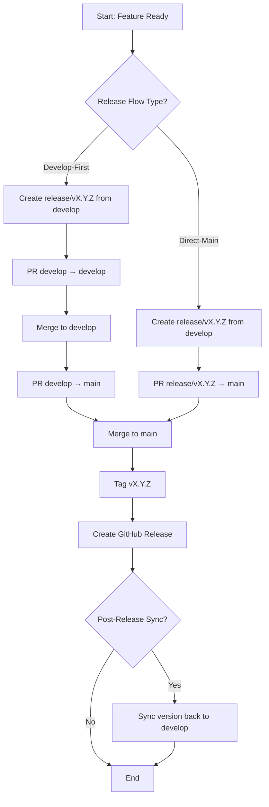

# OpenSpec Analysis Setup & Execution

## What is OpenSpec?

OpenSpec is a framework for analyzing detailed requirements using systematic specification patterns. In this project, we'll use it to:

1. **Analyze questionnaire responses** — Interpret your 50 answers
2. **Identify decision dependencies** — Which choices affect others?
3. **Detect conflicts** — Are there contradictory answers that need resolution?
4. **Assess complexity** — How hard is each requirement to implement?
5. **Generate specifications** — Output formal requirements documents
6. **Create implementation plan** — Prioritized tasks with effort estimates

---

## Pre-Analysis Setup

### Step 1: Confirm Questionnaire Completion

Ensure QUESTIONNAIRE.md is fully completed:

```bash
# Count filled-in responses (rough check)
grep -c "\[X\]" QUESTIONNAIRE.md  # Should have many responses
grep -c "_____" QUESTIONNAIRE.md  # Custom answers filled in?
```

**Checklist:**

- [ ] All 50 questions answered (with [ ] checkboxes marked or blanks filled)
- [ ] Optional context section completed (Q-A through Q-D)
- [ ] No "skip this" sections left blank
- [ ] Conflicts noted (if question A contradicts question B, note it)

### Step 2: Prepare Questionnaire for Analysis

Create a structured input file for OpenSpec:

```bash
# Copy questionnaire to structured format
cp QUESTIONNAIRE.md questionnaire-responses.txt
```

Alternatively, if you want to annotate responses:

```markdown
# questionnaire-responses.txt
## ANALYSIS METADATA
Date: 2026-08-05
Respondent: Ash Shaw (Product Owner)
Completion: 50/50 questions answered
Conflicts Noted: 3

## RESPONSES BY TOPIC
[copy filled-in questionnaire here]

## ADDITIONAL CONTEXT
[paste Q-A through Q-D answers here]
```

---

## Running OpenSpec Analysis

### Option A: Claude-Assisted Analysis (Recommended for First Run)

If OpenSpec is not yet integrated into your CI/CD:

**Step 1:** In Claude Code, run:

```bash
# Start a new session focused on OpenSpec analysis
# Provide the filled questionnaire as context
# Request OpenSpec to analyze and produce:
# 1. Requirements document
# 2. Decision matrix
# 3. Architecture specification
# 4. Implementation plan
```

**Step 2:** Claude will produce:

- `requirements-generated.md` — Formal requirements from questionnaire
- `decision-matrix.md` — All choices and their interdependencies
- `architecture-spec.md` — Detailed system design based on answers
- `implementation-plan.md` — Prioritized tasks with effort/complexity

### Option B: Automated CI/CD Integration (Future)

Once OpenSpec is integrated into your CI:

```yaml
# .github/workflows/openspec-analysis.yml
name: OpenSpec Analysis

on:
  workflow_dispatch:
    inputs:
      input_file:
        description: "Questionnaire response file"
        required: true

jobs:
  analyze:
    runs-on: ubuntu-latest
    steps:
      - uses: actions/checkout@v4
      - name: Run OpenSpec
        run: |
          npm install -g openspec
          openspec analyze --input ${{ inputs.input_file }} \
                          --output .github/projects/active/release-process-redesign-2026-08-05/
```

---

## OpenSpec Configuration

Create `.github/projects/active/release-process-redesign-2026-08-05/.openspec.yml`:

```yaml
# .openspec.yml
name: Release Process Redesign Specification
version: 1.0
description: Formal specification generated from questionnaire analysis

# Analysis scope
scope:
  - Release workflow architecture
  - Changelog automation integration
  - Version management
  - Authorization and governance
  - Error handling and rollback
  - Documentation standards
  - GitHub integration

# Quality gates
quality_gates:
  decision_conflicts: WARN  # Flag if answers contradict
  missing_context: WARN      # Flag if decisions lack rationale
  complexity_threshold: 3    # Flag if complexity > 3/5
  incomplete_coverage: WARN  # Flag if topics not fully specified

# Output format
output:
  format: markdown
  include_examples: true
  include_diagrams: true
  include_decision_records: true
  include_task_breakdown: true

# Target audience
audience:
  - technical-lead
  - release-manager
  - documentation-lead

# Related specs to consider
related_specs:
  - docs/BRANCHING_STRATEGY.md
  - docs/VERSIONING.md
  - docs/CHANGELOG_AUTOMATION.md
  - docs/AUTOMATION.md
```

---

## Expected OpenSpec Output

Once analysis runs, expect these files in the project folder:

### 1. requirements-generated.md

```markdown
# Generated Requirements Specification

## Decision Flows

### Release Flow Architecture
**Question 2-3:** PR targets develop or main?
**Your Answer:** [shows your choice + rationale]
**Derived Requirement:** PR will target [develop/main], triggering [flow type]

### Post-Release Sync
**Question 3:** Sync develop after releasing to main?
**Your Answer:** [shows your choice]
**Derived Requirement:** If yes, [automation needed]. If no, [manual procedure documented].

... [one section per major decision topic]
```

### 2. decision-matrix.md

```markdown
# Decision Dependency Matrix

| Decision | Related Decisions | Impact | Complexity |
|----------|------------------|--------|-----------|
| Release PR target (develop vs main) | Post-release sync, hotfix flow | High | Medium |
| Authorization gating | Release approval, audit trail | High | Medium |
| Version determination (scope vs explicit) | Pre-release support, changelog parsing | Medium | High |
| Rollback automation | Error recovery, changelog revert | Medium | High |
| ... | ... | ... | ... |
```

### 3. architecture-spec.md

Detailed technical specification:

```markdown
# Release Workflow Specification

## Workflow Architecture

### Release Flow Diagram
[ASCII or Mermaid diagram showing your chosen flow]

### Branch States Over Time
[Timeline of branch changes through release]

### Approval Gates
[Who approves what, when]

## Changelog Specification
- Validation rules: [from answers to Q24]
- Rollback behavior: [from answers to Q36]
- Entry format: [from answers to Q39]

## Version Specification
- Format: [from answers to Q10]
- Pre-release support: [from answers to Q11]
- Scope determination: [from answers to Q9]

... [comprehensive technical spec]
```

### 4. implementation-plan.md

```markdown
# Implementation Roadmap

## Phase 1: Critical Path (Sprint 1)
- [ ] Task 1.1: Fix authorization gating (2 days)
- [ ] Task 1.2: Update release.yml workflow (3 days)
- [ ] Task 1.3: Modify release.agent.js (2 days)

## Phase 2: Major Functionality (Sprint 2-3)
- [ ] Task 2.1: Post-release sync automation (2 days)
- [ ] Task 2.2: Rollback automation (2 days)
- [ ] Task 2.3: Rewrite documentation (3 days)

## Phase 3: Integration & Testing (Sprint 3-4)
- [ ] Task 3.1: End-to-end testing (2 days)
- [ ] Task 3.2: Rollback procedure validation (1 day)
- [ ] Task 3.3: Team training (0.5 days)

Estimated Total: 18-22 days (2 sprints)
```

### 5. diagrams.md

Mermaid diagrams generated from your answers:



---

## Analysis Workflow

### Step 1: Receive Questionnaire Responses

```
Input: QUESTIONNAIRE.md (completed)
↓
```

### Step 2: Parse Responses

```
OpenSpec parser reads questionnaire
- Extracts decisions (Q1-50)
- Identifies conflicts
- Maps dependencies
↓
```

### Step 3: Analyze Decisions

```
For each decision:
1. Determine impact (high/medium/low)
2. Identify dependencies (which other decisions affected)
3. Calculate implementation complexity
4. Assess risk (conflicts, missing context)
↓
```

### Step 4: Generate Specifications

```
Produce formal specifications:
- Architecture diagram
- Workflow YAML template
- Agent pseudocode
- Documentation outline
↓
```

### Step 5: Create Implementation Plan

```
Decompose into tasks:
- Critical path first
- Group related work
- Estimate effort
- Identify blockers
↓
```

### Step 6: Review & Validate

```
Output: 4-5 markdown files
- requirements-generated.md
- decision-matrix.md
- architecture-spec.md
- implementation-plan.md
- diagrams.md

Next: User reviews, approves, or requests changes
```

---

## When Conflicts Are Detected

If OpenSpec finds conflicting answers (e.g., "authorize strict" + "don't enforce authorization"), it will:

1. **Flag the conflict** with `⚠️ CONFLICT` marker
2. **Show both answers** with their implications
3. **Request clarification** in review step

**Example:**

```markdown
⚠️ CONFLICT: Authorization Strategy
- Question 17: "Only maintainers can trigger release"
- Question 18: "No enforcement; telemetry is advisory only"
→ These contradict. Which is correct?
→ ACTION: Clarify intended authorization model
```

**Resolution:** Answer the follow-up clarification during review.

---

## OpenSpec Output Review Checklist

After OpenSpec generates output, review for:

- [ ] All 50 questionnaire answers are reflected in requirements
- [ ] Decision dependencies make sense (no circular dependencies)
- [ ] Architecture matches your intent
- [ ] Implementation plan is realistic (effort estimates reasonable)
- [ ] Diagrams accurately represent your chosen flow
- [ ] All conflicts have been identified and resolved
- [ ] No critical decisions are missing

---

## Next Steps After OpenSpec Analysis

Once OpenSpec analysis is complete and reviewed:

### Step 1: Approve Requirements

- [ ] Review generated requirements document
- [ ] Validate architecture matches intent
- [ ] Resolve any conflicts
- [ ] Sign off on approved design

### Step 2: Begin Design Phase

- [ ] Create ADRs based on major decisions
- [ ] Refine YAML workflow templates
- [ ] Outline documentation rewrite
- [ ] Create detailed task breakdown

### Step 3: Implement

- [ ] Follow prioritized task list
- [ ] Update workflows and agents
- [ ] Rewrite documentation
- [ ] Test and validate

---

## Troubleshooting OpenSpec Analysis

### Issue: OpenSpec Reports "Circular Dependencies"

**Cause:** Two decisions depend on each other (e.g., "sync strategy depends on flow type" AND "flow type depends on sync strategy").

**Resolution:** One dependency must be primary. Answer the primary question first, then the derived question depends on it.

### Issue: OpenSpec Flags "Missing Context"

**Cause:** A decision lacks rationale (you answered but didn't explain why).

**Resolution:** Add explanation in "Additional Context Questions" section (Q-A through Q-D).

### Issue: OpenSpec Reports "Unimplementable Design"

**Cause:** Choices conflict or create unsolvable constraints.

**Resolution:** Review conflicting questions, clarify intent, regenerate.

---

## Integration with Project

Once OpenSpec analysis is approved:

1. **Store outputs in project folder:**

   ```
   .github/projects/active/release-process-redesign-2026-08-05/
   ├── requirements.md (generated)
   ├── decision-matrix.md (generated)
   ├── architecture-spec.md (generated)
   ├── implementation-plan.md (generated)
   └── adrs/ (created from analysis)
       └── ADR-001-release-flow-architecture.md
   ```

2. **Reference in implementation:**
   - Pull tasks from implementation-plan.md
   - Follow architecture-spec.md for design
   - Use decision-matrix.md to resolve conflicts

3. **Maintain traceability:**
   - Each implementation task references its OpenSpec decision
   - Each decision is backed by questionnaire answer
   - Each code change links to implementing task

---

## When to Re-Run OpenSpec

Re-run OpenSpec analysis if:

- [ ] Major requirements change (>50% of answers change)
- [ ] New questions need to be answered
- [ ] Conflicting requirements surface during design

Otherwise, freeze analysis when entering implementation phase.

---

## Questions? Issues?

If OpenSpec analysis produces unexpected output:

1. **Check questionnaire:** Are all answers filled in correctly?
2. **Validate conflicts:** Are conflicting answers actually in conflict?
3. **Review assumptions:** Is the scope still accurate?
4. **Ask for clarification:** Provide additional context if needed

---

*OpenSpec Setup Complete*  
*Ready for analysis once questionnaire is finalized*
