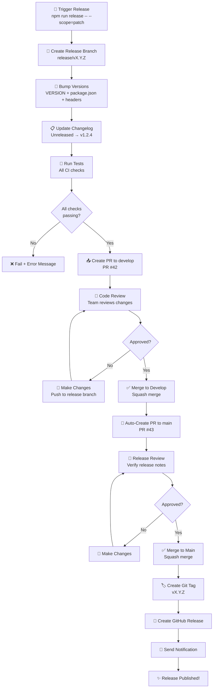

# Phase 7 Implementation Plan

**Release Process V2: Documentation & Training**

---

## Overview

Phase 7 completes the release process redesign by providing comprehensive documentation and team training materials.

**Phase 7 Scope:** Rewrite core documentation (RELEASE_PROCESS.md, BRANCHING_STRATEGY.md), create WordPress-specific guide, and produce training materials for team adoption.

**Timeline:** 2-3 days (estimated 2026-08-15 through 2026-08-17)

**Success Metric:** All documentation accurate, team trained, and confident in new release process.

---

## Validation Against OpenSpec Specification

This plan directly implements requirements from [OPENSPEC_ANALYSIS_REPORT.md](./OPENSPEC_ANALYSIS_REPORT.md):

| Requirement | Task(s) | Status |
|------------|---------|--------|
| NF2: Documentation accuracy | CHILD-027 through CHILD-031 | Planned |
| NF4: Reliability (clear process) | CHILD-027 through CHILD-032 | Planned |

**Validation Result:** ✅ All documentation requirements covered by Phase 7 tasks.

---

## Task Breakdown

### CHILD-027: Rewrite RELEASE_PROCESS.md

**Objective:** Complete rewrite of core release documentation reflecting new develop-first flow.

**Timeline:** 1 day

**Current File:** `docs/RELEASE_PROCESS.md`  
**Status:** Outdated (references old direct-to-main flow)

**New Structure:**

#### 1. Overview Section

**Content:** Introduction to release process, key principles (develop-first flow, two-stage validation, stacked PRs, single decision-maker, reversibility)

**Key Points:**

- Explain what the release process is
- Clarify the five key principles
- Reference develop-first flow and stacked PR workflow

#### 2. Prerequisites Section

**Content:** System requirements and environment checks

**Checklist:**

- Node.js 18+, GitHub CLI, Git, npm installed
- Authorized user (Ash Shaw only)
- On develop branch with clean working tree
- All version files exist and match

#### 3. Step-by-Step Guide Section

**Content:** Complete release workflow with 5 steps

**Step 1:** Trigger release workflow

```bash
npm run release -- --scope=patch
```

Options: patch (1.2.3 → 1.2.4), minor (1.2.3 → 1.3.0), major (1.2.3 → 2.0.0), --dry-run

**Step 2:** Review the generated PR (release branch → develop)

**Step 3:** Merge to develop after approval (squash merge)

**Step 4:** Review auto-generated main PR (develop → main)

**Step 5:** Merge to main; tag and GitHub Release auto-created

**Time:** ~10 minutes from trigger to published release

#### 4. Flow Diagram Section

````markdown
## Release Flow Diagram

[Mermaid diagram showing develop → main flow]


````

#### 5. Troubleshooting Section

````markdown
## Troubleshooting

### Q: Version files don't match
**Error:** "Version files inconsistent: VERSION=1.2.3, package.json=1.2.4"

**Solution:**
1. Stop release workflow
2. Fix version files (make them all the same)
3. Commit fix: `git add -A && git commit -m 'fix: Synchronize version files'`
4. Push and try release again

### Q: Changelog has errors
**Error:** "Changelog validation failed: [Unreleased] section missing"

**Solution:**
1. Stop release workflow
2. Open CHANGELOG.md
3. Ensure [Unreleased] section exists with entries
4. Commit fix
5. Try release again

### Q: Merge conflict
**Error:** "Merge conflict in CHANGELOG.md"

**Solution:**
1. On develop PR, resolve conflict manually
2. Inspect both sides of the CHANGELOG.md conflict
3. Preserve all required release entries from both sides
4. Run changelog validation to ensure structure is correct
5. Commit and push the resolution
6. CI re-runs; should pass
7. Merge PR

### Q: Need to rollback
**Command:**
```bash
node scripts/workflows/release/rollback.cjs --version=1.2.4
```

This:

- Deletes tag (local + remote)
- Reverts VERSION file
- Reverts CHANGELOG.md
- Deletes GitHub Release
- Creates rollback commit

### Q: Version bump wrong scope

**Example:** Bumped minor instead of patch

**Solution:**

1. Don't merge PR yet
2. Contact release manager
3. Either:
   a) Fix commit in release branch and push
   b) Close PR and start over

### Q: Need emergency rollback?

**Process:**

1. Run `node scripts/workflows/release/rollback.cjs --version=X.Y.Z`
2. Verify rollback complete
3. Contact team (Slack notification)
4. Investigation + fix (if needed)
5. Release again when ready

````

#### 6. FAQ Section

````markdown
## FAQ

### Q: Why two PRs instead of one?
**A:** Two-stage validation ensures:
- Code quality validated on develop (tests, lint)
- Release validated on main (final safety check)
- Version always consistent on develop

### Q: Can I release from develop branch directly?
**A:** No. Release branch must be created first, then two PRs.

### Q: What if develop is behind main?
**A:** The workflow automatically syncs when creating main PR.

### Q: Can I release from main directly?
**A:** No. All releases go through develop first.

### Q: What versions are supported?
**A:** SemVer (X.Y.Z) format:
- Patch: 1.2.3 → 1.2.4 (bug fixes)
- Minor: 1.2.3 → 1.3.0 (new features)
- Major: 1.2.3 → 2.0.0 (breaking changes)
- Pre-release: 1.2.4-alpha, 1.2.4-beta, 1.2.4-rc1

### Q: Can I release pre-release versions?
**A:** Yes. Version must end with `-alpha`, `-beta`, or `-rc`.

### Q: How long does release take?
**A:** ~10 minutes from trigger to published GitHub Release.

### Q: What if release fails?
**A:** Workflow stops with clear error. Use rollback if needed.

### Q: Who can trigger releases?
**A:** Only authorized user (Ash Shaw).

### Q: What's the dry-run mode?
**A:** Preview release without committing or pushing.

```bash
npm run release -- --scope=patch --dry-run
```

Shows what would happen without changes.

````

#### 7. References Section

```markdown
## References

- **Branching Strategy:** [docs/BRANCHING_STRATEGY.md](../../../../docs/BRANCHING_STRATEGY.md)
- **WordPress Releases:** Phase 7 deliverable (RELEASE_WORDPRESS.md will be created)
- **Changelog Guide:** [docs/CHANGELOG_AUTOMATION.md](../../../../docs/CHANGELOG_AUTOMATION.md)
- **GitHub Issues:** [Issue #1290 Epic](https://github.com/lightspeedwp/.github/issues/1290)
- **Architectural Decisions:** Project README ADR section
```

---

### CHILD-028: Update BRANCHING_STRATEGY.md

**Objective:** Add release flow section to branching strategy documentation.

**Timeline:** 0.5 day

**Changes to Make:**

#### 1. Add Release Branching Section

```markdown
## Release Branches

### Release Branch Naming

Release branches follow the pattern: `release/vX.Y.Z`

**Examples:**
- `release/v1.2.0` — Version 1.2.0 release
- `release/v1.2.1` — Patch release after 1.2.0
- `release/v2.0.0` — Major release

### Release Branch Workflow

1. Create release branch from `develop`
2. Version files updated (VERSION, package.json, headers, readme.txt)
3. Changelog updated ([Unreleased] → [vX.Y.Z])
4. PR created to `develop` (first PR)
5. After merge to `develop`, PR created to `main` (second PR)
6. After merge to `main`, tag created and release published

### Release Branch Protection

Release branches are NOT protected. Any developer can create one via the release workflow.

**However:** Only authorized user can trigger the workflow.
```

#### 2. Add Stacked PR Explanation

````markdown
## Stacked Pull Requests (Release Flow)

### What are Stacked PRs?

Stacked PRs are two linked pull requests in a sequential dependency chain:
1. **First PR:** Release branch → develop (code quality validation)
2. **Second PR:** Develop → main (release validation)

The second PR depends on the first PR being merged, creating a "stack" of linked changes.

### Workflow

```

Release triggered on develop branch
         ↓
Create release/vX.Y.Z branch from develop
         ↓
Bump versions + update changelog
         ↓
Create PR #1: release/vX.Y.Z → develop
         ↓
[User merges PR #1 to develop]
         ↓
Workflow auto-creates PR #2: develop → main
         ↓
[User merges PR #2 to main]
         ↓
Tag created + Release published

```

### Why Stacked PRs?

- **Two-stage validation:** Code validated on develop, release validated on main
- **Develop always current:** No version skew between develop and main
- **Single source of truth:** Develop is primary integration branch
- **Safe recovery:** Each stage can be tested independently
````

#### 3. Link to Release Process

```markdown
## Complete Release Process

For detailed release workflow, see [docs/RELEASE_PROCESS.md](../../../../docs/RELEASE_PROCESS.md) (will be rewritten in Phase 7).

For WordPress-specific release process, see [RELEASE_WORDPRESS.md](./RELEASE_WORDPRESS.md) (Phase 7 deliverable).
```

---

### CHILD-029: Create RELEASE_WORDPRESS.md

**Objective:** WordPress-specific release guide for plugins and themes.

**Timeline:** 1 day

**Location:** `docs/RELEASE_WORDPRESS.md`

**Structure:**

````markdown
# WordPress Release Process

## Overview

This guide covers releasing WordPress plugins and themes with the new release process.

Same process as control plane, but with WordPress-specific version files.

## Version Files (Plugins)

### Primary Version Files

1. **VERSION (Required)**
   - Plain text file at repo root
   - Content: `1.2.3`
   - Used by: Release system

2. **plugin.php or plugin-name.php (Required)**
   - Main plugin file
   - Line: `Version: 1.2.3`
   - Used by: WordPress.org, plugin directory

3. **readme.txt (Recommended)**
   - Plugin documentation
   - Line: `Stable tag: 1.2.3`
   - Used by: WordPress.org, update checks

4. **package.json (Optional)**
   - npm package definition
   - Field: `"version": "1.2.3"`
   - Used by: npm ecosystem

### Synchronization

All version files MUST have the same version:

```

VERSION:         1.2.3  ✅
plugin.php:      1.2.3  ✅
readme.txt:      1.2.3  ✅
package.json:    1.2.3  ✅

```

If mismatched:
```

VERSION:         1.2.3  ❌
plugin.php:      1.2.4  ❌ MISMATCH

```

Release will fail with error: "Version files inconsistent"

## Version Files (Themes)

### Primary Version Files

1. **VERSION (Required)**
   - Plain text file at repo root
   - Content: `1.2.3`

2. **style.css (Required)**
   - Theme stylesheet
   - Header line: `Version: 1.2.3`
   - Used by: WordPress theme directory

3. **package.json (Optional)**
   - npm package definition
   - Field: `"version": "1.2.3"`

### Synchronization

All theme version files MUST match:

```

VERSION:      1.2.3  ✅
style.css:    1.2.3  ✅
package.json: 1.2.3  ✅

```

## How to Release (Plugin)

### Step 1: Check All Version Files

Before releasing, verify all plugin version files are synchronized:

**1a. Check VERSION file:**
```bash
cat VERSION
# Output: 1.2.3
```

**1b. Check plugin header:**

```bash
grep "Version:" plugin.php
# Output: Version: 1.2.3
```

**1c. Check readme.txt:**

```bash
grep "Stable tag:" readme.txt
# Output: Stable tag: 1.2.3
```

**1d. Check package.json:**

```bash
grep '"version"' package.json
# Output: "version": "1.2.3",
```

**All must match!** If not:

1. Fix mismatches
2. Commit: `git add -A && git commit -m 'fix: Synchronize version files'`
3. Push to develop
4. Try release again

### Step 2: Trigger Release

```bash
npm run release -- --scope=patch
```

This will:

1. Create release/vX.Y.Z branch
2. Bump VERSION file (1.2.3 → 1.2.4)
3. Bump plugin.php header (1.2.3 → 1.2.4)
4. Bump readme.txt Stable tag (1.2.3 → 1.2.4)
5. Bump package.json version (1.2.3 → 1.2.4)
6. Create PR to develop

### Step 3: Merge PR to Develop

After reviewing PR:

1. Merge to develop (squash merge)
2. Workflow auto-creates PR to main

### Step 4: Merge PR to Main

After reviewing:

1. Merge to main (squash merge)
2. Tag created (v1.2.4)
3. GitHub Release published
4. WordPress.org sync (manual step, if desired)

### Step 5: Update WordPress.org (Optional)

If plugin is listed on WordPress.org:

1. Tag pushed: WordPress.org auto-detects new tag
2. Check WordPress.org plugin page
3. New version should appear within hours
4. If not, trigger manual update in plugin settings

## How to Release (Theme)

Same process as plugin, but:

1. Check style.css instead of plugin.php
2. No readme.txt (themes don't use Stable tag)
3. Update style.css Version header

**Commands:**

```bash
# Check theme header
grep "Version:" style.css
# Output: Version: 1.2.3

# Release
npm run release -- --scope=patch

# Verify all files bumped
cat VERSION
grep "Version:" style.css
grep '"version"' package.json
```

## Examples

### Plugin Release Example

**Before Release:**

```
VERSION: 1.0.0
plugin.php: Version: 1.0.0
readme.txt: Stable tag: 1.0.0
package.json: "version": "1.0.0"
CHANGELOG.md: [Unreleased]
```

**After Release (patch):**

```
VERSION: 1.0.1
plugin.php: Version: 1.0.1
readme.txt: Stable tag: 1.0.1
package.json: "version": "1.0.1"
CHANGELOG.md: [1.0.1] - 2026-08-15
```

**Git:**

- Tag: v1.0.1
- GitHub Release: Release Notes generated from changelog

### Theme Release Example

**Before Release:**

```
VERSION: 2.0.0
style.css: Version: 2.0.0
package.json: "version": "2.0.0"
CHANGELOG.md: [Unreleased]
```

**After Release (minor):**

```
VERSION: 2.1.0
style.css: Version: 2.1.0
package.json: "version": "2.1.0"
CHANGELOG.md: [2.1.0] - 2026-08-15
```

## Troubleshooting

### Q: WordPress.org still shows old version

**A:** WordPress.org auto-updates within 12 hours. If longer:

1. Log in to WordPress.org plugin/theme page
2. Check "Deployed Versions" section
3. Manually trigger sync if available

### Q: readme.txt Stable tag is wrong

**A:**

1. Stop release workflow
2. Fix readme.txt Stable tag manually
3. Commit: `git add readme.txt && git commit -m 'fix: Correct stable tag'`
4. Try release again

### Q: Plugin header version is wrong

**A:**

1. Stop release workflow
2. Fix plugin.php Version header
3. Commit: `git add plugin.php && git commit -m 'fix: Correct version header'`
4. Try release again

### Q: Need to rollback theme release

**A:**

```bash
node scripts/workflows/release/rollback.cjs --version=2.1.0
```

This reverts all files including style.css.

## References

- **Release Process:** [docs/RELEASE_PROCESS.md](../../../../docs/RELEASE_PROCESS.md)
- **Branching Strategy:** [docs/BRANCHING_STRATEGY.md](../../../../docs/BRANCHING_STRATEGY.md)
- **Plugin Development:** <https://developer.wordpress.org/plugins/>
- **Theme Development:** <https://developer.wordpress.org/themes/>
- **readme.txt Format:** <https://developer.wordpress.org/plugins/wordpress-org/readme/>

````

---

### CHILD-030 through CHILD-032: Training & Support Documentation

**Objective:** Produce comprehensive team training and support materials.

**Timeline:** 0.5 day each (1.5 days total)

#### CHILD-030: Create RELEASE_TRAINING.md

**Location:** `docs/RELEASE_TRAINING.md`

**Content:**

````markdown
# Release Process Training

## Who Should Read This?

- Team members who may trigger releases
- Release managers
- New developers onboarding
- Anyone supporting the release process

## Training Objectives

After this training, you should be able to:

1. Understand the release flow (develop → main)
2. Trigger a release with correct scope (patch/minor/major)
3. Review and approve release PRs
4. Handle common errors
5. Execute rollback if needed

## Module 1: Release Flow (15 min)

### Concepts

**What is a release?**
- Publishing a new version
- Creating a git tag
- Publishing GitHub Release
- Available for users to download/use

**Why two PRs?**
- First PR (to develop): validates code quality
- Second PR (to main): validates release
- Ensures consistency: develop always has correct version

**Develop-first principle:**
- Develop is primary integration branch
- Main always matches latest develop
- No version skew

### Interactive Exercise

1. Open GitHub: .github repository
2. Find a recent release tag (e.g., v1.5.0)
3. Find the two linked PRs (#123 and #124)
4. Notice: #123 to develop, #124 to main
5. Check: all version files have same version in both PRs

## Module 2: How to Release (30 min)

### Step-by-Step

```bash
# Step 1: Check branch
git branch
# Output: * develop

# Step 2: Check working tree clean
git status
# Output: Working tree clean

# Step 3: Trigger release (dry-run first)
npm run release -- --scope=patch --dry-run
# Output: (Dry run result)

# Step 4: Trigger for real
npm run release -- --scope=patch
# Output: PR #N created to develop

# Step 5: Review PR in GitHub
# - Check version bump
# - Check changelog update
# - Check all tests pass
```

### What to Check in PR

- [ ] Correct version bump (patch/minor/major)
- [ ] VERSION file updated
- [ ] package.json updated
- [ ] (Plugin) plugin.php header updated
- [ ] (Plugin) readme.txt Stable tag updated
- [ ] (Theme) style.css header updated
- [ ] CHANGELOG.md [Unreleased] converted to [vX.Y.Z]
- [ ] All tests passing
- [ ] All linting passing
- [ ] No unintended changes

## Module 3: PR Review (15 min)

### Develop PR Review

When PR to develop appears:

1. Read changelog (latest entries)
2. Check version scope is right:
   - Patch (bug fixes only)?
   - Minor (new features, backward compatible)?
   - Major (breaking changes)?
3. Ask questions if unclear
4. Approve and merge

### Main PR Review (Auto-created)

After develop PR merges, main PR appears:

1. Check develop PR merged successfully
2. Check PR title includes version
3. Verify release notes
4. Approve and merge
5. Release automatically publishes

## Module 4: Troubleshooting (15 min)

### Common Errors

**1. Version files don't match**

```
Error: Version files inconsistent
```

Solution: Stop, fix versions, commit, retry

**2. Tests fail**

```
Error: npm test failed
```

Solution: Stop, fix code, commit, retry

**3. Changelog missing [Unreleased]**

```
Error: [Unreleased] section not found
```

Solution: Stop, add entries, commit, retry

### How to Get Help

1. Check [RELEASE_TROUBLESHOOTING.md](./RELEASE_TROUBLESHOOTING.md) (Phase 7 deliverable)
2. Ask in #engineering Slack channel
3. Contact release manager (Ash)

## Module 5: WordPress Specifics (15 min)

### Plugin Release

Extra files to check:

- plugin.php: Version: X.Y.Z
- readme.txt: Stable tag: X.Y.Z
- VERSION file: X.Y.Z
- package.json: "version": "X.Y.Z"

All must match or release fails.

### Theme Release

Extra files to check:

- style.css: Version: X.Y.Z
- VERSION file: X.Y.Z
- package.json: "version": "X.Y.Z"

All must match or release fails.

## Quiz (Optional)

1. Q: What order do PRs merge?
   A: develop first, then main

2. Q: Who can trigger releases?
   A: Only authorized user (Ash)

3. Q: How long does release take?
   A: ~10 minutes

4. Q: What's the dry-run flag for?
   A: Preview before committing

5. Q: What if tests fail?
   A: Stop release, fix code, retry

## Next Steps

- Read [docs/RELEASE_PROCESS.md](../../../../docs/RELEASE_PROCESS.md) for details (will be rewritten in Phase 7)
- See [RELEASE_WORDPRESS.md](./RELEASE_WORDPRESS.md) for WordPress-specific process (Phase 7 deliverable)
- Practice on test repository
- Ask questions anytime

## Contact

- **Questions?** Slack #engineering or ask Ash
- **Bug report?** Create issue with `type:bug` label
- **Process improvement?** Create issue with `type:improvement` label

````

#### CHILD-031: Create RELEASE_TROUBLESHOOTING.md

**Location:** `docs/RELEASE_TROUBLESHOOTING.md`

**Content:** Comprehensive troubleshooting guide with solutions for common issues (version mismatch, merge conflicts, authorization failures, rollback scenarios, etc.)

#### CHILD-032: Create CI Validation for Doc/Code Drift

**Objective:** GitHub Action to detect and prevent documentation drift.

**Implementation:**

Create `.github/workflows/doc-code-validation.yml`:

```yaml
name: Doc/Code Validation

on: [pull_request]

jobs:
  doc-validation:
    runs-on: ubuntu-latest
    steps:
      - uses: actions/checkout@v4
      
      - name: Setup Node.js
        uses: actions/setup-node@v4
        with:
          node-version: '18'
      
      - name: Install dependencies
        run: npm ci
      
      - name: Check RELEASE_PROCESS.md exists
        run: test -f docs/RELEASE_PROCESS.md
      
      - name: Check BRANCHING_STRATEGY.md exists
        run: test -f docs/BRANCHING_STRATEGY.md
      
      - name: Check RELEASE_WORDPRESS.md exists
        run: test -f docs/RELEASE_WORDPRESS.md
      
      - name: Validate no broken links
        run: npm run validate:links
      
      - name: Validate frontmatter
        run: npm run validate:frontmatter -- docs/
```

---

## Testing Strategy

### Documentation Testing

```javascript
✓ All links in RELEASE_PROCESS.md are live
✓ All examples are current and accurate
✓ All code snippets execute without error
✓ Mermaid diagrams render correctly
```

### Training Validation

```javascript
✓ Training modules cover all required concepts
✓ Quiz questions match training content
✓ Examples work on real repository
✓ Troubleshooting covers common issues
```

---

## Success Criteria (Phase 7)

**Phase 7 is successful when:**

1. **RELEASE_PROCESS.md Complete**
   - [ ] Rewritten with develop-first flow
   - [ ] Flow diagrams accurate
   - [ ] Troubleshooting comprehensive
   - [ ] FAQ answers common questions
   - [ ] All links working

2. **BRANCHING_STRATEGY.md Updated**
   - [ ] Release flow explained
   - [ ] Stacked PR concept clear
   - [ ] Links to related docs

3. **RELEASE_WORDPRESS.md Created**
   - [ ] Plugin release process documented
   - [ ] Theme release process documented
   - [ ] Examples clear and complete
   - [ ] Version file synchronization explained

4. **Training Materials Complete**
   - [ ] RELEASE_TRAINING.md (5 modules, 90 min total)
   - [ ] RELEASE_TROUBLESHOOTING.md (10+ common issues)
   - [ ] All materials reviewed and approved

5. **Team Trained**
   - [ ] All team members completed training
   - [ ] Team comfortable with new process
   - [ ] Q&A resolved
   - [ ] Practice release successful

6. **CI Validation In Place**
   - [ ] Doc/code drift detection working
   - [ ] Links validated in CI
   - [ ] Frontmatter validated in CI

---

## Deliverables Checklist

- [ ] `docs/RELEASE_PROCESS.md` (completely rewritten)
- [ ] `docs/BRANCHING_STRATEGY.md` (updated with release flow section)
- [ ] `docs/RELEASE_WORDPRESS.md` (new, comprehensive)
- [ ] `docs/RELEASE_TRAINING.md` (new, 5 modules)
- [ ] `docs/RELEASE_TROUBLESHOOTING.md` (new, 10+ solutions)
- [ ] `.github/workflows/doc-code-validation.yml` (new CI check)
- [ ] All documentation reviewed
- [ ] Team training completed
- [ ] Feedback incorporated
- [ ] Final review passed

---

## Files Modified/Created

| File | Status | Change |
|------|--------|--------|
| `docs/RELEASE_PROCESS.md` | Modify | Complete rewrite |
| `docs/BRANCHING_STRATEGY.md` | Modify | Add release flow |
| `docs/RELEASE_WORDPRESS.md` | Create | New guide |
| `docs/RELEASE_TRAINING.md` | Create | New training |
| `docs/RELEASE_TROUBLESHOOTING.md` | Create | New guide |
| `.github/workflows/doc-code-validation.yml` | Create | New CI validation |

---

## References

- **Specification:** [OPENSPEC_ANALYSIS_REPORT.md](./OPENSPEC_ANALYSIS_REPORT.md) (NF2)
- **Phase 5 Plan:** [PHASE_5_IMPLEMENTATION_PLAN.md](./PHASE_5_IMPLEMENTATION_PLAN.md)
- **Phase 6 Plan:** [PHASE_6_IMPLEMENTATION_PLAN.md](./PHASE_6_IMPLEMENTATION_PLAN.md)
- **Phase 4 Context:** [PHASE_4_IMPLEMENTATION_PLAN.md](./PHASE_4_IMPLEMENTATION_PLAN.md)

---

*Phase 7 Implementation Plan — Created 2026-08-09*  
*Status: READY FOR EXECUTION*  
*Estimated Timeline: 2-3 days (2026-08-15 through 2026-08-17)*
