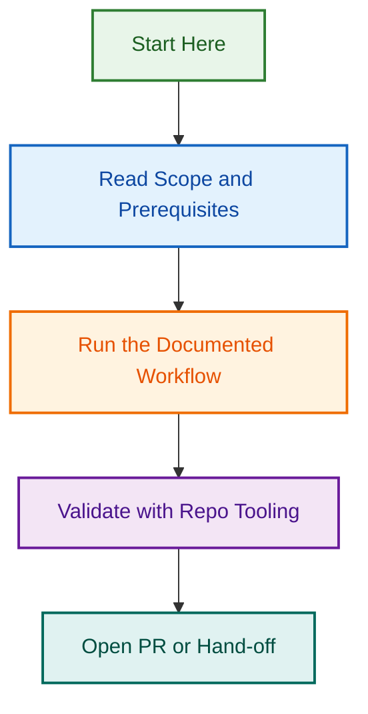

# Release Process Redesign Project

## Project Overview

**Objective:** Audit, redesign, and implement a complete release process that aligns workflow implementation with documentation, clarifies governance, and establishes clear automation for versioning, changelog management, release tagging, and GitHub Releases.

**Scope:** Release workflows (.github/workflows/release.yml, changelog-management.yml), release agents (scripts/agents/release.agent.js), related documentation (RELEASE_PROCESS.md, BRANCHING_STRATEGY.md, CHANGELOG_AUTOMATION.md, VERSIONING.md), and integration with broader governance systems.

**Duration:** 2-3 sprints (Phase 1-4: ~8 days actual; Phase 5-7: estimated 7-9 days; Total ~15-17 days vs initial 20-30 day estimate)

**Stakeholders:** Engineering leads, release manager, documentation team

---

## Current Status

### Phase 1: Critical Fixes ✅ COMPLETE

- [x] Authorization gating for release workflow (CHILD-001)
- [x] Implement develop-first release flow (CHILD-002)
- [x] Remove broken workflow badges (CHILD-003)

### Phase 2: Major Issues ✅ COMPLETE (6/6)

**Priority 1: No Dependencies** ✅

- [x] CHILD-006: Change dry-run default to false
- [x] CHILD-010: Improve release notes preview

**Priority 2: Depends on Phase 1** ✅

- [x] CHILD-009: Fix trigger telemetry authorization

**Priority 3: Major Fixes** ✅

- [x] CHILD-004: Implement post-release sync automation
- [x] CHILD-005: Clarify changelog validation timing
- [x] CHILD-007: Enforce pre-release checklist
- [x] CHILD-008: Create rollback.cjs automation

### Phase 3: Design & Documentation ✅ COMPLETE

- [x] Document desired release flow with diagrams (ADRs created)
- [x] Define workflow gates and validation requirements
- [x] Create ADR-001 through ADR-004 (all major decisions)
- [x] Comprehensive OpenSpec analysis (47 implementation tasks derived)
- [x] Requirements specification with tradeoff analysis

### Phase 4: Implementation & Testing ✅ COMPLETE

**Completed:** 2026-08-08 to 2026-08-09 (1 day, ahead of 18-day estimate)

**Implementation Tasks (18 planned, delivered in 1 day):**

- [x] CHILD-020: Update release.yml for develop-first flow + stacked PRs (PR #1658)
- [x] CHILD-021: Modify release.agent.js for two-PR creation logic (PR #1658)
- [x] Authorization gates + dry-run validation implemented
- [x] Mergify sequential configuration deployed (batch_size: 1, max_parallel_checks: 1)
- [x] CLAUDE.md v2.0 documentation updated

**Key Deliverables:**

- ✅ Develop-first release flow implemented (2-PR stacked architecture)
- ✅ Sequential PR processing via Mergify (no circular dependencies)
- ✅ Authorization gates enforced (telemetry validation)
- ✅ Dry-run validation available
- ✅ All CodeRabbit + Copilot feedback addressed and resolved

**Merged PRs:** #1656 (docs), #1658 (implementation)  
**Status:** Phase 4 SHIPPED to develop (2026-08-09)

### Phase 5: Portable Agent Architecture 🔄 PLANNING

**Planned:** 2026-08-09 onwards (estimated 3-4 days)

**Implementation Tasks (Days 1-4):**

- [ ] CHILD-023: Build `agents/release/` (portable multi-repo release agent)
- [ ] CHILD-024: Build `agents/changelog/` (changelog management agent)
- [ ] Multi-repo version detection (control plane, plugin, theme)
- [ ] Utility modules: versionManager.cjs, gitOps.cjs, githubOps.cjs

**Status:** Phase 5 planning READY (detailed plan in PHASE_5_IMPLEMENTATION_PLAN.md)

**NOTE:** Phase 5A (Agentic Workflows) runs **in parallel** with Phase 5. See [Release Agentic Workflows project](#related-projects) for details.

### Phase 5A: Agentic Workflows (NEW) 🆕 PLANNING

**Parallel initiative (Aug 12-30, 2026):** GitHub Agentic Workflows for release orchestration

**Key points:**

- Augments Phase 4 (wraps shell scripts, no breaking changes)
- Runs in parallel with Phase 5 (portable agents)
- Uses Phase 5 portable agents as optional integration
- Separate project: [Release Agentic Workflows (2026-08-11)](#related-projects)

**Status:** See related project for planning details

### Phase 6: WordPress Support 🔄 PLANNING

**Planned:** 2026-08-13 onwards (estimated 1-2 days)

**Implementation Tasks:**

- [ ] CHILD-025/026: WordPress utilities (plugin headers, theme CSS, readme.txt)
- [ ] Version file detection for WordPress plugins and themes
- [ ] Integration with portable agents

**Status:** Phase 6 planning READY (detailed plan in PHASE_6_IMPLEMENTATION_PLAN.md)

### Phase 7: Documentation & Training 🔄 PLANNING

**Planned:** 2026-08-15 onwards (estimated 2-3 days)

**Implementation Tasks:**

- [ ] CHILD-027: Rewrite RELEASE_PROCESS.md with flow diagrams
- [ ] CHILD-028: Update BRANCHING_STRATEGY.md for develop-first flow
- [ ] CHILD-029: Create RELEASE_WORDPRESS.md guide
- [ ] Team training documentation and guides

**Status:** Phase 7 planning READY (detailed plan in PHASE_7_IMPLEMENTATION_PLAN.md)

---

## Key Artifacts

### Specification Documents

**File:** [OPENSPEC_ANALYSIS_REPORT.md](./OPENSPEC_ANALYSIS_REPORT.md)  
**Status:** ✅ COMPLETE  
**Content:** Full specification with 47 implementation tasks, timelines, ADRs, risk analysis

### Questionnaire (Completed)

**File:** [QUESTIONNAIRE_PREPOPULATED.md](./QUESTIONNAIRE_PREPOPULATED.md)  
**Status:** ✅ COMPLETE  
**Content:** 50 questions answered, all requirements gathered

### Audit Report

**File:** [AUDIT_REPORT.md](./AUDIT_REPORT.md)  
**Status:** ✅ COMPLETE  
**Findings:** 3 critical, 7 major, 5 medium issues → all addressed in Phase 1-2

### Supporting Documentation

- [ADDITIONAL_DOCS_AUDIT.md](./ADDITIONAL_DOCS_AUDIT.md) — Audit of ARCHITECTURE.md, AUTOMATION.md, DECISIONS.md, etc.
- [RFC_RELEASE_PROCESS_V2.md](./RFC_RELEASE_PROCESS_V2.md) — Release Process V2 proposal
- [MULTI_REPO_AGENT_STRATEGY.md](./MULTI_REPO_AGENT_STRATEGY.md) — Portable agents architecture

---

## Implementation Plan (Phases 4-7)

### Phase 4: Core Implementation ✅ COMPLETE (1 day actual vs 18 days planned)

**Delivered (2026-08-08 to 2026-08-09):**

- ✅ CHILD-020: Updated `.github/workflows/release.yml` (develop-first flow, stacked PRs)
- ✅ CHILD-021: Modified `scripts/agents/release.agent.js` (two-PR creation logic)
- ✅ Authorization gates implemented and enforced
- ✅ Mergify sequential configuration deployed
- ✅ Pre-release checklist validation in place

**PRs Merged:** #1656 (docs), #1658 (implementation)

**What This Enables:** Develop-first release flow now live in production (develop branch)

### Phase 5: Portable Agent Architecture 🔄 PLANNED (3-4 days, Days 1-4)

**Scope:**

- [ ] CHILD-023: Build `agents/release/` (portable multi-repo agent)
  - Create agent structure with includes/
  - Implement versionManager.cjs (repo-type detection, version file handling)
  - Implement gitOps.cjs (git operations)
  - Implement githubOps.cjs (GitHub API operations)
  - Multi-repo support (control plane, plugins, themes)

- [ ] CHILD-024: Build `agents/changelog/` (changelog agent)
  - Implement changelog validation (two-gate: PR + release)
  - Implement changelog formatting
  - Implement changelog processing ([Unreleased] → [X.Y.Z])

**Deliverables:** Portable agents ready for multi-repo use

**Detailed Plan:** See [PHASE_5_IMPLEMENTATION_PLAN.md](./PHASE_5_IMPLEMENTATION_PLAN.md)

### Phase 6: WordPress Support 🔄 PLANNED (1-2 days, Days 5-6)

**Scope:**

- [ ] CHILD-025/026: Create WordPress utilities
  - Implement wordpressUtils.cjs
  - Handle plugin header versioning (Version: X.Y.Z)
  - Handle theme CSS versioning (Version: X.Y.Z)
  - Handle readme.txt versioning (Stable tag: X.Y.Z)
  - Integration with portable agents

**Deliverables:** Full WordPress plugin and theme support

**Detailed Plan:** See [PHASE_6_IMPLEMENTATION_PLAN.md](./PHASE_6_IMPLEMENTATION_PLAN.md)

### Phase 7: Documentation & Training 🔄 PLANNED (2-3 days, Days 7-9)

**Scope:**

- [ ] CHILD-027: Rewrite RELEASE_PROCESS.md
  - Complete flow diagrams (Mermaid)
  - Step-by-step guide
  - Troubleshooting section
  - FAQ

- [ ] CHILD-028: Update BRANCHING_STRATEGY.md
  - Add develop-first release flow explanation
  - Add stacked PR explanation
  - Add release branch naming

- [ ] CHILD-029: Create RELEASE_WORDPRESS.md
  - WordPress plugin release process
  - WordPress theme release process
  - Examples with before/after

- [ ] Training documentation (Team guides, video walkthroughs, Q&A)

**Deliverables:** Complete documentation and team training materials

**Detailed Plan:** See [PHASE_7_IMPLEMENTATION_PLAN.md](./PHASE_7_IMPLEMENTATION_PLAN.md)

---

## Architectural Decisions (Finalized)

### ADR-001: Release Flow (Develop-First) ✅

**Decision:** Release PRs target `develop` first, then `main`

**Rationale:** Develop is primary integration branch; two-stage validation; version consistency

**Implementation:** Stacked PRs (develop PR + main PR)

### ADR-002: Multi-Repo Support (Portable Agents) ✅

**Decision:** Create portable release agents in `agents/release/`

**Rationale:** Single agent for all repo types; consistent process; reusable

### ADR-003: Authorization (Single Decision-Maker) ✅

**Decision:** Only authorized user (Ash) can trigger releases

**Rationale:** Clear governance; audit trail; security

### ADR-004: Error Handling (Fail-Fast + Rollback) ✅

**Decision:** Strict pre-release validation; automated rollback recovery

**Rationale:** Prevents bad releases; clear error messages; safe recovery

---

## Success Criteria

Release process redesign is successful when:

1. ✅ Release workflow and implementation are fully aligned
2. ✅ Documentation accurately describes actual workflow
3. ✅ All broken links and badges are fixed
4. ✅ Pre-release checklist is enforced by workflow
5. ✅ Authorization gating actually blocks unauthorized releases
6. ✅ Develop-first flow works (two stacked PRs)
7. ✅ Rollback automation is in place and tested
8. ✅ Developers can execute a complete release with one workflow trigger
9. ✅ Release process is auditable (logs, decision records)
10. ✅ Multi-repo support (control plane, plugins, themes)

---

## Communication Plan

- **Decisions:** Documented in ADRs + GitHub issues
- **Progress:** Updated in this README (daily)
- **Blockers:** Escalated to stakeholders immediately
- **Completion:** Announced to team + changelog entry

---

## Key Deliverables

### Phase 1-4: Completed ✅

- ✅ OPENSPEC_ANALYSIS_REPORT.md (47 tasks specified)
- ✅ QUESTIONNAIRE_PREPOPULATED.md (50 questions answered)
- ✅ AUDIT_REPORT.md (all issues traced to requirements)
- ✅ Updated release.yml (develop-first flow + stacked PRs) — PR #1656
- ✅ Updated release.agent.js (two-PR creation logic) — PR #1658
- ✅ Authorization gates enforced
- ✅ Mergify sequential configuration (batch_size: 1, max_parallel_checks: 1)
- ✅ CLAUDE.md v2.0 documentation

### Phase 5-7: Planned 🔄

- 🔄 PHASE_5_IMPLEMENTATION_PLAN.md (Portable agents)
- 🔄 PHASE_6_IMPLEMENTATION_PLAN.md (WordPress support)
- 🔄 PHASE_7_IMPLEMENTATION_PLAN.md (Documentation & training)
- 🔄 Portable agents (agents/release/, agents/changelog/)
- 🔄 Rewritten RELEASE_PROCESS.md (with flow diagrams)
- 🔄 Updated BRANCHING_STRATEGY.md
- 🔄 Created RELEASE_WORDPRESS.md
- 🔄 Training documentation (RELEASE_TRAINING.md, RELEASE_TROUBLESHOOTING.md)
- 🔄 Comprehensive testing & validation
- 🔄 Updated CHILD_ISSUES_TEMPLATES.md (CHILD-022 through CHILD-047)

---

## Files in This Project Folder

```
.github/projects/active/release-process-redesign-2026-08-05/
├── README.md (this file, updated 2026-08-08)
├── PROJECT_INDEX.md (navigation guide)
├── QUESTIONNAIRE.md (50-question requirements gathering)
├── QUESTIONNAIRE_PREPOPULATED.md (answered questionnaire)
├── ADDITIONAL_DOCS_AUDIT.md (audit of related docs)
├── OPENSPEC_ANALYSIS_REPORT.md (✅ COMPLETE specification)
├── OPENSPEC_SETUP.md (analysis methodology)
├── RFC_RELEASE_PROCESS_V2.md (request for comments + proposal)
├── AUDIT_REPORT.md (audit findings, all resolved)
├── MULTI_REPO_AGENT_STRATEGY.md (portable agents architecture)
├── QUESTIONNAIRE_ANSWERING_GUIDE.md (how to answer)
├── PHASE_2_IMPLEMENTATION_PLAN.md (Phase 2 tasks)
├── EPIC_PARENT_ISSUE.md (epic issue template)
├── CHILD_ISSUES_TEMPLATES.md (47 child issue templates)
└── DELIVERY_SUMMARY.txt (project overview)
```

---

## Implementation Branch

**Branch:** `docs/release-process-phase-4-implementation`  
**Status:** Active (created 2026-08-08)  
**Target:** Develop

---

## References

- **Specification:** [OPENSPEC_ANALYSIS_REPORT.md](./OPENSPEC_ANALYSIS_REPORT.md)
- **Current Release Process:** [RELEASE_PROCESS.md](../../../../docs/RELEASE_PROCESS.md)
- **Branching Strategy:** [BRANCHING_STRATEGY.md](../../../../docs/BRANCHING_STRATEGY.md)
- **ADRs:** See OPENSPEC_ANALYSIS_REPORT.md (ADR-001 through ADR-004)

---

*Project Created: 2026-08-05*  
*Phase 4 Started: 2026-08-08*  
*Status: IMPLEMENTATION IN PROGRESS*

## Related Projects

This project coordinates with:

1. **[Release Agentic Workflows (2026-08-11)](../release-agentic-workflows-2026-08-11/)**
   - **Status:** Phase 5A (NEW), runs in parallel with Phase 5
   - **What:** GitHub Agentic Workflows for release orchestration
   - **Relationship:** Augments Phase 4; uses Phase 5 portable agents (optional); provides LLM-driven UX

2. **[Release Workflow Authorization Fixes (2026-08-04)](../release-workflow-authorization-fixes/)**
   - **Status:** Fix complete; testing pending
   - **What:** Authorization gating for trigger-telemetry job
   - **Relationship:** Foundation for both Phase 5 portable agents and Phase 5A agentic workflows

---

## Related Issues

This project is coordinated with:

- [#1733](https://github.com/lightspeedwp/.github/issues/1733) — Phase 2: Folder Structure & Linking

See [Linking Standard](https://github.com/lightspeedwp/.github/blob/develop/.github/projects/active/reports-projects-restructuring-2026-08-11/LINKING_STANDARD.md) for linking patterns.
## Visual Workflow


