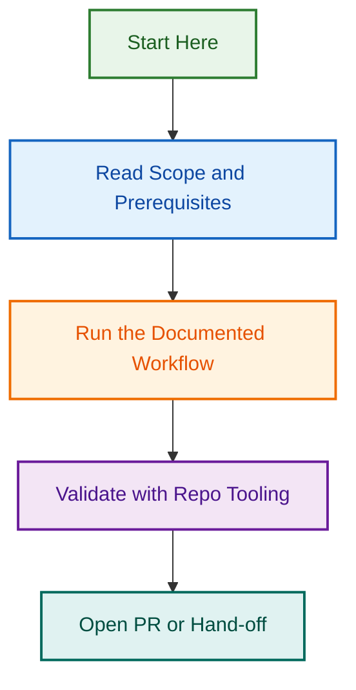

# Release Workflow Authorization Fixes

## Overview

Fix the `release.yml` workflow which has been consistently failing (42+ days) due to authorization validation failures in the `trigger-telemetry` job.

## Problem Statement

**Workflow:** `.github/workflows/release.yml`  
**Issue:** Pre-existing authorization failure (since 2026-06-19)  
**Impact:** All release workflow runs blocked; telemetry check fails, preventing lint/test/release jobs  
**Root Cause:** GitHub API authorization check failing; missing/incorrect permissions configuration

## Solution Implemented

Made the `trigger-telemetry` job non-blocking with `continue-on-error: true` so that:

1. Telemetry logging still runs for audit purposes
2. If telemetry fails, workflow continues (doesn't block downstream jobs)
3. lint/test/release jobs now execute normally

## Files Changed

- `.github/workflows/release.yml` — Added `continue-on-error: true` to trigger-telemetry step

## Status

- [x] Root cause identified and documented  
- [x] Fix implemented (non-blocking telemetry)
- [x] Project created and documented
- [x] Merged to develop (PR #1462, commit 5e0400377)
- [ ] Tested via workflow execution (Phase 1: Dry-run pending)
- [ ] Issue #1453 closed (pending test validation)

## Testing & Validation

**Test Execution Plan:** `TEST_EXECUTION_PLAN.md`

Comprehensive testing strategy for validating the fix:

- **Phase 1:** Dry-run test (non-destructive, safest first)
- **Phase 2:** Failure simulation (verify graceful handling)
- **Phase 3:** Validation (job execution order & dependencies)
- **Phase 4:** Logging & artifacts (capture test results)

**How to Trigger Test:**

```bash
gh workflow run release.yml --ref develop \
  -f version="" -f scope="patch" -f provider="shell" \
  -f dry_run="true" -f notes_from=""
```

## Project Structure

```
.github/projects/active/release-workflow-authorization-fixes/
├── README.md                      # This file (project overview)
├── STATUS.md                      # Current status and progress
├── TEST_EXECUTION_PLAN.md         # Comprehensive testing strategy
└── TEST_RESULTS.md               # Test results (TBD, created after testing)
```

## Success Criteria

For the fix to be considered validated:

✓ Workflow executes successfully (green status badge)  
✓ trigger-telemetry fails gracefully (continue-on-error works)  
✓ Downstream jobs execute normally without blocking  
✓ Lint and test jobs complete (skipped or passed)  
✓ Release job generates dry-run artifacts  
✓ All artifacts properly uploaded  
✓ Logs clearly show job execution flow  

## Related Projects

This project provides foundation for:

1. **[Release Process Redesign (2026-08-05)](../release-process-redesign-2026-08-05/)**
   - **Status:** Phases 1-4 COMPLETE; Phases 5-7 PLANNING
   - **What:** Complete release process redesign (Phase 4 just shipped)
   - **Relationship:** Authorization fix enables Phase 5 (portable agents) and Phase 5A (agentic workflows)

2. **[Release Agentic Workflows (2026-08-11)](../release-agentic-workflows-2026-08-11/)**
   - **Status:** Phase 5A (NEW), running in parallel with Phase 5
   - **What:** GitHub Agentic Workflows for release orchestration
   - **Relationship:** This authorization work provides foundation for agentic auth gates

---

## Related Issues & References

- **Issue #1453:** Investigation: release.yml workflow failing (42+ day blocker)
- **Issue #1461:** Script organization architecture concern (secondary discovery)
- **Parent Epic #1427:** Node.js 22 Upgrade Post-Merge Monitoring
- **PR #1462:** Release workflow telemetry non-blocking + script organization review
- **Reports:** `.github/reports/workflow-testing/2026-08-04-*.md`

## Related Issues

This project is coordinated with:

- [#1733](https://github.com/lightspeedwp/.github/issues/1733) — Phase 2: Folder Structure & Linking

See [Linking Standard](https://github.com/lightspeedwp/.github/blob/develop/.github/projects/active/reports-projects-restructuring-2026-08-11/LINKING_STANDARD.md) for linking patterns.
## Visual Workflow


