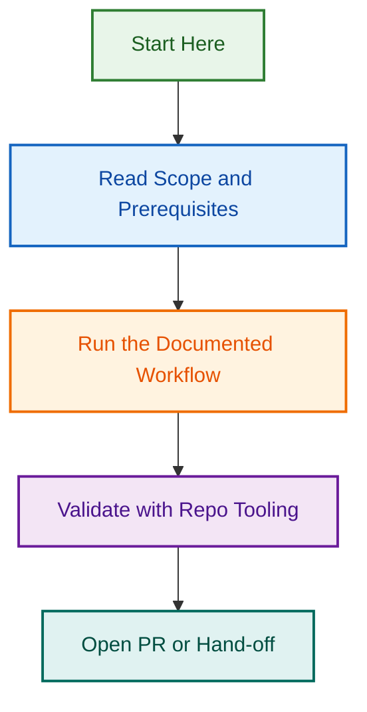

# Repository Restructuring Project

## LightSpeed `.github` Control Plane — 2026-07-25

**Project Owner:** Ash Shaw  
**Start Date:** 2026-07-25  
**Expected Duration:** 3–4 weeks  
**Status:** 🟡 Phase 0 Complete — Phase 1 Ready  
**Branch:** `refactor/repo-restructuring-2026-07-25`

---

## 🎯 Project Overview

This project restructures the LightSpeed `.github` repository to:

1. ✅ **Optimize folder organization** — Separate portable reusable assets (root) from repo-specific governance (`.github/`)
2. ✅ **Consolidate schemas** — Merge hidden `.schemas/` and legacy `schema/` into single visible `schemas/` folder
3. ✅ **Enable multi-project work** — Clear VSCode workspace setup for `.github` + WordPress projects
4. ✅ **Support plugin adoption** — Phased rollout of Claude Code, GitHub Copilot, and emerging tools
5. ✅ **Improve team efficiency** — Automated developer setup, comprehensive documentation, clear migration path

**Impact:** Cleaner organization, faster onboarding, better multi-project support, ready for AI tool ecosystem.

---

## 📊 Current Status

| Phase | Task | Status | Owner | Due |
|-------|------|--------|-------|-----|
| 0 | Pre-flight validation | ✅ COMPLETE | Ash | 2026-07-26 |
| 1.A | Manual folder moves | 🔜 READY | Ash | 2026-07-28 |
| 1.B | Path reference updates | 🔜 READY | Claude | 2026-07-31 |
| 1.C | Folder finalization | 🔜 READY | Claude | 2026-08-01 |
| 2 | Schema consolidation | 🔜 READY | Claude | 2026-08-04 |
| 3 | VSCode workspace setup | 🔜 READY | Claude | 2026-08-08 |
| 4 | Plugin adoption strategy | 🔜 READY | Claude + Web | 2026-08-12 |
| 5 | Rollout & communications | 🔜 READY | Ash + Team | 2026-08-15+ |

---

## 📁 Folder Changes (Summary)

### Root → `.github/`

These operational folders move inside `.github/` to keep root clean:

| Old Path | New Path | Purpose |
|----------|----------|---------|
| `scripts/` | `.github/scripts/` | Validation & setup scripts |
| `reports/` | `.github/reports/` | Audit reports & metrics |
| `projects/` | `.github/projects/` | Active project tracking |
| `tmp/` | `.github/tmp/` | Temporary files |
| `memory/` | `.github/memory/` | Session memory & context |
| `website/` | `.github/website/` | Website content & requirements |

### Schema Consolidation

- `.schemas/` (hidden) → `schemas/` (visible root)
- `schema/` (legacy) → consolidated into `schemas/`

### Stays in Root (Portable)

These folders stay at root for portability across projects:

- `agents/`, `skills/`, `instructions/`, `hooks/`, `plugins/`, `cookbook/`, `workflows/`, `docs/`, `config/`

### Stays in `.github/` (Repo-Specific)

These are GitHub-native and repo-specific:

- `.github/workflows/`, `.github/ISSUE_TEMPLATE/`, `.github/PULL_REQUEST_TEMPLATE/`, `.github/labels.yml`, etc.

---

## 🚀 Quick Start

### For Ash Shaw (Project Owner)

**Phase 0 (Now):**

1. ✅ Review SPECIFICATION.md
2. ✅ Review PREFLIGHT_CHECKLIST.md
3. Run pre-flight checks (checklist included)
4. Sign off on readiness

**Phase 1.A (Next):**

1. Follow [PHASE-1A-MANUAL-MOVES.md](./PHASE-1A-MANUAL-MOVES.md)
2. Move 6 folders via macOS Finder (1–2 hours)
3. Verify all moves
4. Create commit

**Phase 1.B–5 (Automate):**

1. Copy the Claude prompt from each PHASE-*.md file
2. Paste into Claude Code
3. Claude handles the automation
4. Review and commit results

### For Claude Code Agent

Each phase has a dedicated document with a copy-paste prompt:

1. **Phase 1.B:** `PHASE-1B-PATH-UPDATES.md` → Copy prompt → Execute
2. **Phase 1.C:** `PHASE-1C-FINALIZATION.md` → Copy prompt → Execute
3. **Phase 2:** `PHASE-2-SCHEMA-CONSOLIDATION.md` → Copy prompt → Execute
4. **Phase 3:** `PHASE-3-VSCODE-SETUP.md` → Copy prompt → Execute
5. **Phase 4:** `PHASE-4-PLUGIN-ADOPTION.md` → Copy prompt → Execute
6. **Phase 5:** `PHASE-5-ROLLOUT.md` → Copy prompt → Execute

### For Team Members

When Phase 5 (rollout) begins:

1. Pull latest changes: `git pull origin develop`
2. Run setup: `./.github/scripts/setup-vscode-workspace.sh`
3. See docs/MIGRATION.md for any path updates
4. Ask in GitHub issues or Slack for help

---

## 📚 Key Documents

### Understanding the Project

- **[SPECIFICATION.md](./SPECIFICATION.md)** — Complete project specification with decisions and architecture
- **[INDEX.md](./INDEX.md)** — Index of all project documents and quick navigation

### Pre-Flight (Phase 0)

- **[PREFLIGHT_CHECKLIST.md](./PREFLIGHT_CHECKLIST.md)** — Validation checklist before Phase 1

### Execution (Phases 1–5)

- **[PHASE-1A-MANUAL-MOVES.md](./PHASE-1A-MANUAL-MOVES.md)** — Manual folder moves via Finder
- **[PHASE-1B-PATH-UPDATES.md](./PHASE-1B-PATH-UPDATES.md)** — Path reference updates (Claude prompt)
- **[PHASE-1C-FINALIZATION.md](./PHASE-1C-FINALIZATION.md)** — Folder finalization (Claude prompt)
- **[PHASE-2-SCHEMA-CONSOLIDATION.md](./PHASE-2-SCHEMA-CONSOLIDATION.md)** — Schema audit & updates (Claude prompt)
- **[PHASE-3-VSCODE-SETUP.md](./PHASE-3-VSCODE-SETUP.md)** — VSCode automation (Claude prompt)
- **[PHASE-4-PLUGIN-ADOPTION.md](./PHASE-4-PLUGIN-ADOPTION.md)** — Plugin guides & website (Claude prompt)
- **[PHASE-5-ROLLOUT.md](./PHASE-5-ROLLOUT.md)** — Rollout & communications (Claude prompt)

### User Documentation (Created During Project)

- **docs/MIGRATION.md** — Migration guide for team
- **docs/vscode-workspace-setup.md** — VSCode setup guide
- **docs/faq.md** — Frequently asked questions
- **docs/plugin-setup-claude-code.md** — Claude Code setup
- **docs/plugin-setup-github-copilot.md** — Copilot setup
- **docs/plugin-comparison.md** — Plugin comparison table
- **docs/plugin-adoption-phases.md** — Adoption timeline

---

## 🔑 Key Decisions

These decisions have been made and are documented in SPECIFICATION.md:

✅ **Team Structure:** 2–3 core maintainers, 4–5 contributors, 8–9 consumers  
✅ **Folder Organization:** Portable (root) vs. Repo-specific (`.github/`)  
✅ **Schema Visibility:** Consolidated into visible `schemas/` folder  
✅ **VSCode Setup:** Multi-root workspace for `.github` + WordPress projects  
✅ **Manual vs. Automation:** User moves folders (Finder) → Claude updates references  
✅ **Plugin Adoption:** Phased approach (Tier 1 Aug, Tier 2 Sept, Tier 3 Oct+)  
✅ **Branch Naming:** `{type}/{scope}-{short-title}` (no `claude/` prefix)  

---

## ✅ Success Criteria

### Phase 0 ✅

- [x] Specification created and approved
- [x] Pre-flight checklist created
- [x] All environment checks pass
- [x] Repository backup created

### Phase 1

- [ ] All 6 folders moved to `.github/`
- [ ] `.schemas/` → `schemas/` consolidated
- [ ] All path references updated
- [ ] All validation scripts pass
- [ ] All tests pass

### Phase 2

- [ ] Schema audit complete
- [ ] Validation scripts updated
- [ ] Documentation migrated
- [ ] Migration guide created

### Phase 3

- [ ] Setup scripts created and tested
- [ ] VSCode workspace configured
- [ ] Documentation complete
- [ ] Developers can run setup in <10 minutes

### Phase 4

- [ ] Plugin setup guides created
- [ ] Website update requirements documented
- [ ] Plugin adoption timeline clear
- [ ] Testing checklists available

### Phase 5

- [ ] Team announcements sent
- [ ] >80% team adoption achieved
- [ ] Support infrastructure working
- [ ] Grace period managed successfully

---

## 📈 Timeline

```
Week 1 (Jul 25–31)
  Jul 25: Phase 0 complete ✅
  Jul 26–28: Phase 1.A (manual moves)
  Jul 29–31: Phase 1.B–1.C (automation)

Week 2 (Aug 1–4)
  Aug 1–4: Phase 2 (schema consolidation)

Week 3 (Aug 5–8)
  Aug 5–8: Phase 3 (VSCode setup)

Week 4 (Aug 9–12)
  Aug 9–12: Phase 4 (plugin adoption)
  Aug 12: Merge to develop

Week 5–8 (Aug 15–Sep 9)
  Aug 15–Sep 9: Phase 5 (rollout & adoption)
  Aug: Tier 1 adoption (Claude Code + Copilot)
  Sep: Tier 2 adoption (contributors)
  Oct: Tier 3 adoption (all consumers)
```

---

## 🤝 Team Involvement

### Ash Shaw (Project Owner)

- ✅ Pre-flight validation (Phase 0)
- ✅ Manual folder moves (Phase 1.A)
- ✅ Review and approve Claude's work
- ✅ Team announcements (Phase 5)
- ✅ Support and adoption monitoring (Phase 5)

### Claude Code Agent

- ✅ Path reference updates (Phase 1.B)
- ✅ Folder finalization (Phase 1.C)
- ✅ Schema consolidation (Phase 2)
- ✅ Setup script generation (Phase 3)
- ✅ Documentation creation (Phase 4)

### Web Team (Handoff)

- ✅ Website updates (Phase 4)
  - Onboarding routing by tier
  - Documentation page generation
  - References and cookbook integration

### Team Members (During Rollout)

- ✅ Adopt new setup after merge
- ✅ Provide feedback on documentation
- ✅ Request help in GitHub issues
- ✅ Report blockers

---

## 🆘 Support & Questions

### During Execution (Phases 1–4)

Contact: **Ash Shaw** (<ashley@lightspeedwp.agency>)

- Questions about decisions
- Clarifications on phase content
- Go/no-go decisions

### During Rollout (Phase 5)

Contact: **GitHub Issues** with label `[restructuring-help]`

- Setup issues
- Path reference questions
- Plugin configuration help

Escalation: **Ash Shaw** for blockers that prevent adoption

---

## 📋 What's in This Directory

```
repo-restructuring-2026-07-25/
├── README.md (this file)
├── INDEX.md (detailed index of all documents)
├── SPECIFICATION.md (project spec)
├── PREFLIGHT_CHECKLIST.md (Phase 0)
├── PHASE-1A-MANUAL-MOVES.md
├── PHASE-1B-PATH-UPDATES.md
├── PHASE-1C-FINALIZATION.md
├── PHASE-2-SCHEMA-CONSOLIDATION.md
├── PHASE-3-VSCODE-SETUP.md
├── PHASE-4-PLUGIN-ADOPTION.md
├── PHASE-5-ROLLOUT.md
└── [Supporting docs created during execution]
    ├── SCHEMA-AUDIT.md (Phase 2)
    ├── WEBSITE-UPDATE-REQUIREMENTS.md (Phase 4)
    ├── ANNOUNCEMENT-TEMPLATES.md (Phase 5)
    └── SUPPORT-TRACKER.md (Phase 5)
```

---

## 🔗 Related Documents

**Repository-wide:**

- [CLAUDE.md](../../CLAUDE.md) — Repository boundaries and organization
- [BRANCHING_STRATEGY.md](../../docs/BRANCHING_STRATEGY.md) — Branch naming and protection rules
- [AGENTS.md](../../AGENTS.md) — Global AI governance

**Future reference (planned documents):**

- MIGRATION.md — Path update guide (to be created Phase 2)
- vscode-workspace-setup.md — Developer setup guide (to be created Phase 3)
- Plugin Guides — Plugin setup documentation (to be created Phase 4)

For current troubleshooting: [vscode-plugin-troubleshooting.md](https://github.com/lightspeedwp/.github/blob/develop/docs/vscode-plugin-troubleshooting.md)

---

## 🎓 How to Use This Project

1. **Ash Shaw:**
   - Read SPECIFICATION.md for full context
   - Review PREFLIGHT_CHECKLIST.md
   - Execute Phase 1.A manually
   - Provide Claude prompts from Phase 1.B onwards
   - Monitor Phase 5 (team adoption)

2. **Claude Code Agent:**
   - For each phase, copy the prompt from the phase document
   - Paste into Claude Code
   - Execute and review results
   - Commit changes

3. **Team Members:**
   - Wait for Phase 5 (rollout)
   - Pull latest changes
   - Run `./.github/scripts/setup-vscode-workspace.sh`
   - Ask questions in GitHub issues

---

## ✨ Next Step

**You are here:** Phase 0 Complete ✅

**Next:** Execute Phase 1.A (Manual Folder Moves)

Ready to proceed? Open [PHASE-1A-MANUAL-MOVES.md](./PHASE-1A-MANUAL-MOVES.md) and follow the step-by-step instructions.

---

**Project Version:** 1.0  
**Last Updated:** 2026-07-26  
**Maintained By:** Ash Shaw

## Related Issues

This project is coordinated with:

- [#1733](https://github.com/lightspeedwp/.github/issues/1733) — Phase 2: Folder Structure & Linking

See [Linking Standard](https://github.com/lightspeedwp/.github/blob/develop/.github/projects/active/reports-projects-restructuring-2026-08-11/LINKING_STANDARD.md) for linking patterns.

## Visual Workflow


