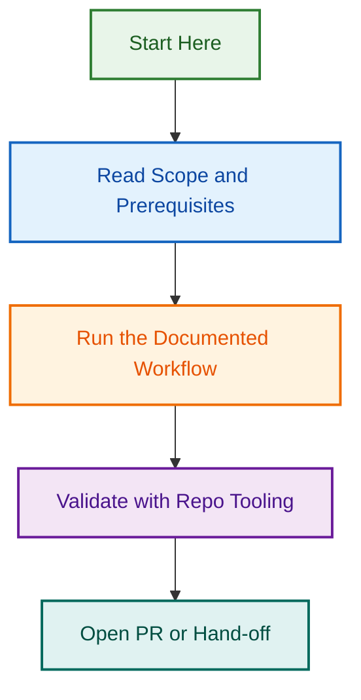

# Reporting Agent v2 — Multi-Repository Support

## Project Overview

The Reporting Agent v2 extends the original Reporting Agent with deterministic multi-repository support, session caching, and portable npm packaging. This agent synthesizes metadata (commit history, tags, branch info) across multiple repositories into structured reports for other agents and workflows.

**Status**: ✅ Phase 1 Complete (Production Ready)  
**Merged**: PR #1895 (CodeRabbit fixes applied)

---

## Phase 1: Agent Spec & Implementation

### Deliverables (Complete ✅)

| Deliverable | Status | Notes |
|---|---|---|
| Agent Specification | ✅ Complete | `.github/agents/reporting.agent.md` (v2.0, 20.5 KB) |
| Core npm Package | ✅ Complete | `@lightspeedwp/metadata-agent` v1.0.0-rc.1 (3,950 LOC) |
| Portable Agent | ✅ Complete | `agents/metadata-agent/` (9 files, reusable module) |
| Test Suite | ✅ Complete | 127 tests, 82%+ coverage (unit + integration + E2E) |
| CodeRabbit Fixes | ✅ Complete | All 12 findings addressed (PR #1895) |
| Documentation | ✅ Complete | Agent spec, npm package README, portable usage guide |

---

## Related Issues

### Phase 1 (Completed)

- **Master Epic**: #1831 — Reporting Agent Phase 1
- **PR #1895**: CodeRabbit fixes (MERGED)

### Phase 2 (Created 2026-08-18)

- #2031-#2045: 15 Phase 2 tasks organized by implementation phase

---

## Project Documentation

- `README.md` — This file (project overview)
- `INTEGRATION_GUIDE.md` — Comprehensive Reporting Agent v2 integration guide (15,000+ words)
- `REPORTING_AGENT_V2_PHASE2_WEEK1_PLAN.md` — Phase 2 Week 1 implementation plan
- `REPORTING_AGENT_V2_PHASE5_2_ADMIN_OPERATIONS_GUIDE.md` — Phase 5.2 production deployment, monitoring, scaling, and incident response guide
- `SPECIFICATION.md` — OpenSpec formal specification

---

**Last Updated**: 2026-09-04  
**Status**: ✅ Phase 1 Production-Ready, Phase 2 Planning, Phase 5.2 Operations Guide Complete

## Visual Workflow

